Exercise 1
================
Wyatt Allen, Elijah Evans, David Ford, Patrick Scovel
10 February 2019

Data visualization 1: green buildings
-------------------------------------

Placeholder 1

Data visualization 2: flights at ABIA
-------------------------------------

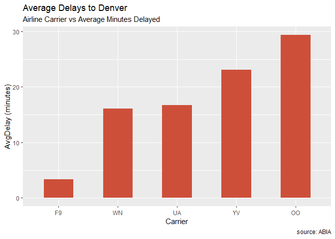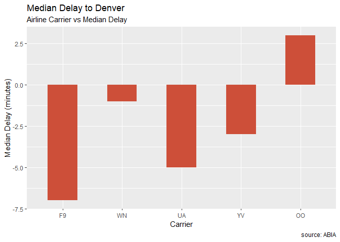

Using the attached code, we have derived the average delay for the five airliners that fly to Denver, CO from ABIA, as well as the median delays. The first graph is in increasing order of average delay times, but for the second one we made the decision to maintain the original ordering to promote easier comparisons. The most notable thing discovered by comparing these graphs is that no airliner has a negative mean delay, but four of the five airliners have negative median delays. We attribute this difference to outliers skewing the average. There are a few flights for each airliner that have hugely negative delays, even over 10 hours in a few cases. However, the negative delays, indicating an earlier arrival than anticipated, are never more than around 30 minutes. This made intuitive sense to us, as it is possible to leave an airport an indefinite amount of time after a scheduled departure, but an airplane can't really leave hours before it's scheduled to land, as it would clearly be unjust to expect all of the passengers and crew to be boarded and ready an hour or ten early, meaning that there is somewhat of a ceiling on how early a flight can be, but little to no limit on how late it can be.

Regression vs KNN
-----------------

    ## -- Attaching packages ------------------------------------------------------------------------------------------ tidyverse 1.2.1 --

    ## v tibble  2.0.1     v purrr   0.3.0
    ## v tidyr   0.8.2     v dplyr   0.7.8
    ## v readr   1.3.1     v stringr 1.3.1
    ## v tibble  2.0.1     v forcats 0.3.0

    ## -- Conflicts --------------------------------------------------------------------------------------------- tidyverse_conflicts() --
    ## x dplyr::filter() masks stats::filter()
    ## x dplyr::lag()    masks stats::lag()

    ## Loading required package: lattice

    ## Loading required package: ggformula

    ## Loading required package: ggstance

    ## 
    ## Attaching package: 'ggstance'

    ## The following objects are masked from 'package:ggplot2':
    ## 
    ##     geom_errorbarh, GeomErrorbarh

    ## 
    ## New to ggformula?  Try the tutorials: 
    ##  learnr::run_tutorial("introduction", package = "ggformula")
    ##  learnr::run_tutorial("refining", package = "ggformula")

    ## Loading required package: mosaicData

    ## Loading required package: Matrix

    ## 
    ## Attaching package: 'Matrix'

    ## The following object is masked from 'package:tidyr':
    ## 
    ##     expand

    ## 
    ## The 'mosaic' package masks several functions from core packages in order to add 
    ## additional features.  The original behavior of these functions should not be affected by this.
    ## 
    ## Note: If you use the Matrix package, be sure to load it BEFORE loading mosaic.

    ## 
    ## Attaching package: 'mosaic'

    ## The following object is masked from 'package:Matrix':
    ## 
    ##     mean

    ## The following objects are masked from 'package:dplyr':
    ## 
    ##     count, do, tally

    ## The following object is masked from 'package:purrr':
    ## 
    ##     cross

    ## The following object is masked from 'package:ggplot2':
    ## 
    ##     stat

    ## The following objects are masked from 'package:stats':
    ## 
    ##     binom.test, cor, cor.test, cov, fivenum, IQR, median,
    ##     prop.test, quantile, sd, t.test, var

    ## The following objects are masked from 'package:base':
    ## 
    ##     max, mean, min, prod, range, sample, sum

    ##      id trim subTrim condition isOneOwner mileage year color displacement
    ## 1 26661  350    unsp       New          f       6 2013 Black        3.0 L
    ## 2 33938  350    unsp       New          f      10 2013 Black        3.0 L
    ## 3 44467  350    unsp       New          f      13 2013  unsp        3.0 L
    ## 4 43128  350    unsp       New          f      17 2013 Black        3.0 L
    ## 5 38588  350    unsp       New          f      25 2013 Black        3.0 L
    ## 6 43132  350    unsp      Used          f    3257 2013 Black        3.0 L
    ##     fuel state region   soundSystem wheelType wheelSize featureCount
    ## 1 Diesel    NY    Mid       Premium     Alloy      unsp           54
    ## 2 Diesel    CA    Pac          unsp      unsp      unsp           16
    ## 3 Diesel    FL    SoA Harman Kardon      unsp      unsp           55
    ## 4 Diesel    FL    SoA          unsp      unsp      unsp            0
    ## 5 Diesel    MA    New          unsp      unsp      unsp            1
    ## 6 Diesel    VA    SoA          unsp      unsp      unsp            6
    ##    price
    ## 1 102460
    ## 2 106010
    ## 3  74900
    ## 4 102110
    ## 5  94230
    ## 6  63995

    ## [1] 13576.43

    ## [1] 11015.42

    ## [1] "call"      "k"         "n"         "pred"      "residuals" "PRESS"    
    ## [7] "R2Pred"

    ## [1] 11594.97

    ## [1] "call"      "k"         "n"         "pred"      "residuals" "PRESS"    
    ## [7] "R2Pred"

    ## [1] 11100.04

    ## [1] "call"      "k"         "n"         "pred"      "residuals" "PRESS"    
    ## [7] "R2Pred"

    ## [1] 10904.38

    ## [1] "call"      "k"         "n"         "pred"      "residuals" "PRESS"    
    ## [7] "R2Pred"

    ## [1] 10347.7

    ## [1] "call"      "k"         "n"         "pred"      "residuals" "PRESS"    
    ## [7] "R2Pred"

    ## [1] 10647.13

    ## [1] "call"      "k"         "n"         "pred"      "residuals" "PRESS"    
    ## [7] "R2Pred"

    ## [1] 11361.21

    ## [1] "call"      "k"         "n"         "pred"      "residuals" "PRESS"    
    ## [7] "R2Pred"

    ## [1] 12053.81

    ## [1] "call"      "k"         "n"         "pred"      "residuals" "PRESS"    
    ## [7] "R2Pred"

    ## [1] 13048.87

    ## [1] "call"      "k"         "n"         "pred"      "residuals" "PRESS"    
    ## [7] "R2Pred"

    ## [1] 15851.08

    ## [1] "call"      "k"         "n"         "pred"      "residuals" "PRESS"    
    ## [7] "R2Pred"

    ## [1] 18212.78

    ## [1] "call"      "k"         "n"         "pred"      "residuals" "PRESS"    
    ## [7] "R2Pred"

    ## [1] 20265.94

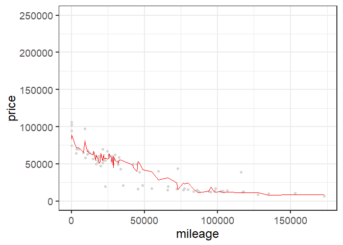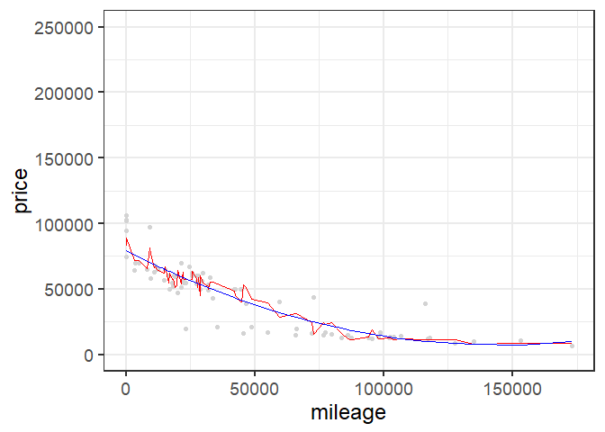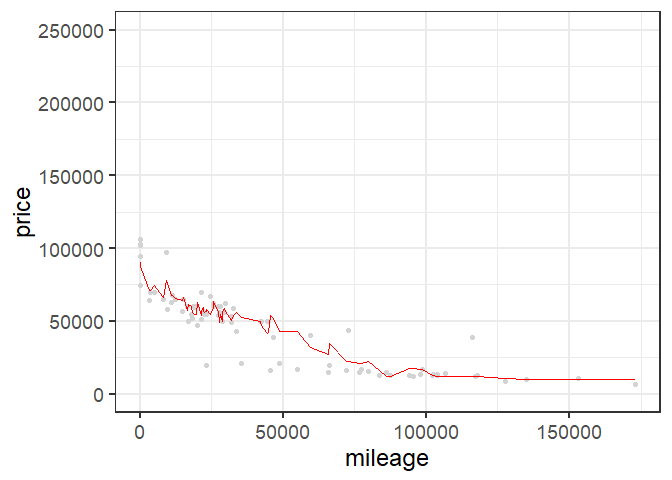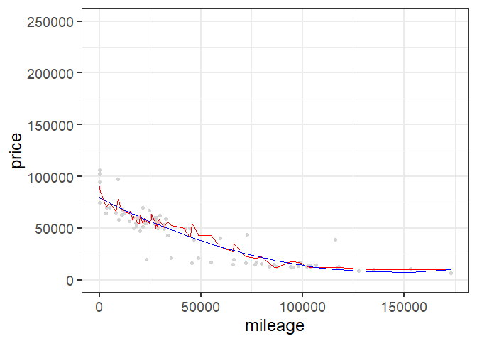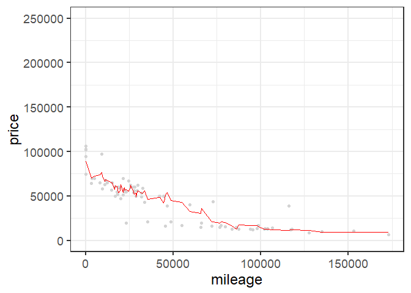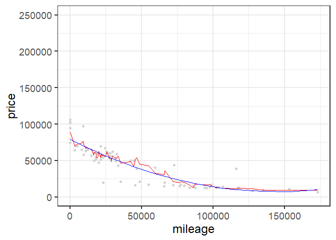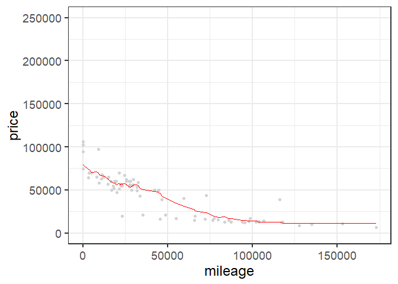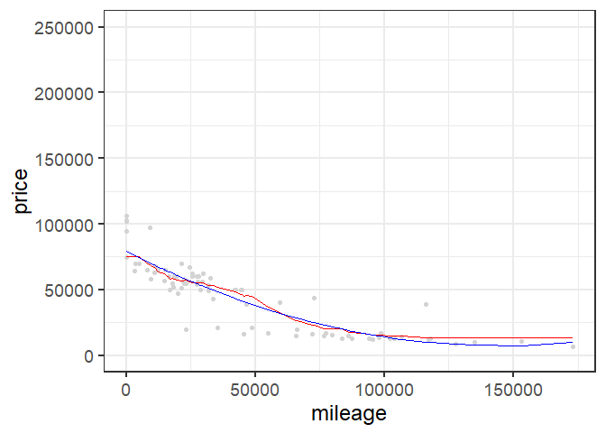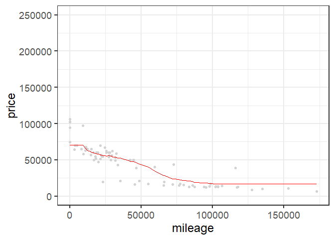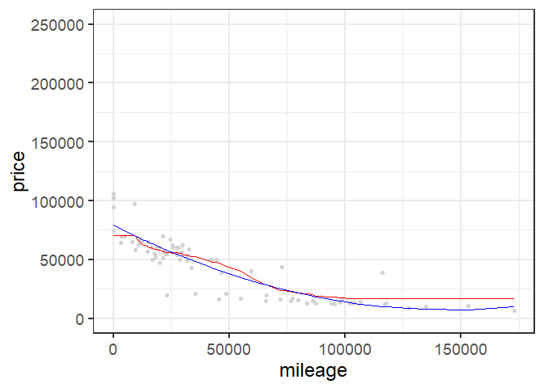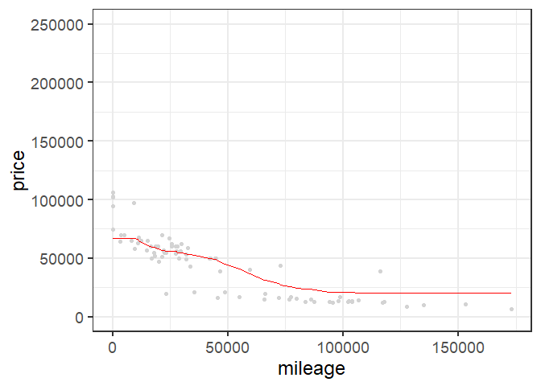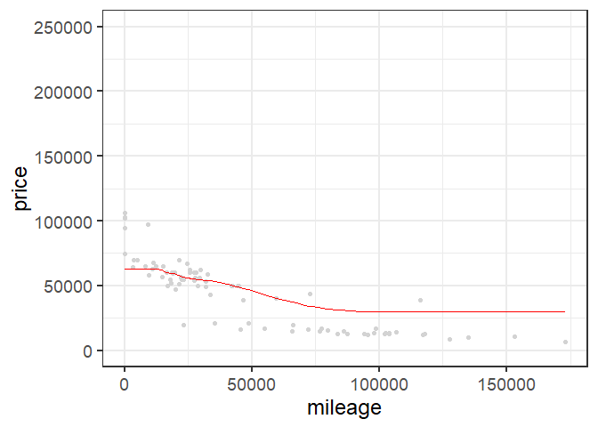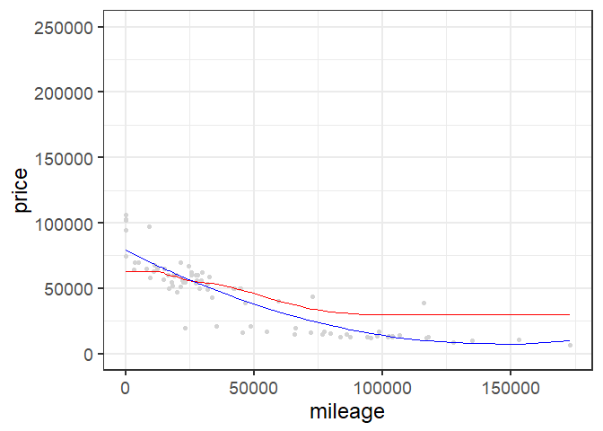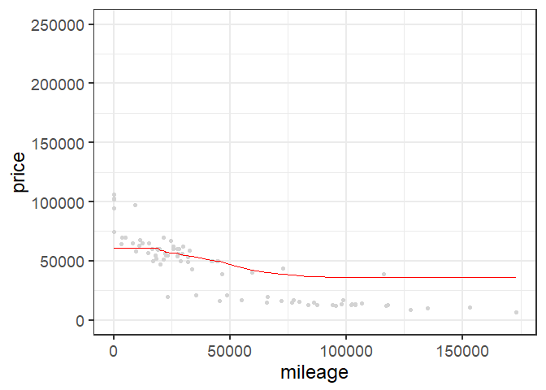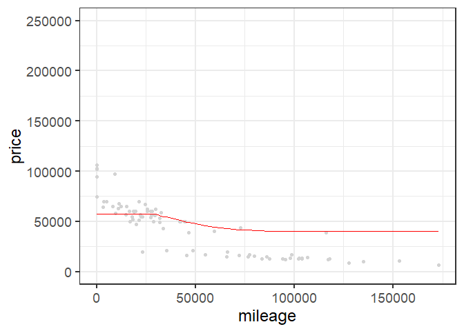

    ## Warning: Removed 57 rows containing missing values (geom_point).

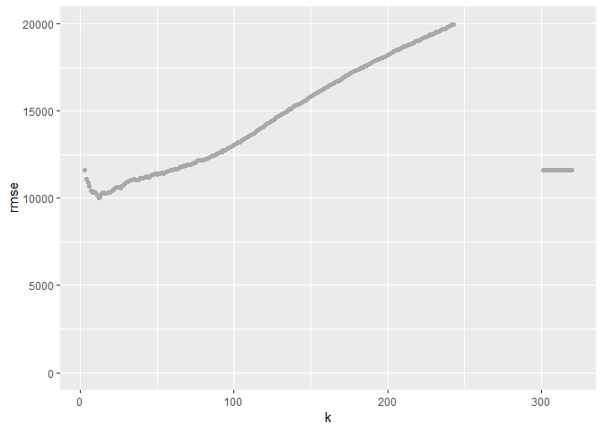

    ## [1] "call"      "k"         "n"         "pred"      "residuals" "PRESS"    
    ## [7] "R2Pred"

    ## [1] 11175.12

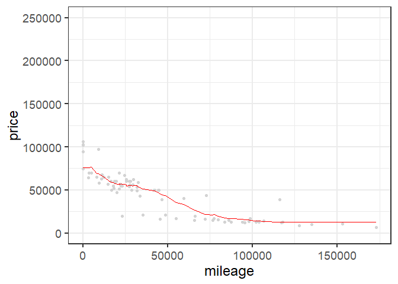
