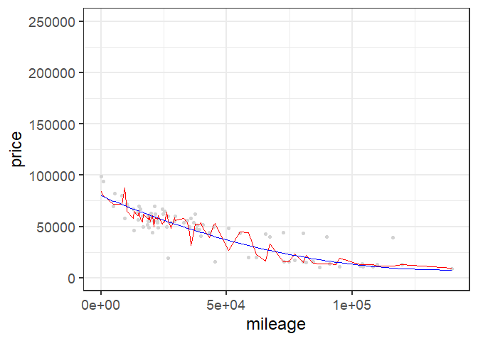
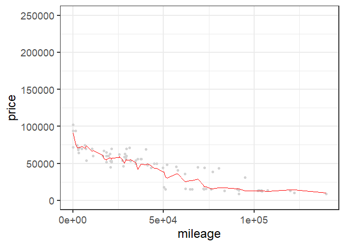
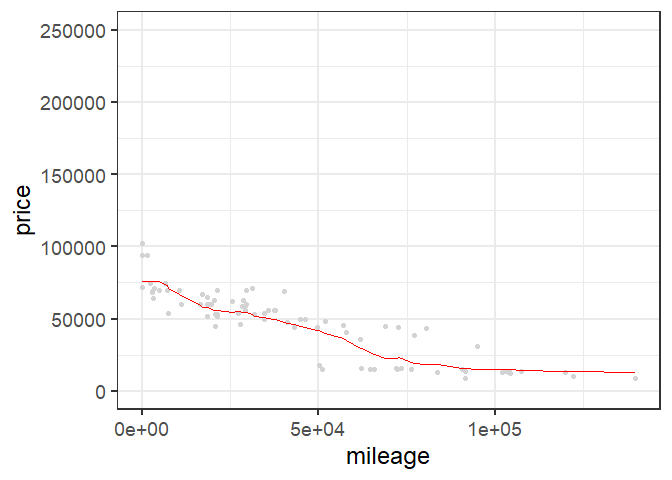
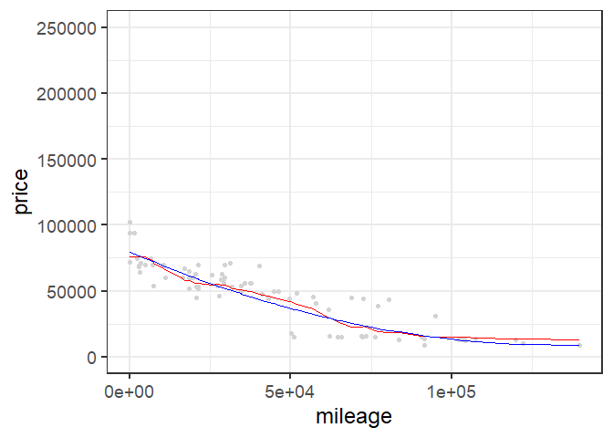
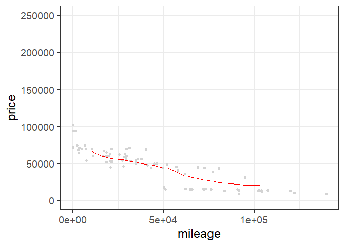
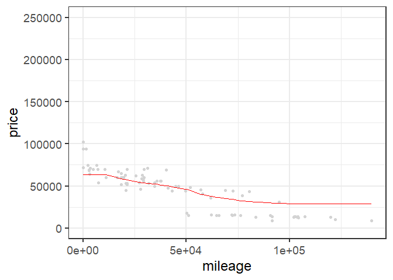
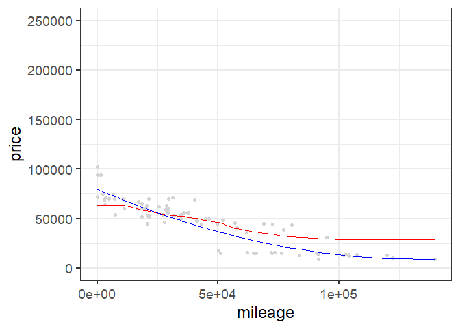
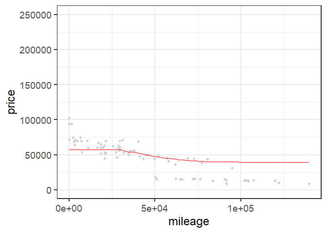
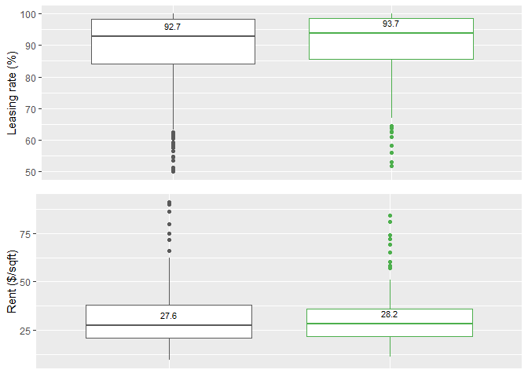

Exercise 1
================
11 February 2019

Wyatt Allen, Elijah Evans, David Ford, Patrick Scovel

Data visualization 1: green buildings
-------------------------------------

    ## nframes and fps adjusted to match transition

Data visualization 2: flights at ABIA
-------------------------------------

    ## Warning: Removed 188 rows containing non-finite values (stat_boxplot).

Using the attached code, we have derived the average delay for the five airliners that fly to Denver, CO from ABIA, as well as the median delays. The first graph is in increasing order of average delay times, but for the second one we made the decision to maintain the original ordering to promote easier comparisons. The most notable thing discovered by comparing these graphs is that no airliner has a negative mean delay, but four of the five airliners have negative median delays. We attribute this difference to outliers skewing the average. There are a few flights for each airliner that have hugely negative delays, even over 10 hours in a few cases. However, the negative delays, indicating an earlier arrival than anticipated, are never more than around 30 minutes. This made intuitive sense to us, as it is possible to leave an airport an indefinite amount of time after a scheduled departure, but an airplane can't really leave hours before it's scheduled to land, as it would clearly be unjust to expect all of the passengers and crew to be boarded and ready an hour or ten early, meaning that there is somewhat of a ceiling on how early a flight can be, but little to no limit on how late it can be.

Regression vs KNN
-----------------

