Exercise 1
================
11 February 2019

Wyatt Allen, Elijah Evans, David Ford, Patrick Scovel

Data visualization 1: green buildings
-------------------------------------

Ultimately what one the two positive outcomes that a developer is looking for is (a) rent and (b) leasing rate. We simply plot our data on these two axis to get an idea of how the data set is distributed 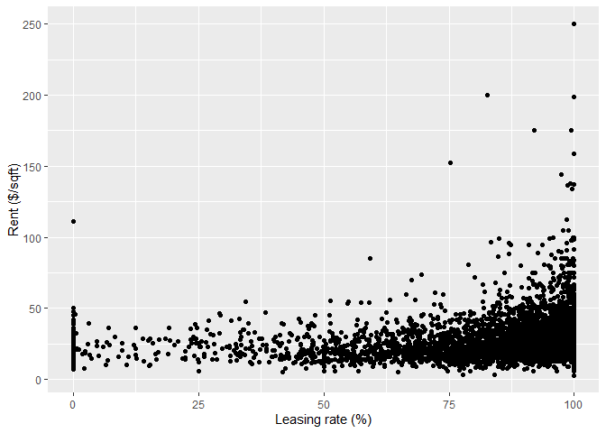

Our data contains a few outliers of extremely high rent and very low leasing rate. We have no reason to believe that our building will fall into these two categories. We will concern outselves with the bulk of the data that has an above 50% occupancy rate and a rend below 100 $/sqft. This restriction will still leave the vast majority of the data

Represented below is the new distribution.

Our builder is concerned with the decision of "going green.". To illustrate this in our data we colour the apartments that have green certifications

We note here that the buildings with green certifications appear to have slightly higher leasing rates. Furthermore, there appears to be a larger clump of low-rent buildings without green certificaions 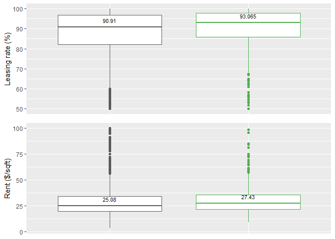

We can see that both the leasing rate and the rent are higher for green buildings. An interesting theory might be that green buildings typically correspond to newer developments. And newer developments might correspond to nicer buildings and therefore higher rents and leasing rates.

This new plot now considers whether a building is relatively new. If the point is filled in then it represents a newer development

It is difficult to make out everything so we will cycle through the different states

    ## nframes and fps adjusted to match transition

 Here it looks like by simply controlling for newer developments, we have removed many of the low occupancy buildings from the non-green apartments.

We can now look at the box and whiskers just for the new buildings and the gap has considerably shrunk. 

To finalize this study we can control for a few more variables that the situation describes. The developer describes the building that is, 15 stories, Mixed use, Is located on East Cesar Chavez One can find online sources for the approximate rent of an East Cesar Chavez apartment. Estimates are approximately $27/sqft and is newly constructed. With these qualifications we can find apartments in our data set that could be considered roughly comprable

Idealy we would like to see where this range of building factors are located on our data set. Here we will construct a polygon sized to the interquartile of the leasing rent and Rent.

Now we overlay our quantile polygon on our previous data. 

Here we see that the interquartile range for the green within the iqr of the non-green. For our comps the decision to go green is less clear than before. It appears that from our data not upgrading would be an acceptable option. The green buildings tend to have very slight higher median leasing rates and slightly higher median rents; however, it is far from conclusive. It is important to note that the 75th quantile of the non-green does extend higher in both dimensions than the green. It may be more worth while for the developer to spend money that could have gone into green appliances and instead invest in more luxirous dwellings that prompt higher rents and leasing rates. More data is needed to more accurately represent the dwelling that the developer wants to build.

Data is now shown in a box plot 

An initial look at the data appears to show that it is favorable to invest in green appliances based on rent and leasing rate. After controlling for various other factors such as age, there appears to be a confounding effect between apartments that have green certifications and apartments that exhibit other desirable factors. When we look at apartments that would more closely describe the one which the developer would like to build, we see that there is inconclusive evidence supporting the decision to go green. Apartments that already have many competitive amenities and characteristics are much more inelastic to green certifications; therefore, instead of purchasing more expensive green appliances, a developer should consider investing in other features that may be more desirable for an apartment lessee.

Data visualization 2: flights at ABIA
-------------------------------------

Plotting the flights from Austin Bergstrom to the airports it services. 

Below is a heat map of the average delays for each calendar day of 2008. There is a concentration of delays in December, likely due to increased airline traffic.

This graph shows the average delay by airline for each month of the year. Average for most carriers delays appear to decrease in the fall.

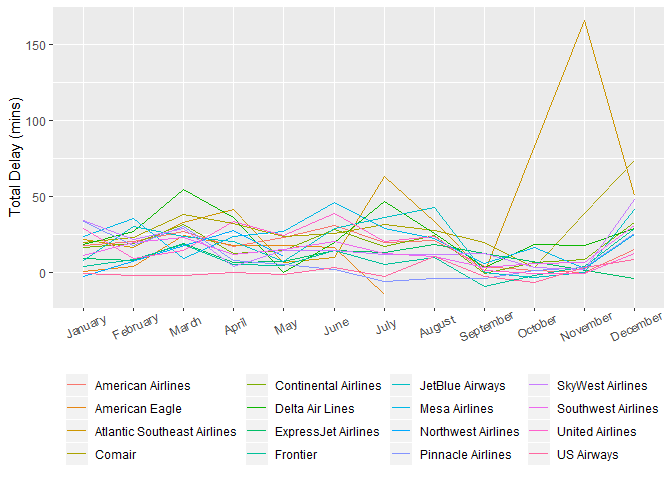

The graph below shows the average delay by airline for each day of the week. Average delays increase on Friday and Sunday likely due to increased traffic flying to weekend destination.

Here is a box plot showing the delay by airline carrier. Comair and Atlantic Southeast Airlines appear to have the highest delays. 

Here, we focused our analysis on a specific route. We chose Austin to Denver. 

We have derived the average delay for the five airliners that fly to Denver, CO from ABIA, as well as the median delays. The first graph is in increasing order of average delay times, but for the second one we made the decision to maintain the original ordering to promote easier comparisons. The most notable thing discovered by comparing these graphs is that no airliner has a negative mean delay, but four of the five airliners have negative median delays. We attribute this difference to outliers skewing the average. There are a few flights for each airliner that have hugely negative delays, even over 10 hours in a few cases. However, the negative delays, indicating an earlier arrival than anticipated, are never more than around 30 minutes. This made intuitive sense to us, as it is possible to leave an airport an indefinite amount of time after a scheduled departure, but an airplane can't really leave hours before it's scheduled to land, as it would clearly be unjust to expect all of the passengers and crew to be boarded and ready an hour or ten early, meaning that there is somewhat of a ceiling on how early a flight can be, but little to no limit on how late it can be.

Regression vs KNN
-----------------

For each of the trim levels, S350 and S65 AMG, we ran KNN regression for K values of 3, 4, 5, 10, 25, 50, 75, 100, 150, and 200. We ran another KNN regression on S350 at k=250, which was not supported by the S65 AMG trim due to the size of the train data set. As you can see, in both cases, as k increases, the lines become smoother, and for high k values, the line becomes essentially a horizontal line at the mean.

The analysis is first done with the s350, with K values 3, 4, 5, 10, 25, 50, 75, 100, 150, and 200. This is plotted in red against the linear regression in blue.

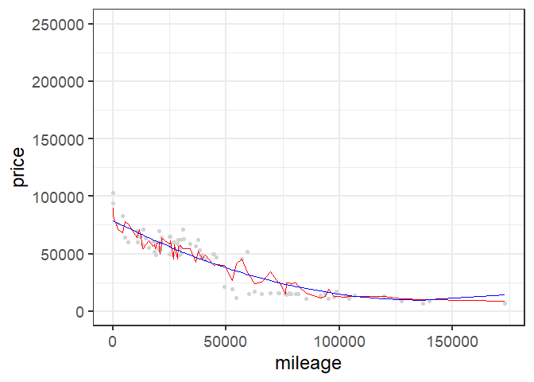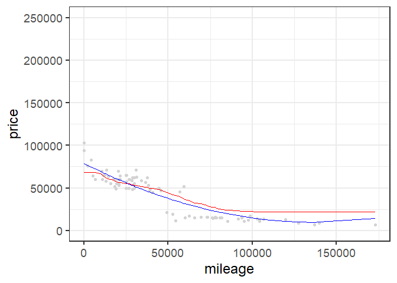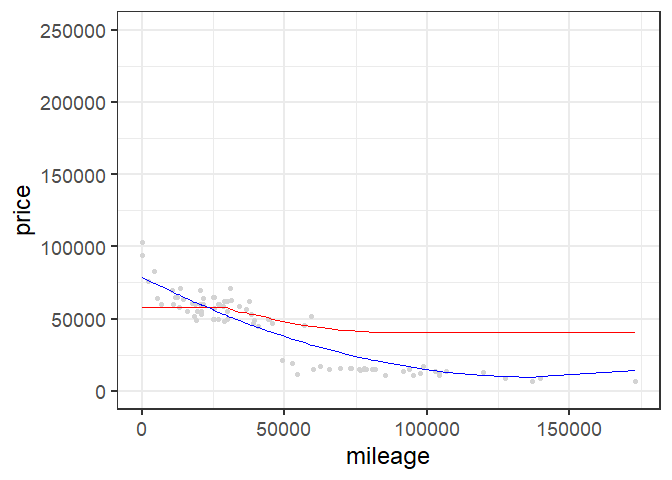

Here, we plot the RMSE as a function of K. 

Here, we have the optimized value of K plotted against the linear model. 

The analysis now repeated with the 65 AMG, with K values 3, 4, 5, 10, 25, 50, 75, 100, 150, and 200. This is plotted in red against the linear regression in blue.

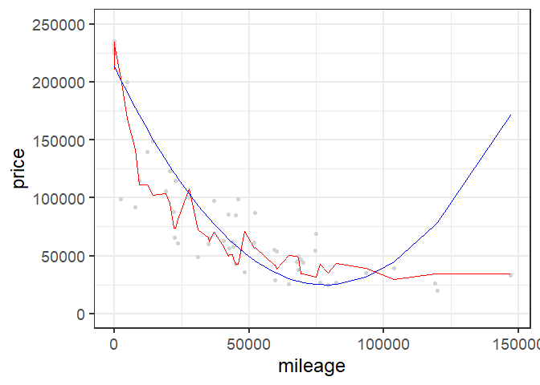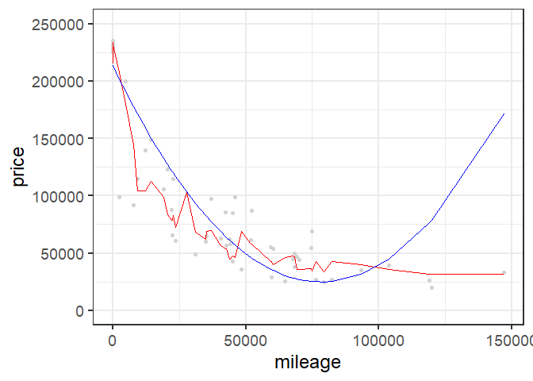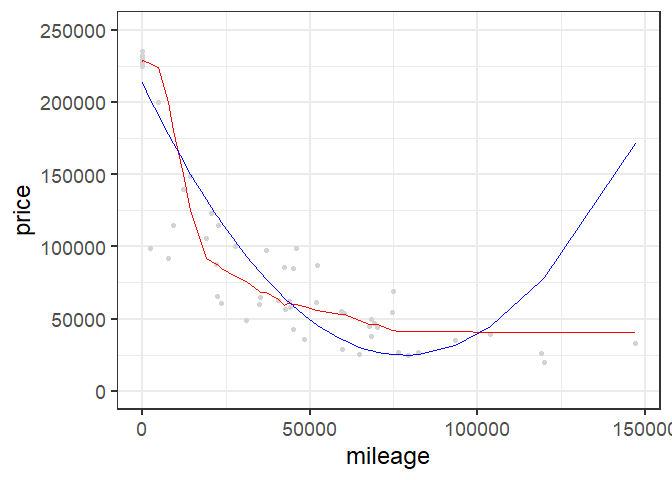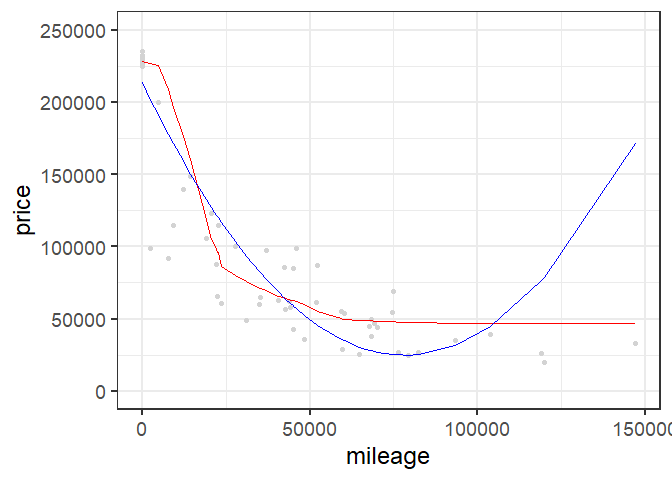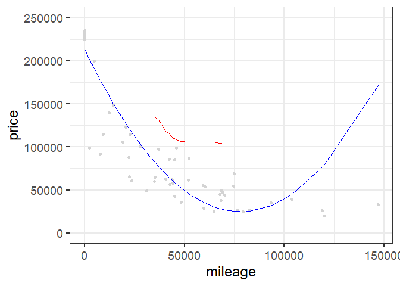

Here, we have the RMSE plotted as a function of K. RMSE is minimized at K = 40.

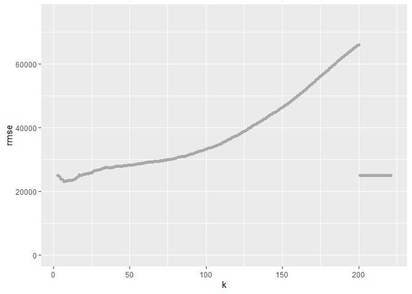

Here, we have the optimized value of K plotted against the linear model.  It is worth noting that due to the random selection of test vs. train data points, the optimal K found changed, sometimes drastically, between trials conducted on this data set. However, the optimal K values we found the final time we ran RMSE as a function of K, were 40 for both the S350 and for the S65 AMG. This would likely be explained by the fact that we have roughly 400 observations of the S350 trim, and roughly 300 observations of the S65 AMG trim. The similarity is the size of the data sets would likely mean that again by random chance, we could certainly see optimal k-values for the different data sets being very close to each other.
