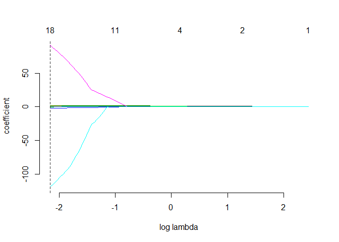

Exercise 3
================
Wyatt Allen, Elijah Evans, David Ford, Patrick Scovel
07 April 2019

Question 1: Model selection and regularization: green buildings
---------------------------------------------------------------

After briefly cleaning-up the dataset by removing blank values, we have created our best guess at a linear model as a starting point - which we have simply named lm. In our case, we believe that the most important variables for predicting rent prices are: size of the lot, age of the building, "class" of the building, dummy variables for various amenities, and the cluster information. Cluster is used here to identify clusters of buildings that are fairly close to each other, and cluster rent is used to measure average rental prices in the general vicinity of each building.

    ## 
    ## Call:
    ## lm(formula = Rent ~ size + age + class_a + class_b + amenities + 
    ##     cluster_rent + cluster, data = g)
    ## 
    ## Residuals:
    ##     Min      1Q  Median      3Q     Max 
    ## -52.207  -3.700  -0.472   2.363 176.263 
    ## 
    ## Coefficients:
    ##                Estimate Std. Error t value Pr(>|t|)    
    ## (Intercept)  -4.545e+00  5.073e-01  -8.959  < 2e-16 ***
    ## size          6.080e-06  4.208e-07  14.451  < 2e-16 ***
    ## age          -7.079e-03  3.991e-03  -1.774 0.076162 .  
    ## class_a       2.842e+00  4.219e-01   6.735 1.76e-11 ***
    ## class_b       1.290e+00  3.378e-01   3.819 0.000135 ***
    ## amenities     4.522e-01  2.456e-01   1.841 0.065616 .  
    ## cluster_rent  1.066e+00  1.046e-02 101.919  < 2e-16 ***
    ## cluster       9.804e-04  2.772e-04   3.537 0.000407 ***
    ## ---
    ## Signif. codes:  0 '***' 0.001 '**' 0.01 '*' 0.05 '.' 0.1 ' ' 1
    ## 
    ## Residual standard error: 9.473 on 7812 degrees of freedom
    ## Multiple R-squared:  0.6069, Adjusted R-squared:  0.6066 
    ## F-statistic:  1723 on 7 and 7812 DF,  p-value: < 2.2e-16

Next, we have moved on to stepwise selection. Essentially, this starts at our "best guess" and then adds/removes variables one-by-one until there are no more natural improvements to be made to the "best guess" lm model in terms of improving the model's AIC. In our case, we have only included two-way interactions, as we believed that three-way interactions would quickly over-complicate things and are difficult to interpret for most people anyway.

After that we create a sparse matrix, which is a prerequisite for using the gamma-lasso regression. This lasso regression is a convenient method of regularizing the model selection process. It basically minimizes the deviance of the model while also penalizing it for being overly complex - which is vital for improving out-of-sample predictions, which can perform poorly when models have been fit too closely to the pre-existing data that you are working with. The lasso approach uses the sparse matrix that we have setup to give sparse solutions which automatically select variables for us - a much simpler approach than the earlier exercises where we have attempted to fit predictive models by hand.

In the end, we have estimated that green certification ratings increase the expected rent per square foot by around $1.47, and we found this using the model discovered by stepwise selection. Our lasso regression returned an estimate of -$0.33, which to us seems less reasonable than our estimate from stepwise selection, which is why we are going with the stepwise selection model.

As for whether or not the "green certification" effect is different for different buildings or not, we believe that it does not. We have arrived at this conclusion based on the fact that our stepwise selection model did not choose to include class interactions when assessing possible variables to include one-by-one. Therefore, it appears as though the "green certification" effect is indeed roughly similar across all or most buildings.

Question 2: What causes what?
-----------------------------

1.  Simply running crime on police seems like a natural way of looking into this, but the fact is that you can't pinpoint causation vs correlation this way most of the time. In this case, there is every chance that more or less police are hired because of high or low crime rates, which causes some exogeneity problems. It is difficult to say which is causing which, as the podcast pointed out - it's likely even that they are both having effects on each other. It could also be the case that more police are better able to catch the same level of crime, which would inflate the crime statistics, as more people appear to be breaking the laws when in reality it could just be that more people are being caught. Really, there are just a number of reasons as to why it isn't this simple, and because of that, we need to come up with clever solutions to better justify models.

2.  They were able to isolate this effect basically by looking at "high-alert" days in DC. They have a terrorism alert system, and on high alert days there is stronger police presence. Now you might ask, is everyone just hiding inside from the terrorists? Well, maybe. However, these researchers had the foresight to also look at the amount of people riding the metro on those days, and were therefore able to include to some extent the total volume of people in DC in order to control for that possibility in their models. As seen in the table, the effect of high-alert days on crime appears significant. The first column is claiming that, holding all else fixed, high-alert days have less crime on average, and even once controlling for metro rider levels, high-alert days have less crime than other days, on average. This appears to make sense, as criminals would be more cautious of committing crimes when there are noticeably more police on the streets. The R-squared also goes up between the two regressions, which is of course expected as we have added an explanatory variable.

3.  Here they have controlled for metro ridership because they were concerned that the high-alert days may simply have less criminals or less tourists or whoever on the streets because they were afraid of the terrorists. They are trying to use this metric as a way of capturing the possibly-reduced levels of people moving around DC on those days. Naturally less people should mean less crime, so this is their way of controlling for that in their regression.

4.  In the first column, they have four coefficients. The first is an interaction between high-alert days and police District 1, then an interaction between high-alert days and the other districts, ln(midday metro ridership), and a constant term. In short, they are saying that midday ridership has a positive effect on crime rates, meaning that more people (or more potential victims) lead to higher crime rates on average. However, the high-alert days both seem to have reduced levels of crime, although District 1 is showing even higher reductions in crime on high-alert days. I don't know the geography of DC very well, but a quick Google search shows that the 1st District Substation is near Capitol Hill. This seems to make sense, as terrorists may be more likely (or at least are perceived to be more likely) to attack the more popular tourist attractions in the city, or perhaps the political leaders in/around the capitol building. Overall, it seems like they are indeed able to make the claim that more police lead to less crime. They have chosen what seem to be appropriate instruments, and have even controlled for the volume of people in the city, which seem to me like sufficiently-clever measures to make a decent claim that this is due to causation rather than correlation.
