Exercise 4
================
25 April 2019

Question 1
----------

``` r
## Exercise 4 
# Question 1
library(ggplot2)
library(LICORS)
```

    ## Warning: package 'LICORS' was built under R version 3.5.3

``` r
library(foreach)
```

    ## Warning: package 'foreach' was built under R version 3.5.3

``` r
library(cluster)

wine <- read.csv("https://raw.githubusercontent.com/jgscott/ECO395M/master/data/wine.csv")

# Objectice sort reds from whites
# Want 2 clusters?
# Later want to distinguish between quality????

# Pick out the 11 attibutes
X = wine[,-c(12,13)]
# Scale the entries
X = scale(X, center = TRUE, scale = TRUE)
y = wine[,13]
# Looking at just the first few clusters the data seems very homogeneous
pairs(X[,1:5], pch=16, cex=0.3)
```

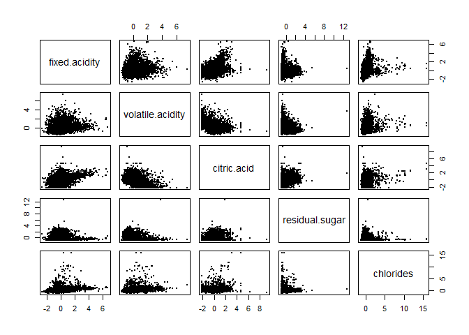

``` r
## K-means++ w/o PCA ##
cluster_k = kmeanspp(X, k = 2, nstart = 25, iter.max = 1000)
# Same plot with the k-means
pairs(X[,1:5], col = cluster_k$cluster, pch=16, cex=0.3)
```

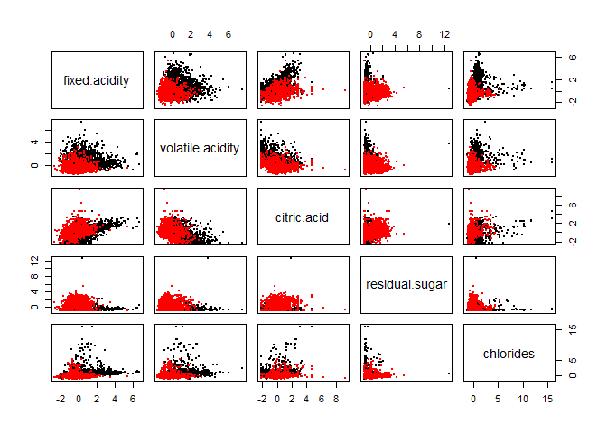

``` r
## PCA ##
pc_wine = prcomp(X, rank.=5)
# Plot of variance for each PC
plot(pc_wine, type="lines")
```

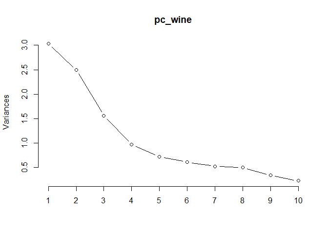

``` r
summary(pc_wine)
```

    ## Importance of first k=5 (out of 11) components:
    ##                           PC1    PC2    PC3     PC4     PC5
    ## Standard deviation     1.7407 1.5792 1.2475 0.98517 0.84845
    ## Proportion of Variance 0.2754 0.2267 0.1415 0.08823 0.06544
    ## Cumulative Proportion  0.2754 0.5021 0.6436 0.73187 0.79732

``` r
comps <- data.frame(pc_wine$x)
# Plot 1st 5 PCs
plot(comps[,1:5], pch = 16, col=rgb(0,0,0, alpha = 0.5), cex=0.3)
```

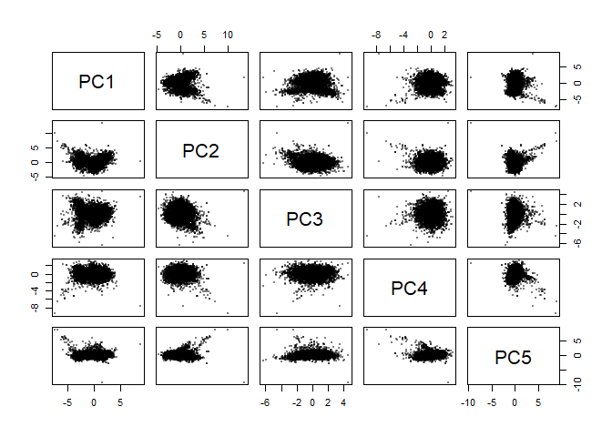

``` r
# A few plots appear to have 2 groupings 

## K-means++ clustering with PCA ##
# Run kmeans++ with arbitrary k=5 on PCA
cluster_kp = kmeanspp(comps, k = 2, nstart = 25, iter.max = 1000)
plot(comps[,1:5], col = cluster_kp$cluster, pch=16, cex=0.3)
```

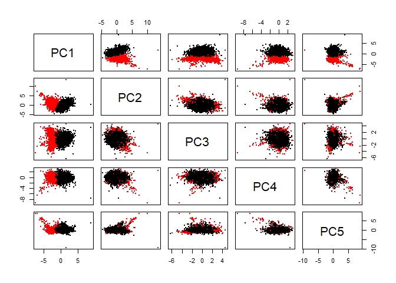

``` r
# Appears to have itendified clusters along the 1st PC

## Heirarchical Clustering ##
# Pairwise distance matrix using the distance function
distance_between_wine = dist(pc_wine$x, method='euclidean')
# Hierarchical clustering
# Complete seems to have break up the clusters quicker
cluster_hier = hclust(distance_between_wine, method='complete')
# Dendrogram
plot(cluster_hier)
```

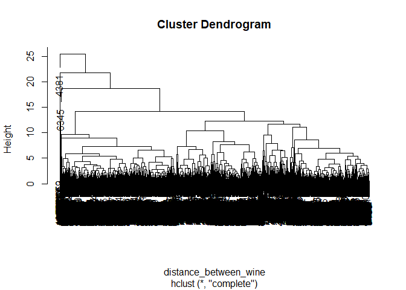

``` r
# Problem dendogram is highly homogeneous
# Arbitrarily choose k 
# Maybe k = 18 
# (2 colors) * (9 qualities) = 18 clusters??? -> k=18
hcluster = cutree(cluster_hier, k=18)
summary(factor(hcluster))
```

    ##    1    2    3    4    5    6    7    8    9   10   11   12   13   14   15 
    ##  721  466 1009   98   53   95   22  460    2   55 1393  528 1570   19    2 
    ##   16   17   18 
    ##    2    1    1

``` r
## Check to see if we are picking up on the color based on kmeans++ ##
c1_k = wine[which(cluster_k$cluster == 1),]
c2_k = wine[which(cluster_k$cluster == 2),]
summary(c1_k$color)
```

    ##   red white 
    ##    24  4830

``` r
summary(c2_k$color)
```

    ##   red white 
    ##  1575    68

``` r
## Look at how effective kmeans++ w/ PCA was ##
c1_kp = wine[which(cluster_kp$cluster==1),]
c2_kp = wine[which(cluster_kp$cluster==2),]
summary(c1_kp$color)
```

    ##   red white 
    ##    25  4820

``` r
summary(c2_kp$color)
```

    ##   red white 
    ##  1574    78

``` r
# Heirarchical cluster??
c1_h = wine[which(hcluster == 1),]
summary(c1_h$color)
```

    ##   red white 
    ##   711    10

``` r
summary(c1_h$quality)
```

    ##    Min. 1st Qu.  Median    Mean 3rd Qu.    Max. 
    ##   3.000   5.000   5.000   5.369   6.000   8.000

``` r
# Try and get data from 18 clusters of
# Heirarchical clustering with k = 18 
cluster_grid = seq(1, 18, by = 1)
hier_grid = foreach(i = cluster_grid, .combine = 'c') %do% {
  summary(wine[which(hcluster == i),]$color)
}

## Figure out quality prediction
# Either try kmeans++ with higher k-val or hierachical 
```

Question 2
----------

``` r
## Exercise 2
# Question 2
library(LICORS)
library(foreach)
library(cluster)
library(wordcloud2)
```

    ## Warning: package 'wordcloud2' was built under R version 3.5.3

``` r
library(data.table)
social <- read.csv("https://raw.githubusercontent.com/jgscott/ECO395M/master/data/social_marketing.csv")

# each row is a user

X_social = social[,-1]
cluster_k_social = kmeanspp(X_social, k = 2, nstart = 25, iter.max = 1000)
pairs(X_social[,1:5], col = cluster_k_social$cluster, pch=16, cex=0.3)
```


``` r
## Typical clusters takes way too fucking long
## PCA
pc_social = prcomp(X_social, rank.=7)
# Plot of variance for each PC
plot(pc_social, type="lines")
```


``` r
# Looks like 7 PC
summary(pc_social)
```

    ## Importance of first k=7 (out of 36) components:
    ##                           PC1    PC2    PC3    PC4     PC5     PC6     PC7
    ## Standard deviation     5.2035 4.3366 3.8224 3.7751 3.60916 3.21543 2.13510
    ## Proportion of Variance 0.1924 0.1336 0.1038 0.1013 0.09255 0.07346 0.03239
    ## Cumulative Proportion  0.1924 0.3260 0.4298 0.5311 0.62363 0.69709 0.72948

``` r
comps <- data.frame(pc_social$x)
# Plot 1st 5 PCs
plot(comps[,1:5], pch = 16, col=rgb(0,0,0, alpha = 0.5), cex=0.3)
```

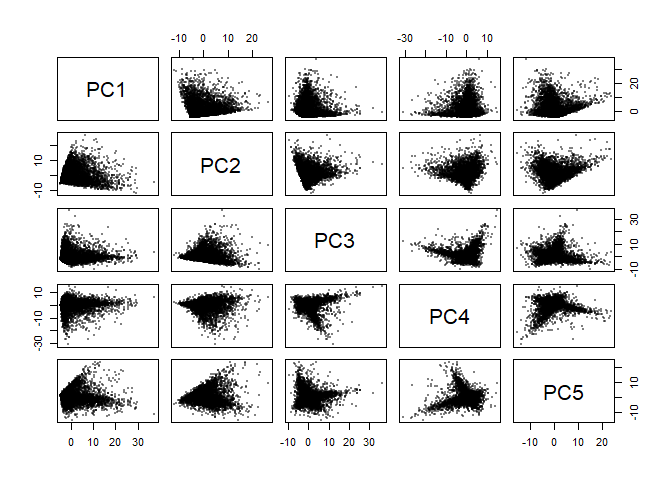

``` r
# A few plots appear to have 2 groupings 

# Look through the K's
k_grid_social = seq(2, 25, by = 1)
N = nrow(social)
SSE_grid_social = foreach(k = k_grid_social, .combine = 'c') %dopar% {
  cluster_kp_social = kmeanspp(pc_social$x, k, nstart=25)
  cluster_kp_social$tot.withinss
}
```

    ## Warning: executing %dopar% sequentially: no parallel backend registered

``` r
plot(SSE_grid_social)
```

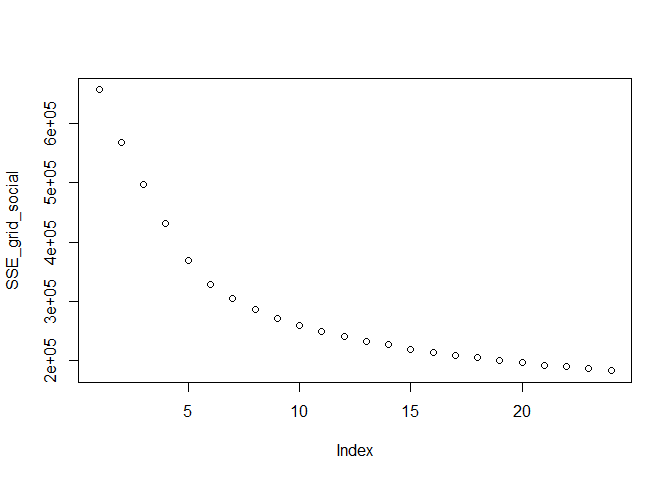

``` r
# No clear "elbow"
# Lets choose k=6
# Gap statistic takes way too long " stage steps exceeded maximum "
k_clusters = 6
cluster_kp_social = kmeanspp(pc_social$x, k = k_clusters, nstart = 25, iter.max = 1000)
plot(comps[,1:5], col = cluster_kp_social$cluster, pch=16, cex=0.3)
```

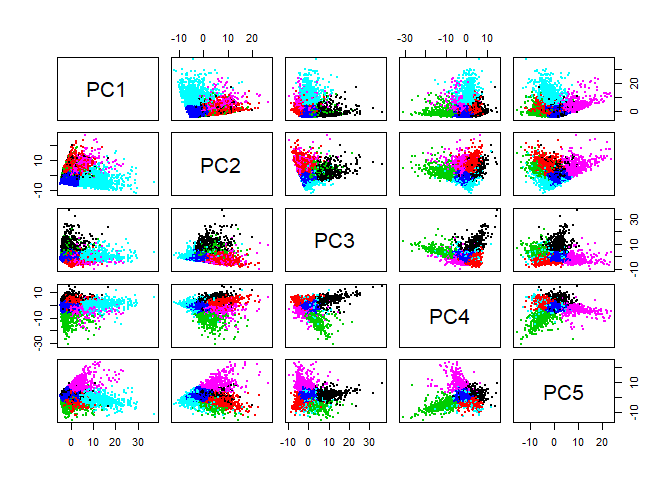

``` r
c1_kp = social[which(cluster_kp_social$cluster == 1),]
c2_kp = social[which(cluster_kp_social$cluster == 2),]
summary(c1_kp)
```

    ##          X           chatter      current_events      travel     
    ##  12grikctu:   1   Min.   :0.000   Min.   :0.000   Min.   :0.000  
    ##  12klxic7j:   1   1st Qu.:2.000   1st Qu.:0.000   1st Qu.:0.000  
    ##  12t4msroj:   1   Median :3.000   Median :1.000   Median :1.000  
    ##  132y8f6aj:   1   Mean   :2.919   Mean   :1.374   Mean   :1.103  
    ##  135k7cozy:   1   3rd Qu.:4.000   3rd Qu.:2.000   3rd Qu.:2.000  
    ##  13mjqlzyo:   1   Max.   :9.000   Max.   :7.000   Max.   :8.000  
    ##  (Other)  :4038                                                  
    ##  photo_sharing    uncategorized       tv_film       sports_fandom   
    ##  Min.   : 0.000   Min.   :0.0000   Min.   : 0.000   Min.   : 0.000  
    ##  1st Qu.: 0.000   1st Qu.:0.0000   1st Qu.: 0.000   1st Qu.: 0.000  
    ##  Median : 1.000   Median :1.0000   Median : 0.000   Median : 1.000  
    ##  Mean   : 1.514   Mean   :0.7085   Mean   : 1.028   Mean   : 1.497  
    ##  3rd Qu.: 2.000   3rd Qu.:1.0000   3rd Qu.: 1.000   3rd Qu.: 2.000  
    ##  Max.   :10.000   Max.   :6.0000   Max.   :16.000   Max.   :17.000  
    ##                                                                     
    ##     politics           food            family       home_and_garden 
    ##  Min.   :0.0000   Min.   : 0.000   Min.   :0.0000   Min.   :0.0000  
    ##  1st Qu.:0.0000   1st Qu.: 0.000   1st Qu.:0.0000   1st Qu.:0.0000  
    ##  Median :0.0000   Median : 1.000   Median :0.0000   Median :0.0000  
    ##  Mean   :0.9003   Mean   : 1.188   Mean   :0.7515   Mean   :0.4456  
    ##  3rd Qu.:1.0000   3rd Qu.: 2.000   3rd Qu.:1.0000   3rd Qu.:1.0000  
    ##  Max.   :7.0000   Max.   :16.000   Max.   :9.0000   Max.   :5.0000  
    ##                                                                     
    ##      music              news         online_gaming       shopping     
    ##  Min.   : 0.0000   Min.   : 0.0000   Min.   :0.0000   Min.   :0.0000  
    ##  1st Qu.: 0.0000   1st Qu.: 0.0000   1st Qu.:0.0000   1st Qu.:0.0000  
    ##  Median : 0.0000   Median : 0.0000   Median :0.0000   Median :0.0000  
    ##  Mean   : 0.5546   Mean   : 0.7455   Mean   :0.5589   Mean   :0.7366  
    ##  3rd Qu.: 1.0000   3rd Qu.: 1.0000   3rd Qu.:1.0000   3rd Qu.:1.0000  
    ##  Max.   :10.0000   Max.   :11.0000   Max.   :9.0000   Max.   :7.0000  
    ##                                                                       
    ##  health_nutrition  college_uni      sports_playing      cooking      
    ##  Min.   :0.0000   Min.   : 0.0000   Min.   :0.0000   Min.   :0.0000  
    ##  1st Qu.:0.0000   1st Qu.: 0.0000   1st Qu.:0.0000   1st Qu.:0.0000  
    ##  Median :0.0000   Median : 0.0000   Median :0.0000   Median :0.0000  
    ##  Mean   :0.9525   Mean   : 0.8897   Mean   :0.4357   Mean   :0.8259  
    ##  3rd Qu.:1.0000   3rd Qu.: 1.0000   3rd Qu.:1.0000   3rd Qu.:1.0000  
    ##  Max.   :8.0000   Max.   :10.0000   Max.   :5.0000   Max.   :9.0000  
    ##                                                                      
    ##       eco           computers         business         outdoors    
    ##  Min.   :0.0000   Min.   :0.0000   Min.   :0.0000   Min.   :0.000  
    ##  1st Qu.:0.0000   1st Qu.:0.0000   1st Qu.:0.0000   1st Qu.:0.000  
    ##  Median :0.0000   Median :0.0000   Median :0.0000   Median :0.000  
    ##  Mean   :0.3598   Mean   :0.3853   Mean   :0.3173   Mean   :0.454  
    ##  3rd Qu.:1.0000   3rd Qu.:1.0000   3rd Qu.:1.0000   3rd Qu.:1.000  
    ##  Max.   :4.0000   Max.   :6.0000   Max.   :5.0000   Max.   :6.000  
    ##                                                                    
    ##      crafts        automotive          art             religion     
    ##  Min.   :0.000   Min.   :0.0000   Min.   : 0.0000   Min.   : 0.000  
    ##  1st Qu.:0.000   1st Qu.:0.0000   1st Qu.: 0.0000   1st Qu.: 0.000  
    ##  Median :0.000   Median :0.0000   Median : 0.0000   Median : 0.000  
    ##  Mean   :0.405   Mean   :0.5784   Mean   : 0.6513   Mean   : 1.077  
    ##  3rd Qu.:1.000   3rd Qu.:1.0000   3rd Qu.: 1.0000   3rd Qu.: 1.000  
    ##  Max.   :7.000   Max.   :9.0000   Max.   :18.0000   Max.   :15.000  
    ##                                                                     
    ##      beauty         parenting           dating            school       
    ##  Min.   :0.0000   Min.   : 0.0000   Min.   : 0.0000   Min.   : 0.0000  
    ##  1st Qu.:0.0000   1st Qu.: 0.0000   1st Qu.: 0.0000   1st Qu.: 0.0000  
    ##  Median :0.0000   Median : 0.0000   Median : 0.0000   Median : 0.0000  
    ##  Mean   :0.4392   Mean   : 0.8358   Mean   : 0.4624   Mean   : 0.6642  
    ##  3rd Qu.:1.0000   3rd Qu.: 1.0000   3rd Qu.: 0.0000   3rd Qu.: 1.0000  
    ##  Max.   :6.0000   Max.   :13.0000   Max.   :16.0000   Max.   :10.0000  
    ##                                                                        
    ##  personal_fitness    fashion       small_business        spam         
    ##  Min.   :0.0000   Min.   :0.0000   Min.   :0.0000   Min.   :0.000000  
    ##  1st Qu.:0.0000   1st Qu.:0.0000   1st Qu.:0.0000   1st Qu.:0.000000  
    ##  Median :0.0000   Median :0.0000   Median :0.0000   Median :0.000000  
    ##  Mean   :0.6414   Mean   :0.5321   Mean   :0.2772   Mean   :0.007666  
    ##  3rd Qu.:1.0000   3rd Qu.:1.0000   3rd Qu.:0.0000   3rd Qu.:0.000000  
    ##  Max.   :8.0000   Max.   :7.0000   Max.   :4.0000   Max.   :2.000000  
    ##                                                                       
    ##      adult       
    ##  Min.   : 0.000  
    ##  1st Qu.: 0.000  
    ##  Median : 0.000  
    ##  Mean   : 0.452  
    ##  3rd Qu.: 0.000  
    ##  Max.   :20.000  
    ## 

``` r
summary(c2_kp)
```

    ##          X          chatter       current_events      travel      
    ##  123pxkyqj:  1   Min.   : 0.000   Min.   :0.000   Min.   : 0.000  
    ##  13jvg69ek:  1   1st Qu.: 2.000   1st Qu.:1.000   1st Qu.: 2.000  
    ##  15tiw6rye:  1   Median : 3.000   Median :2.000   Median : 5.000  
    ##  16kjio4fp:  1   Mean   : 3.946   Mean   :1.675   Mean   : 5.919  
    ##  18xq6vst3:  1   3rd Qu.: 5.000   3rd Qu.:3.000   3rd Qu.: 9.000  
    ##  1bvlxoc7r:  1   Max.   :19.000   Max.   :8.000   Max.   :26.000  
    ##  (Other)  :637                                                    
    ##  photo_sharing    uncategorized       tv_film      sports_fandom   
    ##  Min.   : 0.000   Min.   :0.0000   Min.   : 0.00   Min.   : 0.000  
    ##  1st Qu.: 1.000   1st Qu.:0.0000   1st Qu.: 0.00   1st Qu.: 0.000  
    ##  Median : 2.000   Median :1.0000   Median : 1.00   Median : 2.000  
    ##  Mean   : 2.168   Mean   :0.7325   Mean   : 1.18   Mean   : 2.235  
    ##  3rd Qu.: 3.000   3rd Qu.:1.0000   3rd Qu.: 2.00   3rd Qu.: 3.000  
    ##  Max.   :12.000   Max.   :5.0000   Max.   :12.00   Max.   :12.000  
    ##                                                                    
    ##     politics           food            family       home_and_garden 
    ##  Min.   : 2.000   Min.   : 0.000   Min.   :0.0000   Min.   :0.0000  
    ##  1st Qu.: 6.000   1st Qu.: 0.000   1st Qu.:0.0000   1st Qu.:0.0000  
    ##  Median : 9.000   Median : 1.000   Median :1.0000   Median :0.0000  
    ##  Mean   : 9.473   Mean   : 1.695   Mean   :0.9798   Mean   :0.5848  
    ##  3rd Qu.:11.000   3rd Qu.: 2.000   3rd Qu.:1.0000   3rd Qu.:1.0000  
    ##  Max.   :37.000   Max.   :14.000   Max.   :6.0000   Max.   :3.0000  
    ##                                                                     
    ##      music             news        online_gaming       shopping     
    ##  Min.   :0.0000   Min.   : 0.000   Min.   : 0.000   Min.   : 0.000  
    ##  1st Qu.:0.0000   1st Qu.: 3.000   1st Qu.: 0.000   1st Qu.: 0.000  
    ##  Median :0.0000   Median : 4.000   Median : 0.000   Median : 1.000  
    ##  Mean   :0.6252   Mean   : 5.151   Mean   : 0.804   Mean   : 1.151  
    ##  3rd Qu.:1.0000   3rd Qu.: 7.000   3rd Qu.: 1.000   3rd Qu.: 2.000  
    ##  Max.   :9.0000   Max.   :20.000   Max.   :13.000   Max.   :10.000  
    ##                                                                     
    ##  health_nutrition  college_uni     sports_playing      cooking      
    ##  Min.   : 0.000   Min.   : 0.000   Min.   :0.0000   Min.   : 0.000  
    ##  1st Qu.: 0.000   1st Qu.: 0.000   1st Qu.:0.0000   1st Qu.: 0.000  
    ##  Median : 0.000   Median : 1.000   Median :0.0000   Median : 1.000  
    ##  Mean   : 1.369   Mean   : 1.244   Mean   :0.6547   Mean   : 1.177  
    ##  3rd Qu.: 1.500   3rd Qu.: 2.000   3rd Qu.:1.0000   3rd Qu.: 1.500  
    ##  Max.   :19.000   Max.   :13.000   Max.   :7.0000   Max.   :12.000  
    ##                                                                     
    ##       eco           computers        business        outdoors     
    ##  Min.   :0.0000   Min.   : 0.00   Min.   :0.000   Min.   :0.0000  
    ##  1st Qu.:0.0000   1st Qu.: 0.00   1st Qu.:0.000   1st Qu.:0.0000  
    ##  Median :0.0000   Median : 2.00   Median :0.000   Median :1.0000  
    ##  Mean   :0.5739   Mean   : 2.47   Mean   :0.633   Mean   :0.8818  
    ##  3rd Qu.:1.0000   3rd Qu.: 4.00   3rd Qu.:1.000   3rd Qu.:1.0000  
    ##  Max.   :5.0000   Max.   :16.00   Max.   :4.000   Max.   :7.0000  
    ##                                                                   
    ##      crafts         automotive          art             religion     
    ##  Min.   :0.0000   Min.   : 0.000   Min.   : 0.0000   Min.   : 0.000  
    ##  1st Qu.:0.0000   1st Qu.: 0.000   1st Qu.: 0.0000   1st Qu.: 0.000  
    ##  Median :0.0000   Median : 1.000   Median : 0.0000   Median : 1.000  
    ##  Mean   :0.6236   Mean   : 2.079   Mean   : 0.6905   Mean   : 1.342  
    ##  3rd Qu.:1.0000   3rd Qu.: 3.000   3rd Qu.: 1.0000   3rd Qu.: 2.000  
    ##  Max.   :6.0000   Max.   :13.000   Max.   :12.0000   Max.   :13.000  
    ##                                                                      
    ##      beauty         parenting          dating            school      
    ##  Min.   :0.0000   Min.   : 0.000   Min.   : 0.0000   Min.   : 0.000  
    ##  1st Qu.:0.0000   1st Qu.: 0.000   1st Qu.: 0.0000   1st Qu.: 0.000  
    ##  Median :0.0000   Median : 1.000   Median : 0.0000   Median : 0.000  
    ##  Mean   :0.4946   Mean   : 1.154   Mean   : 0.9938   Mean   : 0.846  
    ##  3rd Qu.:1.0000   3rd Qu.: 2.000   3rd Qu.: 1.0000   3rd Qu.: 1.000  
    ##  Max.   :6.0000   Max.   :13.000   Max.   :14.0000   Max.   :11.000  
    ##                                                                      
    ##  personal_fitness    fashion       small_business        spam         
    ##  Min.   :0.0000   Min.   :0.0000   Min.   :0.0000   Min.   :0.000000  
    ##  1st Qu.:0.0000   1st Qu.:0.0000   1st Qu.:0.0000   1st Qu.:0.000000  
    ##  Median :0.0000   Median :0.0000   Median :0.0000   Median :0.000000  
    ##  Mean   :0.8896   Mean   :0.6579   Mean   :0.4603   Mean   :0.004666  
    ##  3rd Qu.:1.0000   3rd Qu.:1.0000   3rd Qu.:1.0000   3rd Qu.:0.000000  
    ##  Max.   :9.0000   Max.   :9.0000   Max.   :5.0000   Max.   :1.000000  
    ##                                                                       
    ##      adult        
    ##  Min.   : 0.0000  
    ##  1st Qu.: 0.0000  
    ##  Median : 0.0000  
    ##  Mean   : 0.2426  
    ##  3rd Qu.: 0.0000  
    ##  Max.   :21.0000  
    ## 

``` r
## We have some clusters but how should we compare??
barplot(height = colSums(c1_kp[,-1]))
```

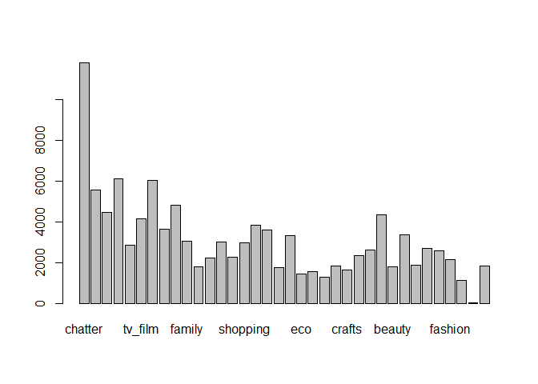

``` r
barplot(height = colSums(c2_kp[,-1]))
```

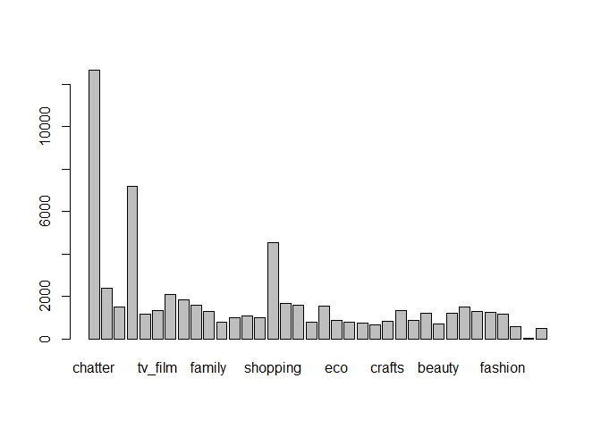

``` r
# Wordcloud
wordclouds_df <- foreach(i = 1:k_clusters, .combine = 'rbind') %do% {
  ci = social[which(cluster_kp_social$cluster == i),]
  colSums(ci[,-1])
}
wordclouds_df <- t(wordclouds_df)
wordcloud2(data.frame(c(rownames(wordclouds_df)), wordclouds_df[,1]))
```

<!--html_preserve-->

<script type="application/json" data-for="htmlwidget-1a49b7e05955ef09e5fc">{"x":{"word":["chatter","current_events","travel","photo_sharing","uncategorized","tv_film","sports_fandom","politics","food","family","home_and_garden","music","news","online_gaming","shopping","health_nutrition","college_uni","sports_playing","cooking","eco","computers","business","outdoors","crafts","automotive","art","religion","beauty","parenting","dating","school","personal_fitness","fashion","small_business","spam","adult"],"freq":[11805,5557,4460,6122,2865,4159,6054,3641,4806,3039,1802,2243,3015,2260,2979,3852,3598,1762,3340,1455,1558,1283,1836,1638,2339,2634,4355,1776,3380,1870,2686,2594,2152,1121,31,1828],"fontFamily":"Segoe UI","fontWeight":"bold","color":"random-dark","minSize":0,"weightFactor":0.0152477763659466,"backgroundColor":"white","gridSize":0,"minRotation":-0.785398163397448,"maxRotation":0.785398163397448,"shuffle":true,"rotateRatio":0.4,"shape":"circle","ellipticity":0.65,"figBase64":null,"hover":null},"evals":[],"jsHooks":{"render":[{"code":"function(el,x){\n                        console.log(123);\n                        if(!iii){\n                          window.location.reload();\n                          iii = False;\n\n                        }\n  }","data":null}]}}</script>
<!--/html_preserve-->
``` r
# w/o chatter
wordclouds_nochat_df <- wordclouds_df[-1,]
wordcloud2(data.frame(c(rownames(wordclouds_nochat_df)), wordclouds_nochat_df[,1]))
```

<!--html_preserve-->

<script type="application/json" data-for="htmlwidget-439fbe29f2b62146b6f9">{"x":{"word":["current_events","travel","photo_sharing","uncategorized","tv_film","sports_fandom","politics","food","family","home_and_garden","music","news","online_gaming","shopping","health_nutrition","college_uni","sports_playing","cooking","eco","computers","business","outdoors","crafts","automotive","art","religion","beauty","parenting","dating","school","personal_fitness","fashion","small_business","spam","adult"],"freq":[5557,4460,6122,2865,4159,6054,3641,4806,3039,1802,2243,3015,2260,2979,3852,3598,1762,3340,1455,1558,1283,1836,1638,2339,2634,4355,1776,3380,1870,2686,2594,2152,1121,31,1828],"fontFamily":"Segoe UI","fontWeight":"bold","color":"random-dark","minSize":0,"weightFactor":0.0294021561581183,"backgroundColor":"white","gridSize":0,"minRotation":-0.785398163397448,"maxRotation":0.785398163397448,"shuffle":true,"rotateRatio":0.4,"shape":"circle","ellipticity":0.65,"figBase64":null,"hover":null},"evals":[],"jsHooks":{"render":[{"code":"function(el,x){\n                        console.log(123);\n                        if(!iii){\n                          window.location.reload();\n                          iii = False;\n\n                        }\n  }","data":null}]}}</script>
<!--/html_preserve-->
``` r
wordcloud2(data.frame(c(rownames(wordclouds_nochat_df)), wordclouds_nochat_df[,2]))
```

<!--html_preserve-->

<script type="application/json" data-for="htmlwidget-10846766ec088d3c569a">{"x":{"word":["current_events","travel","photo_sharing","uncategorized","tv_film","sports_fandom","politics","food","family","home_and_garden","music","news","online_gaming","shopping","health_nutrition","college_uni","sports_playing","cooking","eco","computers","business","outdoors","crafts","automotive","art","religion","beauty","parenting","dating","school","personal_fitness","fashion","small_business","spam","adult"],"freq":[1077,3806,1394,471,759,1437,6091,1090,630,376,402,3312,517,740,880,800,421,757,369,1588,407,567,401,1337,444,863,318,742,639,544,572,423,296,3,156],"fontFamily":"Segoe UI","fontWeight":"bold","color":"random-dark","minSize":0,"weightFactor":0.0295517977343622,"backgroundColor":"white","gridSize":0,"minRotation":-0.785398163397448,"maxRotation":0.785398163397448,"shuffle":true,"rotateRatio":0.4,"shape":"circle","ellipticity":0.65,"figBase64":null,"hover":null},"evals":[],"jsHooks":{"render":[{"code":"function(el,x){\n                        console.log(123);\n                        if(!iii){\n                          window.location.reload();\n                          iii = False;\n\n                        }\n  }","data":null}]}}</script>
<!--/html_preserve-->
``` r
wordcloud2(data.frame(c(rownames(wordclouds_nochat_df)), wordclouds_nochat_df[,3]))
```

<!--html_preserve-->

<script type="application/json" data-for="htmlwidget-9662f12bfc6d6b6eb210">{"x":{"word":["current_events","travel","photo_sharing","uncategorized","tv_film","sports_fandom","politics","food","family","home_and_garden","music","news","online_gaming","shopping","health_nutrition","college_uni","sports_playing","cooking","eco","computers","business","outdoors","crafts","automotive","art","religion","beauty","parenting","dating","school","personal_fitness","fashion","small_business","spam","adult"],"freq":[2390,1521,7192,1145,1351,2091,1851,1597,1276,763,1014,1060,1005,4532,1684,1572,764,1522,884,782,754,675,819,1342,857,1225,711,1187,1504,1274,1234,1153,553,4,470],"fontFamily":"Segoe UI","fontWeight":"bold","color":"random-dark","minSize":0,"weightFactor":0.025027808676307,"backgroundColor":"white","gridSize":0,"minRotation":-0.785398163397448,"maxRotation":0.785398163397448,"shuffle":true,"rotateRatio":0.4,"shape":"circle","ellipticity":0.65,"figBase64":null,"hover":null},"evals":[],"jsHooks":{"render":[{"code":"function(el,x){\n                        console.log(123);\n                        if(!iii){\n                          window.location.reload();\n                          iii = False;\n\n                        }\n  }","data":null}]}}</script>
<!--/html_preserve-->
``` r
wordcloud2(data.frame(c(rownames(wordclouds_nochat_df)), wordclouds_nochat_df[,4]))
```

<!--html_preserve-->

<script type="application/json" data-for="htmlwidget-736ba3351f21c5fe7809">{"x":{"word":["current_events","travel","photo_sharing","uncategorized","tv_film","sports_fandom","politics","food","family","home_and_garden","music","news","online_gaming","shopping","health_nutrition","college_uni","sports_playing","cooking","eco","computers","business","outdoors","crafts","automotive","art","religion","beauty","parenting","dating","school","personal_fitness","fashion","small_business","spam","adult"],"freq":[882,761,3062,623,523,801,702,651,499,318,618,557,544,882,1050,748,435,6182,279,389,291,424,314,455,474,653,1993,552,307,544,675,2937,240,2,220],"fontFamily":"Segoe UI","fontWeight":"bold","color":"random-dark","minSize":0,"weightFactor":0.029116790682627,"backgroundColor":"white","gridSize":0,"minRotation":-0.785398163397448,"maxRotation":0.785398163397448,"shuffle":true,"rotateRatio":0.4,"shape":"circle","ellipticity":0.65,"figBase64":null,"hover":null},"evals":[],"jsHooks":{"render":[{"code":"function(el,x){\n                        console.log(123);\n                        if(!iii){\n                          window.location.reload();\n                          iii = False;\n\n                        }\n  }","data":null}]}}</script>
<!--/html_preserve-->
``` r
wordcloud2(data.frame(c(rownames(wordclouds_nochat_df)), wordclouds_nochat_df[,5]))
```

<!--html_preserve-->

<script type="application/json" data-for="htmlwidget-a8b9d2fa4956422f165b">{"x":{"word":["current_events","travel","photo_sharing","uncategorized","tv_film","sports_fandom","politics","food","family","home_and_garden","music","news","online_gaming","shopping","health_nutrition","college_uni","sports_playing","cooking","eco","computers","business","outdoors","crafts","automotive","art","religion","beauty","parenting","dating","school","personal_fitness","fashion","small_business","spam","adult"],"freq":[1522,1302,2391,946,1042,1505,1274,2260,894,613,738,1196,935,1307,12111,1031,634,3311,855,555,441,2401,639,677,803,1095,539,994,979,721,6025,804,266,7,320],"fontFamily":"Segoe UI","fontWeight":"bold","color":"random-dark","minSize":0,"weightFactor":0.0148625216745108,"backgroundColor":"white","gridSize":0,"minRotation":-0.785398163397448,"maxRotation":0.785398163397448,"shuffle":true,"rotateRatio":0.4,"shape":"circle","ellipticity":0.65,"figBase64":null,"hover":null},"evals":[],"jsHooks":{"render":[{"code":"function(el,x){\n                        console.log(123);\n                        if(!iii){\n                          window.location.reload();\n                          iii = False;\n\n                        }\n  }","data":null}]}}</script>
<!--/html_preserve-->
``` r
wordcloud2(data.frame(c(rownames(wordclouds_nochat_df)), wordclouds_nochat_df[,6]))
```

<!--html_preserve-->

<script type="application/json" data-for="htmlwidget-d6dcdded86dbc456227b">{"x":{"word":["current_events","travel","photo_sharing","uncategorized","tv_film","sports_fandom","politics","food","family","home_and_garden","music","news","online_gaming","shopping","health_nutrition","college_uni","sports_playing","cooking","eco","computers","business","outdoors","crafts","automotive","art","religion","beauty","parenting","dating","school","personal_fitness","fashion","small_business","spam","adult"],"freq":[602,643,1095,358,602,676,539,611,471,232,339,362,4267,511,658,4464,1022,638,196,244,160,266,255,391,501,443,221,407,304,282,424,386,175,4,185],"fontFamily":"Segoe UI","fontWeight":"bold","color":"random-dark","minSize":0,"weightFactor":0.0403225806451613,"backgroundColor":"white","gridSize":0,"minRotation":-0.785398163397448,"maxRotation":0.785398163397448,"shuffle":true,"rotateRatio":0.4,"shape":"circle","ellipticity":0.65,"figBase64":null,"hover":null},"evals":[],"jsHooks":{"render":[{"code":"function(el,x){\n                        console.log(123);\n                        if(!iii){\n                          window.location.reload();\n                          iii = False;\n\n                        }\n  }","data":null}]}}</script>
<!--/html_preserve-->
``` r
#################################################################

## Heirarchical Clustering ##
# Pairwise distance matrix using the distance function
distance_between_social = dist(pc_social$x, method='euclidean')
# Hierarchical clustering
# Complete seems to have break up the clusters quicker
cluster_hier_social = hclust(distance_between_social, method='complete')
# Dendrogram
plot(cluster_hier_social)
```

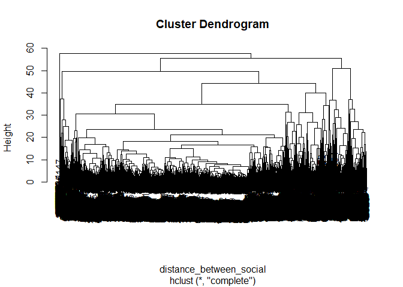

``` r
# Problem dendogram is highly homogeneous
# Arbitrarily choose k 
hcluster_social = cutree(cluster_hier_social, k=10)
summary(factor(hcluster_social))
```

    ##    1    2    3    4    5    6    7    8    9   10 
    ##  299 5734  436  663   33  172  410   90   18   27

Question 3
----------

``` r
library(arules)
```

    ## Warning: package 'arules' was built under R version 3.5.3

    ## Loading required package: Matrix

    ## 
    ## Attaching package: 'arules'

    ## The following objects are masked from 'package:base':
    ## 
    ##     abbreviate, write

``` r
library(arulesViz)
```

    ## Warning: package 'arulesViz' was built under R version 3.5.3

    ## Loading required package: grid

``` r
grocery_raw = read.csv("https://raw.githubusercontent.com/jgscott/ECO395M/master/data/groceries.txt", header = FALSE)
# Trip ID
grocery_raw$ID = seq.int(nrow(grocery_raw))
# Stack columns
grocery <- cbind(grocery_raw[,5], stack(lapply(grocery_raw[,1:4], as.character)))[1:2]
# Rename columns
colnames(grocery) <- c("ID","items")
# Aggregate and order by Trip ID
grocery <- grocery[order(grocery$ID),]
# Remove blanks
grocery <- grocery[!(grocery$items==""),]
# Renumber the rows
row.names(grocery) <- 1:nrow(grocery)
# turn IDs to factors 
grocery$ID = factor(grocery$ID)

grocery_raw <- readLines(con = "https://raw.githubusercontent.com/jgscott/ECO395M/master/data/groceries.txt" )

# Create list of baskets - vectors of items by consumer
# # apriori algorithm expects a list of baskets in a special format
# In this case, one "basket" of songs per user
# First split data into a list of artists for each user
g = split(x=grocery$items, f=grocery$ID)

# Remove duplicates ("de-dupe")
g = lapply(g, unique)

#Cast playslists as "transactions" class
g_trans = as(g, "transactions")
summary(g_trans)
```

    ## transactions as itemMatrix in sparse format with
    ##  15296 rows (elements/itemsets/transactions) and
    ##  169 columns (items) and a density of 0.01677625 
    ## 
    ## most frequent items:
    ##       whole milk other vegetables       rolls/buns             soda 
    ##             2513             1903             1809             1715 
    ##           yogurt          (Other) 
    ##             1372            34055 
    ## 
    ## element (itemset/transaction) length distribution:
    ## sizes
    ##    1    2    3    4 
    ## 3485 2630 2102 7079 
    ## 
    ##    Min. 1st Qu.  Median    Mean 3rd Qu.    Max. 
    ##   1.000   2.000   3.000   2.835   4.000   4.000 
    ## 
    ## includes extended item information - examples:
    ##             labels
    ## 1 abrasive cleaner
    ## 2 artif. sweetener
    ## 3   baby cosmetics
    ## 
    ## includes extended transaction information - examples:
    ##   transactionID
    ## 1             1
    ## 2             2
    ## 3             3

``` r
support_val = .001
conf_val = .05
maxlen_val = 5

g_rules = apriori(g_trans,
                  parameter = list(support = support_val, 
                                   confidence = conf_val,
                                   maxlen = maxlen_val))
```

    ## Apriori
    ## 
    ## Parameter specification:
    ##  confidence minval smax arem  aval originalSupport maxtime support minlen
    ##        0.05    0.1    1 none FALSE            TRUE       5   0.001      1
    ##  maxlen target   ext
    ##       5  rules FALSE
    ## 
    ## Algorithmic control:
    ##  filter tree heap memopt load sort verbose
    ##     0.1 TRUE TRUE  FALSE TRUE    2    TRUE
    ## 
    ## Absolute minimum support count: 15 
    ## 
    ## set item appearances ...[0 item(s)] done [0.00s].
    ## set transactions ...[169 item(s), 15296 transaction(s)] done [0.02s].
    ## sorting and recoding items ... [151 item(s)] done [0.00s].
    ## creating transaction tree ... done [0.00s].
    ## checking subsets of size 1 2 3 4 done [0.00s].
    ## writing ... [1044 rule(s)] done [0.00s].
    ## creating S4 object  ... done [0.00s].

``` r
inspect(g_rules)
```

    ##        lhs                            rhs                            support confidence       lift count
    ## [1]    {}                          => {newspapers}               0.051320607 0.05132061  1.0000000   785
    ## [2]    {}                          => {bottled beer}             0.051778243 0.05177824  1.0000000   792
    ## [3]    {}                          => {shopping bags}            0.063349895 0.06334990  1.0000000   969
    ## [4]    {}                          => {pastry}                   0.057204498 0.05720450  1.0000000   875
    ## [5]    {}                          => {citrus fruit}             0.053216527 0.05321653  1.0000000   814
    ## [6]    {}                          => {sausage}                  0.060407950 0.06040795  1.0000000   924
    ## [7]    {}                          => {bottled water}            0.071064331 0.07106433  1.0000000  1087
    ## [8]    {}                          => {tropical fruit}           0.067468619 0.06746862  1.0000000  1032
    ## [9]    {}                          => {root vegetables}          0.070083682 0.07008368  1.0000000  1072
    ## [10]   {}                          => {yogurt}                   0.089696653 0.08969665  1.0000000  1372
    ## [11]   {}                          => {soda}                     0.112120816 0.11212082  1.0000000  1715
    ## [12]   {}                          => {rolls/buns}               0.118266213 0.11826621  1.0000000  1809
    ## [13]   {}                          => {other vegetables}         0.124411611 0.12441161  1.0000000  1903
    ## [14]   {}                          => {whole milk}               0.164291318 0.16429132  1.0000000  2513
    ## [15]   {popcorn}                   => {salty snack}              0.001176778 0.25352113 10.4243526    18
    ## [16]   {liquor (appetizer)}        => {soda}                     0.001046025 0.20512821  1.8295283    16
    ## [17]   {frozen potato products}    => {rolls/buns}               0.001046025 0.19277108  1.6299760    16
    ## [18]   {specialty cheese}          => {other vegetables}         0.001111402 0.20238095  1.6267047    17
    ## [19]   {turkey}                    => {citrus fruit}             0.001111402 0.21250000  3.9931204    17
    ## [20]   {turkey}                    => {tropical fruit}           0.001569038 0.30000000  4.4465116    24
    ## [21]   {turkey}                    => {root vegetables}          0.001111402 0.21250000  3.0320896    17
    ## [22]   {turkey}                    => {other vegetables}         0.001372908 0.26250000  2.1099317    21
    ## [23]   {liquor}                    => {red/blush wine}           0.001111402 0.15596330 12.6222999    17
    ## [24]   {red/blush wine}            => {liquor}                   0.001111402 0.08994709 12.6222999    17
    ## [25]   {liquor}                    => {bottled beer}             0.002811192 0.39449541  7.6189417    43
    ## [26]   {bottled beer}              => {liquor}                   0.002811192 0.05429293  7.6189417    43
    ## [27]   {mayonnaise}                => {rolls/buns}               0.001176778 0.20000000  1.6911001    18
    ## [28]   {mayonnaise}                => {whole milk}               0.001046025 0.17777778  1.0820887    16
    ## [29]   {condensed milk}            => {coffee}                   0.001242155 0.18811881  5.0393439    19
    ## [30]   {condensed milk}            => {whole milk}               0.001111402 0.16831683  1.0245023    17
    ## [31]   {canned vegetables}         => {soda}                     0.001372908 0.19811321  1.7669619    21
    ## [32]   {salt}                      => {sugar}                    0.001111402 0.16037736  7.3667630    17
    ## [33]   {sugar}                     => {salt}                     0.001111402 0.05105105  7.3667630    17
    ## [34]   {frozen dessert}            => {rolls/buns}               0.001569038 0.22641509  1.9144529    24
    ## [35]   {cake bar}                  => {shopping bags}            0.001242155 0.14615385  2.3070890    19
    ## [36]   {cake bar}                  => {soda}                     0.001765167 0.20769231  1.8523974    27
    ## [37]   {spread cheese}             => {yogurt}                   0.001503661 0.20909091  2.3310893    23
    ## [38]   {spread cheese}             => {rolls/buns}               0.001895921 0.26363636  2.2291773    29
    ## [39]   {spread cheese}             => {whole milk}               0.001046025 0.14545455  0.8853453    16
    ## [40]   {frozen fish}               => {frozen vegetables}        0.001046025 0.13913043  4.4992371    16
    ## [41]   {frozen fish}               => {rolls/buns}               0.001176778 0.15652174  1.3234696    18
    ## [42]   {frozen fish}               => {other vegetables}         0.001111402 0.14782609  1.1882017    17
    ## [43]   {frozen fish}               => {whole milk}               0.001046025 0.13913043  0.8468520    16
    ## [44]   {mustard}                   => {rolls/buns}               0.001372908 0.17796610  1.5047924    21
    ## [45]   {pot plants}                => {shopping bags}            0.001111402 0.10000000  1.5785346    17
    ## [46]   {dishes}                    => {napkins}                  0.001307531 0.11560694  3.4336383    20
    ## [47]   {packaged fruit/vegetables} => {root vegetables}          0.001634414 0.19531250  2.7868470    25
    ## [48]   {packaged fruit/vegetables} => {yogurt}                   0.001111402 0.13281250  1.4806851    17
    ## [49]   {packaged fruit/vegetables} => {other vegetables}         0.001830544 0.21875000  1.7582764    28
    ## [50]   {packaged fruit/vegetables} => {whole milk}               0.002222803 0.26562500  1.6167927    34
    ## [51]   {canned fish}               => {soda}                     0.001307531 0.13513514  1.2052636    20
    ## [52]   {canned fish}               => {rolls/buns}               0.001372908 0.14189189  1.1997669    21
    ## [53]   {pasta}                     => {soda}                     0.001176778 0.12162162  1.0847372    18
    ## [54]   {pasta}                     => {whole milk}               0.001111402 0.11486486  0.6991536    17
    ## [55]   {white wine}                => {bottled beer}             0.001111402 0.09090909  1.7557392    17
    ## [56]   {white wine}                => {shopping bags}            0.001176778 0.09625668  1.5194450    18
    ## [57]   {white wine}                => {bottled water}            0.001765167 0.14438503  2.0317510    27
    ## [58]   {white wine}                => {soda}                     0.001372908 0.11229947  1.0015934    21
    ## [59]   {red/blush wine}            => {canned beer}              0.001438285 0.11640212  2.3304801    22
    ## [60]   {red/blush wine}            => {bottled beer}             0.002549686 0.20634921  3.9852493    39
    ## [61]   {red/blush wine}            => {bottled water}            0.001111402 0.08994709  1.2657136    17
    ## [62]   {red/blush wine}            => {soda}                     0.001699791 0.13756614  1.2269456    26
    ## [63]   {herbs}                     => {beef}                     0.001372908 0.13125000  3.8906977    21
    ## [64]   {herbs}                     => {tropical fruit}           0.001046025 0.10000000  1.4821705    16
    ## [65]   {herbs}                     => {root vegetables}          0.003726464 0.35625000  5.0832090    57
    ## [66]   {root vegetables}           => {herbs}                    0.003726464 0.05317164  5.0832090    57
    ## [67]   {herbs}                     => {yogurt}                   0.001176778 0.11250000  1.2542274    18
    ## [68]   {herbs}                     => {other vegetables}         0.004314854 0.41250000  3.3156069    66
    ## [69]   {herbs}                     => {whole milk}               0.003334205 0.31875000  1.9401512    51
    ## [70]   {processed cheese}          => {white bread}              0.001307531 0.12269939  4.5333570    20
    ## [71]   {processed cheese}          => {soda}                     0.001242155 0.11656442  1.0396323    19
    ## [72]   {processed cheese}          => {rolls/buns}               0.001895921 0.17791411  1.5043528    29
    ## [73]   {processed cheese}          => {other vegetables}         0.001307531 0.12269939  0.9862374    20
    ## [74]   {processed cheese}          => {whole milk}               0.002811192 0.26380368  1.6057068    43
    ## [75]   {semi-finished bread}       => {pastry}                   0.001503661 0.13218391  2.3107258    23
    ## [76]   {semi-finished bread}       => {soda}                     0.001111402 0.09770115  0.8713917    17
    ## [77]   {semi-finished bread}       => {rolls/buns}               0.001503661 0.13218391  1.1176811    23
    ## [78]   {semi-finished bread}       => {whole milk}               0.001765167 0.15517241  0.9444955    27
    ## [79]   {baking powder}             => {sugar}                    0.001634414 0.14367816  6.5997032    25
    ## [80]   {sugar}                     => {baking powder}            0.001634414 0.07507508  6.5997032    25
    ## [81]   {baking powder}             => {margarine}                0.001307531 0.11494253  3.0523627    20
    ## [82]   {baking powder}             => {bottled water}            0.001176778 0.10344828  1.4556990    18
    ## [83]   {baking powder}             => {rolls/buns}               0.001242155 0.10919540  0.9233018    19
    ## [84]   {baking powder}             => {whole milk}               0.001242155 0.10919540  0.6646450    19
    ## [85]   {pickled vegetables}        => {bottled water}            0.001046025 0.09090909  1.2792506    16
    ## [86]   {pickled vegetables}        => {soda}                     0.001438285 0.12500000  1.1148688    22
    ## [87]   {pickled vegetables}        => {rolls/buns}               0.001242155 0.10795455  0.9128097    19
    ## [88]   {soft cheese}               => {domestic eggs}            0.001372908 0.12500000  3.0641026    21
    ## [89]   {soft cheese}               => {whipped/sour cream}       0.001569038 0.14285714  3.0994934    24
    ## [90]   {soft cheese}               => {yogurt}                   0.002484310 0.22619048  2.5217271    38
    ## [91]   {soft cheese}               => {rolls/buns}               0.002353556 0.21428571  1.8118929    36
    ## [92]   {soft cheese}               => {other vegetables}         0.001307531 0.11904762  0.9568851    20
    ## [93]   {soft cheese}               => {whole milk}               0.001895921 0.17261905  1.0506888    29
    ## [94]   {chewing gum}               => {bottled water}            0.001176778 0.08695652  1.2236311    18
    ## [95]   {chewing gum}               => {soda}                     0.002157427 0.15942029  1.4218617    33
    ## [96]   {chewing gum}               => {rolls/buns}               0.001503661 0.11111111  0.9395000    23
    ## [97]   {flour}                     => {sugar}                    0.001895921 0.16959064  7.7899654    29
    ## [98]   {sugar}                     => {flour}                    0.001895921 0.08708709  7.7899654    29
    ## [99]   {flour}                     => {curd}                     0.001046025 0.09356725  2.7313066    16
    ## [100]  {flour}                     => {margarine}                0.001634414 0.14619883  3.8823912    25
    ## [101]  {flour}                     => {domestic eggs}            0.001372908 0.12280702  3.0103464    21
    ## [102]  {flour}                     => {whipped/sour cream}       0.001111402 0.09941520  2.1569574    17
    ## [103]  {flour}                     => {yogurt}                   0.001242155 0.11111111  1.2387431    19
    ## [104]  {flour}                     => {rolls/buns}               0.001699791 0.15204678  1.2856316    26
    ## [105]  {flour}                     => {whole milk}               0.001503661 0.13450292  0.8186855    23
    ## [106]  {specialty bar}             => {waffles}                  0.001176778 0.06691450  2.7077359    18
    ## [107]  {specialty bar}             => {chocolate}                0.001569038 0.08921933  2.7965141    24
    ## [108]  {specialty bar}             => {shopping bags}            0.001307531 0.07434944  1.1736317    20
    ## [109]  {specialty bar}             => {pastry}                   0.001111402 0.06319703  1.1047562    17
    ## [110]  {specialty bar}             => {bottled water}            0.001111402 0.06319703  0.8892932    17
    ## [111]  {specialty bar}             => {soda}                     0.002615063 0.14869888  1.3262380    40
    ## [112]  {specialty bar}             => {rolls/buns}               0.001307531 0.07434944  0.6286617    20
    ## [113]  {ice cream}                 => {bottled water}            0.001111402 0.06910569  0.9724385    17
    ## [114]  {ice cream}                 => {yogurt}                   0.001046025 0.06504065  0.7251179    16
    ## [115]  {ice cream}                 => {soda}                     0.002288180 0.14227642  1.2689564    35
    ## [116]  {ice cream}                 => {rolls/buns}               0.001569038 0.09756098  0.8249269    24
    ## [117]  {ice cream}                 => {other vegetables}         0.001046025 0.06504065  0.5227860    16
    ## [118]  {ice cream}                 => {whole milk}               0.001830544 0.11382114  0.6928007    28
    ## [119]  {cat food}                  => {chocolate}                0.001111402 0.07423581  2.3268666    17
    ## [120]  {cat food}                  => {coffee}                   0.001242155 0.08296943  2.2225927    19
    ## [121]  {cat food}                  => {margarine}                0.001242155 0.08296943  2.2032994    19
    ## [122]  {cat food}                  => {bottled water}            0.001830544 0.12227074  1.7205642    28
    ## [123]  {cat food}                  => {yogurt}                   0.001046025 0.06986900  0.7789476    16
    ## [124]  {cat food}                  => {soda}                     0.001699791 0.11353712  1.0126319    26
    ## [125]  {cat food}                  => {rolls/buns}               0.001046025 0.06986900  0.5907773    16
    ## [126]  {cat food}                  => {whole milk}               0.001372908 0.09170306  0.5581735    21
    ## [127]  {grapes}                    => {berries}                  0.001242155 0.08636364  4.0398110    19
    ## [128]  {berries}                   => {grapes}                   0.001242155 0.05810398  4.0398110    19
    ## [129]  {grapes}                    => {beef}                     0.001307531 0.09090909  2.6948555    20
    ## [130]  {grapes}                    => {pork}                     0.001111402 0.07727273  2.0845920    17
    ## [131]  {grapes}                    => {frankfurter}              0.001111402 0.07727273  2.0378683    17
    ## [132]  {grapes}                    => {pip fruit}                0.001895921 0.13181818  2.7100684    29
    ## [133]  {grapes}                    => {citrus fruit}             0.002288180 0.15909091  2.9895019    35
    ## [134]  {grapes}                    => {sausage}                  0.001503661 0.10454545  1.7306572    23
    ## [135]  {grapes}                    => {tropical fruit}           0.003399582 0.23636364  3.5033122    52
    ## [136]  {tropical fruit}            => {grapes}                   0.003399582 0.05038760  3.5033122    52
    ## [137]  {grapes}                    => {root vegetables}          0.001895921 0.13181818  1.8808684    29
    ## [138]  {grapes}                    => {other vegetables}         0.003726464 0.25909091  2.0825300    57
    ## [139]  {grapes}                    => {whole milk}               0.002811192 0.19545455  1.1896827    43
    ## [140]  {beverages}                 => {whipped/sour cream}       0.001372908 0.08203125  1.7797872    21
    ## [141]  {beverages}                 => {pastry}                   0.001242155 0.07421875  1.2974286    19
    ## [142]  {beverages}                 => {tropical fruit}           0.001111402 0.06640625  0.9842539    17
    ## [143]  {beverages}                 => {root vegetables}          0.001046025 0.06250000  0.8917910    16
    ## [144]  {beverages}                 => {yogurt}                   0.002941946 0.17578125  1.9597303    45
    ## [145]  {beverages}                 => {soda}                     0.001438285 0.08593750  0.7664723    22
    ## [146]  {beverages}                 => {rolls/buns}               0.002092050 0.12500000  1.0569375    32
    ## [147]  {beverages}                 => {other vegetables}         0.001699791 0.10156250  0.8163426    26
    ## [148]  {beverages}                 => {whole milk}               0.003007322 0.17968750  1.0937127    46
    ## [149]  {candy}                     => {specialty chocolate}      0.001046025 0.05442177  2.7840648    16
    ## [150]  {specialty chocolate}       => {candy}                    0.001046025 0.05351171  2.7840648    16
    ## [151]  {candy}                     => {waffles}                  0.001111402 0.05782313  2.3398481    17
    ## [152]  {candy}                     => {chocolate}                0.002484310 0.12925170  4.0512992    38
    ## [153]  {chocolate}                 => {candy}                    0.002484310 0.07786885  4.0512992    38
    ## [154]  {candy}                     => {fruit/vegetable juice}    0.001438285 0.07482993  1.6098434    22
    ## [155]  {candy}                     => {shopping bags}            0.001634414 0.08503401  1.3422913    25
    ## [156]  {candy}                     => {soda}                     0.002549686 0.13265306  1.1831261    39
    ## [157]  {candy}                     => {rolls/buns}               0.001242155 0.06462585  0.5464439    19
    ## [158]  {specialty chocolate}       => {waffles}                  0.001176778 0.06020067  2.4360567    18
    ## [159]  {specialty chocolate}       => {chocolate}                0.001569038 0.08026756  2.5159274    24
    ## [160]  {specialty chocolate}       => {shopping bags}            0.001438285 0.07357860  1.1614636    22
    ## [161]  {specialty chocolate}       => {bottled water}            0.001438285 0.07357860  1.0353801    22
    ## [162]  {specialty chocolate}       => {soda}                     0.002222803 0.11371237  1.0141950    34
    ## [163]  {specialty chocolate}       => {rolls/buns}               0.001176778 0.06020067  0.5090268    18
    ## [164]  {misc. beverages}           => {canned beer}              0.001046025 0.05734767  1.1481544    16
    ## [165]  {misc. beverages}           => {bottled beer}             0.001111402 0.06093190  1.1767858    17
    ## [166]  {misc. beverages}           => {fruit/vegetable juice}    0.001961297 0.10752688  2.3132647    30
    ## [167]  {misc. beverages}           => {bottled water}            0.002811192 0.15412186  2.1687654    43
    ## [168]  {misc. beverages}           => {soda}                     0.004184100 0.22939068  2.0459241    64
    ## [169]  {misc. beverages}           => {rolls/buns}               0.001372908 0.07526882  0.6364355    21
    ## [170]  {hard cheese}               => {frozen vegetables}        0.001111402 0.07053942  2.2811225    17
    ## [171]  {hard cheese}               => {butter}                   0.001176778 0.07468880  2.0962199    18
    ## [172]  {hard cheese}               => {domestic eggs}            0.001438285 0.09128631  2.2376849    22
    ## [173]  {hard cheese}               => {whipped/sour cream}       0.002092050 0.13278008  2.8808569    32
    ## [174]  {hard cheese}               => {sausage}                  0.001176778 0.07468880  1.2364067    18
    ## [175]  {hard cheese}               => {yogurt}                   0.002157427 0.13692946  1.5265838    33
    ## [176]  {hard cheese}               => {soda}                     0.001111402 0.07053942  0.6291376    17
    ## [177]  {hard cheese}               => {rolls/buns}               0.002353556 0.14937759  1.2630623    36
    ## [178]  {hard cheese}               => {other vegetables}         0.002092050 0.13278008  1.0672644    32
    ## [179]  {hard cheese}               => {whole milk}               0.002941946 0.18672199  1.1365299    45
    ## [180]  {sliced cheese}             => {cream cheese }            0.001046025 0.06639004  2.6038515    16
    ## [181]  {sliced cheese}             => {butter}                   0.001111402 0.07053942  1.9797632    17
    ## [182]  {sliced cheese}             => {domestic eggs}            0.001176778 0.07468880  1.8308331    18
    ## [183]  {sliced cheese}             => {whipped/sour cream}       0.001765167 0.11203320  2.4307231    27
    ## [184]  {sliced cheese}             => {pastry}                   0.001176778 0.07468880  1.3056455    18
    ## [185]  {sliced cheese}             => {sausage}                  0.001830544 0.11618257  1.9232994    28
    ## [186]  {sliced cheese}             => {yogurt}                   0.003203452 0.20331950  2.2667457    49
    ## [187]  {sliced cheese}             => {rolls/buns}               0.002876569 0.18257261  1.5437428    44
    ## [188]  {sliced cheese}             => {other vegetables}         0.001961297 0.12448133  1.0005604    30
    ## [189]  {sliced cheese}             => {whole milk}               0.003595711 0.22821577  1.3890921    55
    ## [190]  {hygiene articles}          => {napkins}                  0.002811192 0.13271605  3.9417955    43
    ## [191]  {napkins}                   => {hygiene articles}         0.002811192 0.08349515  3.9417955    43
    ## [192]  {hygiene articles}          => {newspapers}               0.001569038 0.07407407  1.4433593    24
    ## [193]  {hygiene articles}          => {fruit/vegetable juice}    0.001176778 0.05555556  1.1951867    18
    ## [194]  {hygiene articles}          => {shopping bags}            0.002222803 0.10493827  1.6564869    34
    ## [195]  {hygiene articles}          => {bottled water}            0.001372908 0.06481481  0.9120583    21
    ## [196]  {hygiene articles}          => {soda}                     0.001765167 0.08333333  0.7432459    27
    ## [197]  {meat}                      => {hamburger meat}           0.001046025 0.06299213  2.9465675    16
    ## [198]  {meat}                      => {chicken}                  0.001503661 0.09055118  3.2821585    23
    ## [199]  {chicken}                   => {meat}                     0.001503661 0.05450237  3.2821585    23
    ## [200]  {meat}                      => {beef}                     0.001176778 0.07086614  2.1007142    18
    ## [201]  {meat}                      => {pork}                     0.001765167 0.10629921  2.8676415    27
    ## [202]  {meat}                      => {frankfurter}              0.002092050 0.12598425  3.3225088    32
    ## [203]  {frankfurter}               => {meat}                     0.002092050 0.05517241  3.3225088    32
    ## [204]  {meat}                      => {pip fruit}                0.001569038 0.09448819  1.9425959    24
    ## [205]  {meat}                      => {citrus fruit}             0.002026674 0.12204724  2.2934087    31
    ## [206]  {meat}                      => {sausage}                  0.003399582 0.20472441  3.3890309    52
    ## [207]  {sausage}                   => {meat}                     0.003399582 0.05627706  3.3890309    52
    ## [208]  {meat}                      => {tropical fruit}           0.001895921 0.11417323  1.6922420    29
    ## [209]  {meat}                      => {root vegetables}          0.002680439 0.16141732  2.3032084    41
    ## [210]  {meat}                      => {yogurt}                   0.001307531 0.07874016  0.8778495    20
    ## [211]  {meat}                      => {rolls/buns}               0.001699791 0.10236220  0.8655237    26
    ## [212]  {meat}                      => {other vegetables}         0.004380230 0.26377953  2.1202163    67
    ## [213]  {meat}                      => {whole milk}               0.003857218 0.23228346  1.4138511    59
    ## [214]  {oil}                       => {sugar}                    0.001111402 0.06159420  2.8292640    17
    ## [215]  {sugar}                     => {oil}                      0.001111402 0.05105105  2.8292640    17
    ## [216]  {oil}                       => {coffee}                   0.001242155 0.06884058  1.8441077    19
    ## [217]  {oil}                       => {margarine}                0.001961297 0.10869565  2.8864734    30
    ## [218]  {margarine}                 => {oil}                      0.001961297 0.05208333  2.8864734    30
    ## [219]  {oil}                       => {brown bread}              0.001176778 0.06521739  1.5635818    18
    ## [220]  {oil}                       => {fruit/vegetable juice}    0.001111402 0.06159420  1.3250984    17
    ## [221]  {oil}                       => {pastry}                   0.001111402 0.06159420  1.0767371    17
    ## [222]  {oil}                       => {bottled water}            0.001503661 0.08333333  1.1726464    23
    ## [223]  {oil}                       => {soda}                     0.001176778 0.06521739  0.5816707    18
    ## [224]  {oil}                       => {rolls/buns}               0.001961297 0.10869565  0.9190761    30
    ## [225]  {oil}                       => {whole milk}               0.001569038 0.08695652  0.5292825    24
    ## [226]  {frozen meals}              => {frozen vegetables}        0.001830544 0.10035842  3.2454174    28
    ## [227]  {frozen vegetables}         => {frozen meals}             0.001830544 0.05919662  3.2454174    28
    ## [228]  {frozen meals}              => {domestic eggs}            0.001503661 0.08243728  2.0207701    23
    ## [229]  {frozen meals}              => {pastry}                   0.001111402 0.06093190  1.0651592    17
    ## [230]  {frozen meals}              => {yogurt}                   0.002484310 0.13620072  1.5184593    38
    ## [231]  {frozen meals}              => {soda}                     0.001438285 0.07885305  0.7032864    22
    ## [232]  {frozen meals}              => {rolls/buns}               0.002157427 0.11827957  1.0001129    33
    ## [233]  {frozen meals}              => {other vegetables}         0.001699791 0.09318996  0.7490456    26
    ## [234]  {frozen meals}              => {whole milk}               0.003007322 0.16487455  1.0035500    46
    ## [235]  {ham}                       => {dessert}                  0.001046025 0.06250000  2.6191781    16
    ## [236]  {ham}                       => {chicken}                  0.001046025 0.06250000  2.2654028    16
    ## [237]  {ham}                       => {beef}                     0.001307531 0.07812500  2.3158915    20
    ## [238]  {ham}                       => {pork}                     0.001111402 0.06640625  1.7914462    17
    ## [239]  {ham}                       => {frankfurter}              0.001634414 0.09765625  2.5754310    25
    ## [240]  {ham}                       => {pip fruit}                0.002353556 0.14062500  2.8911290    36
    ## [241]  {ham}                       => {citrus fruit}             0.001699791 0.10156250  1.9084767    26
    ## [242]  {ham}                       => {sausage}                  0.003203452 0.19140625  3.1685606    49
    ## [243]  {sausage}                   => {ham}                      0.003203452 0.05303030  3.1685606    49
    ## [244]  {ham}                       => {tropical fruit}           0.003203452 0.19140625  2.8369671    49
    ## [245]  {ham}                       => {root vegetables}          0.001765167 0.10546875  1.5048974    27
    ## [246]  {ham}                       => {yogurt}                   0.001307531 0.07812500  0.8709913    20
    ## [247]  {ham}                       => {rolls/buns}               0.001307531 0.07812500  0.6605860    20
    ## [248]  {ham}                       => {other vegetables}         0.003922594 0.23437500  1.8838676    60
    ## [249]  {ham}                       => {whole milk}               0.004903243 0.29296875  1.7832272    75
    ## [250]  {butter milk}               => {dessert}                  0.001046025 0.05818182  2.4382167    16
    ## [251]  {butter milk}               => {cream cheese }            0.001307531 0.07272727  2.8524009    20
    ## [252]  {cream cheese }             => {butter milk}              0.001307531 0.05128205  2.8524009    20
    ## [253]  {butter milk}               => {curd}                     0.001176778 0.06545455  1.9106731    18
    ## [254]  {butter milk}               => {frankfurter}              0.001176778 0.06545455  1.7261944    18
    ## [255]  {butter milk}               => {brown bread}              0.001046025 0.05818182  1.3949045    16
    ## [256]  {butter milk}               => {whipped/sour cream}       0.001634414 0.09090909  1.9724049    25
    ## [257]  {butter milk}               => {pip fruit}                0.001111402 0.06181818  1.2709286    17
    ## [258]  {butter milk}               => {citrus fruit}             0.001569038 0.08727273  1.6399553    24
    ## [259]  {butter milk}               => {tropical fruit}           0.001503661 0.08363636  1.2396335    23
    ## [260]  {butter milk}               => {root vegetables}          0.001438285 0.08000000  1.1414925    22
    ## [261]  {butter milk}               => {yogurt}                   0.004445607 0.24727273  2.7567665    68
    ## [262]  {butter milk}               => {rolls/buns}               0.002092050 0.11636364  0.9839128    32
    ## [263]  {butter milk}               => {other vegetables}         0.003791841 0.21090909  1.6952525    58
    ## [264]  {butter milk}               => {whole milk}               0.005033996 0.28000000  1.7042897    77
    ## [265]  {salty snack}               => {long life bakery product} 0.001699791 0.06989247  2.9050958    26
    ## [266]  {long life bakery product}  => {salty snack}              0.001699791 0.07065217  2.9050958    26
    ## [267]  {salty snack}               => {waffles}                  0.001634414 0.06720430  2.7194629    25
    ## [268]  {waffles}                   => {salty snack}              0.001634414 0.06613757  2.7194629    25
    ## [269]  {salty snack}               => {bottled beer}             0.001307531 0.05376344  1.0383404    20
    ## [270]  {salty snack}               => {fruit/vegetable juice}    0.002549686 0.10483871  2.2554331    39
    ## [271]  {fruit/vegetable juice}     => {salty snack}              0.002549686 0.05485232  2.2554331    39
    ## [272]  {salty snack}               => {shopping bags}            0.001765167 0.07258065  1.1457106    27
    ## [273]  {salty snack}               => {pastry}                   0.001372908 0.05645161  0.9868387    21
    ## [274]  {salty snack}               => {bottled water}            0.001569038 0.06451613  0.9078553    24
    ## [275]  {salty snack}               => {soda}                     0.003268828 0.13440860  1.1987837    50
    ## [276]  {onions}                    => {hamburger meat}           0.001046025 0.05245902  2.4538627    16
    ## [277]  {onions}                    => {chicken}                  0.001111402 0.05573770  2.0202937    17
    ## [278]  {onions}                    => {beef}                     0.001046025 0.05245902  1.5550642    16
    ## [279]  {onions}                    => {butter}                   0.001242155 0.06229508  1.7483772    19
    ## [280]  {onions}                    => {pork}                     0.001895921 0.09508197  2.5650331    29
    ## [281]  {pork}                      => {onions}                   0.001895921 0.05114638  2.5650331    29
    ## [282]  {onions}                    => {frankfurter}              0.001765167 0.08852459  2.3346071    27
    ## [283]  {onions}                    => {pip fruit}                0.001569038 0.07868852  1.6177684    24
    ## [284]  {onions}                    => {citrus fruit}             0.002418933 0.12131148  2.2795827    37
    ## [285]  {onions}                    => {sausage}                  0.001634414 0.08196721  1.3568945    25
    ## [286]  {onions}                    => {tropical fruit}           0.002811192 0.14098361  2.0896175    43
    ## [287]  {onions}                    => {root vegetables}          0.005295502 0.26557377  3.7893810    81
    ## [288]  {root vegetables}           => {onions}                   0.005295502 0.07555970  3.7893810    81
    ## [289]  {onions}                    => {yogurt}                   0.002157427 0.10819672  1.2062515    33
    ## [290]  {onions}                    => {rolls/buns}               0.001176778 0.05901639  0.4990131    18
    ## [291]  {onions}                    => {other vegetables}         0.007452929 0.37377049  3.0043055   114
    ## [292]  {other vegetables}          => {onions}                   0.007452929 0.05990541  3.0043055   114
    ## [293]  {onions}                    => {whole milk}               0.005360879 0.26885246  1.6364374    82
    ## [294]  {long life bakery product}  => {waffles}                  0.001765167 0.07336957  2.9689441    27
    ## [295]  {waffles}                   => {long life bakery product} 0.001765167 0.07142857  2.9689441    27
    ## [296]  {long life bakery product}  => {napkins}                  0.001569038 0.06521739  1.9370198    24
    ## [297]  {long life bakery product}  => {chocolate}                0.002549686 0.10597826  3.3218104    39
    ## [298]  {chocolate}                 => {long life bakery product} 0.002549686 0.07991803  3.3218104    39
    ## [299]  {long life bakery product}  => {fruit/vegetable juice}    0.003072699 0.12771739  2.7476304    47
    ## [300]  {fruit/vegetable juice}     => {long life bakery product} 0.003072699 0.06610408  2.7476304    47
    ## [301]  {long life bakery product}  => {shopping bags}            0.001895921 0.07880435  1.2439539    29
    ## [302]  {long life bakery product}  => {pastry}                   0.001569038 0.06521739  1.1400745    24
    ## [303]  {long life bakery product}  => {bottled water}            0.001765167 0.07336957  1.0324387    27
    ## [304]  {long life bakery product}  => {soda}                     0.003464958 0.14402174  1.2845228    53
    ## [305]  {long life bakery product}  => {rolls/buns}               0.001307531 0.05434783  0.4595381    20
    ## [306]  {long life bakery product}  => {whole milk}               0.001242155 0.05163043  0.3142615    19
    ## [307]  {sugar}                     => {coffee}                   0.002092050 0.09609610  2.5742310    32
    ## [308]  {coffee}                    => {sugar}                    0.002092050 0.05604203  2.5742310    32
    ## [309]  {sugar}                     => {margarine}                0.002549686 0.11711712  3.1101101    39
    ## [310]  {margarine}                 => {sugar}                    0.002549686 0.06770833  3.1101101    39
    ## [311]  {sugar}                     => {brown bread}              0.001307531 0.06006006  1.4399352    20
    ## [312]  {sugar}                     => {domestic eggs}            0.001765167 0.08108108  1.9875260    27
    ## [313]  {sugar}                     => {fruit/vegetable juice}    0.001176778 0.05405405  1.1628844    18
    ## [314]  {sugar}                     => {pastry}                   0.002157427 0.09909910  1.7323655    33
    ## [315]  {sugar}                     => {bottled water}            0.001895921 0.08708709  1.2254683    29
    ## [316]  {sugar}                     => {yogurt}                   0.001176778 0.05405405  0.6026318    18
    ## [317]  {sugar}                     => {soda}                     0.002615063 0.12012012  1.0713454    40
    ## [318]  {sugar}                     => {rolls/buns}               0.002484310 0.11411411  0.9648919    38
    ## [319]  {sugar}                     => {whole milk}               0.002353556 0.10810811  0.6580269    36
    ## [320]  {waffles}                   => {napkins}                  0.001242155 0.05026455  1.4929059    19
    ## [321]  {waffles}                   => {chocolate}                0.002811192 0.11375661  3.5656171    43
    ## [322]  {chocolate}                 => {waffles}                  0.002811192 0.08811475  3.5656171    43
    ## [323]  {waffles}                   => {canned beer}              0.001307531 0.05291005  1.0593091    20
    ## [324]  {waffles}                   => {fruit/vegetable juice}    0.001699791 0.06878307  1.4797550    26
    ## [325]  {waffles}                   => {shopping bags}            0.001569038 0.06349206  1.0022442    24
    ## [326]  {waffles}                   => {pastry}                   0.001895921 0.07671958  1.3411459    29
    ## [327]  {waffles}                   => {bottled water}            0.001307531 0.05291005  0.7445374    20
    ## [328]  {waffles}                   => {soda}                     0.003595711 0.14550265  1.2977309    55
    ## [329]  {waffles}                   => {rolls/buns}               0.001830544 0.07407407  0.6263334    28
    ## [330]  {UHT-milk}                  => {dessert}                  0.001372908 0.06382979  2.6749053    21
    ## [331]  {dessert}                   => {UHT-milk}                 0.001372908 0.05753425  2.6749053    21
    ## [332]  {UHT-milk}                  => {cream cheese }            0.001372908 0.06382979  2.5034370    21
    ## [333]  {cream cheese }             => {UHT-milk}                 0.001372908 0.05384615  2.5034370    21
    ## [334]  {UHT-milk}                  => {coffee}                   0.001176778 0.05471125  1.4656098    18
    ## [335]  {UHT-milk}                  => {frankfurter}              0.001111402 0.05167173  1.3627083    17
    ## [336]  {UHT-milk}                  => {brown bread}              0.001569038 0.07294833  1.7489305    24
    ## [337]  {UHT-milk}                  => {domestic eggs}            0.001895921 0.08814590  2.1607045    29
    ## [338]  {UHT-milk}                  => {whipped/sour cream}       0.001569038 0.07294833  1.5827200    24
    ## [339]  {UHT-milk}                  => {pip fruit}                0.001176778 0.05471125  1.1248162    18
    ## [340]  {UHT-milk}                  => {pastry}                   0.001176778 0.05471125  0.9564151    18
    ## [341]  {UHT-milk}                  => {citrus fruit}             0.001961297 0.09118541  1.7134792    30
    ## [342]  {UHT-milk}                  => {sausage}                  0.001111402 0.05167173  0.8553797    17
    ## [343]  {UHT-milk}                  => {bottled water}            0.002026674 0.09422492  1.3259102    31
    ## [344]  {UHT-milk}                  => {tropical fruit}           0.001569038 0.07294833  1.0812186    24
    ## [345]  {UHT-milk}                  => {root vegetables}          0.001569038 0.07294833  1.0408747    24
    ## [346]  {UHT-milk}                  => {yogurt}                   0.003987971 0.18541033  2.0670820    61
    ## [347]  {UHT-milk}                  => {soda}                     0.001634414 0.07598784  0.6777318    25
    ## [348]  {UHT-milk}                  => {rolls/buns}               0.002288180 0.10638298  0.8995213    35
    ## [349]  {UHT-milk}                  => {other vegetables}         0.002811192 0.13069909  1.0505377    43
    ## [350]  {UHT-milk}                  => {whole milk}               0.001569038 0.07294833  0.4440182    24
    ## [351]  {berries}                   => {chicken}                  0.001438285 0.06727829  2.4385988    22
    ## [352]  {chicken}                   => {berries}                  0.001438285 0.05213270  2.4385988    22
    ## [353]  {berries}                   => {beef}                     0.002092050 0.09785933  2.9008842    32
    ## [354]  {beef}                      => {berries}                  0.002092050 0.06201550  2.9008842    32
    ## [355]  {berries}                   => {pork}                     0.001634414 0.07645260  2.0624673    25
    ## [356]  {berries}                   => {whipped/sour cream}       0.002941946 0.13761468  2.9857505    45
    ## [357]  {whipped/sour cream}        => {berries}                  0.002941946 0.06382979  2.9857505    45
    ## [358]  {berries}                   => {pip fruit}                0.001765167 0.08256881  1.6975437    27
    ## [359]  {berries}                   => {citrus fruit}             0.002549686 0.11926606  2.2411469    39
    ## [360]  {berries}                   => {sausage}                  0.002353556 0.11009174  1.8224711    36
    ## [361]  {berries}                   => {tropical fruit}           0.003268828 0.15290520  2.2663158    50
    ## [362]  {berries}                   => {root vegetables}          0.003726464 0.17431193  2.4871970    57
    ## [363]  {root vegetables}           => {berries}                  0.003726464 0.05317164  2.4871970    57
    ## [364]  {berries}                   => {yogurt}                   0.003595711 0.16819572  1.8751616    55
    ## [365]  {berries}                   => {other vegetables}         0.005164749 0.24159021  1.9418623    79
    ## [366]  {berries}                   => {whole milk}               0.005230126 0.24464832  1.4891129    80
    ## [367]  {hamburger meat}            => {chicken}                  0.002288180 0.10703364  3.8795890    35
    ## [368]  {chicken}                   => {hamburger meat}           0.002288180 0.08293839  3.8795890    35
    ## [369]  {hamburger meat}            => {beef}                     0.002092050 0.09785933  2.9008842    32
    ## [370]  {beef}                      => {hamburger meat}           0.002092050 0.06201550  2.9008842    32
    ## [371]  {hamburger meat}            => {pork}                     0.001765167 0.08256881  2.2274647    27
    ## [372]  {hamburger meat}            => {frankfurter}              0.001961297 0.09174312  2.4194875    30
    ## [373]  {frankfurter}               => {hamburger meat}           0.001961297 0.05172414  2.4194875    30
    ## [374]  {hamburger meat}            => {pip fruit}                0.002615063 0.12232416  2.5148795    40
    ## [375]  {pip fruit}                 => {hamburger meat}           0.002615063 0.05376344  2.5148795    40
    ## [376]  {hamburger meat}            => {citrus fruit}             0.002288180 0.10703364  2.0112857    35
    ## [377]  {hamburger meat}            => {sausage}                  0.003203452 0.14984709  2.4805857    49
    ## [378]  {sausage}                   => {hamburger meat}           0.003203452 0.05303030  2.4805857    49
    ## [379]  {hamburger meat}            => {tropical fruit}           0.002484310 0.11620795  1.7224000    38
    ## [380]  {hamburger meat}            => {root vegetables}          0.003072699 0.14373089  2.0508467    47
    ## [381]  {hamburger meat}            => {yogurt}                   0.001111402 0.05198777  0.5795954    17
    ## [382]  {hamburger meat}            => {rolls/buns}               0.001830544 0.08562691  0.7240184    28
    ## [383]  {hamburger meat}            => {other vegetables}         0.006210774 0.29051988  2.3351508    95
    ## [384]  {hamburger meat}            => {whole milk}               0.005818515 0.27217125  1.6566381    89
    ## [385]  {dessert}                   => {curd}                     0.002549686 0.10684932  3.1190212    39
    ## [386]  {curd}                      => {dessert}                  0.002549686 0.07442748  3.1190212    39
    ## [387]  {dessert}                   => {butter}                   0.001242155 0.05205479  1.4609727    19
    ## [388]  {dessert}                   => {whipped/sour cream}       0.001765167 0.07397260  1.6049432    27
    ## [389]  {dessert}                   => {pastry}                   0.001372908 0.05753425  1.0057644    21
    ## [390]  {dessert}                   => {citrus fruit}             0.001503661 0.06301370  1.1841002    23
    ## [391]  {dessert}                   => {sausage}                  0.001765167 0.07397260  1.2245508    27
    ## [392]  {dessert}                   => {tropical fruit}           0.001895921 0.07945205  1.1776150    29
    ## [393]  {dessert}                   => {root vegetables}          0.001699791 0.07123288  1.0163975    26
    ## [394]  {dessert}                   => {yogurt}                   0.004837866 0.20273973  2.2602820    74
    ## [395]  {yogurt}                    => {dessert}                  0.004837866 0.05393586  2.2602820    74
    ## [396]  {dessert}                   => {soda}                     0.001961297 0.08219178  0.7330644    30
    ## [397]  {dessert}                   => {rolls/buns}               0.001961297 0.08219178  0.6949726    30
    ## [398]  {dessert}                   => {other vegetables}         0.004968619 0.20821918  1.6736314    76
    ## [399]  {dessert}                   => {whole milk}               0.006603033 0.27671233  1.6842785   101
    ## [400]  {napkins}                   => {chocolate}                0.001830544 0.05436893  1.7041541    28
    ## [401]  {chocolate}                 => {napkins}                  0.001830544 0.05737705  1.7041541    28
    ## [402]  {napkins}                   => {newspapers}               0.002549686 0.07572816  1.4755896    39
    ## [403]  {napkins}                   => {fruit/vegetable juice}    0.001961297 0.05825243  1.2532055    30
    ## [404]  {napkins}                   => {shopping bags}            0.003334205 0.09902913  1.5632090    51
    ## [405]  {shopping bags}             => {napkins}                  0.003334205 0.05263158  1.5632090    51
    ## [406]  {napkins}                   => {bottled water}            0.002288180 0.06796117  0.9563330    35
    ## [407]  {napkins}                   => {soda}                     0.003138075 0.09320388  0.8312808    48
    ## [408]  {napkins}                   => {rolls/buns}               0.001830544 0.05436893  0.4597165    28
    ## [409]  {cream cheese }             => {curd}                     0.001438285 0.05641026  1.6466628    22
    ## [410]  {cream cheese }             => {brown bread}              0.001765167 0.06923077  1.6598023    27
    ## [411]  {cream cheese }             => {domestic eggs}            0.001961297 0.07692308  1.8856016    30
    ## [412]  {cream cheese }             => {whipped/sour cream}       0.002811192 0.11025641  2.3921731    43
    ## [413]  {whipped/sour cream}        => {cream cheese }            0.002811192 0.06099291  2.3921731    43
    ## [414]  {cream cheese }             => {bottled water}            0.001372908 0.05384615  0.7577100    21
    ## [415]  {cream cheese }             => {tropical fruit}           0.001895921 0.07435897  1.1021268    29
    ## [416]  {cream cheese }             => {yogurt}                   0.005033996 0.19743590  2.2011512    77
    ## [417]  {yogurt}                    => {cream cheese }            0.005033996 0.05612245  2.2011512    77
    ## [418]  {cream cheese }             => {soda}                     0.001438285 0.05641026  0.5031203    22
    ## [419]  {cream cheese }             => {rolls/buns}               0.003922594 0.15384615  1.3008462    60
    ## [420]  {cream cheese }             => {other vegetables}         0.003203452 0.12564103  1.0098818    49
    ## [421]  {cream cheese }             => {whole milk}               0.004903243 0.19230769  1.1705286    75
    ## [422]  {chocolate}                 => {newspapers}               0.002026674 0.06352459  1.2377989    31
    ## [423]  {chocolate}                 => {fruit/vegetable juice}    0.002615063 0.08196721  1.7633903    40
    ## [424]  {fruit/vegetable juice}     => {chocolate}                0.002615063 0.05625879  1.7633903    40
    ## [425]  {chocolate}                 => {shopping bags}            0.002811192 0.08811475  1.3909219    43
    ## [426]  {chocolate}                 => {pastry}                   0.002026674 0.06352459  1.1104824    31
    ## [427]  {chocolate}                 => {soda}                     0.005360879 0.16803279  1.4986761    82
    ## [428]  {chocolate}                 => {rolls/buns}               0.002157427 0.06762295  0.5717859    33
    ## [429]  {white bread}               => {frozen vegetables}        0.001372908 0.05072464  1.6403468    21
    ## [430]  {white bread}               => {brown bread}              0.002157427 0.07971014  1.9110445    33
    ## [431]  {brown bread}               => {white bread}              0.002157427 0.05172414  1.9110445    33
    ## [432]  {white bread}               => {domestic eggs}            0.002615063 0.09661836  2.3683885    40
    ## [433]  {domestic eggs}             => {white bread}              0.002615063 0.06410256  2.3683885    40
    ## [434]  {white bread}               => {fruit/vegetable juice}    0.001372908 0.05072464  1.0912575    21
    ## [435]  {white bread}               => {whipped/sour cream}       0.001569038 0.05797101  1.2577654    24
    ## [436]  {white bread}               => {pastry}                   0.002615063 0.09661836  1.6889993    40
    ## [437]  {white bread}               => {root vegetables}          0.001503661 0.05555556  0.7927032    23
    ## [438]  {white bread}               => {yogurt}                   0.002288180 0.08454106  0.9425219    35
    ## [439]  {white bread}               => {soda}                     0.002680439 0.09903382  0.8832777    41
    ## [440]  {white bread}               => {rolls/buns}               0.003399582 0.12560386  1.0620435    52
    ## [441]  {white bread}               => {other vegetables}         0.003007322 0.11111111  0.8930928    46
    ## [442]  {white bread}               => {whole milk}               0.004380230 0.16183575  0.9850536    67
    ## [443]  {chicken}                   => {frozen vegetables}        0.001503661 0.05450237  1.7625121    23
    ## [444]  {chicken}                   => {beef}                     0.003072699 0.11137441  3.3015173    47
    ## [445]  {beef}                      => {chicken}                  0.003072699 0.09108527  3.3015173    47
    ## [446]  {chicken}                   => {pork}                     0.003661088 0.13270142  3.5798959    56
    ## [447]  {pork}                      => {chicken}                  0.003661088 0.09876543  3.5798959    56
    ## [448]  {chicken}                   => {frankfurter}              0.002288180 0.08293839  2.1872855    35
    ## [449]  {frankfurter}               => {chicken}                  0.002288180 0.06034483  2.1872855    35
    ## [450]  {chicken}                   => {pip fruit}                0.002745816 0.09952607  2.0461703    42
    ## [451]  {pip fruit}                 => {chicken}                  0.002745816 0.05645161  2.0461703    42
    ## [452]  {chicken}                   => {citrus fruit}             0.004118724 0.14928910  2.8053146    63
    ## [453]  {citrus fruit}              => {chicken}                  0.004118724 0.07739558  2.8053146    63
    ## [454]  {chicken}                   => {sausage}                  0.003334205 0.12085308  2.0006155    51
    ## [455]  {sausage}                   => {chicken}                  0.003334205 0.05519481  2.0006155    51
    ## [456]  {chicken}                   => {tropical fruit}           0.003530335 0.12796209  1.8966163    54
    ## [457]  {tropical fruit}            => {chicken}                  0.003530335 0.05232558  1.8966163    54
    ## [458]  {chicken}                   => {root vegetables}          0.004968619 0.18009479  2.5697107    76
    ## [459]  {root vegetables}           => {chicken}                  0.004968619 0.07089552  2.5697107    76
    ## [460]  {chicken}                   => {rolls/buns}               0.001634414 0.05924171  0.5009183    25
    ## [461]  {chicken}                   => {other vegetables}         0.007975941 0.28909953  2.3237343   122
    ## [462]  {other vegetables}          => {chicken}                  0.007975941 0.06410930  2.3237343   122
    ## [463]  {chicken}                   => {whole milk}               0.006341527 0.22985782  1.3990868    97
    ## [464]  {frozen vegetables}         => {margarine}                0.001569038 0.05073996  1.3474278    24
    ## [465]  {frozen vegetables}         => {butter}                   0.001569038 0.05073996  1.4240704    24
    ## [466]  {frozen vegetables}         => {domestic eggs}            0.002484310 0.08033827  1.9693175    38
    ## [467]  {domestic eggs}             => {frozen vegetables}        0.002484310 0.06089744  1.9693175    38
    ## [468]  {frozen vegetables}         => {whipped/sour cream}       0.003334205 0.10782241  2.3393640    51
    ## [469]  {whipped/sour cream}        => {frozen vegetables}        0.003334205 0.07234043  2.3393640    51
    ## [470]  {frozen vegetables}         => {pastry}                   0.001699791 0.05496829  0.9609085    26
    ## [471]  {frozen vegetables}         => {bottled water}            0.001569038 0.05073996  0.7140004    24
    ## [472]  {frozen vegetables}         => {root vegetables}          0.002288180 0.07399577  1.0558203    35
    ## [473]  {frozen vegetables}         => {yogurt}                   0.004314854 0.13953488  1.5556309    66
    ## [474]  {frozen vegetables}         => {soda}                     0.001634414 0.05285412  0.4714033    25
    ## [475]  {frozen vegetables}         => {rolls/buns}               0.004445607 0.14376321  1.2155899    68
    ## [476]  {frozen vegetables}         => {other vegetables}         0.003791841 0.12262156  0.9856119    58
    ## [477]  {frozen vegetables}         => {whole milk}               0.005687762 0.18393235  1.1195500    87
    ## [478]  {canned beer}               => {shopping bags}            0.003334205 0.06675393  1.0537338    51
    ## [479]  {shopping bags}             => {canned beer}              0.003334205 0.05263158  1.0537338    51
    ## [480]  {canned beer}               => {bottled water}            0.003072699 0.06151832  0.8656709    47
    ## [481]  {canned beer}               => {soda}                     0.006537657 0.13089005  1.1674019   100
    ## [482]  {soda}                      => {canned beer}              0.006537657 0.05830904  1.1674019   100
    ## [483]  {canned beer}               => {rolls/buns}               0.003857218 0.07722513  0.6529771    59
    ## [484]  {coffee}                    => {fruit/vegetable juice}    0.002222803 0.05954466  1.2810058    34
    ## [485]  {coffee}                    => {shopping bags}            0.002222803 0.05954466  0.9399330    34
    ## [486]  {coffee}                    => {pastry}                   0.002222803 0.05954466  1.0409087    34
    ## [487]  {coffee}                    => {bottled water}            0.003661088 0.09807356  1.3800672    56
    ## [488]  {bottled water}             => {coffee}                   0.003661088 0.05151794  1.3800672    56
    ## [489]  {coffee}                    => {soda}                     0.004510983 0.12084063  1.0777716    69
    ## [490]  {coffee}                    => {rolls/buns}               0.004053347 0.10858144  0.9181104    62
    ## [491]  {coffee}                    => {whole milk}               0.003268828 0.08756567  0.5329903    50
    ## [492]  {beef}                      => {pork}                     0.004903243 0.14534884  3.9210861    75
    ## [493]  {pork}                      => {beef}                     0.004903243 0.13227513  3.9210861    75
    ## [494]  {beef}                      => {frankfurter}              0.003007322 0.08914729  2.3510291    46
    ## [495]  {frankfurter}               => {beef}                     0.003007322 0.07931034  2.3510291    46
    ## [496]  {beef}                      => {pip fruit}                0.002876569 0.08527132  1.7531049    44
    ## [497]  {pip fruit}                 => {beef}                     0.002876569 0.05913978  1.7531049    44
    ## [498]  {beef}                      => {citrus fruit}             0.005099372 0.15116279  2.8405234    78
    ## [499]  {citrus fruit}              => {beef}                     0.005099372 0.09582310  2.8405234    78
    ## [500]  {beef}                      => {sausage}                  0.003530335 0.10465116  1.7324071    54
    ## [501]  {sausage}                   => {beef}                     0.003530335 0.05844156  1.7324071    54
    ## [502]  {beef}                      => {tropical fruit}           0.004314854 0.12790698  1.8957995    66
    ## [503]  {tropical fruit}            => {beef}                     0.004314854 0.06395349  1.8957995    66
    ## [504]  {beef}                      => {root vegetables}          0.008695084 0.25775194  3.6777739   133
    ## [505]  {root vegetables}           => {beef}                     0.008695084 0.12406716  3.6777739   133
    ## [506]  {beef}                      => {yogurt}                   0.002811192 0.08333333  0.9290573    43
    ## [507]  {beef}                      => {rolls/buns}               0.002288180 0.06782946  0.5735320    35
    ## [508]  {beef}                      => {other vegetables}         0.008302824 0.24612403  1.9783044   127
    ## [509]  {other vegetables}          => {beef}                     0.008302824 0.06673673  1.9783044   127
    ## [510]  {beef}                      => {whole milk}               0.008172071 0.24224806  1.4745031   125
    ## [511]  {curd}                      => {butter}                   0.002876569 0.08396947  2.3566916    44
    ## [512]  {butter}                    => {curd}                     0.002876569 0.08073394  2.3566916    44
    ## [513]  {curd}                      => {whipped/sour cream}       0.003791841 0.11068702  2.4015159    58
    ## [514]  {whipped/sour cream}        => {curd}                     0.003791841 0.08226950  2.4015159    58
    ## [515]  {curd}                      => {pip fruit}                0.002092050 0.06106870  1.2555200    32
    ## [516]  {curd}                      => {citrus fruit}             0.002092050 0.06106870  1.1475514    32
    ## [517]  {curd}                      => {sausage}                  0.002157427 0.06297710  1.0425300    33
    ## [518]  {curd}                      => {tropical fruit}           0.002876569 0.08396947  1.2445707    44
    ## [519]  {curd}                      => {root vegetables}          0.002941946 0.08587786  1.2253617    45
    ## [520]  {curd}                      => {yogurt}                   0.007649059 0.22328244  2.4893063   117
    ## [521]  {yogurt}                    => {curd}                     0.007649059 0.08527697  2.4893063   117
    ## [522]  {curd}                      => {rolls/buns}               0.002549686 0.07442748  0.6293216    39
    ## [523]  {curd}                      => {other vegetables}         0.007060669 0.20610687  1.6566530   108
    ## [524]  {other vegetables}          => {curd}                     0.007060669 0.05675250  1.6566530   108
    ## [525]  {curd}                      => {whole milk}               0.012617678 0.36832061  2.2418751   193
    ## [526]  {whole milk}                => {curd}                     0.012617678 0.07680064  2.2418751   193
    ## [527]  {fruit/vegetable juice}     => {newspapers}               0.002484310 0.05344585  1.0414111    38
    ## [528]  {newspapers}                => {shopping bags}            0.003464958 0.06751592  1.0657622    53
    ## [529]  {shopping bags}             => {newspapers}               0.003464958 0.05469556  1.0657622    53
    ## [530]  {newspapers}                => {bottled water}            0.003857218 0.07515924  1.0576225    59
    ## [531]  {bottled water}             => {newspapers}               0.003857218 0.05427783  1.0576225    59
    ## [532]  {newspapers}                => {soda}                     0.004249477 0.08280255  0.7385118    65
    ## [533]  {newspapers}                => {rolls/buns}               0.003661088 0.07133758  0.6031949    56
    ## [534]  {newspapers}                => {whole milk}               0.003595711 0.07006369  0.4264601    55
    ## [535]  {margarine}                 => {brown bread}              0.002811192 0.07465278  1.7897945    43
    ## [536]  {brown bread}               => {margarine}                0.002811192 0.06739812  1.7897945    43
    ## [537]  {margarine}                 => {domestic eggs}            0.002222803 0.05902778  1.4469373    34
    ## [538]  {domestic eggs}             => {margarine}                0.002222803 0.05448718  1.4469373    34
    ## [539]  {margarine}                 => {pastry}                   0.002811192 0.07465278  1.3050159    43
    ## [540]  {margarine}                 => {bottled water}            0.003922594 0.10416667  1.4658080    60
    ## [541]  {bottled water}             => {margarine}                0.003922594 0.05519779  1.4658080    60
    ## [542]  {margarine}                 => {yogurt}                   0.002288180 0.06076389  0.6774376    35
    ## [543]  {margarine}                 => {soda}                     0.003791841 0.10069444  0.8980888    58
    ## [544]  {margarine}                 => {rolls/buns}               0.005491632 0.14583333  1.2330938    84
    ## [545]  {margarine}                 => {other vegetables}         0.002680439 0.07118056  0.5721376    41
    ## [546]  {margarine}                 => {whole milk}               0.004641736 0.12326389  0.7502763    71
    ## [547]  {butter}                    => {domestic eggs}            0.003072699 0.08623853  2.1139497    47
    ## [548]  {domestic eggs}             => {butter}                   0.003072699 0.07532051  2.1139497    47
    ## [549]  {butter}                    => {whipped/sour cream}       0.003857218 0.10825688  2.3487904    59
    ## [550]  {whipped/sour cream}        => {butter}                   0.003857218 0.08368794  2.3487904    59
    ## [551]  {butter}                    => {pip fruit}                0.002026674 0.05688073  1.1694190    31
    ## [552]  {butter}                    => {citrus fruit}             0.002811192 0.07889908  1.4826049    43
    ## [553]  {citrus fruit}              => {butter}                   0.002811192 0.05282555  1.4826049    43
    ## [554]  {butter}                    => {sausage}                  0.002353556 0.06605505  1.0934827    36
    ## [555]  {butter}                    => {tropical fruit}           0.002615063 0.07339450  1.0878316    40
    ## [556]  {butter}                    => {root vegetables}          0.004053347 0.11376147  1.6232233    62
    ## [557]  {root vegetables}           => {butter}                   0.004053347 0.05783582  1.6232233    62
    ## [558]  {butter}                    => {yogurt}                   0.006210774 0.17431193  1.9433493    95
    ## [559]  {yogurt}                    => {butter}                   0.006210774 0.06924198  1.9433493    95
    ## [560]  {butter}                    => {rolls/buns}               0.003399582 0.09541284  0.8067633    52
    ## [561]  {butter}                    => {other vegetables}         0.008237448 0.23119266  1.8582885   126
    ## [562]  {other vegetables}          => {butter}                   0.008237448 0.06621125  1.8582885   126
    ## [563]  {butter}                    => {whole milk}               0.014382845 0.40366972  2.4570363   220
    ## [564]  {whole milk}                => {butter}                   0.014382845 0.08754477  2.4570363   220
    ## [565]  {pork}                      => {frankfurter}              0.003726464 0.10052910  2.6511950    57
    ## [566]  {frankfurter}               => {pork}                     0.003726464 0.09827586  2.6511950    57
    ## [567]  {pork}                      => {pip fruit}                0.003464958 0.09347443  1.9217538    53
    ## [568]  {pip fruit}                 => {pork}                     0.003464958 0.07123656  1.9217538    53
    ## [569]  {pork}                      => {citrus fruit}             0.003857218 0.10405644  1.9553406    59
    ## [570]  {citrus fruit}              => {pork}                     0.003857218 0.07248157  1.9553406    59
    ## [571]  {pork}                      => {sausage}                  0.004118724 0.11111111  1.8393458    63
    ## [572]  {sausage}                   => {pork}                     0.004118724 0.06818182  1.8393458    63
    ## [573]  {pork}                      => {tropical fruit}           0.004968619 0.13403880  1.9866836    76
    ## [574]  {tropical fruit}            => {pork}                     0.004968619 0.07364341  1.9866836    76
    ## [575]  {pork}                      => {root vegetables}          0.006733787 0.18165785  2.5920135   103
    ## [576]  {root vegetables}           => {pork}                     0.006733787 0.09608209  2.5920135   103
    ## [577]  {pork}                      => {yogurt}                   0.002157427 0.05820106  0.6488654    33
    ## [578]  {pork}                      => {soda}                     0.002026674 0.05467372  0.4876322    31
    ## [579]  {pork}                      => {rolls/buns}               0.002026674 0.05467372  0.4622937    31
    ## [580]  {pork}                      => {other vegetables}         0.009283473 0.25044092  2.0130028   142
    ## [581]  {other vegetables}          => {pork}                     0.009283473 0.07461902  2.0130028   142
    ## [582]  {pork}                      => {whole milk}               0.008695084 0.23456790  1.4277559   133
    ## [583]  {whole milk}                => {pork}                     0.008695084 0.05292479  1.4277559   133
    ## [584]  {frankfurter}               => {pip fruit}                0.004118724 0.10862069  2.2331479    63
    ## [585]  {pip fruit}                 => {frankfurter}              0.004118724 0.08467742  2.2331479    63
    ## [586]  {frankfurter}               => {citrus fruit}             0.004053347 0.10689655  2.0087097    62
    ## [587]  {citrus fruit}              => {frankfurter}              0.004053347 0.07616708  2.0087097    62
    ## [588]  {frankfurter}               => {sausage}                  0.006472280 0.17068966  2.8256158    99
    ## [589]  {sausage}                   => {frankfurter}              0.006472280 0.10714286  2.8256158    99
    ## [590]  {frankfurter}               => {tropical fruit}           0.005557008 0.14655172  2.1721465    85
    ## [591]  {tropical fruit}            => {frankfurter}              0.005557008 0.08236434  2.1721465    85
    ## [592]  {frankfurter}               => {root vegetables}          0.004641736 0.12241379  1.7466804    71
    ## [593]  {root vegetables}           => {frankfurter}              0.004641736 0.06623134  1.7466804    71
    ## [594]  {frankfurter}               => {yogurt}                   0.002615063 0.06896552  0.7688750    40
    ## [595]  {frankfurter}               => {soda}                     0.002092050 0.05517241  0.4920800    32
    ## [596]  {frankfurter}               => {rolls/buns}               0.006210774 0.16379310  1.3849526    95
    ## [597]  {rolls/buns}                => {frankfurter}              0.006210774 0.05251520  1.3849526    95
    ## [598]  {frankfurter}               => {other vegetables}         0.007060669 0.18620690  1.4967003   108
    ## [599]  {other vegetables}          => {frankfurter}              0.007060669 0.05675250  1.4967003   108
    ## [600]  {frankfurter}               => {whole milk}               0.008237448 0.21724138  1.3222937   126
    ## [601]  {whole milk}                => {frankfurter}              0.008237448 0.05013928  1.3222937   126
    ## [602]  {bottled beer}              => {fruit/vegetable juice}    0.003464958 0.06691919  1.4396568    53
    ## [603]  {fruit/vegetable juice}     => {bottled beer}             0.003464958 0.07454290  1.4396568    53
    ## [604]  {bottled beer}              => {bottled water}            0.006929916 0.13383838  1.8833412   106
    ## [605]  {bottled water}             => {bottled beer}             0.006929916 0.09751610  1.8833412   106
    ## [606]  {bottled beer}              => {soda}                     0.008302824 0.16035354  1.4301852   127
    ## [607]  {soda}                      => {bottled beer}             0.008302824 0.07405248  1.4301852   127
    ## [608]  {bottled beer}              => {rolls/buns}               0.004380230 0.08459596  0.7153012    67
    ## [609]  {bottled beer}              => {whole milk}               0.003072699 0.05934343  0.3612086    47
    ## [610]  {brown bread}               => {domestic eggs}            0.003138075 0.07523511  1.8442247    48
    ## [611]  {domestic eggs}             => {brown bread}              0.003138075 0.07692308  1.8442247    48
    ## [612]  {brown bread}               => {fruit/vegetable juice}    0.002549686 0.06112853  1.3150801    39
    ## [613]  {fruit/vegetable juice}     => {brown bread}              0.002549686 0.05485232  1.3150801    39
    ## [614]  {brown bread}               => {pastry}                   0.005033996 0.12068966  2.1097931    77
    ## [615]  {pastry}                    => {brown bread}              0.005033996 0.08800000  2.1097931    77
    ## [616]  {brown bread}               => {bottled water}            0.002811192 0.06739812  0.9484100    43
    ## [617]  {brown bread}               => {yogurt}                   0.003464958 0.08307210  0.9261449    53
    ## [618]  {brown bread}               => {soda}                     0.003726464 0.08934169  0.7968341    57
    ## [619]  {brown bread}               => {rolls/buns}               0.006276151 0.15047022  1.2723010    96
    ## [620]  {rolls/buns}                => {brown bread}              0.006276151 0.05306799  1.2723010    96
    ## [621]  {brown bread}               => {other vegetables}         0.003661088 0.08777429  0.7055153    56
    ## [622]  {brown bread}               => {whole milk}               0.006733787 0.16144201  0.9826570   103
    ## [623]  {domestic eggs}             => {whipped/sour cream}       0.003857218 0.09455128  2.0514275    59
    ## [624]  {whipped/sour cream}        => {domestic eggs}            0.003857218 0.08368794  2.0514275    59
    ## [625]  {domestic eggs}             => {pastry}                   0.003595711 0.08814103  1.5408059    55
    ## [626]  {pastry}                    => {domestic eggs}            0.003595711 0.06285714  1.5408059    55
    ## [627]  {domestic eggs}             => {root vegetables}          0.002222803 0.05448718  0.7774589    34
    ## [628]  {domestic eggs}             => {yogurt}                   0.004314854 0.10576923  1.1791882    66
    ## [629]  {domestic eggs}             => {soda}                     0.002418933 0.05929487  0.5288480    37
    ## [630]  {domestic eggs}             => {rolls/buns}               0.008172071 0.20032051  1.6938102   125
    ## [631]  {rolls/buns}                => {domestic eggs}            0.008172071 0.06909895  1.6938102   125
    ## [632]  {domestic eggs}             => {other vegetables}         0.003791841 0.09294872  0.7471065    58
    ## [633]  {domestic eggs}             => {whole milk}               0.008172071 0.20032051  1.2193007   125
    ## [634]  {fruit/vegetable juice}     => {shopping bags}            0.002680439 0.05766526  0.9102661    41
    ## [635]  {fruit/vegetable juice}     => {bottled water}            0.005753138 0.12376934  1.7416521    88
    ## [636]  {bottled water}             => {fruit/vegetable juice}    0.005753138 0.08095676  1.7416521    88
    ## [637]  {fruit/vegetable juice}     => {soda}                     0.009348849 0.20112518  1.7938255   143
    ## [638]  {soda}                      => {fruit/vegetable juice}    0.009348849 0.08338192  1.7938255   143
    ## [639]  {fruit/vegetable juice}     => {rolls/buns}               0.003922594 0.08438819  0.7135443    60
    ## [640]  {shopping bags}             => {soda}                     0.006406904 0.10113519  0.9020198    98
    ## [641]  {soda}                      => {shopping bags}            0.006406904 0.05714286  0.9020198    98
    ## [642]  {whipped/sour cream}        => {pastry}                   0.002353556 0.05106383  0.8926541    36
    ## [643]  {whipped/sour cream}        => {root vegetables}          0.003595711 0.07801418  1.1131576    55
    ## [644]  {root vegetables}           => {whipped/sour cream}       0.003595711 0.05130597  1.1131576    55
    ## [645]  {whipped/sour cream}        => {yogurt}                   0.009741109 0.21134752  2.3562475   149
    ## [646]  {yogurt}                    => {whipped/sour cream}       0.009741109 0.10860058  2.3562475   149
    ## [647]  {whipped/sour cream}        => {rolls/buns}               0.005360879 0.11631206  0.9834766    82
    ## [648]  {whipped/sour cream}        => {other vegetables}         0.008302824 0.18014184  1.4479504   127
    ## [649]  {other vegetables}          => {whipped/sour cream}       0.008302824 0.06673673  1.4479504   127
    ## [650]  {whipped/sour cream}        => {whole milk}               0.011440900 0.24822695  1.5108951   175
    ## [651]  {whole milk}                => {whipped/sour cream}       0.011440900 0.06963788  1.5108951   175
    ## [652]  {pip fruit}                 => {citrus fruit}             0.008172071 0.16801075  3.1571161   125
    ## [653]  {citrus fruit}              => {pip fruit}                0.008172071 0.15356265  3.1571161   125
    ## [654]  {pip fruit}                 => {sausage}                  0.006210774 0.12768817  2.1137644    95
    ## [655]  {sausage}                   => {pip fruit}                0.006210774 0.10281385  2.1137644    95
    ## [656]  {pip fruit}                 => {tropical fruit}           0.012683054 0.26075269  3.8647995   194
    ## [657]  {tropical fruit}            => {pip fruit}                0.012683054 0.18798450  3.8647995   194
    ## [658]  {pip fruit}                 => {root vegetables}          0.008106695 0.16666667  2.3781095   124
    ## [659]  {root vegetables}           => {pip fruit}                0.008106695 0.11567164  2.3781095   124
    ## [660]  {pip fruit}                 => {yogurt}                   0.004445607 0.09139785  1.0189661    68
    ## [661]  {pip fruit}                 => {rolls/buns}               0.002941946 0.06048387  0.5114214    45
    ## [662]  {pip fruit}                 => {other vegetables}         0.010917887 0.22446237  1.8041915   167
    ## [663]  {other vegetables}          => {pip fruit}                0.010917887 0.08775617  1.8041915   167
    ## [664]  {pip fruit}                 => {whole milk}               0.012552301 0.25806452  1.5707739   192
    ## [665]  {whole milk}                => {pip fruit}                0.012552301 0.07640271  1.5707739   192
    ## [666]  {pastry}                    => {bottled water}            0.003203452 0.05600000  0.7880184    49
    ## [667]  {pastry}                    => {yogurt}                   0.005164749 0.09028571  1.0065673    79
    ## [668]  {yogurt}                    => {pastry}                   0.005164749 0.05758017  1.0065673    79
    ## [669]  {pastry}                    => {soda}                     0.007256799 0.12685714  1.1314326   111
    ## [670]  {soda}                      => {pastry}                   0.007256799 0.06472303  1.1314326   111
    ## [671]  {pastry}                    => {rolls/buns}               0.010198745 0.17828571  1.5074949   156
    ## [672]  {rolls/buns}                => {pastry}                   0.010198745 0.08623549  1.5074949   156
    ## [673]  {pastry}                    => {other vegetables}         0.003334205 0.05828571  0.4684910    51
    ## [674]  {pastry}                    => {whole milk}               0.009414226 0.16457143  1.0017050   144
    ## [675]  {whole milk}                => {pastry}                   0.009414226 0.05730203  1.0017050   144
    ## [676]  {citrus fruit}              => {sausage}                  0.006929916 0.13022113  2.1556952   106
    ## [677]  {sausage}                   => {citrus fruit}             0.006929916 0.11471861  2.1556952   106
    ## [678]  {citrus fruit}              => {tropical fruit}           0.012486925 0.23464373  3.4778203   191
    ## [679]  {tropical fruit}            => {citrus fruit}             0.012486925 0.18507752  3.4778203   191
    ## [680]  {citrus fruit}              => {root vegetables}          0.008695084 0.16339066  2.3313653   133
    ## [681]  {root vegetables}           => {citrus fruit}             0.008695084 0.12406716  2.3313653   133
    ## [682]  {citrus fruit}              => {yogurt}                   0.006733787 0.12653563  1.4107062   103
    ## [683]  {yogurt}                    => {citrus fruit}             0.006733787 0.07507289  1.4107062   103
    ## [684]  {citrus fruit}              => {rolls/buns}               0.003268828 0.06142506  0.5193796    50
    ## [685]  {citrus fruit}              => {other vegetables}         0.012813808 0.24078624  1.9354001   196
    ## [686]  {other vegetables}          => {citrus fruit}             0.012813808 0.10299527  1.9354001   196
    ## [687]  {citrus fruit}              => {whole milk}               0.012813808 0.24078624  1.4656054   196
    ## [688]  {whole milk}                => {citrus fruit}             0.012813808 0.07799443  1.4656054   196
    ## [689]  {sausage}                   => {tropical fruit}           0.008172071 0.13528139  2.0051008   125
    ## [690]  {tropical fruit}            => {sausage}                  0.008172071 0.12112403  2.0051008   125
    ## [691]  {sausage}                   => {root vegetables}          0.007322176 0.12121212  1.7295341   112
    ## [692]  {root vegetables}           => {sausage}                  0.007322176 0.10447761  1.7295341   112
    ## [693]  {sausage}                   => {yogurt}                   0.005818515 0.09632035  1.0738455    89
    ## [694]  {yogurt}                    => {sausage}                  0.005818515 0.06486880  1.0738455    89
    ## [695]  {sausage}                   => {soda}                     0.004968619 0.08225108  0.7335933    76
    ## [696]  {sausage}                   => {rolls/buns}               0.010787134 0.17857143  1.5099108   165
    ## [697]  {rolls/buns}                => {sausage}                  0.010787134 0.09121061  1.5099108   165
    ## [698]  {sausage}                   => {other vegetables}         0.012617678 0.20887446  1.6788984   193
    ## [699]  {other vegetables}          => {sausage}                  0.012617678 0.10141881  1.6788984   193
    ## [700]  {sausage}                   => {whole milk}               0.012552301 0.20779221  1.2647790   192
    ## [701]  {whole milk}                => {sausage}                  0.012552301 0.07640271  1.2647790   192
    ## [702]  {bottled water}             => {yogurt}                   0.004184100 0.05887764  0.6564085    64
    ## [703]  {bottled water}             => {soda}                     0.014644351 0.20607176  1.8379438   224
    ## [704]  {soda}                      => {bottled water}            0.014644351 0.13061224  1.8379438   224
    ## [705]  {bottled water}             => {rolls/buns}               0.008564331 0.12051518  1.0190161   131
    ## [706]  {rolls/buns}                => {bottled water}            0.008564331 0.07241570  1.0190161   131
    ## [707]  {bottled water}             => {whole milk}               0.006799163 0.09567617  0.5823568   104
    ## [708]  {tropical fruit}            => {root vegetables}          0.010983264 0.16279070  2.3228046   168
    ## [709]  {root vegetables}           => {tropical fruit}           0.010983264 0.15671642  2.3228046   168
    ## [710]  {tropical fruit}            => {yogurt}                   0.008172071 0.12112403  1.3503740   125
    ## [711]  {yogurt}                    => {tropical fruit}           0.008172071 0.09110787  1.3503740   125
    ## [712]  {tropical fruit}            => {rolls/buns}               0.006210774 0.09205426  0.7783649    95
    ## [713]  {rolls/buns}                => {tropical fruit}           0.006210774 0.05251520  0.7783649    95
    ## [714]  {tropical fruit}            => {other vegetables}         0.015494247 0.22965116  1.8458982   237
    ## [715]  {other vegetables}          => {tropical fruit}           0.015494247 0.12454020  1.8458982   237
    ## [716]  {tropical fruit}            => {whole milk}               0.018305439 0.27131783  1.6514435   280
    ## [717]  {whole milk}                => {tropical fruit}           0.018305439 0.11142061  1.6514435   280
    ## [718]  {root vegetables}           => {yogurt}                   0.006472280 0.09235075  1.0295897    99
    ## [719]  {yogurt}                    => {root vegetables}          0.006472280 0.07215743  1.0295897    99
    ## [720]  {root vegetables}           => {rolls/buns}               0.004118724 0.05876866  0.4969184    63
    ## [721]  {root vegetables}           => {other vegetables}         0.025366109 0.36194030  2.9092164   388
    ## [722]  {other vegetables}          => {root vegetables}          0.025366109 0.20388860  2.9092164   388
    ## [723]  {root vegetables}           => {whole milk}               0.022620293 0.32276119  1.9645663   346
    ## [724]  {whole milk}                => {root vegetables}          0.022620293 0.13768404  1.9645663   346
    ## [725]  {yogurt}                    => {rolls/buns}               0.011898536 0.13265306  1.1216480   182
    ## [726]  {rolls/buns}                => {yogurt}                   0.011898536 0.10060807  1.1216480   182
    ## [727]  {yogurt}                    => {other vegetables}         0.015886506 0.17711370  1.4236107   243
    ## [728]  {other vegetables}          => {yogurt}                   0.015886506 0.12769312  1.4236107   243
    ## [729]  {yogurt}                    => {whole milk}               0.024254707 0.27040816  1.6459066   371
    ## [730]  {whole milk}                => {yogurt}                   0.024254707 0.14763231  1.6459066   371
    ## [731]  {soda}                      => {rolls/buns}               0.014252092 0.12711370  1.0748099   218
    ## [732]  {rolls/buns}                => {soda}                     0.014252092 0.12050857  1.0748099   218
    ## [733]  {soda}                      => {whole milk}               0.006733787 0.06005831  0.3655598   103
    ## [734]  {rolls/buns}                => {other vegetables}         0.010198745 0.08623549  0.6931466   156
    ## [735]  {other vegetables}          => {rolls/buns}               0.010198745 0.08197583  0.6931466   156
    ## [736]  {rolls/buns}                => {whole milk}               0.018305439 0.15478165  0.9421170   280
    ## [737]  {whole milk}                => {rolls/buns}               0.018305439 0.11142061  0.9421170   280
    ## [738]  {other vegetables}          => {whole milk}               0.040860356 0.32842880  1.9990636   625
    ## [739]  {whole milk}                => {other vegetables}         0.040860356 0.24870673  1.9990636   625
    ## [740]  {liquor,                                                                                         
    ##         red/blush wine}            => {bottled beer}             0.001046025 0.94117647 18.1770648    16
    ## [741]  {bottled beer,                                                                                   
    ##         liquor}                    => {red/blush wine}           0.001046025 0.37209302 30.1139412    16
    ## [742]  {bottled beer,                                                                                   
    ##         red/blush wine}            => {liquor}                   0.001046025 0.41025641 57.5713950    16
    ## [743]  {herbs,                                                                                          
    ##         root vegetables}           => {other vegetables}         0.001438285 0.38596491  3.1023223    22
    ## [744]  {herbs,                                                                                          
    ##         other vegetables}          => {root vegetables}          0.001438285 0.33333333  4.7562189    22
    ## [745]  {other vegetables,                                                                               
    ##         root vegetables}           => {herbs}                    0.001438285 0.05670103  5.4206186    22
    ## [746]  {herbs,                                                                                          
    ##         root vegetables}           => {whole milk}               0.001176778 0.31578947  1.9221312    18
    ## [747]  {herbs,                                                                                          
    ##         whole milk}                => {root vegetables}          0.001176778 0.35294118  5.0359965    18
    ## [748]  {root vegetables,                                                                                
    ##         whole milk}                => {herbs}                    0.001176778 0.05202312  4.9734104    18
    ## [749]  {herbs,                                                                                          
    ##         other vegetables}          => {whole milk}               0.001372908 0.31818182  1.9366928    21
    ## [750]  {herbs,                                                                                          
    ##         whole milk}                => {other vegetables}         0.001372908 0.41176471  3.3096968    21
    ## [751]  {butter milk,                                                                                    
    ##         yogurt}                    => {whole milk}               0.001176778 0.26470588  1.6111982    18
    ## [752]  {butter milk,                                                                                    
    ##         whole milk}                => {yogurt}                   0.001176778 0.23376623  2.6061868    18
    ## [753]  {butter milk,                                                                                    
    ##         other vegetables}          => {whole milk}               0.001176778 0.31034483  1.8889910    18
    ## [754]  {butter milk,                                                                                    
    ##         whole milk}                => {other vegetables}         0.001176778 0.23376623  1.8789744    18
    ## [755]  {citrus fruit,                                                                                   
    ##         onions}                    => {other vegetables}         0.001111402 0.45945946  3.6930593    17
    ## [756]  {onions,                                                                                         
    ##         other vegetables}          => {citrus fruit}             0.001111402 0.14912281  2.8021897    17
    ## [757]  {citrus fruit,                                                                                   
    ##         other vegetables}          => {onions}                   0.001111402 0.08673469  4.3498160    17
    ## [758]  {onions,                                                                                         
    ##         root vegetables}           => {other vegetables}         0.002092050 0.39506173  3.1754410    32
    ## [759]  {onions,                                                                                         
    ##         other vegetables}          => {root vegetables}          0.002092050 0.28070175  4.0052370    32
    ## [760]  {other vegetables,                                                                               
    ##         root vegetables}           => {onions}                   0.002092050 0.08247423  4.1361501    32
    ## [761]  {onions,                                                                                         
    ##         root vegetables}           => {whole milk}               0.001111402 0.20987654  1.2774658    17
    ## [762]  {onions,                                                                                         
    ##         whole milk}                => {root vegetables}          0.001111402 0.20731707  2.9581361    17
    ## [763]  {onions,                                                                                         
    ##         other vegetables}          => {whole milk}               0.002288180 0.30701754  1.8687387    35
    ## [764]  {onions,                                                                                         
    ##         whole milk}                => {other vegetables}         0.002288180 0.42682927  3.4307832    35
    ## [765]  {other vegetables,                                                                               
    ##         whole milk}                => {onions}                   0.002288180 0.05600000  2.8084459    35
    ## [766]  {berries,                                                                                        
    ##         root vegetables}           => {other vegetables}         0.001372908 0.36842105  2.9613076    21
    ## [767]  {berries,                                                                                        
    ##         other vegetables}          => {root vegetables}          0.001372908 0.26582278  3.7929341    21
    ## [768]  {other vegetables,                                                                               
    ##         root vegetables}           => {berries}                  0.001372908 0.05412371  2.5317318    21
    ## [769]  {berries,                                                                                        
    ##         root vegetables}           => {whole milk}               0.001372908 0.36842105  2.2424864    21
    ## [770]  {berries,                                                                                        
    ##         whole milk}                => {root vegetables}          0.001372908 0.26250000  3.7455224    21
    ## [771]  {root vegetables,                                                                                
    ##         whole milk}                => {berries}                  0.001372908 0.06069364  2.8390518    21
    ## [772]  {berries,                                                                                        
    ##         other vegetables}          => {whole milk}               0.001503661 0.29113924  1.7720915    23
    ## [773]  {berries,                                                                                        
    ##         whole milk}                => {other vegetables}         0.001503661 0.28750000  2.3108776    23
    ## [774]  {hamburger meat,                                                                                 
    ##         root vegetables}           => {other vegetables}         0.001307531 0.42553191  3.4203553    20
    ## [775]  {hamburger meat,                                                                                 
    ##         other vegetables}          => {root vegetables}          0.001307531 0.21052632  3.0039277    20
    ## [776]  {other vegetables,                                                                               
    ##         root vegetables}           => {hamburger meat}           0.001307531 0.05154639  2.4111731    20
    ## [777]  {hamburger meat,                                                                                 
    ##         other vegetables}          => {whole milk}               0.001569038 0.25263158  1.5377050    24
    ## [778]  {hamburger meat,                                                                                 
    ##         whole milk}                => {other vegetables}         0.001569038 0.26966292  2.1675061    24
    ## [779]  {dessert,                                                                                        
    ##         other vegetables}          => {whole milk}               0.001634414 0.32894737  2.0022200    25
    ## [780]  {dessert,                                                                                        
    ##         whole milk}                => {other vegetables}         0.001634414 0.24752475  1.9895631    25
    ## [781]  {chicken,                                                                                        
    ##         root vegetables}           => {other vegetables}         0.001438285 0.28947368  2.3267417    22
    ## [782]  {chicken,                                                                                        
    ##         other vegetables}          => {root vegetables}          0.001438285 0.18032787  2.5730365    22
    ## [783]  {other vegetables,                                                                               
    ##         root vegetables}           => {chicken}                  0.001438285 0.05670103  2.0552108    22
    ## [784]  {chicken,                                                                                        
    ##         root vegetables}           => {whole milk}               0.001242155 0.25000000  1.5216872    19
    ## [785]  {chicken,                                                                                        
    ##         whole milk}                => {root vegetables}          0.001242155 0.19587629  2.7948915    19
    ## [786]  {root vegetables,                                                                                
    ##         whole milk}                => {chicken}                  0.001242155 0.05491329  1.9904117    19
    ## [787]  {chicken,                                                                                        
    ##         other vegetables}          => {whole milk}               0.002092050 0.26229508  1.5965243    32
    ## [788]  {chicken,                                                                                        
    ##         whole milk}                => {other vegetables}         0.002092050 0.32989691  2.6516569    32
    ## [789]  {other vegetables,                                                                               
    ##         whole milk}                => {chicken}                  0.002092050 0.05120000  1.8558180    32
    ## [790]  {frozen vegetables,                                                                              
    ##         other vegetables}          => {whole milk}               0.001242155 0.32758621  1.9939350    19
    ## [791]  {frozen vegetables,                                                                              
    ##         whole milk}                => {other vegetables}         0.001242155 0.21839080  1.7553893    19
    ## [792]  {beef,                                                                                           
    ##         pork}                      => {other vegetables}         0.001046025 0.21333333  1.7147381    16
    ## [793]  {beef,                                                                                           
    ##         other vegetables}          => {pork}                     0.001046025 0.12598425  3.3986863    16
    ## [794]  {other vegetables,                                                                               
    ##         pork}                      => {beef}                     0.001046025 0.11267606  3.3401026    16
    ## [795]  {beef,                                                                                           
    ##         citrus fruit}              => {tropical fruit}           0.001111402 0.21794872  3.2303717    17
    ## [796]  {beef,                                                                                           
    ##         tropical fruit}            => {citrus fruit}             0.001111402 0.25757576  4.8401459    17
    ## [797]  {citrus fruit,                                                                                   
    ##         tropical fruit}            => {beef}                     0.001111402 0.08900524  2.6384188    17
    ## [798]  {beef,                                                                                           
    ##         citrus fruit}              => {root vegetables}          0.001372908 0.26923077  3.8415614    21
    ## [799]  {beef,                                                                                           
    ##         root vegetables}           => {citrus fruit}             0.001372908 0.15789474  2.9670244    21
    ## [800]  {citrus fruit,                                                                                   
    ##         root vegetables}           => {beef}                     0.001372908 0.15789474  4.6805386    21
    ## [801]  {beef,                                                                                           
    ##         tropical fruit}            => {root vegetables}          0.001176778 0.27272727  3.8914518    18
    ## [802]  {beef,                                                                                           
    ##         root vegetables}           => {tropical fruit}           0.001176778 0.13533835  2.0059451    18
    ## [803]  {root vegetables,                                                                                
    ##         tropical fruit}            => {beef}                     0.001176778 0.10714286  3.1760797    18
    ## [804]  {beef,                                                                                           
    ##         root vegetables}           => {other vegetables}         0.002288180 0.26315789  2.1152197    35
    ## [805]  {beef,                                                                                           
    ##         other vegetables}          => {root vegetables}          0.002288180 0.27559055  3.9323070    35
    ## [806]  {other vegetables,                                                                               
    ##         root vegetables}           => {beef}                     0.002288180 0.09020619  2.6740190    35
    ## [807]  {beef,                                                                                           
    ##         root vegetables}           => {whole milk}               0.001961297 0.22556391  1.3729509    30
    ## [808]  {beef,                                                                                           
    ##         whole milk}                => {root vegetables}          0.001961297 0.24000000  3.4244776    30
    ## [809]  {root vegetables,                                                                                
    ##         whole milk}                => {beef}                     0.001961297 0.08670520  2.5702379    30
    ## [810]  {beef,                                                                                           
    ##         other vegetables}          => {whole milk}               0.002026674 0.24409449  1.4857419    31
    ## [811]  {beef,                                                                                           
    ##         whole milk}                => {other vegetables}         0.002026674 0.24800000  1.9933831    31
    ## [812]  {butter,                                                                                         
    ##         curd}                      => {whole milk}               0.001242155 0.43181818  2.6283688    19
    ## [813]  {curd,                                                                                           
    ##         whole milk}                => {butter}                   0.001242155 0.09844560  2.7629795    19
    ## [814]  {butter,                                                                                         
    ##         whole milk}                => {curd}                     0.001242155 0.08636364  2.5210271    19
    ## [815]  {curd,                                                                                           
    ##         whipped/sour cream}        => {yogurt}                   0.001111402 0.29310345  3.2677189    17
    ## [816]  {curd,                                                                                           
    ##         yogurt}                    => {whipped/sour cream}       0.001111402 0.14529915  3.1524762    17
    ## [817]  {whipped/sour cream,                                                                             
    ##         yogurt}                    => {curd}                     0.001111402 0.11409396  3.3304985    17
    ## [818]  {curd,                                                                                           
    ##         whipped/sour cream}        => {whole milk}               0.001046025 0.27586207  1.6791031    16
    ## [819]  {curd,                                                                                           
    ##         whole milk}                => {whipped/sour cream}       0.001046025 0.08290155  1.7986698    16
    ## [820]  {whipped/sour cream,                                                                             
    ##         whole milk}                => {curd}                     0.001046025 0.09142857  2.6688768    16
    ## [821]  {curd,                                                                                           
    ##         tropical fruit}            => {whole milk}               0.001503661 0.52272727  3.1817097    23
    ## [822]  {curd,                                                                                           
    ##         whole milk}                => {tropical fruit}           0.001503661 0.11917098  1.7663172    23
    ## [823]  {tropical fruit,                                                                                 
    ##         whole milk}                => {curd}                     0.001503661 0.08214286  2.3978190    23
    ## [824]  {curd,                                                                                           
    ##         root vegetables}           => {whole milk}               0.001242155 0.42222222  2.5699606    19
    ## [825]  {curd,                                                                                           
    ##         whole milk}                => {root vegetables}          0.001242155 0.09844560  1.4046864    19
    ## [826]  {root vegetables,                                                                                
    ##         whole milk}                => {curd}                     0.001242155 0.05491329  1.6029652    19
    ## [827]  {curd,                                                                                           
    ##         yogurt}                    => {whole milk}               0.002092050 0.27350427  1.6647518    32
    ## [828]  {curd,                                                                                           
    ##         whole milk}                => {yogurt}                   0.002092050 0.16580311  1.8484871    32
    ## [829]  {whole milk,                                                                                     
    ##         yogurt}                    => {curd}                     0.002092050 0.08625337  2.5178083    32
    ## [830]  {curd,                                                                                           
    ##         other vegetables}          => {whole milk}               0.003399582 0.48148148  2.9306569    52
    ## [831]  {curd,                                                                                           
    ##         whole milk}                => {other vegetables}         0.003399582 0.26943005  2.1656343    52
    ## [832]  {other vegetables,                                                                               
    ##         whole milk}                => {curd}                     0.003399582 0.08320000  2.4286779    52
    ## [833]  {butter,                                                                                         
    ##         whipped/sour cream}        => {whole milk}               0.001242155 0.32203390  1.9601395    19
    ## [834]  {butter,                                                                                         
    ##         whole milk}                => {whipped/sour cream}       0.001242155 0.08636364  1.8737847    19
    ## [835]  {whipped/sour cream,                                                                             
    ##         whole milk}                => {butter}                   0.001242155 0.10857143  3.0471717    19
    ## [836]  {butter,                                                                                         
    ##         tropical fruit}            => {whole milk}               0.001046025 0.40000000  2.4346996    16
    ## [837]  {butter,                                                                                         
    ##         whole milk}                => {tropical fruit}           0.001046025 0.07272727  1.0779422    16
    ## [838]  {tropical fruit,                                                                                 
    ##         whole milk}                => {butter}                   0.001046025 0.05714286  1.6037746    16
    ## [839]  {butter,                                                                                         
    ##         root vegetables}           => {other vegetables}         0.001242155 0.30645161  2.4632075    19
    ## [840]  {butter,                                                                                         
    ##         other vegetables}          => {root vegetables}          0.001242155 0.15079365  2.1516228    19
    ## [841]  {butter,                                                                                         
    ##         root vegetables}           => {whole milk}               0.002092050 0.51612903  3.1415478    32
    ## [842]  {butter,                                                                                         
    ##         whole milk}                => {root vegetables}          0.002092050 0.14545455  2.0754410    32
    ## [843]  {root vegetables,                                                                                
    ##         whole milk}                => {butter}                   0.002092050 0.09248555  2.5957045    32
    ## [844]  {butter,                                                                                         
    ##         yogurt}                    => {whole milk}               0.002615063 0.42105263  2.5628416    40
    ## [845]  {butter,                                                                                         
    ##         whole milk}                => {yogurt}                   0.002615063 0.18181818  2.0270342    40
    ## [846]  {whole milk,                                                                                     
    ##         yogurt}                    => {butter}                   0.002615063 0.10781671  3.0259898    40
    ## [847]  {butter,                                                                                         
    ##         rolls/buns}                => {whole milk}               0.001046025 0.30769231  1.8728458    16
    ## [848]  {butter,                                                                                         
    ##         whole milk}                => {rolls/buns}               0.001046025 0.07272727  0.6149455    16
    ## [849]  {rolls/buns,                                                                                     
    ##         whole milk}                => {butter}                   0.001046025 0.05714286  1.6037746    16
    ## [850]  {butter,                                                                                         
    ##         other vegetables}          => {whole milk}               0.003791841 0.46031746  2.8018368    58
    ## [851]  {butter,                                                                                         
    ##         whole milk}                => {other vegetables}         0.003791841 0.26363636  2.1190656    58
    ## [852]  {other vegetables,                                                                               
    ##         whole milk}                => {butter}                   0.003791841 0.09280000  2.6045299    58
    ## [853]  {pork,                                                                                           
    ##         root vegetables}           => {other vegetables}         0.001830544 0.27184466  2.1850425    28
    ## [854]  {other vegetables,                                                                               
    ##         pork}                      => {root vegetables}          0.001830544 0.19718310  2.8135379    28
    ## [855]  {other vegetables,                                                                               
    ##         root vegetables}           => {pork}                     0.001830544 0.07216495  1.9467990    28
    ## [856]  {pork,                                                                                           
    ##         root vegetables}           => {whole milk}               0.001372908 0.20388350  1.2409876    21
    ## [857]  {pork,                                                                                           
    ##         whole milk}                => {root vegetables}          0.001372908 0.15789474  2.2529458    21
    ## [858]  {root vegetables,                                                                                
    ##         whole milk}                => {pork}                     0.001372908 0.06069364  1.6373368    21
    ## [859]  {other vegetables,                                                                               
    ##         pork}                      => {whole milk}               0.002549686 0.27464789  1.6717127    39
    ## [860]  {pork,                                                                                           
    ##         whole milk}                => {other vegetables}         0.002549686 0.29323308  2.3569591    39
    ## [861]  {other vegetables,                                                                               
    ##         whole milk}                => {pork}                     0.002549686 0.06240000  1.6833693    39
    ## [862]  {frankfurter,                                                                                    
    ##         pip fruit}                 => {tropical fruit}           0.001111402 0.26984127  3.9995078    17
    ## [863]  {frankfurter,                                                                                    
    ##         tropical fruit}            => {pip fruit}                0.001111402 0.20000000  4.1118280    17
    ## [864]  {pip fruit,                                                                                      
    ##         tropical fruit}            => {frankfurter}              0.001111402 0.08762887  2.3109847    17
    ## [865]  {frankfurter,                                                                                    
    ##         sausage}                   => {tropical fruit}           0.001046025 0.16161616  2.3954271    16
    ## [866]  {frankfurter,                                                                                    
    ##         tropical fruit}            => {sausage}                  0.001046025 0.18823529  3.1160682    16
    ## [867]  {sausage,                                                                                        
    ##         tropical fruit}            => {frankfurter}              0.001046025 0.12800000  3.3756690    16
    ## [868]  {frankfurter,                                                                                    
    ##         tropical fruit}            => {whole milk}               0.001372908 0.24705882  1.5037850    21
    ## [869]  {frankfurter,                                                                                    
    ##         whole milk}                => {tropical fruit}           0.001372908 0.16666667  2.4702842    21
    ## [870]  {tropical fruit,                                                                                 
    ##         whole milk}                => {frankfurter}              0.001372908 0.07500000  1.9779310    21
    ## [871]  {frankfurter,                                                                                    
    ##         other vegetables}          => {whole milk}               0.001634414 0.23148148  1.4089697    25
    ## [872]  {frankfurter,                                                                                    
    ##         whole milk}                => {other vegetables}         0.001634414 0.19841270  1.5948085    25
    ## [873]  {bottled beer,                                                                                   
    ##         fruit/vegetable juice}     => {soda}                     0.001046025 0.30188679  2.6925133    16
    ## [874]  {bottled beer,                                                                                   
    ##         soda}                      => {fruit/vegetable juice}    0.001046025 0.12598425  2.7103448    16
    ## [875]  {fruit/vegetable juice,                                                                          
    ##         soda}                      => {bottled beer}             0.001046025 0.11188811  2.1609098    16
    ## [876]  {bottled beer,                                                                                   
    ##         bottled water}             => {soda}                     0.002092050 0.30188679  2.6925133    32
    ## [877]  {bottled beer,                                                                                   
    ##         soda}                      => {bottled water}            0.002092050 0.25196850  3.5456396    32
    ## [878]  {bottled water,                                                                                  
    ##         soda}                      => {bottled beer}             0.002092050 0.14285714  2.7590188    32
    ## [879]  {domestic eggs,                                                                                  
    ##         other vegetables}          => {whole milk}               0.001372908 0.36206897  2.2038229    21
    ## [880]  {domestic eggs,                                                                                  
    ##         whole milk}                => {other vegetables}         0.001372908 0.16800000  1.3503563    21
    ## [881]  {bottled water,                                                                                  
    ##         fruit/vegetable juice}     => {soda}                     0.001765167 0.30681818  2.7364962    27
    ## [882]  {fruit/vegetable juice,                                                                          
    ##         soda}                      => {bottled water}            0.001765167 0.18881119  2.6569052    27
    ## [883]  {bottled water,                                                                                  
    ##         soda}                      => {fruit/vegetable juice}    0.001765167 0.12053571  2.5931284    27
    ## [884]  {whipped/sour cream,                                                                             
    ##         yogurt}                    => {other vegetables}         0.001895921 0.19463087  1.5644108    29
    ## [885]  {other vegetables,                                                                               
    ##         whipped/sour cream}        => {yogurt}                   0.001895921 0.22834646  2.5457634    29
    ## [886]  {other vegetables,                                                                               
    ##         yogurt}                    => {whipped/sour cream}       0.001895921 0.11934156  2.5892887    29
    ## [887]  {whipped/sour cream,                                                                             
    ##         yogurt}                    => {whole milk}               0.002222803 0.22818792  1.3889226    34
    ## [888]  {whipped/sour cream,                                                                             
    ##         whole milk}                => {yogurt}                   0.002222803 0.19428571  2.1660308    34
    ## [889]  {whole milk,                                                                                     
    ##         yogurt}                    => {whipped/sour cream}       0.002222803 0.09164420  1.9883543    34
    ## [890]  {other vegetables,                                                                               
    ##         whipped/sour cream}        => {whole milk}               0.002418933 0.29133858  1.7733048    37
    ## [891]  {whipped/sour cream,                                                                             
    ##         whole milk}                => {other vegetables}         0.002418933 0.21142857  1.6994280    37
    ## [892]  {other vegetables,                                                                               
    ##         whole milk}                => {whipped/sour cream}       0.002418933 0.05920000  1.2844301    37
    ## [893]  {citrus fruit,                                                                                   
    ##         pip fruit}                 => {tropical fruit}           0.003072699 0.37600000  5.5729612    47
    ## [894]  {pip fruit,                                                                                      
    ##         tropical fruit}            => {citrus fruit}             0.003072699 0.24226804  4.5524963    47
    ## [895]  {citrus fruit,                                                                                   
    ##         tropical fruit}            => {pip fruit}                0.003072699 0.24607330  5.0590553    47
    ## [896]  {citrus fruit,                                                                                   
    ##         pip fruit}                 => {root vegetables}          0.001438285 0.17600000  2.5112836    22
    ## [897]  {pip fruit,                                                                                      
    ##         root vegetables}           => {citrus fruit}             0.001438285 0.17741935  3.3339146    22
    ## [898]  {citrus fruit,                                                                                   
    ##         root vegetables}           => {pip fruit}                0.001438285 0.16541353  3.4007600    22
    ## [899]  {citrus fruit,                                                                                   
    ##         pip fruit}                 => {other vegetables}         0.001372908 0.16800000  1.3503563    21
    ## [900]  {other vegetables,                                                                               
    ##         pip fruit}                 => {citrus fruit}             0.001372908 0.12574850  2.3629596    21
    ## [901]  {citrus fruit,                                                                                   
    ##         other vegetables}          => {pip fruit}                0.001372908 0.10714286  2.2027650    21
    ## [902]  {citrus fruit,                                                                                   
    ##         pip fruit}                 => {whole milk}               0.001242155 0.15200000  0.9251858    19
    ## [903]  {pip fruit,                                                                                      
    ##         whole milk}                => {citrus fruit}             0.001242155 0.09895833  1.8595414    19
    ## [904]  {citrus fruit,                                                                                   
    ##         whole milk}                => {pip fruit}                0.001242155 0.09693878  1.9929778    19
    ## [905]  {pip fruit,                                                                                      
    ##         sausage}                   => {tropical fruit}           0.001372908 0.22105263  3.2763770    21
    ## [906]  {pip fruit,                                                                                      
    ##         tropical fruit}            => {sausage}                  0.001372908 0.10824742  1.7919400    21
    ## [907]  {sausage,                                                                                        
    ##         tropical fruit}            => {pip fruit}                0.001372908 0.16800000  3.4539355    21
    ## [908]  {pip fruit,                                                                                      
    ##         sausage}                   => {whole milk}               0.001634414 0.26315789  1.6017760    25
    ## [909]  {pip fruit,                                                                                      
    ##         whole milk}                => {sausage}                  0.001634414 0.13020833  2.1554834    25
    ## [910]  {sausage,                                                                                        
    ##         whole milk}                => {pip fruit}                0.001634414 0.13020833  2.6769713    25
    ## [911]  {pip fruit,                                                                                      
    ##         tropical fruit}            => {root vegetables}          0.002157427 0.17010309  2.4271426    33
    ## [912]  {pip fruit,                                                                                      
    ##         root vegetables}           => {tropical fruit}           0.002157427 0.26612903  3.9444861    33
    ## [913]  {root vegetables,                                                                                
    ##         tropical fruit}            => {pip fruit}                0.002157427 0.19642857  4.0384025    33
    ## [914]  {pip fruit,                                                                                      
    ##         tropical fruit}            => {other vegetables}         0.002484310 0.19587629  1.5744213    38
    ## [915]  {other vegetables,                                                                               
    ##         pip fruit}                 => {tropical fruit}           0.002484310 0.22754491  3.3726036    38
    ## [916]  {other vegetables,                                                                               
    ##         tropical fruit}            => {pip fruit}                0.002484310 0.16033755  3.2964022    38
    ## [917]  {pip fruit,                                                                                      
    ##         tropical fruit}            => {whole milk}               0.001830544 0.14432990  0.8784998    28
    ## [918]  {pip fruit,                                                                                      
    ##         whole milk}                => {tropical fruit}           0.001830544 0.14583333  2.1614987    28
    ## [919]  {tropical fruit,                                                                                 
    ##         whole milk}                => {pip fruit}                0.001830544 0.10000000  2.0559140    28
    ## [920]  {pip fruit,                                                                                      
    ##         root vegetables}           => {other vegetables}         0.002092050 0.25806452  2.0742800    32
    ## [921]  {other vegetables,                                                                               
    ##         pip fruit}                 => {root vegetables}          0.002092050 0.19161677  2.7341139    32
    ## [922]  {other vegetables,                                                                               
    ##         root vegetables}           => {pip fruit}                0.002092050 0.08247423  1.6955992    32
    ## [923]  {pip fruit,                                                                                      
    ##         root vegetables}           => {whole milk}               0.001961297 0.24193548  1.4726005    30
    ## [924]  {pip fruit,                                                                                      
    ##         whole milk}                => {root vegetables}          0.001961297 0.15625000  2.2294776    30
    ## [925]  {root vegetables,                                                                                
    ##         whole milk}                => {pip fruit}                0.001961297 0.08670520  1.7825844    30
    ## [926]  {pip fruit,                                                                                      
    ##         yogurt}                    => {whole milk}               0.001242155 0.27941176  1.7007093    19
    ## [927]  {pip fruit,                                                                                      
    ##         whole milk}                => {yogurt}                   0.001242155 0.09895833  1.1032556    19
    ## [928]  {whole milk,                                                                                     
    ##         yogurt}                    => {pip fruit}                0.001242155 0.05121294  1.0528940    19
    ## [929]  {other vegetables,                                                                               
    ##         pip fruit}                 => {whole milk}               0.003203452 0.29341317  1.7859323    49
    ## [930]  {pip fruit,                                                                                      
    ##         whole milk}                => {other vegetables}         0.003203452 0.25520833  2.0513225    49
    ## [931]  {other vegetables,                                                                               
    ##         whole milk}                => {pip fruit}                0.003203452 0.07840000  1.6118366    49
    ## [932]  {pastry,                                                                                         
    ##         yogurt}                    => {rolls/buns}               0.001307531 0.25316456  2.1406330    20
    ## [933]  {pastry,                                                                                         
    ##         rolls/buns}                => {yogurt}                   0.001307531 0.12820513  1.4293190    20
    ## [934]  {rolls/buns,                                                                                     
    ##         yogurt}                    => {pastry}                   0.001307531 0.10989011  1.9210047    20
    ## [935]  {pastry,                                                                                         
    ##         soda}                      => {rolls/buns}               0.001176778 0.16216216  1.3711622    18
    ## [936]  {pastry,                                                                                         
    ##         rolls/buns}                => {soda}                     0.001176778 0.11538462  1.0291097    18
    ## [937]  {rolls/buns,                                                                                     
    ##         soda}                      => {pastry}                   0.001176778 0.08256881  1.4433971    18
    ## [938]  {citrus fruit,                                                                                   
    ##         sausage}                   => {tropical fruit}           0.001242155 0.17924528  2.6567208    19
    ## [939]  {citrus fruit,                                                                                   
    ##         tropical fruit}            => {sausage}                  0.001242155 0.09947644  1.6467442    19
    ## [940]  {sausage,                                                                                        
    ##         tropical fruit}            => {citrus fruit}             0.001242155 0.15200000  2.8562555    19
    ## [941]  {citrus fruit,                                                                                   
    ##         sausage}                   => {other vegetables}         0.001438285 0.20754717  1.6682299    22
    ## [942]  {citrus fruit,                                                                                   
    ##         other vegetables}          => {sausage}                  0.001438285 0.11224490  1.8581147    22
    ## [943]  {other vegetables,                                                                               
    ##         sausage}                   => {citrus fruit}             0.001438285 0.11398964  2.1419969    22
    ## [944]  {citrus fruit,                                                                                   
    ##         sausage}                   => {whole milk}               0.001111402 0.16037736  0.9761767    17
    ## [945]  {citrus fruit,                                                                                   
    ##         whole milk}                => {sausage}                  0.001111402 0.08673469  1.4358159    17
    ## [946]  {sausage,                                                                                        
    ##         whole milk}                => {citrus fruit}             0.001111402 0.08854167  1.6638002    17
    ## [947]  {citrus fruit,                                                                                   
    ##         tropical fruit}            => {root vegetables}          0.001895921 0.15183246  2.1664453    29
    ## [948]  {citrus fruit,                                                                                   
    ##         root vegetables}           => {tropical fruit}           0.001895921 0.21804511  3.2318004    29
    ## [949]  {root vegetables,                                                                                
    ##         tropical fruit}            => {citrus fruit}             0.001895921 0.17261905  3.2437112    29
    ## [950]  {citrus fruit,                                                                                   
    ##         tropical fruit}            => {yogurt}                   0.001111402 0.08900524  0.9922916    17
    ## [951]  {citrus fruit,                                                                                   
    ##         yogurt}                    => {tropical fruit}           0.001111402 0.16504854  2.4463009    17
    ## [952]  {tropical fruit,                                                                                 
    ##         yogurt}                    => {citrus fruit}             0.001111402 0.13600000  2.5555971    17
    ## [953]  {citrus fruit,                                                                                   
    ##         tropical fruit}            => {other vegetables}         0.002549686 0.20418848  1.6412333    39
    ## [954]  {citrus fruit,                                                                                   
    ##         other vegetables}          => {tropical fruit}           0.002549686 0.19897959  2.9492169    39
    ## [955]  {other vegetables,                                                                               
    ##         tropical fruit}            => {citrus fruit}             0.002549686 0.16455696  3.0922153    39
    ## [956]  {citrus fruit,                                                                                   
    ##         tropical fruit}            => {whole milk}               0.002418933 0.19371728  1.1791084    37
    ## [957]  {citrus fruit,                                                                                   
    ##         whole milk}                => {tropical fruit}           0.002418933 0.18877551  2.7979750    37
    ## [958]  {tropical fruit,                                                                                 
    ##         whole milk}                => {citrus fruit}             0.002418933 0.13214286  2.4831169    37
    ## [959]  {citrus fruit,                                                                                   
    ##         root vegetables}           => {other vegetables}         0.002484310 0.28571429  2.2965243    38
    ## [960]  {citrus fruit,                                                                                   
    ##         other vegetables}          => {root vegetables}          0.002484310 0.19387755  2.7663722    38
    ## [961]  {other vegetables,                                                                               
    ##         root vegetables}           => {citrus fruit}             0.002484310 0.09793814  1.8403708    38
    ## [962]  {citrus fruit,                                                                                   
    ##         root vegetables}           => {whole milk}               0.001699791 0.19548872  1.1898908    26
    ## [963]  {citrus fruit,                                                                                   
    ##         whole milk}                => {root vegetables}          0.001699791 0.13265306  1.8927810    26
    ## [964]  {root vegetables,                                                                                
    ##         whole milk}                => {citrus fruit}             0.001699791 0.07514451  1.4120521    26
    ## [965]  {citrus fruit,                                                                                   
    ##         yogurt}                    => {whole milk}               0.001765167 0.26213592  1.5955555    27
    ## [966]  {citrus fruit,                                                                                   
    ##         whole milk}                => {yogurt}                   0.001765167 0.13775510  1.5357887    27
    ## [967]  {whole milk,                                                                                     
    ##         yogurt}                    => {citrus fruit}             0.001765167 0.07277628  1.3675503    27
    ## [968]  {citrus fruit,                                                                                   
    ##         other vegetables}          => {whole milk}               0.002941946 0.22959184  1.3974679    45
    ## [969]  {citrus fruit,                                                                                   
    ##         whole milk}                => {other vegetables}         0.002941946 0.22959184  1.8454213    45
    ## [970]  {other vegetables,                                                                               
    ##         whole milk}                => {citrus fruit}             0.002941946 0.07200000  1.3529631    45
    ## [971]  {sausage,                                                                                        
    ##         tropical fruit}            => {root vegetables}          0.001242155 0.15200000  2.1688358    19
    ## [972]  {root vegetables,                                                                                
    ##         sausage}                   => {tropical fruit}           0.001242155 0.16964286  2.5143965    19
    ## [973]  {root vegetables,                                                                                
    ##         tropical fruit}            => {sausage}                  0.001242155 0.11309524  1.8721913    19
    ## [974]  {sausage,                                                                                        
    ##         tropical fruit}            => {other vegetables}         0.001699791 0.20800000  1.6718697    26
    ## [975]  {other vegetables,                                                                               
    ##         sausage}                   => {tropical fruit}           0.001699791 0.13471503  1.9967064    26
    ## [976]  {other vegetables,                                                                               
    ##         tropical fruit}            => {sausage}                  0.001699791 0.10970464  1.8160630    26
    ## [977]  {sausage,                                                                                        
    ##         tropical fruit}            => {whole milk}               0.001634414 0.20000000  1.2173498    25
    ## [978]  {sausage,                                                                                        
    ##         whole milk}                => {tropical fruit}           0.001634414 0.13020833  1.9299096    25
    ## [979]  {tropical fruit,                                                                                 
    ##         whole milk}                => {sausage}                  0.001634414 0.08928571  1.4780458    25
    ## [980]  {root vegetables,                                                                                
    ##         sausage}                   => {other vegetables}         0.002026674 0.27678571  2.2247579    31
    ## [981]  {other vegetables,                                                                               
    ##         sausage}                   => {root vegetables}          0.002026674 0.16062176  2.2918568    31
    ## [982]  {other vegetables,                                                                               
    ##         root vegetables}           => {sausage}                  0.002026674 0.07989691  1.3226224    31
    ## [983]  {root vegetables,                                                                                
    ##         sausage}                   => {whole milk}               0.001438285 0.19642857  1.1956114    22
    ## [984]  {sausage,                                                                                        
    ##         whole milk}                => {root vegetables}          0.001438285 0.11458333  1.6349502    22
    ## [985]  {root vegetables,                                                                                
    ##         whole milk}                => {sausage}                  0.001438285 0.06358382  1.0525736    22
    ## [986]  {sausage,                                                                                        
    ##         yogurt}                    => {other vegetables}         0.001438285 0.24719101  1.9868806    22
    ## [987]  {other vegetables,                                                                               
    ##         sausage}                   => {yogurt}                   0.001438285 0.11398964  1.2708349    22
    ## [988]  {other vegetables,                                                                               
    ##         yogurt}                    => {sausage}                  0.001438285 0.09053498  1.4987262    22
    ## [989]  {sausage,                                                                                        
    ##         yogurt}                    => {whole milk}               0.001242155 0.21348315  1.2994183    19
    ## [990]  {sausage,                                                                                        
    ##         whole milk}                => {yogurt}                   0.001242155 0.09895833  1.1032556    19
    ## [991]  {whole milk,                                                                                     
    ##         yogurt}                    => {sausage}                  0.001242155 0.05121294  0.8477847    19
    ## [992]  {sausage,                                                                                        
    ##         soda}                      => {rolls/buns}               0.002288180 0.46052632  3.8939804    35
    ## [993]  {rolls/buns,                                                                                     
    ##         sausage}                   => {soda}                     0.002288180 0.21212121  1.8918986    35
    ## [994]  {rolls/buns,                                                                                     
    ##         soda}                      => {sausage}                  0.002288180 0.16055046  2.6577704    35
    ## [995]  {rolls/buns,                                                                                     
    ##         sausage}                   => {other vegetables}         0.001111402 0.10303030  0.8281406    17
    ## [996]  {other vegetables,                                                                               
    ##         sausage}                   => {rolls/buns}               0.001111402 0.08808290  0.7447850    17
    ## [997]  {other vegetables,                                                                               
    ##         rolls/buns}                => {sausage}                  0.001111402 0.10897436  1.8039738    17
    ## [998]  {rolls/buns,                                                                                     
    ##         sausage}                   => {whole milk}               0.001569038 0.14545455  0.8853453    24
    ## [999]  {sausage,                                                                                        
    ##         whole milk}                => {rolls/buns}               0.001569038 0.12500000  1.0569375    24
    ## [1000] {rolls/buns,                                                                                     
    ##         whole milk}                => {sausage}                  0.001569038 0.08571429  1.4189239    24
    ## [1001] {other vegetables,                                                                               
    ##         sausage}                   => {whole milk}               0.002353556 0.18652850  1.1353521    36
    ## [1002] {sausage,                                                                                        
    ##         whole milk}                => {other vegetables}         0.002353556 0.18750000  1.5070941    36
    ## [1003] {other vegetables,                                                                               
    ##         whole milk}                => {sausage}                  0.002353556 0.05760000  0.9535169    36
    ## [1004] {bottled water,                                                                                  
    ##         soda}                      => {rolls/buns}               0.001046025 0.07142857  0.6039643    16
    ## [1005] {bottled water,                                                                                  
    ##         rolls/buns}                => {soda}                     0.001046025 0.12213740  1.0893375    16
    ## [1006] {rolls/buns,                                                                                     
    ##         soda}                      => {bottled water}            0.001046025 0.07339450  1.0327895    16
    ## [1007] {root vegetables,                                                                                
    ##         tropical fruit}            => {other vegetables}         0.003334205 0.30357143  2.4400571    51
    ## [1008] {other vegetables,                                                                               
    ##         tropical fruit}            => {root vegetables}          0.003334205 0.21518987  3.0704704    51
    ## [1009] {other vegetables,                                                                               
    ##         root vegetables}           => {tropical fruit}           0.003334205 0.13144330  1.9482139    51
    ## [1010] {root vegetables,                                                                                
    ##         tropical fruit}            => {whole milk}               0.002418933 0.22023810  1.3405340    37
    ## [1011] {tropical fruit,                                                                                 
    ##         whole milk}                => {root vegetables}          0.002418933 0.13214286  1.8855011    37
    ## [1012] {root vegetables,                                                                                
    ##         whole milk}                => {tropical fruit}           0.002418933 0.10693642  1.5849801    37
    ## [1013] {tropical fruit,                                                                                 
    ##         yogurt}                    => {whole milk}               0.002026674 0.24800000  1.5095137    31
    ## [1014] {tropical fruit,                                                                                 
    ##         whole milk}                => {yogurt}                   0.002026674 0.11071429  1.2343190    31
    ## [1015] {whole milk,                                                                                     
    ##         yogurt}                    => {tropical fruit}           0.002026674 0.08355795  1.2384713    31
    ## [1016] {rolls/buns,                                                                                     
    ##         tropical fruit}            => {whole milk}               0.001372908 0.22105263  1.3454919    21
    ## [1017] {tropical fruit,                                                                                 
    ##         whole milk}                => {rolls/buns}               0.001372908 0.07500000  0.6341625    21
    ## [1018] {rolls/buns,                                                                                     
    ##         whole milk}                => {tropical fruit}           0.001372908 0.07500000  1.1116279    21
    ## [1019] {other vegetables,                                                                               
    ##         tropical fruit}            => {whole milk}               0.003791841 0.24472574  1.4895841    58
    ## [1020] {tropical fruit,                                                                                 
    ##         whole milk}                => {other vegetables}         0.003791841 0.20714286  1.6649801    58
    ## [1021] {other vegetables,                                                                               
    ##         whole milk}                => {tropical fruit}           0.003791841 0.09280000  1.3754543    58
    ## [1022] {root vegetables,                                                                                
    ##         yogurt}                    => {other vegetables}         0.001895921 0.29292929  2.3545173    29
    ## [1023] {other vegetables,                                                                               
    ##         root vegetables}           => {yogurt}                   0.001895921 0.07474227  0.8332782    29
    ## [1024] {other vegetables,                                                                               
    ##         yogurt}                    => {root vegetables}          0.001895921 0.11934156  1.7028438    29
    ## [1025] {root vegetables,                                                                                
    ##         yogurt}                    => {whole milk}               0.002026674 0.31313131  1.9059517    31
    ## [1026] {root vegetables,                                                                                
    ##         whole milk}                => {yogurt}                   0.002026674 0.08959538  0.9988709    31
    ## [1027] {whole milk,                                                                                     
    ##         yogurt}                    => {root vegetables}          0.002026674 0.08355795  1.1922597    31
    ## [1028] {rolls/buns,                                                                                     
    ##         root vegetables}           => {other vegetables}         0.001111402 0.26984127  2.1689396    17
    ## [1029] {other vegetables,                                                                               
    ##         rolls/buns}                => {root vegetables}          0.001111402 0.10897436  1.5549177    17
    ## [1030] {rolls/buns,                                                                                     
    ##         root vegetables}           => {whole milk}               0.001176778 0.28571429  1.7390711    18
    ## [1031] {root vegetables,                                                                                
    ##         whole milk}                => {rolls/buns}               0.001176778 0.05202312  0.4398815    18
    ## [1032] {rolls/buns,                                                                                     
    ##         whole milk}                => {root vegetables}          0.001176778 0.06428571  0.9172708    18
    ## [1033] {other vegetables,                                                                               
    ##         root vegetables}           => {whole milk}               0.008172071 0.32216495  1.9609371   125
    ## [1034] {root vegetables,                                                                                
    ##         whole milk}                => {other vegetables}         0.008172071 0.36127168  2.9038421   125
    ## [1035] {other vegetables,                                                                               
    ##         whole milk}                => {root vegetables}          0.008172071 0.20000000  2.8537313   125
    ## [1036] {rolls/buns,                                                                                     
    ##         yogurt}                    => {whole milk}               0.002353556 0.19780220  1.2039723    36
    ## [1037] {whole milk,                                                                                     
    ##         yogurt}                    => {rolls/buns}               0.002353556 0.09703504  0.8204798    36
    ## [1038] {rolls/buns,                                                                                     
    ##         whole milk}                => {yogurt}                   0.002353556 0.12857143  1.4334027    36
    ## [1039] {other vegetables,                                                                               
    ##         yogurt}                    => {whole milk}               0.006341527 0.39917695  2.4296899    97
    ## [1040] {whole milk,                                                                                     
    ##         yogurt}                    => {other vegetables}         0.006341527 0.26145553  2.1015364    97
    ## [1041] {other vegetables,                                                                               
    ##         whole milk}                => {yogurt}                   0.006341527 0.15520000  1.7302764    97
    ## [1042] {other vegetables,                                                                               
    ##         rolls/buns}                => {whole milk}               0.002288180 0.22435897  1.3656167    35
    ## [1043] {rolls/buns,                                                                                     
    ##         whole milk}                => {other vegetables}         0.002288180 0.12500000  1.0047294    35
    ## [1044] {other vegetables,                                                                               
    ##         whole milk}                => {rolls/buns}               0.002288180 0.05600000  0.4735080    35

``` r
# Look at a subset
inspect(subset(g_rules, subset=lift > 2))
```

    ##       lhs                            rhs                            support confidence      lift count
    ## [1]   {popcorn}                   => {salty snack}              0.001176778 0.25352113 10.424353    18
    ## [2]   {turkey}                    => {citrus fruit}             0.001111402 0.21250000  3.993120    17
    ## [3]   {turkey}                    => {tropical fruit}           0.001569038 0.30000000  4.446512    24
    ## [4]   {turkey}                    => {root vegetables}          0.001111402 0.21250000  3.032090    17
    ## [5]   {turkey}                    => {other vegetables}         0.001372908 0.26250000  2.109932    21
    ## [6]   {liquor}                    => {red/blush wine}           0.001111402 0.15596330 12.622300    17
    ## [7]   {red/blush wine}            => {liquor}                   0.001111402 0.08994709 12.622300    17
    ## [8]   {liquor}                    => {bottled beer}             0.002811192 0.39449541  7.618942    43
    ## [9]   {bottled beer}              => {liquor}                   0.002811192 0.05429293  7.618942    43
    ## [10]  {condensed milk}            => {coffee}                   0.001242155 0.18811881  5.039344    19
    ## [11]  {salt}                      => {sugar}                    0.001111402 0.16037736  7.366763    17
    ## [12]  {sugar}                     => {salt}                     0.001111402 0.05105105  7.366763    17
    ## [13]  {cake bar}                  => {shopping bags}            0.001242155 0.14615385  2.307089    19
    ## [14]  {spread cheese}             => {yogurt}                   0.001503661 0.20909091  2.331089    23
    ## [15]  {spread cheese}             => {rolls/buns}               0.001895921 0.26363636  2.229177    29
    ## [16]  {frozen fish}               => {frozen vegetables}        0.001046025 0.13913043  4.499237    16
    ## [17]  {dishes}                    => {napkins}                  0.001307531 0.11560694  3.433638    20
    ## [18]  {packaged fruit/vegetables} => {root vegetables}          0.001634414 0.19531250  2.786847    25
    ## [19]  {white wine}                => {bottled water}            0.001765167 0.14438503  2.031751    27
    ## [20]  {red/blush wine}            => {canned beer}              0.001438285 0.11640212  2.330480    22
    ## [21]  {red/blush wine}            => {bottled beer}             0.002549686 0.20634921  3.985249    39
    ## [22]  {herbs}                     => {beef}                     0.001372908 0.13125000  3.890698    21
    ## [23]  {herbs}                     => {root vegetables}          0.003726464 0.35625000  5.083209    57
    ## [24]  {root vegetables}           => {herbs}                    0.003726464 0.05317164  5.083209    57
    ## [25]  {herbs}                     => {other vegetables}         0.004314854 0.41250000  3.315607    66
    ## [26]  {processed cheese}          => {white bread}              0.001307531 0.12269939  4.533357    20
    ## [27]  {semi-finished bread}       => {pastry}                   0.001503661 0.13218391  2.310726    23
    ## [28]  {baking powder}             => {sugar}                    0.001634414 0.14367816  6.599703    25
    ## [29]  {sugar}                     => {baking powder}            0.001634414 0.07507508  6.599703    25
    ## [30]  {baking powder}             => {margarine}                0.001307531 0.11494253  3.052363    20
    ## [31]  {soft cheese}               => {domestic eggs}            0.001372908 0.12500000  3.064103    21
    ## [32]  {soft cheese}               => {whipped/sour cream}       0.001569038 0.14285714  3.099493    24
    ## [33]  {soft cheese}               => {yogurt}                   0.002484310 0.22619048  2.521727    38
    ## [34]  {flour}                     => {sugar}                    0.001895921 0.16959064  7.789965    29
    ## [35]  {sugar}                     => {flour}                    0.001895921 0.08708709  7.789965    29
    ## [36]  {flour}                     => {curd}                     0.001046025 0.09356725  2.731307    16
    ## [37]  {flour}                     => {margarine}                0.001634414 0.14619883  3.882391    25
    ## [38]  {flour}                     => {domestic eggs}            0.001372908 0.12280702  3.010346    21
    ## [39]  {flour}                     => {whipped/sour cream}       0.001111402 0.09941520  2.156957    17
    ## [40]  {specialty bar}             => {waffles}                  0.001176778 0.06691450  2.707736    18
    ## [41]  {specialty bar}             => {chocolate}                0.001569038 0.08921933  2.796514    24
    ## [42]  {cat food}                  => {chocolate}                0.001111402 0.07423581  2.326867    17
    ## [43]  {cat food}                  => {coffee}                   0.001242155 0.08296943  2.222593    19
    ## [44]  {cat food}                  => {margarine}                0.001242155 0.08296943  2.203299    19
    ## [45]  {grapes}                    => {berries}                  0.001242155 0.08636364  4.039811    19
    ## [46]  {berries}                   => {grapes}                   0.001242155 0.05810398  4.039811    19
    ## [47]  {grapes}                    => {beef}                     0.001307531 0.09090909  2.694856    20
    ## [48]  {grapes}                    => {pork}                     0.001111402 0.07727273  2.084592    17
    ## [49]  {grapes}                    => {frankfurter}              0.001111402 0.07727273  2.037868    17
    ## [50]  {grapes}                    => {pip fruit}                0.001895921 0.13181818  2.710068    29
    ## [51]  {grapes}                    => {citrus fruit}             0.002288180 0.15909091  2.989502    35
    ## [52]  {grapes}                    => {tropical fruit}           0.003399582 0.23636364  3.503312    52
    ## [53]  {tropical fruit}            => {grapes}                   0.003399582 0.05038760  3.503312    52
    ## [54]  {grapes}                    => {other vegetables}         0.003726464 0.25909091  2.082530    57
    ## [55]  {candy}                     => {specialty chocolate}      0.001046025 0.05442177  2.784065    16
    ## [56]  {specialty chocolate}       => {candy}                    0.001046025 0.05351171  2.784065    16
    ## [57]  {candy}                     => {waffles}                  0.001111402 0.05782313  2.339848    17
    ## [58]  {candy}                     => {chocolate}                0.002484310 0.12925170  4.051299    38
    ## [59]  {chocolate}                 => {candy}                    0.002484310 0.07786885  4.051299    38
    ## [60]  {specialty chocolate}       => {waffles}                  0.001176778 0.06020067  2.436057    18
    ## [61]  {specialty chocolate}       => {chocolate}                0.001569038 0.08026756  2.515927    24
    ## [62]  {misc. beverages}           => {fruit/vegetable juice}    0.001961297 0.10752688  2.313265    30
    ## [63]  {misc. beverages}           => {bottled water}            0.002811192 0.15412186  2.168765    43
    ## [64]  {misc. beverages}           => {soda}                     0.004184100 0.22939068  2.045924    64
    ## [65]  {hard cheese}               => {frozen vegetables}        0.001111402 0.07053942  2.281123    17
    ## [66]  {hard cheese}               => {butter}                   0.001176778 0.07468880  2.096220    18
    ## [67]  {hard cheese}               => {domestic eggs}            0.001438285 0.09128631  2.237685    22
    ## [68]  {hard cheese}               => {whipped/sour cream}       0.002092050 0.13278008  2.880857    32
    ## [69]  {sliced cheese}             => {cream cheese }            0.001046025 0.06639004  2.603851    16
    ## [70]  {sliced cheese}             => {whipped/sour cream}       0.001765167 0.11203320  2.430723    27
    ## [71]  {sliced cheese}             => {yogurt}                   0.003203452 0.20331950  2.266746    49
    ## [72]  {hygiene articles}          => {napkins}                  0.002811192 0.13271605  3.941796    43
    ## [73]  {napkins}                   => {hygiene articles}         0.002811192 0.08349515  3.941796    43
    ## [74]  {meat}                      => {hamburger meat}           0.001046025 0.06299213  2.946567    16
    ## [75]  {meat}                      => {chicken}                  0.001503661 0.09055118  3.282158    23
    ## [76]  {chicken}                   => {meat}                     0.001503661 0.05450237  3.282158    23
    ## [77]  {meat}                      => {beef}                     0.001176778 0.07086614  2.100714    18
    ## [78]  {meat}                      => {pork}                     0.001765167 0.10629921  2.867642    27
    ## [79]  {meat}                      => {frankfurter}              0.002092050 0.12598425  3.322509    32
    ## [80]  {frankfurter}               => {meat}                     0.002092050 0.05517241  3.322509    32
    ## [81]  {meat}                      => {citrus fruit}             0.002026674 0.12204724  2.293409    31
    ## [82]  {meat}                      => {sausage}                  0.003399582 0.20472441  3.389031    52
    ## [83]  {sausage}                   => {meat}                     0.003399582 0.05627706  3.389031    52
    ## [84]  {meat}                      => {root vegetables}          0.002680439 0.16141732  2.303208    41
    ## [85]  {meat}                      => {other vegetables}         0.004380230 0.26377953  2.120216    67
    ## [86]  {oil}                       => {sugar}                    0.001111402 0.06159420  2.829264    17
    ## [87]  {sugar}                     => {oil}                      0.001111402 0.05105105  2.829264    17
    ## [88]  {oil}                       => {margarine}                0.001961297 0.10869565  2.886473    30
    ## [89]  {margarine}                 => {oil}                      0.001961297 0.05208333  2.886473    30
    ## [90]  {frozen meals}              => {frozen vegetables}        0.001830544 0.10035842  3.245417    28
    ## [91]  {frozen vegetables}         => {frozen meals}             0.001830544 0.05919662  3.245417    28
    ## [92]  {frozen meals}              => {domestic eggs}            0.001503661 0.08243728  2.020770    23
    ## [93]  {ham}                       => {dessert}                  0.001046025 0.06250000  2.619178    16
    ## [94]  {ham}                       => {chicken}                  0.001046025 0.06250000  2.265403    16
    ## [95]  {ham}                       => {beef}                     0.001307531 0.07812500  2.315891    20
    ## [96]  {ham}                       => {frankfurter}              0.001634414 0.09765625  2.575431    25
    ## [97]  {ham}                       => {pip fruit}                0.002353556 0.14062500  2.891129    36
    ## [98]  {ham}                       => {sausage}                  0.003203452 0.19140625  3.168561    49
    ## [99]  {sausage}                   => {ham}                      0.003203452 0.05303030  3.168561    49
    ## [100] {ham}                       => {tropical fruit}           0.003203452 0.19140625  2.836967    49
    ## [101] {butter milk}               => {dessert}                  0.001046025 0.05818182  2.438217    16
    ## [102] {butter milk}               => {cream cheese }            0.001307531 0.07272727  2.852401    20
    ## [103] {cream cheese }             => {butter milk}              0.001307531 0.05128205  2.852401    20
    ## [104] {butter milk}               => {yogurt}                   0.004445607 0.24727273  2.756766    68
    ## [105] {salty snack}               => {long life bakery product} 0.001699791 0.06989247  2.905096    26
    ## [106] {long life bakery product}  => {salty snack}              0.001699791 0.07065217  2.905096    26
    ## [107] {salty snack}               => {waffles}                  0.001634414 0.06720430  2.719463    25
    ## [108] {waffles}                   => {salty snack}              0.001634414 0.06613757  2.719463    25
    ## [109] {salty snack}               => {fruit/vegetable juice}    0.002549686 0.10483871  2.255433    39
    ## [110] {fruit/vegetable juice}     => {salty snack}              0.002549686 0.05485232  2.255433    39
    ## [111] {onions}                    => {hamburger meat}           0.001046025 0.05245902  2.453863    16
    ## [112] {onions}                    => {chicken}                  0.001111402 0.05573770  2.020294    17
    ## [113] {onions}                    => {pork}                     0.001895921 0.09508197  2.565033    29
    ## [114] {pork}                      => {onions}                   0.001895921 0.05114638  2.565033    29
    ## [115] {onions}                    => {frankfurter}              0.001765167 0.08852459  2.334607    27
    ## [116] {onions}                    => {citrus fruit}             0.002418933 0.12131148  2.279583    37
    ## [117] {onions}                    => {tropical fruit}           0.002811192 0.14098361  2.089617    43
    ## [118] {onions}                    => {root vegetables}          0.005295502 0.26557377  3.789381    81
    ## [119] {root vegetables}           => {onions}                   0.005295502 0.07555970  3.789381    81
    ## [120] {onions}                    => {other vegetables}         0.007452929 0.37377049  3.004306   114
    ## [121] {other vegetables}          => {onions}                   0.007452929 0.05990541  3.004306   114
    ## [122] {long life bakery product}  => {waffles}                  0.001765167 0.07336957  2.968944    27
    ## [123] {waffles}                   => {long life bakery product} 0.001765167 0.07142857  2.968944    27
    ## [124] {long life bakery product}  => {chocolate}                0.002549686 0.10597826  3.321810    39
    ## [125] {chocolate}                 => {long life bakery product} 0.002549686 0.07991803  3.321810    39
    ## [126] {long life bakery product}  => {fruit/vegetable juice}    0.003072699 0.12771739  2.747630    47
    ## [127] {fruit/vegetable juice}     => {long life bakery product} 0.003072699 0.06610408  2.747630    47
    ## [128] {sugar}                     => {coffee}                   0.002092050 0.09609610  2.574231    32
    ## [129] {coffee}                    => {sugar}                    0.002092050 0.05604203  2.574231    32
    ## [130] {sugar}                     => {margarine}                0.002549686 0.11711712  3.110110    39
    ## [131] {margarine}                 => {sugar}                    0.002549686 0.06770833  3.110110    39
    ## [132] {waffles}                   => {chocolate}                0.002811192 0.11375661  3.565617    43
    ## [133] {chocolate}                 => {waffles}                  0.002811192 0.08811475  3.565617    43
    ## [134] {UHT-milk}                  => {dessert}                  0.001372908 0.06382979  2.674905    21
    ## [135] {dessert}                   => {UHT-milk}                 0.001372908 0.05753425  2.674905    21
    ## [136] {UHT-milk}                  => {cream cheese }            0.001372908 0.06382979  2.503437    21
    ## [137] {cream cheese }             => {UHT-milk}                 0.001372908 0.05384615  2.503437    21
    ## [138] {UHT-milk}                  => {domestic eggs}            0.001895921 0.08814590  2.160705    29
    ## [139] {UHT-milk}                  => {yogurt}                   0.003987971 0.18541033  2.067082    61
    ## [140] {berries}                   => {chicken}                  0.001438285 0.06727829  2.438599    22
    ## [141] {chicken}                   => {berries}                  0.001438285 0.05213270  2.438599    22
    ## [142] {berries}                   => {beef}                     0.002092050 0.09785933  2.900884    32
    ## [143] {beef}                      => {berries}                  0.002092050 0.06201550  2.900884    32
    ## [144] {berries}                   => {pork}                     0.001634414 0.07645260  2.062467    25
    ## [145] {berries}                   => {whipped/sour cream}       0.002941946 0.13761468  2.985751    45
    ## [146] {whipped/sour cream}        => {berries}                  0.002941946 0.06382979  2.985751    45
    ## [147] {berries}                   => {citrus fruit}             0.002549686 0.11926606  2.241147    39
    ## [148] {berries}                   => {tropical fruit}           0.003268828 0.15290520  2.266316    50
    ## [149] {berries}                   => {root vegetables}          0.003726464 0.17431193  2.487197    57
    ## [150] {root vegetables}           => {berries}                  0.003726464 0.05317164  2.487197    57
    ## [151] {hamburger meat}            => {chicken}                  0.002288180 0.10703364  3.879589    35
    ## [152] {chicken}                   => {hamburger meat}           0.002288180 0.08293839  3.879589    35
    ## [153] {hamburger meat}            => {beef}                     0.002092050 0.09785933  2.900884    32
    ## [154] {beef}                      => {hamburger meat}           0.002092050 0.06201550  2.900884    32
    ## [155] {hamburger meat}            => {pork}                     0.001765167 0.08256881  2.227465    27
    ## [156] {hamburger meat}            => {frankfurter}              0.001961297 0.09174312  2.419488    30
    ## [157] {frankfurter}               => {hamburger meat}           0.001961297 0.05172414  2.419488    30
    ## [158] {hamburger meat}            => {pip fruit}                0.002615063 0.12232416  2.514879    40
    ## [159] {pip fruit}                 => {hamburger meat}           0.002615063 0.05376344  2.514879    40
    ## [160] {hamburger meat}            => {citrus fruit}             0.002288180 0.10703364  2.011286    35
    ## [161] {hamburger meat}            => {sausage}                  0.003203452 0.14984709  2.480586    49
    ## [162] {sausage}                   => {hamburger meat}           0.003203452 0.05303030  2.480586    49
    ## [163] {hamburger meat}            => {root vegetables}          0.003072699 0.14373089  2.050847    47
    ## [164] {hamburger meat}            => {other vegetables}         0.006210774 0.29051988  2.335151    95
    ## [165] {dessert}                   => {curd}                     0.002549686 0.10684932  3.119021    39
    ## [166] {curd}                      => {dessert}                  0.002549686 0.07442748  3.119021    39
    ## [167] {dessert}                   => {yogurt}                   0.004837866 0.20273973  2.260282    74
    ## [168] {yogurt}                    => {dessert}                  0.004837866 0.05393586  2.260282    74
    ## [169] {cream cheese }             => {whipped/sour cream}       0.002811192 0.11025641  2.392173    43
    ## [170] {whipped/sour cream}        => {cream cheese }            0.002811192 0.06099291  2.392173    43
    ## [171] {cream cheese }             => {yogurt}                   0.005033996 0.19743590  2.201151    77
    ## [172] {yogurt}                    => {cream cheese }            0.005033996 0.05612245  2.201151    77
    ## [173] {white bread}               => {domestic eggs}            0.002615063 0.09661836  2.368388    40
    ## [174] {domestic eggs}             => {white bread}              0.002615063 0.06410256  2.368388    40
    ## [175] {chicken}                   => {beef}                     0.003072699 0.11137441  3.301517    47
    ## [176] {beef}                      => {chicken}                  0.003072699 0.09108527  3.301517    47
    ## [177] {chicken}                   => {pork}                     0.003661088 0.13270142  3.579896    56
    ## [178] {pork}                      => {chicken}                  0.003661088 0.09876543  3.579896    56
    ## [179] {chicken}                   => {frankfurter}              0.002288180 0.08293839  2.187286    35
    ## [180] {frankfurter}               => {chicken}                  0.002288180 0.06034483  2.187286    35
    ## [181] {chicken}                   => {pip fruit}                0.002745816 0.09952607  2.046170    42
    ## [182] {pip fruit}                 => {chicken}                  0.002745816 0.05645161  2.046170    42
    ## [183] {chicken}                   => {citrus fruit}             0.004118724 0.14928910  2.805315    63
    ## [184] {citrus fruit}              => {chicken}                  0.004118724 0.07739558  2.805315    63
    ## [185] {chicken}                   => {sausage}                  0.003334205 0.12085308  2.000615    51
    ## [186] {sausage}                   => {chicken}                  0.003334205 0.05519481  2.000615    51
    ## [187] {chicken}                   => {root vegetables}          0.004968619 0.18009479  2.569711    76
    ## [188] {root vegetables}           => {chicken}                  0.004968619 0.07089552  2.569711    76
    ## [189] {chicken}                   => {other vegetables}         0.007975941 0.28909953  2.323734   122
    ## [190] {other vegetables}          => {chicken}                  0.007975941 0.06410930  2.323734   122
    ## [191] {frozen vegetables}         => {whipped/sour cream}       0.003334205 0.10782241  2.339364    51
    ## [192] {whipped/sour cream}        => {frozen vegetables}        0.003334205 0.07234043  2.339364    51
    ## [193] {beef}                      => {pork}                     0.004903243 0.14534884  3.921086    75
    ## [194] {pork}                      => {beef}                     0.004903243 0.13227513  3.921086    75
    ## [195] {beef}                      => {frankfurter}              0.003007322 0.08914729  2.351029    46
    ## [196] {frankfurter}               => {beef}                     0.003007322 0.07931034  2.351029    46
    ## [197] {beef}                      => {citrus fruit}             0.005099372 0.15116279  2.840523    78
    ## [198] {citrus fruit}              => {beef}                     0.005099372 0.09582310  2.840523    78
    ## [199] {beef}                      => {root vegetables}          0.008695084 0.25775194  3.677774   133
    ## [200] {root vegetables}           => {beef}                     0.008695084 0.12406716  3.677774   133
    ## [201] {curd}                      => {butter}                   0.002876569 0.08396947  2.356692    44
    ## [202] {butter}                    => {curd}                     0.002876569 0.08073394  2.356692    44
    ## [203] {curd}                      => {whipped/sour cream}       0.003791841 0.11068702  2.401516    58
    ## [204] {whipped/sour cream}        => {curd}                     0.003791841 0.08226950  2.401516    58
    ## [205] {curd}                      => {yogurt}                   0.007649059 0.22328244  2.489306   117
    ## [206] {yogurt}                    => {curd}                     0.007649059 0.08527697  2.489306   117
    ## [207] {curd}                      => {whole milk}               0.012617678 0.36832061  2.241875   193
    ## [208] {whole milk}                => {curd}                     0.012617678 0.07680064  2.241875   193
    ## [209] {butter}                    => {domestic eggs}            0.003072699 0.08623853  2.113950    47
    ## [210] {domestic eggs}             => {butter}                   0.003072699 0.07532051  2.113950    47
    ## [211] {butter}                    => {whipped/sour cream}       0.003857218 0.10825688  2.348790    59
    ## [212] {whipped/sour cream}        => {butter}                   0.003857218 0.08368794  2.348790    59
    ## [213] {butter}                    => {whole milk}               0.014382845 0.40366972  2.457036   220
    ## [214] {whole milk}                => {butter}                   0.014382845 0.08754477  2.457036   220
    ## [215] {pork}                      => {frankfurter}              0.003726464 0.10052910  2.651195    57
    ## [216] {frankfurter}               => {pork}                     0.003726464 0.09827586  2.651195    57
    ## [217] {pork}                      => {root vegetables}          0.006733787 0.18165785  2.592013   103
    ## [218] {root vegetables}           => {pork}                     0.006733787 0.09608209  2.592013   103
    ## [219] {pork}                      => {other vegetables}         0.009283473 0.25044092  2.013003   142
    ## [220] {other vegetables}          => {pork}                     0.009283473 0.07461902  2.013003   142
    ## [221] {frankfurter}               => {pip fruit}                0.004118724 0.10862069  2.233148    63
    ## [222] {pip fruit}                 => {frankfurter}              0.004118724 0.08467742  2.233148    63
    ## [223] {frankfurter}               => {citrus fruit}             0.004053347 0.10689655  2.008710    62
    ## [224] {citrus fruit}              => {frankfurter}              0.004053347 0.07616708  2.008710    62
    ## [225] {frankfurter}               => {sausage}                  0.006472280 0.17068966  2.825616    99
    ## [226] {sausage}                   => {frankfurter}              0.006472280 0.10714286  2.825616    99
    ## [227] {frankfurter}               => {tropical fruit}           0.005557008 0.14655172  2.172146    85
    ## [228] {tropical fruit}            => {frankfurter}              0.005557008 0.08236434  2.172146    85
    ## [229] {brown bread}               => {pastry}                   0.005033996 0.12068966  2.109793    77
    ## [230] {pastry}                    => {brown bread}              0.005033996 0.08800000  2.109793    77
    ## [231] {domestic eggs}             => {whipped/sour cream}       0.003857218 0.09455128  2.051428    59
    ## [232] {whipped/sour cream}        => {domestic eggs}            0.003857218 0.08368794  2.051428    59
    ## [233] {whipped/sour cream}        => {yogurt}                   0.009741109 0.21134752  2.356248   149
    ## [234] {yogurt}                    => {whipped/sour cream}       0.009741109 0.10860058  2.356248   149
    ## [235] {pip fruit}                 => {citrus fruit}             0.008172071 0.16801075  3.157116   125
    ## [236] {citrus fruit}              => {pip fruit}                0.008172071 0.15356265  3.157116   125
    ## [237] {pip fruit}                 => {sausage}                  0.006210774 0.12768817  2.113764    95
    ## [238] {sausage}                   => {pip fruit}                0.006210774 0.10281385  2.113764    95
    ## [239] {pip fruit}                 => {tropical fruit}           0.012683054 0.26075269  3.864800   194
    ## [240] {tropical fruit}            => {pip fruit}                0.012683054 0.18798450  3.864800   194
    ## [241] {pip fruit}                 => {root vegetables}          0.008106695 0.16666667  2.378109   124
    ## [242] {root vegetables}           => {pip fruit}                0.008106695 0.11567164  2.378109   124
    ## [243] {citrus fruit}              => {sausage}                  0.006929916 0.13022113  2.155695   106
    ## [244] {sausage}                   => {citrus fruit}             0.006929916 0.11471861  2.155695   106
    ## [245] {citrus fruit}              => {tropical fruit}           0.012486925 0.23464373  3.477820   191
    ## [246] {tropical fruit}            => {citrus fruit}             0.012486925 0.18507752  3.477820   191
    ## [247] {citrus fruit}              => {root vegetables}          0.008695084 0.16339066  2.331365   133
    ## [248] {root vegetables}           => {citrus fruit}             0.008695084 0.12406716  2.331365   133
    ## [249] {sausage}                   => {tropical fruit}           0.008172071 0.13528139  2.005101   125
    ## [250] {tropical fruit}            => {sausage}                  0.008172071 0.12112403  2.005101   125
    ## [251] {tropical fruit}            => {root vegetables}          0.010983264 0.16279070  2.322805   168
    ## [252] {root vegetables}           => {tropical fruit}           0.010983264 0.15671642  2.322805   168
    ## [253] {root vegetables}           => {other vegetables}         0.025366109 0.36194030  2.909216   388
    ## [254] {other vegetables}          => {root vegetables}          0.025366109 0.20388860  2.909216   388
    ## [255] {liquor,                                                                                        
    ##        red/blush wine}            => {bottled beer}             0.001046025 0.94117647 18.177065    16
    ## [256] {bottled beer,                                                                                  
    ##        liquor}                    => {red/blush wine}           0.001046025 0.37209302 30.113941    16
    ## [257] {bottled beer,                                                                                  
    ##        red/blush wine}            => {liquor}                   0.001046025 0.41025641 57.571395    16
    ## [258] {herbs,                                                                                         
    ##        root vegetables}           => {other vegetables}         0.001438285 0.38596491  3.102322    22
    ## [259] {herbs,                                                                                         
    ##        other vegetables}          => {root vegetables}          0.001438285 0.33333333  4.756219    22
    ## [260] {other vegetables,                                                                              
    ##        root vegetables}           => {herbs}                    0.001438285 0.05670103  5.420619    22
    ## [261] {herbs,                                                                                         
    ##        whole milk}                => {root vegetables}          0.001176778 0.35294118  5.035996    18
    ## [262] {root vegetables,                                                                               
    ##        whole milk}                => {herbs}                    0.001176778 0.05202312  4.973410    18
    ## [263] {herbs,                                                                                         
    ##        whole milk}                => {other vegetables}         0.001372908 0.41176471  3.309697    21
    ## [264] {butter milk,                                                                                   
    ##        whole milk}                => {yogurt}                   0.001176778 0.23376623  2.606187    18
    ## [265] {citrus fruit,                                                                                  
    ##        onions}                    => {other vegetables}         0.001111402 0.45945946  3.693059    17
    ## [266] {onions,                                                                                        
    ##        other vegetables}          => {citrus fruit}             0.001111402 0.14912281  2.802190    17
    ## [267] {citrus fruit,                                                                                  
    ##        other vegetables}          => {onions}                   0.001111402 0.08673469  4.349816    17
    ## [268] {onions,                                                                                        
    ##        root vegetables}           => {other vegetables}         0.002092050 0.39506173  3.175441    32
    ## [269] {onions,                                                                                        
    ##        other vegetables}          => {root vegetables}          0.002092050 0.28070175  4.005237    32
    ## [270] {other vegetables,                                                                              
    ##        root vegetables}           => {onions}                   0.002092050 0.08247423  4.136150    32
    ## [271] {onions,                                                                                        
    ##        whole milk}                => {root vegetables}          0.001111402 0.20731707  2.958136    17
    ## [272] {onions,                                                                                        
    ##        whole milk}                => {other vegetables}         0.002288180 0.42682927  3.430783    35
    ## [273] {other vegetables,                                                                              
    ##        whole milk}                => {onions}                   0.002288180 0.05600000  2.808446    35
    ## [274] {berries,                                                                                       
    ##        root vegetables}           => {other vegetables}         0.001372908 0.36842105  2.961308    21
    ## [275] {berries,                                                                                       
    ##        other vegetables}          => {root vegetables}          0.001372908 0.26582278  3.792934    21
    ## [276] {other vegetables,                                                                              
    ##        root vegetables}           => {berries}                  0.001372908 0.05412371  2.531732    21
    ## [277] {berries,                                                                                       
    ##        root vegetables}           => {whole milk}               0.001372908 0.36842105  2.242486    21
    ## [278] {berries,                                                                                       
    ##        whole milk}                => {root vegetables}          0.001372908 0.26250000  3.745522    21
    ## [279] {root vegetables,                                                                               
    ##        whole milk}                => {berries}                  0.001372908 0.06069364  2.839052    21
    ## [280] {berries,                                                                                       
    ##        whole milk}                => {other vegetables}         0.001503661 0.28750000  2.310878    23
    ## [281] {hamburger meat,                                                                                
    ##        root vegetables}           => {other vegetables}         0.001307531 0.42553191  3.420355    20
    ## [282] {hamburger meat,                                                                                
    ##        other vegetables}          => {root vegetables}          0.001307531 0.21052632  3.003928    20
    ## [283] {other vegetables,                                                                              
    ##        root vegetables}           => {hamburger meat}           0.001307531 0.05154639  2.411173    20
    ## [284] {hamburger meat,                                                                                
    ##        whole milk}                => {other vegetables}         0.001569038 0.26966292  2.167506    24
    ## [285] {dessert,                                                                                       
    ##        other vegetables}          => {whole milk}               0.001634414 0.32894737  2.002220    25
    ## [286] {chicken,                                                                                       
    ##        root vegetables}           => {other vegetables}         0.001438285 0.28947368  2.326742    22
    ## [287] {chicken,                                                                                       
    ##        other vegetables}          => {root vegetables}          0.001438285 0.18032787  2.573036    22
    ## [288] {other vegetables,                                                                              
    ##        root vegetables}           => {chicken}                  0.001438285 0.05670103  2.055211    22
    ## [289] {chicken,                                                                                       
    ##        whole milk}                => {root vegetables}          0.001242155 0.19587629  2.794892    19
    ## [290] {chicken,                                                                                       
    ##        whole milk}                => {other vegetables}         0.002092050 0.32989691  2.651657    32
    ## [291] {beef,                                                                                          
    ##        other vegetables}          => {pork}                     0.001046025 0.12598425  3.398686    16
    ## [292] {other vegetables,                                                                              
    ##        pork}                      => {beef}                     0.001046025 0.11267606  3.340103    16
    ## [293] {beef,                                                                                          
    ##        citrus fruit}              => {tropical fruit}           0.001111402 0.21794872  3.230372    17
    ## [294] {beef,                                                                                          
    ##        tropical fruit}            => {citrus fruit}             0.001111402 0.25757576  4.840146    17
    ## [295] {citrus fruit,                                                                                  
    ##        tropical fruit}            => {beef}                     0.001111402 0.08900524  2.638419    17
    ## [296] {beef,                                                                                          
    ##        citrus fruit}              => {root vegetables}          0.001372908 0.26923077  3.841561    21
    ## [297] {beef,                                                                                          
    ##        root vegetables}           => {citrus fruit}             0.001372908 0.15789474  2.967024    21
    ## [298] {citrus fruit,                                                                                  
    ##        root vegetables}           => {beef}                     0.001372908 0.15789474  4.680539    21
    ## [299] {beef,                                                                                          
    ##        tropical fruit}            => {root vegetables}          0.001176778 0.27272727  3.891452    18
    ## [300] {beef,                                                                                          
    ##        root vegetables}           => {tropical fruit}           0.001176778 0.13533835  2.005945    18
    ## [301] {root vegetables,                                                                               
    ##        tropical fruit}            => {beef}                     0.001176778 0.10714286  3.176080    18
    ## [302] {beef,                                                                                          
    ##        root vegetables}           => {other vegetables}         0.002288180 0.26315789  2.115220    35
    ## [303] {beef,                                                                                          
    ##        other vegetables}          => {root vegetables}          0.002288180 0.27559055  3.932307    35
    ## [304] {other vegetables,                                                                              
    ##        root vegetables}           => {beef}                     0.002288180 0.09020619  2.674019    35
    ## [305] {beef,                                                                                          
    ##        whole milk}                => {root vegetables}          0.001961297 0.24000000  3.424478    30
    ## [306] {root vegetables,                                                                               
    ##        whole milk}                => {beef}                     0.001961297 0.08670520  2.570238    30
    ## [307] {butter,                                                                                        
    ##        curd}                      => {whole milk}               0.001242155 0.43181818  2.628369    19
    ## [308] {curd,                                                                                          
    ##        whole milk}                => {butter}                   0.001242155 0.09844560  2.762980    19
    ## [309] {butter,                                                                                        
    ##        whole milk}                => {curd}                     0.001242155 0.08636364  2.521027    19
    ## [310] {curd,                                                                                          
    ##        whipped/sour cream}        => {yogurt}                   0.001111402 0.29310345  3.267719    17
    ## [311] {curd,                                                                                          
    ##        yogurt}                    => {whipped/sour cream}       0.001111402 0.14529915  3.152476    17
    ## [312] {whipped/sour cream,                                                                            
    ##        yogurt}                    => {curd}                     0.001111402 0.11409396  3.330498    17
    ## [313] {whipped/sour cream,                                                                            
    ##        whole milk}                => {curd}                     0.001046025 0.09142857  2.668877    16
    ## [314] {curd,                                                                                          
    ##        tropical fruit}            => {whole milk}               0.001503661 0.52272727  3.181710    23
    ## [315] {tropical fruit,                                                                                
    ##        whole milk}                => {curd}                     0.001503661 0.08214286  2.397819    23
    ## [316] {curd,                                                                                          
    ##        root vegetables}           => {whole milk}               0.001242155 0.42222222  2.569961    19
    ## [317] {whole milk,                                                                                    
    ##        yogurt}                    => {curd}                     0.002092050 0.08625337  2.517808    32
    ## [318] {curd,                                                                                          
    ##        other vegetables}          => {whole milk}               0.003399582 0.48148148  2.930657    52
    ## [319] {curd,                                                                                          
    ##        whole milk}                => {other vegetables}         0.003399582 0.26943005  2.165634    52
    ## [320] {other vegetables,                                                                              
    ##        whole milk}                => {curd}                     0.003399582 0.08320000  2.428678    52
    ## [321] {whipped/sour cream,                                                                            
    ##        whole milk}                => {butter}                   0.001242155 0.10857143  3.047172    19
    ## [322] {butter,                                                                                        
    ##        tropical fruit}            => {whole milk}               0.001046025 0.40000000  2.434700    16
    ## [323] {butter,                                                                                        
    ##        root vegetables}           => {other vegetables}         0.001242155 0.30645161  2.463207    19
    ## [324] {butter,                                                                                        
    ##        other vegetables}          => {root vegetables}          0.001242155 0.15079365  2.151623    19
    ## [325] {butter,                                                                                        
    ##        root vegetables}           => {whole milk}               0.002092050 0.51612903  3.141548    32
    ## [326] {butter,                                                                                        
    ##        whole milk}                => {root vegetables}          0.002092050 0.14545455  2.075441    32
    ## [327] {root vegetables,                                                                               
    ##        whole milk}                => {butter}                   0.002092050 0.09248555  2.595705    32
    ## [328] {butter,                                                                                        
    ##        yogurt}                    => {whole milk}               0.002615063 0.42105263  2.562842    40
    ## [329] {butter,                                                                                        
    ##        whole milk}                => {yogurt}                   0.002615063 0.18181818  2.027034    40
    ## [330] {whole milk,                                                                                    
    ##        yogurt}                    => {butter}                   0.002615063 0.10781671  3.025990    40
    ## [331] {butter,                                                                                        
    ##        other vegetables}          => {whole milk}               0.003791841 0.46031746  2.801837    58
    ## [332] {butter,                                                                                        
    ##        whole milk}                => {other vegetables}         0.003791841 0.26363636  2.119066    58
    ## [333] {other vegetables,                                                                              
    ##        whole milk}                => {butter}                   0.003791841 0.09280000  2.604530    58
    ## [334] {pork,                                                                                          
    ##        root vegetables}           => {other vegetables}         0.001830544 0.27184466  2.185043    28
    ## [335] {other vegetables,                                                                              
    ##        pork}                      => {root vegetables}          0.001830544 0.19718310  2.813538    28
    ## [336] {pork,                                                                                          
    ##        whole milk}                => {root vegetables}          0.001372908 0.15789474  2.252946    21
    ## [337] {pork,                                                                                          
    ##        whole milk}                => {other vegetables}         0.002549686 0.29323308  2.356959    39
    ## [338] {frankfurter,                                                                                   
    ##        pip fruit}                 => {tropical fruit}           0.001111402 0.26984127  3.999508    17
    ## [339] {frankfurter,                                                                                   
    ##        tropical fruit}            => {pip fruit}                0.001111402 0.20000000  4.111828    17
    ## [340] {pip fruit,                                                                                     
    ##        tropical fruit}            => {frankfurter}              0.001111402 0.08762887  2.310985    17
    ## [341] {frankfurter,                                                                                   
    ##        sausage}                   => {tropical fruit}           0.001046025 0.16161616  2.395427    16
    ## [342] {frankfurter,                                                                                   
    ##        tropical fruit}            => {sausage}                  0.001046025 0.18823529  3.116068    16
    ## [343] {sausage,                                                                                       
    ##        tropical fruit}            => {frankfurter}              0.001046025 0.12800000  3.375669    16
    ## [344] {frankfurter,                                                                                   
    ##        whole milk}                => {tropical fruit}           0.001372908 0.16666667  2.470284    21
    ## [345] {bottled beer,                                                                                  
    ##        fruit/vegetable juice}     => {soda}                     0.001046025 0.30188679  2.692513    16
    ## [346] {bottled beer,                                                                                  
    ##        soda}                      => {fruit/vegetable juice}    0.001046025 0.12598425  2.710345    16
    ## [347] {fruit/vegetable juice,                                                                         
    ##        soda}                      => {bottled beer}             0.001046025 0.11188811  2.160910    16
    ## [348] {bottled beer,                                                                                  
    ##        bottled water}             => {soda}                     0.002092050 0.30188679  2.692513    32
    ## [349] {bottled beer,                                                                                  
    ##        soda}                      => {bottled water}            0.002092050 0.25196850  3.545640    32
    ## [350] {bottled water,                                                                                 
    ##        soda}                      => {bottled beer}             0.002092050 0.14285714  2.759019    32
    ## [351] {domestic eggs,                                                                                 
    ##        other vegetables}          => {whole milk}               0.001372908 0.36206897  2.203823    21
    ## [352] {bottled water,                                                                                 
    ##        fruit/vegetable juice}     => {soda}                     0.001765167 0.30681818  2.736496    27
    ## [353] {fruit/vegetable juice,                                                                         
    ##        soda}                      => {bottled water}            0.001765167 0.18881119  2.656905    27
    ## [354] {bottled water,                                                                                 
    ##        soda}                      => {fruit/vegetable juice}    0.001765167 0.12053571  2.593128    27
    ## [355] {other vegetables,                                                                              
    ##        whipped/sour cream}        => {yogurt}                   0.001895921 0.22834646  2.545763    29
    ## [356] {other vegetables,                                                                              
    ##        yogurt}                    => {whipped/sour cream}       0.001895921 0.11934156  2.589289    29
    ## [357] {whipped/sour cream,                                                                            
    ##        whole milk}                => {yogurt}                   0.002222803 0.19428571  2.166031    34
    ## [358] {citrus fruit,                                                                                  
    ##        pip fruit}                 => {tropical fruit}           0.003072699 0.37600000  5.572961    47
    ## [359] {pip fruit,                                                                                     
    ##        tropical fruit}            => {citrus fruit}             0.003072699 0.24226804  4.552496    47
    ## [360] {citrus fruit,                                                                                  
    ##        tropical fruit}            => {pip fruit}                0.003072699 0.24607330  5.059055    47
    ## [361] {citrus fruit,                                                                                  
    ##        pip fruit}                 => {root vegetables}          0.001438285 0.17600000  2.511284    22
    ## [362] {pip fruit,                                                                                     
    ##        root vegetables}           => {citrus fruit}             0.001438285 0.17741935  3.333915    22
    ## [363] {citrus fruit,                                                                                  
    ##        root vegetables}           => {pip fruit}                0.001438285 0.16541353  3.400760    22
    ## [364] {other vegetables,                                                                              
    ##        pip fruit}                 => {citrus fruit}             0.001372908 0.12574850  2.362960    21
    ## [365] {citrus fruit,                                                                                  
    ##        other vegetables}          => {pip fruit}                0.001372908 0.10714286  2.202765    21
    ## [366] {pip fruit,                                                                                     
    ##        sausage}                   => {tropical fruit}           0.001372908 0.22105263  3.276377    21
    ## [367] {sausage,                                                                                       
    ##        tropical fruit}            => {pip fruit}                0.001372908 0.16800000  3.453935    21
    ## [368] {pip fruit,                                                                                     
    ##        whole milk}                => {sausage}                  0.001634414 0.13020833  2.155483    25
    ## [369] {sausage,                                                                                       
    ##        whole milk}                => {pip fruit}                0.001634414 0.13020833  2.676971    25
    ## [370] {pip fruit,                                                                                     
    ##        tropical fruit}            => {root vegetables}          0.002157427 0.17010309  2.427143    33
    ## [371] {pip fruit,                                                                                     
    ##        root vegetables}           => {tropical fruit}           0.002157427 0.26612903  3.944486    33
    ## [372] {root vegetables,                                                                               
    ##        tropical fruit}            => {pip fruit}                0.002157427 0.19642857  4.038402    33
    ## [373] {other vegetables,                                                                              
    ##        pip fruit}                 => {tropical fruit}           0.002484310 0.22754491  3.372604    38
    ## [374] {other vegetables,                                                                              
    ##        tropical fruit}            => {pip fruit}                0.002484310 0.16033755  3.296402    38
    ## [375] {pip fruit,                                                                                     
    ##        whole milk}                => {tropical fruit}           0.001830544 0.14583333  2.161499    28
    ## [376] {tropical fruit,                                                                                
    ##        whole milk}                => {pip fruit}                0.001830544 0.10000000  2.055914    28
    ## [377] {pip fruit,                                                                                     
    ##        root vegetables}           => {other vegetables}         0.002092050 0.25806452  2.074280    32
    ## [378] {other vegetables,                                                                              
    ##        pip fruit}                 => {root vegetables}          0.002092050 0.19161677  2.734114    32
    ## [379] {pip fruit,                                                                                     
    ##        whole milk}                => {root vegetables}          0.001961297 0.15625000  2.229478    30
    ## [380] {pip fruit,                                                                                     
    ##        whole milk}                => {other vegetables}         0.003203452 0.25520833  2.051322    49
    ## [381] {pastry,                                                                                        
    ##        yogurt}                    => {rolls/buns}               0.001307531 0.25316456  2.140633    20
    ## [382] {citrus fruit,                                                                                  
    ##        sausage}                   => {tropical fruit}           0.001242155 0.17924528  2.656721    19
    ## [383] {sausage,                                                                                       
    ##        tropical fruit}            => {citrus fruit}             0.001242155 0.15200000  2.856256    19
    ## [384] {other vegetables,                                                                              
    ##        sausage}                   => {citrus fruit}             0.001438285 0.11398964  2.141997    22
    ## [385] {citrus fruit,                                                                                  
    ##        tropical fruit}            => {root vegetables}          0.001895921 0.15183246  2.166445    29
    ## [386] {citrus fruit,                                                                                  
    ##        root vegetables}           => {tropical fruit}           0.001895921 0.21804511  3.231800    29
    ## [387] {root vegetables,                                                                               
    ##        tropical fruit}            => {citrus fruit}             0.001895921 0.17261905  3.243711    29
    ## [388] {citrus fruit,                                                                                  
    ##        yogurt}                    => {tropical fruit}           0.001111402 0.16504854  2.446301    17
    ## [389] {tropical fruit,                                                                                
    ##        yogurt}                    => {citrus fruit}             0.001111402 0.13600000  2.555597    17
    ## [390] {citrus fruit,                                                                                  
    ##        other vegetables}          => {tropical fruit}           0.002549686 0.19897959  2.949217    39
    ## [391] {other vegetables,                                                                              
    ##        tropical fruit}            => {citrus fruit}             0.002549686 0.16455696  3.092215    39
    ## [392] {citrus fruit,                                                                                  
    ##        whole milk}                => {tropical fruit}           0.002418933 0.18877551  2.797975    37
    ## [393] {tropical fruit,                                                                                
    ##        whole milk}                => {citrus fruit}             0.002418933 0.13214286  2.483117    37
    ## [394] {citrus fruit,                                                                                  
    ##        root vegetables}           => {other vegetables}         0.002484310 0.28571429  2.296524    38
    ## [395] {citrus fruit,                                                                                  
    ##        other vegetables}          => {root vegetables}          0.002484310 0.19387755  2.766372    38
    ## [396] {sausage,                                                                                       
    ##        tropical fruit}            => {root vegetables}          0.001242155 0.15200000  2.168836    19
    ## [397] {root vegetables,                                                                               
    ##        sausage}                   => {tropical fruit}           0.001242155 0.16964286  2.514396    19
    ## [398] {root vegetables,                                                                               
    ##        sausage}                   => {other vegetables}         0.002026674 0.27678571  2.224758    31
    ## [399] {other vegetables,                                                                              
    ##        sausage}                   => {root vegetables}          0.002026674 0.16062176  2.291857    31
    ## [400] {sausage,                                                                                       
    ##        soda}                      => {rolls/buns}               0.002288180 0.46052632  3.893980    35
    ## [401] {rolls/buns,                                                                                    
    ##        soda}                      => {sausage}                  0.002288180 0.16055046  2.657770    35
    ## [402] {root vegetables,                                                                               
    ##        tropical fruit}            => {other vegetables}         0.003334205 0.30357143  2.440057    51
    ## [403] {other vegetables,                                                                              
    ##        tropical fruit}            => {root vegetables}          0.003334205 0.21518987  3.070470    51
    ## [404] {root vegetables,                                                                               
    ##        yogurt}                    => {other vegetables}         0.001895921 0.29292929  2.354517    29
    ## [405] {rolls/buns,                                                                                    
    ##        root vegetables}           => {other vegetables}         0.001111402 0.26984127  2.168940    17
    ## [406] {root vegetables,                                                                               
    ##        whole milk}                => {other vegetables}         0.008172071 0.36127168  2.903842   125
    ## [407] {other vegetables,                                                                              
    ##        whole milk}                => {root vegetables}          0.008172071 0.20000000  2.853731   125
    ## [408] {other vegetables,                                                                              
    ##        yogurt}                    => {whole milk}               0.006341527 0.39917695  2.429690    97
    ## [409] {whole milk,                                                                                    
    ##        yogurt}                    => {other vegetables}         0.006341527 0.26145553  2.101536    97

``` r
# Plots
plot(g_rules)
```

    ## To reduce overplotting, jitter is added! Use jitter = 0 to prevent jitter.


``` r
#Other axis
plot(g_rules, measure = c("support", "lift"), shading = "confidence")
```

    ## To reduce overplotting, jitter is added! Use jitter = 0 to prevent jitter.

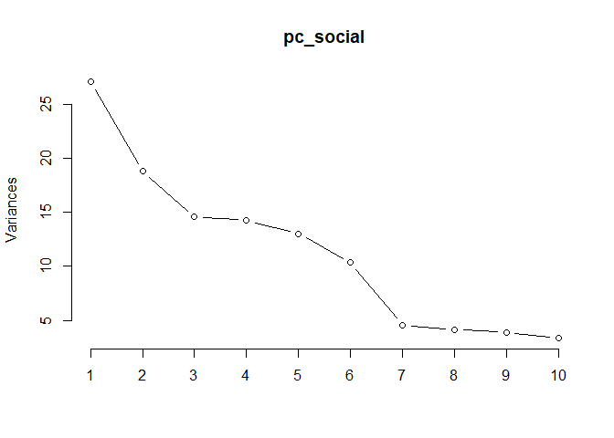

``` r
# two key plot
plot(g_rules, method='two-key plot')
```

    ## To reduce overplotting, jitter is added! Use jitter = 0 to prevent jitter.


``` r
# Look at key subsets
inspect(subset(g_rules, support > 0.03))
```

    ##      lhs                   rhs                support    confidence
    ## [1]  {}                 => {newspapers}       0.05132061 0.05132061
    ## [2]  {}                 => {bottled beer}     0.05177824 0.05177824
    ## [3]  {}                 => {shopping bags}    0.06334990 0.06334990
    ## [4]  {}                 => {pastry}           0.05720450 0.05720450
    ## [5]  {}                 => {citrus fruit}     0.05321653 0.05321653
    ## [6]  {}                 => {sausage}          0.06040795 0.06040795
    ## [7]  {}                 => {bottled water}    0.07106433 0.07106433
    ## [8]  {}                 => {tropical fruit}   0.06746862 0.06746862
    ## [9]  {}                 => {root vegetables}  0.07008368 0.07008368
    ## [10] {}                 => {yogurt}           0.08969665 0.08969665
    ## [11] {}                 => {soda}             0.11212082 0.11212082
    ## [12] {}                 => {rolls/buns}       0.11826621 0.11826621
    ## [13] {}                 => {other vegetables} 0.12441161 0.12441161
    ## [14] {}                 => {whole milk}       0.16429132 0.16429132
    ## [15] {other vegetables} => {whole milk}       0.04086036 0.32842880
    ## [16] {whole milk}       => {other vegetables} 0.04086036 0.24870673
    ##      lift     count
    ## [1]  1.000000  785 
    ## [2]  1.000000  792 
    ## [3]  1.000000  969 
    ## [4]  1.000000  875 
    ## [5]  1.000000  814 
    ## [6]  1.000000  924 
    ## [7]  1.000000 1087 
    ## [8]  1.000000 1032 
    ## [9]  1.000000 1072 
    ## [10] 1.000000 1372 
    ## [11] 1.000000 1715 
    ## [12] 1.000000 1809 
    ## [13] 1.000000 1903 
    ## [14] 1.000000 2513 
    ## [15] 1.999064  625 
    ## [16] 1.999064  625

``` r
inspect(subset(g_rules, confidence > 0.3))
```

    ##      lhs                        rhs                    support confidence      lift count
    ## [1]  {liquor}                => {bottled beer}     0.002811192  0.3944954  7.618942    43
    ## [2]  {herbs}                 => {root vegetables}  0.003726464  0.3562500  5.083209    57
    ## [3]  {herbs}                 => {other vegetables} 0.004314854  0.4125000  3.315607    66
    ## [4]  {herbs}                 => {whole milk}       0.003334205  0.3187500  1.940151    51
    ## [5]  {onions}                => {other vegetables} 0.007452929  0.3737705  3.004306   114
    ## [6]  {curd}                  => {whole milk}       0.012617678  0.3683206  2.241875   193
    ## [7]  {butter}                => {whole milk}       0.014382845  0.4036697  2.457036   220
    ## [8]  {root vegetables}       => {other vegetables} 0.025366109  0.3619403  2.909216   388
    ## [9]  {root vegetables}       => {whole milk}       0.022620293  0.3227612  1.964566   346
    ## [10] {other vegetables}      => {whole milk}       0.040860356  0.3284288  1.999064   625
    ## [11] {liquor,                                                                            
    ##       red/blush wine}        => {bottled beer}     0.001046025  0.9411765 18.177065    16
    ## [12] {bottled beer,                                                                      
    ##       liquor}                => {red/blush wine}   0.001046025  0.3720930 30.113941    16
    ## [13] {bottled beer,                                                                      
    ##       red/blush wine}        => {liquor}           0.001046025  0.4102564 57.571395    16
    ## [14] {herbs,                                                                             
    ##       root vegetables}       => {other vegetables} 0.001438285  0.3859649  3.102322    22
    ## [15] {herbs,                                                                             
    ##       other vegetables}      => {root vegetables}  0.001438285  0.3333333  4.756219    22
    ## [16] {herbs,                                                                             
    ##       root vegetables}       => {whole milk}       0.001176778  0.3157895  1.922131    18
    ## [17] {herbs,                                                                             
    ##       whole milk}            => {root vegetables}  0.001176778  0.3529412  5.035996    18
    ## [18] {herbs,                                                                             
    ##       other vegetables}      => {whole milk}       0.001372908  0.3181818  1.936693    21
    ## [19] {herbs,                                                                             
    ##       whole milk}            => {other vegetables} 0.001372908  0.4117647  3.309697    21
    ## [20] {butter milk,                                                                       
    ##       other vegetables}      => {whole milk}       0.001176778  0.3103448  1.888991    18
    ## [21] {citrus fruit,                                                                      
    ##       onions}                => {other vegetables} 0.001111402  0.4594595  3.693059    17
    ## [22] {onions,                                                                            
    ##       root vegetables}       => {other vegetables} 0.002092050  0.3950617  3.175441    32
    ## [23] {onions,                                                                            
    ##       other vegetables}      => {whole milk}       0.002288180  0.3070175  1.868739    35
    ## [24] {onions,                                                                            
    ##       whole milk}            => {other vegetables} 0.002288180  0.4268293  3.430783    35
    ## [25] {berries,                                                                           
    ##       root vegetables}       => {other vegetables} 0.001372908  0.3684211  2.961308    21
    ## [26] {berries,                                                                           
    ##       root vegetables}       => {whole milk}       0.001372908  0.3684211  2.242486    21
    ## [27] {hamburger meat,                                                                    
    ##       root vegetables}       => {other vegetables} 0.001307531  0.4255319  3.420355    20
    ## [28] {dessert,                                                                           
    ##       other vegetables}      => {whole milk}       0.001634414  0.3289474  2.002220    25
    ## [29] {chicken,                                                                           
    ##       whole milk}            => {other vegetables} 0.002092050  0.3298969  2.651657    32
    ## [30] {frozen vegetables,                                                                 
    ##       other vegetables}      => {whole milk}       0.001242155  0.3275862  1.993935    19
    ## [31] {butter,                                                                            
    ##       curd}                  => {whole milk}       0.001242155  0.4318182  2.628369    19
    ## [32] {curd,                                                                              
    ##       tropical fruit}        => {whole milk}       0.001503661  0.5227273  3.181710    23
    ## [33] {curd,                                                                              
    ##       root vegetables}       => {whole milk}       0.001242155  0.4222222  2.569961    19
    ## [34] {curd,                                                                              
    ##       other vegetables}      => {whole milk}       0.003399582  0.4814815  2.930657    52
    ## [35] {butter,                                                                            
    ##       whipped/sour cream}    => {whole milk}       0.001242155  0.3220339  1.960139    19
    ## [36] {butter,                                                                            
    ##       tropical fruit}        => {whole milk}       0.001046025  0.4000000  2.434700    16
    ## [37] {butter,                                                                            
    ##       root vegetables}       => {other vegetables} 0.001242155  0.3064516  2.463207    19
    ## [38] {butter,                                                                            
    ##       root vegetables}       => {whole milk}       0.002092050  0.5161290  3.141548    32
    ## [39] {butter,                                                                            
    ##       yogurt}                => {whole milk}       0.002615063  0.4210526  2.562842    40
    ## [40] {butter,                                                                            
    ##       rolls/buns}            => {whole milk}       0.001046025  0.3076923  1.872846    16
    ## [41] {butter,                                                                            
    ##       other vegetables}      => {whole milk}       0.003791841  0.4603175  2.801837    58
    ## [42] {bottled beer,                                                                      
    ##       fruit/vegetable juice} => {soda}             0.001046025  0.3018868  2.692513    16
    ## [43] {bottled beer,                                                                      
    ##       bottled water}         => {soda}             0.002092050  0.3018868  2.692513    32
    ## [44] {domestic eggs,                                                                     
    ##       other vegetables}      => {whole milk}       0.001372908  0.3620690  2.203823    21
    ## [45] {bottled water,                                                                     
    ##       fruit/vegetable juice} => {soda}             0.001765167  0.3068182  2.736496    27
    ## [46] {citrus fruit,                                                                      
    ##       pip fruit}             => {tropical fruit}   0.003072699  0.3760000  5.572961    47
    ## [47] {sausage,                                                                           
    ##       soda}                  => {rolls/buns}       0.002288180  0.4605263  3.893980    35
    ## [48] {root vegetables,                                                                   
    ##       tropical fruit}        => {other vegetables} 0.003334205  0.3035714  2.440057    51
    ## [49] {root vegetables,                                                                   
    ##       yogurt}                => {whole milk}       0.002026674  0.3131313  1.905952    31
    ## [50] {other vegetables,                                                                  
    ##       root vegetables}       => {whole milk}       0.008172071  0.3221649  1.960937   125
    ## [51] {root vegetables,                                                                   
    ##       whole milk}            => {other vegetables} 0.008172071  0.3612717  2.903842   125
    ## [52] {other vegetables,                                                                  
    ##       yogurt}                => {whole milk}       0.006341527  0.3991770  2.429690    97

``` r
# graph visualization
sub1 = subset(g_rules, subset=confidence>0.15, support > 0.001)
summary(sub1)
```

    ## set of 319 rules
    ## 
    ## rule length distribution (lhs + rhs):sizes
    ##   1   2   3 
    ##   1 141 177 
    ## 
    ##    Min. 1st Qu.  Median    Mean 3rd Qu.    Max. 
    ##   1.000   2.000   3.000   2.552   3.000   3.000 
    ## 
    ## summary of quality measures:
    ##     support           confidence          lift             count        
    ##  Min.   :0.001046   Min.   :0.1505   Min.   : 0.9252   Min.   :  16.00  
    ##  1st Qu.:0.001373   1st Qu.:0.1845   1st Qu.: 1.6140   1st Qu.:  21.00  
    ##  Median :0.002288   Median :0.2211   Median : 2.1099   Median :  35.00  
    ##  Mean   :0.004634   Mean   :0.2409   Mean   : 2.6856   Mean   :  70.88  
    ##  3rd Qu.:0.004903   3rd Qu.:0.2701   3rd Qu.: 2.8471   3rd Qu.:  75.00  
    ##  Max.   :0.164291   Max.   :0.9412   Max.   :57.5714   Max.   :2513.00  
    ## 
    ## mining info:
    ##     data ntransactions support confidence
    ##  g_trans         15296   0.001       0.05

``` r
plot(head(sub1, 10, by='lift'), method='paracoord')
```


``` r
####### Association rules
saveAsGraph(head(g_rules, n = 1000, by = "lift"), file = "g_rules.graphml")
```
