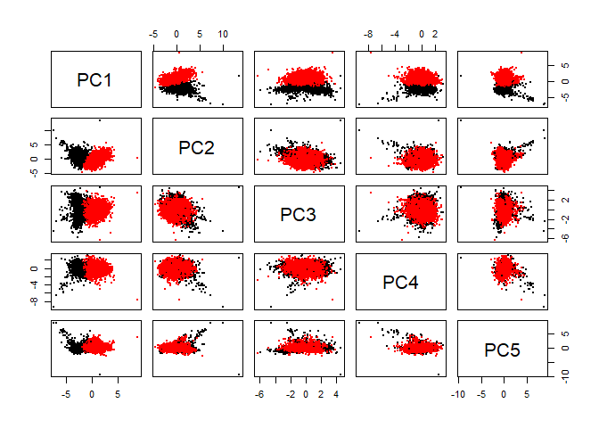
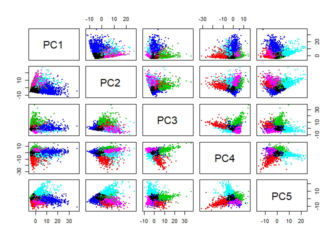

Exercise 4
================
Wyatt Allen, Elijah Evans, David Ford, Patrick Scovel
25 April 2019

Question 1
----------


    ## Importance of first k=5 (out of 11) components:
    ##                           PC1    PC2    PC3     PC4     PC5
    ## Standard deviation     1.7407 1.5792 1.2475 0.98517 0.84845
    ## Proportion of Variance 0.2754 0.2267 0.1415 0.08823 0.06544
    ## Cumulative Proportion  0.2754 0.5021 0.6436 0.73187 0.79732



    ##    1    2    3    4    5    6    7    8    9   10   11   12   13   14   15 
    ##  721  466 1009   98   53   95   22  460    2   55 1393  528 1570   19    2 
    ##   16   17   18 
    ##    2    1    1

    ##   red white 
    ##  1575    68

    ##   red white 
    ##    24  4830

    ##   red white 
    ##  1574    78

    ##   red white 
    ##    25  4820

    ##   red white 
    ##   711    10

    ##    Min. 1st Qu.  Median    Mean 3rd Qu.    Max. 
    ##   3.000   5.000   5.000   5.369   6.000   8.000

Question 2
----------


    ## Importance of first k=7 (out of 36) components:
    ##                           PC1    PC2    PC3    PC4     PC5     PC6     PC7
    ## Standard deviation     5.2035 4.3366 3.8224 3.7751 3.60916 3.21543 2.13510
    ## Proportion of Variance 0.1924 0.1336 0.1038 0.1013 0.09255 0.07346 0.03239
    ## Cumulative Proportion  0.1924 0.3260 0.4298 0.5311 0.62363 0.69709 0.72948



<!--html_preserve-->


    ##    1    2    3    4    5    6    7    8    9   10 
    ##  299 5734  436  663   33  172  410   90   18   27

Question 3
----------

    ## transactions as itemMatrix in sparse format with
    ##  15296 rows (elements/itemsets/transactions) and
    ##  169 columns (items) and a density of 0.01677625 
    ## 
    ## most frequent items:
    ##       whole milk other vegetables       rolls/buns             soda 
    ##             2513             1903             1809             1715 
    ##           yogurt          (Other) 
    ##             1372            34055 
    ## 
    ## element (itemset/transaction) length distribution:
    ## sizes
    ##    1    2    3    4 
    ## 3485 2630 2102 7079 
    ## 
    ##    Min. 1st Qu.  Median    Mean 3rd Qu.    Max. 
    ##   1.000   2.000   3.000   2.835   4.000   4.000 
    ## 
    ## includes extended item information - examples:
    ##             labels
    ## 1 abrasive cleaner
    ## 2 artif. sweetener
    ## 3   baby cosmetics
    ## 
    ## includes extended transaction information - examples:
    ##   transactionID
    ## 1             1
    ## 2             2
    ## 3             3

    ## Apriori
    ## 
    ## Parameter specification:
    ##  confidence minval smax arem  aval originalSupport maxtime support minlen
    ##        0.05    0.1    1 none FALSE            TRUE       5   0.001      1
    ##  maxlen target   ext
    ##       5  rules FALSE
    ## 
    ## Algorithmic control:
    ##  filter tree heap memopt load sort verbose
    ##     0.1 TRUE TRUE  FALSE TRUE    2    TRUE
    ## 
    ## Absolute minimum support count: 15 
    ## 
    ## set item appearances ...[0 item(s)] done [0.00s].
    ## set transactions ...[169 item(s), 15296 transaction(s)] done [0.00s].
    ## sorting and recoding items ... [151 item(s)] done [0.00s].
    ## creating transaction tree ... done [0.02s].
    ## checking subsets of size 1 2 3 4 done [0.00s].
    ## writing ... [1044 rule(s)] done [0.00s].
    ## creating S4 object  ... done [0.00s].

``` r
# Plots
plot(g_rules)
```

    ## To reduce overplotting, jitter is added! Use jitter = 0 to prevent jitter.


``` r
#Other axis
plot(g_rules, measure = c("support", "lift"), shading = "confidence")
```

    ## To reduce overplotting, jitter is added! Use jitter = 0 to prevent jitter.


``` r
# two key plot
plot(g_rules, method='two-key plot')
```

    ## To reduce overplotting, jitter is added! Use jitter = 0 to prevent jitter.


``` r
# Look at key subsets
inspect(subset(g_rules, support > 0.03))
```

    ##      lhs                   rhs                support    confidence
    ## [1]  {}                 => {newspapers}       0.05132061 0.05132061
    ## [2]  {}                 => {bottled beer}     0.05177824 0.05177824
    ## [3]  {}                 => {shopping bags}    0.06334990 0.06334990
    ## [4]  {}                 => {pastry}           0.05720450 0.05720450
    ## [5]  {}                 => {citrus fruit}     0.05321653 0.05321653
    ## [6]  {}                 => {sausage}          0.06040795 0.06040795
    ## [7]  {}                 => {bottled water}    0.07106433 0.07106433
    ## [8]  {}                 => {tropical fruit}   0.06746862 0.06746862
    ## [9]  {}                 => {root vegetables}  0.07008368 0.07008368
    ## [10] {}                 => {yogurt}           0.08969665 0.08969665
    ## [11] {}                 => {soda}             0.11212082 0.11212082
    ## [12] {}                 => {rolls/buns}       0.11826621 0.11826621
    ## [13] {}                 => {other vegetables} 0.12441161 0.12441161
    ## [14] {}                 => {whole milk}       0.16429132 0.16429132
    ## [15] {other vegetables} => {whole milk}       0.04086036 0.32842880
    ## [16] {whole milk}       => {other vegetables} 0.04086036 0.24870673
    ##      lift     count
    ## [1]  1.000000  785 
    ## [2]  1.000000  792 
    ## [3]  1.000000  969 
    ## [4]  1.000000  875 
    ## [5]  1.000000  814 
    ## [6]  1.000000  924 
    ## [7]  1.000000 1087 
    ## [8]  1.000000 1032 
    ## [9]  1.000000 1072 
    ## [10] 1.000000 1372 
    ## [11] 1.000000 1715 
    ## [12] 1.000000 1809 
    ## [13] 1.000000 1903 
    ## [14] 1.000000 2513 
    ## [15] 1.999064  625 
    ## [16] 1.999064  625

``` r
inspect(subset(g_rules, confidence > 0.3))
```

    ##      lhs                        rhs                    support confidence      lift count
    ## [1]  {liquor}                => {bottled beer}     0.002811192  0.3944954  7.618942    43
    ## [2]  {herbs}                 => {root vegetables}  0.003726464  0.3562500  5.083209    57
    ## [3]  {herbs}                 => {other vegetables} 0.004314854  0.4125000  3.315607    66
    ## [4]  {herbs}                 => {whole milk}       0.003334205  0.3187500  1.940151    51
    ## [5]  {onions}                => {other vegetables} 0.007452929  0.3737705  3.004306   114
    ## [6]  {curd}                  => {whole milk}       0.012617678  0.3683206  2.241875   193
    ## [7]  {butter}                => {whole milk}       0.014382845  0.4036697  2.457036   220
    ## [8]  {root vegetables}       => {other vegetables} 0.025366109  0.3619403  2.909216   388
    ## [9]  {root vegetables}       => {whole milk}       0.022620293  0.3227612  1.964566   346
    ## [10] {other vegetables}      => {whole milk}       0.040860356  0.3284288  1.999064   625
    ## [11] {liquor,                                                                            
    ##       red/blush wine}        => {bottled beer}     0.001046025  0.9411765 18.177065    16
    ## [12] {bottled beer,                                                                      
    ##       liquor}                => {red/blush wine}   0.001046025  0.3720930 30.113941    16
    ## [13] {bottled beer,                                                                      
    ##       red/blush wine}        => {liquor}           0.001046025  0.4102564 57.571395    16
    ## [14] {herbs,                                                                             
    ##       root vegetables}       => {other vegetables} 0.001438285  0.3859649  3.102322    22
    ## [15] {herbs,                                                                             
    ##       other vegetables}      => {root vegetables}  0.001438285  0.3333333  4.756219    22
    ## [16] {herbs,                                                                             
    ##       root vegetables}       => {whole milk}       0.001176778  0.3157895  1.922131    18
    ## [17] {herbs,                                                                             
    ##       whole milk}            => {root vegetables}  0.001176778  0.3529412  5.035996    18
    ## [18] {herbs,                                                                             
    ##       other vegetables}      => {whole milk}       0.001372908  0.3181818  1.936693    21
    ## [19] {herbs,                                                                             
    ##       whole milk}            => {other vegetables} 0.001372908  0.4117647  3.309697    21
    ## [20] {butter milk,                                                                       
    ##       other vegetables}      => {whole milk}       0.001176778  0.3103448  1.888991    18
    ## [21] {citrus fruit,                                                                      
    ##       onions}                => {other vegetables} 0.001111402  0.4594595  3.693059    17
    ## [22] {onions,                                                                            
    ##       root vegetables}       => {other vegetables} 0.002092050  0.3950617  3.175441    32
    ## [23] {onions,                                                                            
    ##       other vegetables}      => {whole milk}       0.002288180  0.3070175  1.868739    35
    ## [24] {onions,                                                                            
    ##       whole milk}            => {other vegetables} 0.002288180  0.4268293  3.430783    35
    ## [25] {berries,                                                                           
    ##       root vegetables}       => {other vegetables} 0.001372908  0.3684211  2.961308    21
    ## [26] {berries,                                                                           
    ##       root vegetables}       => {whole milk}       0.001372908  0.3684211  2.242486    21
    ## [27] {hamburger meat,                                                                    
    ##       root vegetables}       => {other vegetables} 0.001307531  0.4255319  3.420355    20
    ## [28] {dessert,                                                                           
    ##       other vegetables}      => {whole milk}       0.001634414  0.3289474  2.002220    25
    ## [29] {chicken,                                                                           
    ##       whole milk}            => {other vegetables} 0.002092050  0.3298969  2.651657    32
    ## [30] {frozen vegetables,                                                                 
    ##       other vegetables}      => {whole milk}       0.001242155  0.3275862  1.993935    19
    ## [31] {butter,                                                                            
    ##       curd}                  => {whole milk}       0.001242155  0.4318182  2.628369    19
    ## [32] {curd,                                                                              
    ##       tropical fruit}        => {whole milk}       0.001503661  0.5227273  3.181710    23
    ## [33] {curd,                                                                              
    ##       root vegetables}       => {whole milk}       0.001242155  0.4222222  2.569961    19
    ## [34] {curd,                                                                              
    ##       other vegetables}      => {whole milk}       0.003399582  0.4814815  2.930657    52
    ## [35] {butter,                                                                            
    ##       whipped/sour cream}    => {whole milk}       0.001242155  0.3220339  1.960139    19
    ## [36] {butter,                                                                            
    ##       tropical fruit}        => {whole milk}       0.001046025  0.4000000  2.434700    16
    ## [37] {butter,                                                                            
    ##       root vegetables}       => {other vegetables} 0.001242155  0.3064516  2.463207    19
    ## [38] {butter,                                                                            
    ##       root vegetables}       => {whole milk}       0.002092050  0.5161290  3.141548    32
    ## [39] {butter,                                                                            
    ##       yogurt}                => {whole milk}       0.002615063  0.4210526  2.562842    40
    ## [40] {butter,                                                                            
    ##       rolls/buns}            => {whole milk}       0.001046025  0.3076923  1.872846    16
    ## [41] {butter,                                                                            
    ##       other vegetables}      => {whole milk}       0.003791841  0.4603175  2.801837    58
    ## [42] {bottled beer,                                                                      
    ##       fruit/vegetable juice} => {soda}             0.001046025  0.3018868  2.692513    16
    ## [43] {bottled beer,                                                                      
    ##       bottled water}         => {soda}             0.002092050  0.3018868  2.692513    32
    ## [44] {domestic eggs,                                                                     
    ##       other vegetables}      => {whole milk}       0.001372908  0.3620690  2.203823    21
    ## [45] {bottled water,                                                                     
    ##       fruit/vegetable juice} => {soda}             0.001765167  0.3068182  2.736496    27
    ## [46] {citrus fruit,                                                                      
    ##       pip fruit}             => {tropical fruit}   0.003072699  0.3760000  5.572961    47
    ## [47] {sausage,                                                                           
    ##       soda}                  => {rolls/buns}       0.002288180  0.4605263  3.893980    35
    ## [48] {root vegetables,                                                                   
    ##       tropical fruit}        => {other vegetables} 0.003334205  0.3035714  2.440057    51
    ## [49] {root vegetables,                                                                   
    ##       yogurt}                => {whole milk}       0.002026674  0.3131313  1.905952    31
    ## [50] {other vegetables,                                                                  
    ##       root vegetables}       => {whole milk}       0.008172071  0.3221649  1.960937   125
    ## [51] {root vegetables,                                                                   
    ##       whole milk}            => {other vegetables} 0.008172071  0.3612717  2.903842   125
    ## [52] {other vegetables,                                                                  
    ##       yogurt}                => {whole milk}       0.006341527  0.3991770  2.429690    97

``` r
# graph visualization
sub1 = subset(g_rules, subset=confidence>0.15, support > 0.001)
summary(sub1)
```

    ## set of 319 rules
    ## 
    ## rule length distribution (lhs + rhs):sizes
    ##   1   2   3 
    ##   1 141 177 
    ## 
    ##    Min. 1st Qu.  Median    Mean 3rd Qu.    Max. 
    ##   1.000   2.000   3.000   2.552   3.000   3.000 
    ## 
    ## summary of quality measures:
    ##     support           confidence          lift             count        
    ##  Min.   :0.001046   Min.   :0.1505   Min.   : 0.9252   Min.   :  16.00  
    ##  1st Qu.:0.001373   1st Qu.:0.1845   1st Qu.: 1.6140   1st Qu.:  21.00  
    ##  Median :0.002288   Median :0.2211   Median : 2.1099   Median :  35.00  
    ##  Mean   :0.004634   Mean   :0.2409   Mean   : 2.6856   Mean   :  70.88  
    ##  3rd Qu.:0.004903   3rd Qu.:0.2701   3rd Qu.: 2.8471   3rd Qu.:  75.00  
    ##  Max.   :0.164291   Max.   :0.9412   Max.   :57.5714   Max.   :2513.00  
    ## 
    ## mining info:
    ##     data ntransactions support confidence
    ##  g_trans         15296   0.001       0.05

``` r
plot(head(sub1, 10, by='lift'), method='paracoord')
```


``` r
####### Association rules
saveAsGraph(head(g_rules, n = 1000, by = "lift"), file = "g_rules.graphml")
```
