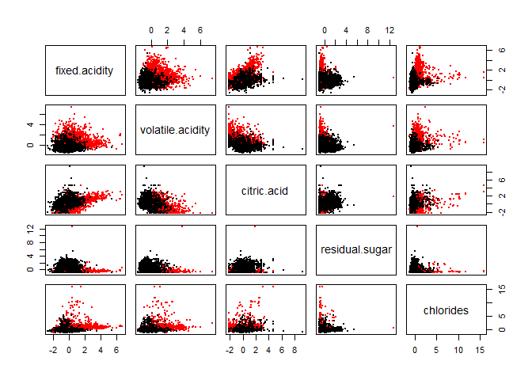

Exercise 4
================
Wyatt Allen, Elijah Evans, David Ford, Patrick Scovel --
28 April 2019

Question 1
----------

To begin, we load in our libraries and the data

Here we are getting a visual for the interactions between the variables 

Here we are creating an elbow plot to determine the "optimal" k value. That is, we identify that at k=5 (or using 5 variables for PCA) there seems to be an "elbow" and this is indicates it should be a good choice. 

    ## Importance of first k=5 (out of 11) components:
    ##                           PC1    PC2    PC3     PC4     PC5
    ## Standard deviation     1.7407 1.5792 1.2475 0.98517 0.84845
    ## Proportion of Variance 0.2754 0.2267 0.1415 0.08823 0.06544
    ## Cumulative Proportion  0.2754 0.5021 0.6436 0.73187 0.79732

We create graphs from what we learned during PCA with k=5, and see that there are still some graphs which clearly have a very loose cluster, or perhaps even 2 clusters.

Since we had a higher than desired level of dispersion in some of the clusters from PCA, we've decided now to explore Hierarchical clustering. This is setting up the dendrogram and also grouping the dendrogram into groups of 9 wines with the closest associations.

Here, we are setting up 3 different ways of looking at our wine data in an attempt to sort it effectively,

Our result are not good. This model seems to be entirely incapable of identifying wine into red or white.

    ##          
    ## hcluster2  red white
    ##         1 1599  4897
    ##         2    0     1

We also don't seem to be able to identify wine and quality clusters in this model

Here we are running K-means without PCA, and we do seem to be getting 2 different clusters in each graph when we separate the wines by color.

Here we have very clear clustering in each PCAxPCA graph within each type of wine denoted by different colors 

Here we are setting up and testing whether k-means can predict color. We see that it is clearly predicting color fairly well for both with and without PCA.

    ##   red white 
    ##    24  4830

    ##   red white 
    ##  1575    68

    ##   red white 
    ##    25  4820

    ##   red white 
    ##  1574    78

Here we are trying to predict both color and quality. This particular model doesn't seem to be doing a very good job of identifying quality. We come to this conclusion based on the fact that there seems to be considerable spread in the colors used to identify quality within each of the PCAxPCA graph. 

    ##    
    ##      red white
    ##   3   10    20
    ##   4   53   163
    ##   5  681  1457
    ##   6  638  2198
    ##   7  199   880
    ##   8   18   175
    ##   9    0     5

We try to identify quality with k-means. We don't appear to be having much success with this. 

Conclusion: We were able to identify wines by type using K-means with and without PCA included inside the model as well. Unfortunately, we were not able to find a model which would also effectively predict color and quality.

Question 2
----------

As previously, we begin by loading our libraries and data

Here we are finding out, probably the most important piece of information, which topics have the most unique users tweeting about them, and then among those topics, which ones are tweeted about this most. This is important because any insights we gain through data analysis will be useless if they are not consistent with these metrics.

Here we use and elbow plot to determine that we should be using k=9 for PCA and run PCA analysis. Unfortunately, we still do not see much in the way of a natural grouping using this method. 

    ## Importance of first k=9 (out of 33) components:
    ##                           PC1     PC2     PC3     PC4    PC5     PC6
    ## Standard deviation     2.1015 1.66641 1.59225 1.53165 1.4701 1.28846
    ## Proportion of Variance 0.1338 0.08415 0.07683 0.07109 0.0655 0.05031
    ## Cumulative Proportion  0.1338 0.21798 0.29480 0.36589 0.4314 0.48169
    ##                            PC7     PC8     PC9
    ## Standard deviation     1.21799 1.17434 1.05527
    ## Proportion of Variance 0.04495 0.04179 0.03374
    ## Cumulative Proportion  0.52665 0.56844 0.60218

    ##           adult   online_gaming     college_uni  current_events 
    ##      0.05262015      0.07231607      0.08940811      0.09139879 
    ##         tv_film             art          dating        shopping 
    ##      0.09397846      0.09738386      0.09763988      0.10778144 
    ## home_and_garden  small_business 
    ##      0.11582759      0.11638518

Now we will try to run K-means with PCA clustering. First we'll try to look at an elbow plot to find the optimal k. Unfortunately, we don't see a clear elbow, so we'll just use 10. 

Recreating graphs with clustering, using different colors for the different clusters. 

Here we are creating word clouds to help visualize the associations between twitter topics. Using these we can see a clear association between fitness, cooking, and travel with photosharing. Additionally we see a clear association between news and politics. Unfortunately, this is a very confusing way to present data, and levels of association are unclear. <!--html_preserve-->

<!--/html_preserve-->
<!--html_preserve-->

<!--/html_preserve-->
<!--html_preserve-->

<!--/html_preserve-->
<!--html_preserve-->

<!--/html_preserve-->
<!--html_preserve-->

<!--/html_preserve-->
<!--html_preserve-->

<!--/html_preserve-->
<!--html_preserve-->

<!--/html_preserve-->
<!--html_preserve-->

<!--/html_preserve-->
<!--html_preserve-->

<!--/html_preserve-->
<!--html_preserve-->

<!--/html_preserve-->
Here we have decided to use hierarchical clustering and are creating a dendrogram. This makes it much easier to visualize the level of association between topics on twitter. Here we see that phtosharing is most closely related to health and nutrition, but not particularly closely related to the other topics. 

Here we block off branches of the tree to see the 10 groups with the closest associations. Our suggestion would be to look at these associations, and within the groups, determine which groups are most popular among twitter users in the sample. These should be the topics that are targeted for marketing campaigns. Looking back at what we looked into in lines 18-24, the health-nutrition/photo sharing cluster would be a very good one to target, with average number of tweets among users who are tweeting of roughly 5 and 3.4. Another good suggestion would be to target the cluster with outdoor because this is a very large cluster that would have a lot of tangential effects (i.e. target outdoor would likely get picked up by users tweeting about school, sports, music, etc)

Question 3
----------

Just data manipulation

First, we set our threshold.

Then, we determine our rules.

    ## Apriori
    ## 
    ## Parameter specification:
    ##  confidence minval smax arem  aval originalSupport maxtime support minlen
    ##        0.05    0.1    1 none FALSE            TRUE       5   0.005      1
    ##  maxlen target   ext
    ##      10  rules FALSE
    ## 
    ## Algorithmic control:
    ##  filter tree heap memopt load sort verbose
    ##     0.1 TRUE TRUE  FALSE TRUE    2    TRUE
    ## 
    ## Absolute minimum support count: 76 
    ## 
    ## set item appearances ...[0 item(s)] done [0.00s].
    ## set transactions ...[169 item(s), 15296 transaction(s)] done [0.01s].
    ## sorting and recoding items ... [101 item(s)] done [0.00s].
    ## creating transaction tree ... done [0.00s].
    ## checking subsets of size 1 2 3 done [0.00s].
    ## writing ... [181 rule(s)] done [0.00s].
    ## creating S4 object  ... done [0.00s].

Here, we display the rules which were discovered to have a lift over 2.

    ##      lhs                              rhs                  support    
    ## [1]  {onions}                      => {root vegetables}    0.005295502
    ## [2]  {root vegetables}             => {onions}             0.005295502
    ## [3]  {onions}                      => {other vegetables}   0.007452929
    ## [4]  {other vegetables}            => {onions}             0.007452929
    ## [5]  {hamburger meat}              => {other vegetables}   0.006210774
    ## [6]  {cream cheese }               => {yogurt}             0.005033996
    ## [7]  {yogurt}                      => {cream cheese }      0.005033996
    ## [8]  {chicken}                     => {other vegetables}   0.007975941
    ## [9]  {other vegetables}            => {chicken}            0.007975941
    ## [10] {beef}                        => {citrus fruit}       0.005099372
    ## [11] {citrus fruit}                => {beef}               0.005099372
    ## [12] {beef}                        => {root vegetables}    0.008695084
    ## [13] {root vegetables}             => {beef}               0.008695084
    ## [14] {curd}                        => {yogurt}             0.007649059
    ## [15] {yogurt}                      => {curd}               0.007649059
    ## [16] {curd}                        => {whole milk}         0.012617678
    ## [17] {whole milk}                  => {curd}               0.012617678
    ## [18] {butter}                      => {whole milk}         0.014382845
    ## [19] {whole milk}                  => {butter}             0.014382845
    ## [20] {pork}                        => {root vegetables}    0.006733787
    ## [21] {root vegetables}             => {pork}               0.006733787
    ## [22] {pork}                        => {other vegetables}   0.009283473
    ## [23] {other vegetables}            => {pork}               0.009283473
    ## [24] {frankfurter}                 => {sausage}            0.006472280
    ## [25] {sausage}                     => {frankfurter}        0.006472280
    ## [26] {frankfurter}                 => {tropical fruit}     0.005557008
    ## [27] {tropical fruit}              => {frankfurter}        0.005557008
    ## [28] {brown bread}                 => {pastry}             0.005033996
    ## [29] {pastry}                      => {brown bread}        0.005033996
    ## [30] {whipped/sour cream}          => {yogurt}             0.009741109
    ## [31] {yogurt}                      => {whipped/sour cream} 0.009741109
    ## [32] {pip fruit}                   => {citrus fruit}       0.008172071
    ## [33] {citrus fruit}                => {pip fruit}          0.008172071
    ## [34] {pip fruit}                   => {sausage}            0.006210774
    ## [35] {sausage}                     => {pip fruit}          0.006210774
    ## [36] {pip fruit}                   => {tropical fruit}     0.012683054
    ## [37] {tropical fruit}              => {pip fruit}          0.012683054
    ## [38] {pip fruit}                   => {root vegetables}    0.008106695
    ## [39] {root vegetables}             => {pip fruit}          0.008106695
    ## [40] {citrus fruit}                => {sausage}            0.006929916
    ## [41] {sausage}                     => {citrus fruit}       0.006929916
    ## [42] {citrus fruit}                => {tropical fruit}     0.012486925
    ## [43] {tropical fruit}              => {citrus fruit}       0.012486925
    ## [44] {citrus fruit}                => {root vegetables}    0.008695084
    ## [45] {root vegetables}             => {citrus fruit}       0.008695084
    ## [46] {sausage}                     => {tropical fruit}     0.008172071
    ## [47] {tropical fruit}              => {sausage}            0.008172071
    ## [48] {tropical fruit}              => {root vegetables}    0.010983264
    ## [49] {root vegetables}             => {tropical fruit}     0.010983264
    ## [50] {root vegetables}             => {other vegetables}   0.025366109
    ## [51] {other vegetables}            => {root vegetables}    0.025366109
    ## [52] {root vegetables,whole milk}  => {other vegetables}   0.008172071
    ## [53] {other vegetables,whole milk} => {root vegetables}    0.008172071
    ## [54] {other vegetables,yogurt}     => {whole milk}         0.006341527
    ## [55] {whole milk,yogurt}           => {other vegetables}   0.006341527
    ##      confidence lift     count
    ## [1]  0.26557377 3.789381  81  
    ## [2]  0.07555970 3.789381  81  
    ## [3]  0.37377049 3.004306 114  
    ## [4]  0.05990541 3.004306 114  
    ## [5]  0.29051988 2.335151  95  
    ## [6]  0.19743590 2.201151  77  
    ## [7]  0.05612245 2.201151  77  
    ## [8]  0.28909953 2.323734 122  
    ## [9]  0.06410930 2.323734 122  
    ## [10] 0.15116279 2.840523  78  
    ## [11] 0.09582310 2.840523  78  
    ## [12] 0.25775194 3.677774 133  
    ## [13] 0.12406716 3.677774 133  
    ## [14] 0.22328244 2.489306 117  
    ## [15] 0.08527697 2.489306 117  
    ## [16] 0.36832061 2.241875 193  
    ## [17] 0.07680064 2.241875 193  
    ## [18] 0.40366972 2.457036 220  
    ## [19] 0.08754477 2.457036 220  
    ## [20] 0.18165785 2.592013 103  
    ## [21] 0.09608209 2.592013 103  
    ## [22] 0.25044092 2.013003 142  
    ## [23] 0.07461902 2.013003 142  
    ## [24] 0.17068966 2.825616  99  
    ## [25] 0.10714286 2.825616  99  
    ## [26] 0.14655172 2.172146  85  
    ## [27] 0.08236434 2.172146  85  
    ## [28] 0.12068966 2.109793  77  
    ## [29] 0.08800000 2.109793  77  
    ## [30] 0.21134752 2.356248 149  
    ## [31] 0.10860058 2.356248 149  
    ## [32] 0.16801075 3.157116 125  
    ## [33] 0.15356265 3.157116 125  
    ## [34] 0.12768817 2.113764  95  
    ## [35] 0.10281385 2.113764  95  
    ## [36] 0.26075269 3.864800 194  
    ## [37] 0.18798450 3.864800 194  
    ## [38] 0.16666667 2.378109 124  
    ## [39] 0.11567164 2.378109 124  
    ## [40] 0.13022113 2.155695 106  
    ## [41] 0.11471861 2.155695 106  
    ## [42] 0.23464373 3.477820 191  
    ## [43] 0.18507752 3.477820 191  
    ## [44] 0.16339066 2.331365 133  
    ## [45] 0.12406716 2.331365 133  
    ## [46] 0.13528139 2.005101 125  
    ## [47] 0.12112403 2.005101 125  
    ## [48] 0.16279070 2.322805 168  
    ## [49] 0.15671642 2.322805 168  
    ## [50] 0.36194030 2.909216 388  
    ## [51] 0.20388860 2.909216 388  
    ## [52] 0.36127168 2.903842 125  
    ## [53] 0.20000000 2.853731 125  
    ## [54] 0.39917695 2.429690  97  
    ## [55] 0.26145553 2.101536  97

We plot our association rules.

    ## To reduce overplotting, jitter is added! Use jitter = 0 to prevent jitter.

Conclusion: For this problem, we decided to set a support of .005, confidence of .05, and a max length of 10. The support decided upon because of the size of the dataset and the tremendous variation in items available in a grocery store. If we had a smaller sample, or had fewer options, this would have been higher, just to get more data, but we felt comfortable with this level. We set a confidence level of 5% because again, there are so many options available in a grocery store we wanted to capture any meaningful associations possible. Additionally, we felt that if 5% of people who purchased one item were also purchasing another item, it would provide actionable insight, and an opportunity to exploit a non-zero relationship (i.e. we felt that this was likely a natural association and we could likely nudge marginal consumers toward buying more items). The length was limited to 10 because it seems unlikely that we would be able to present meaningful associations with more than 10 items because at that point it would be difficult to follow all of the items being associated.
There are a series of interesting associations we have found. Among the strongest are between pip fruits and tropical fruits, onions and root vegetables, and beef and root vegetables. All of these associations also enjoy a significant amount of reciprocity. That is, not only does purchasing Item A increase the likelihood of purchasing Item B, but Item B has the same effect on Item A. Some of these associations are fairly intuitive as virtually every roast beef recipe calls for onions and carrots, which would be classified as a root vegetable. Perhaps less intuitive are the associations between fruits, as those are rarely used as ingredients together, and are instead, at least in American culture, typically eaten as stand alone foods. *support\_val = .005 *conf\_val = .05 \*maxlen\_val = 10
