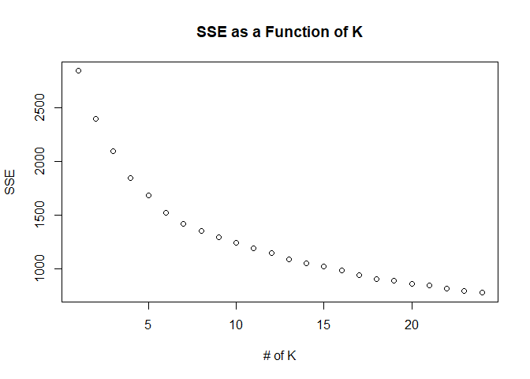
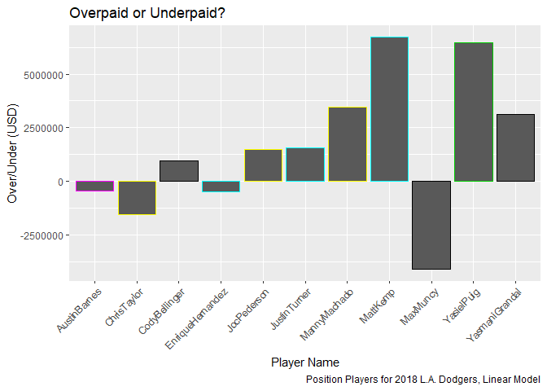
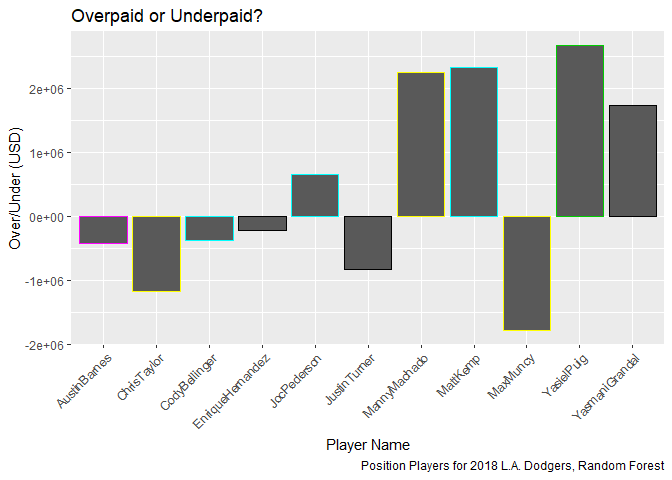
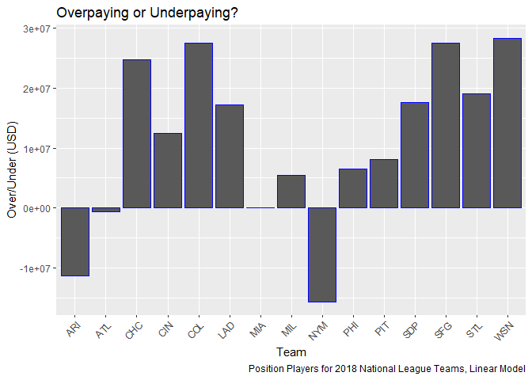
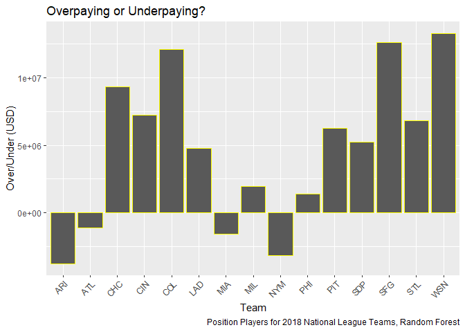
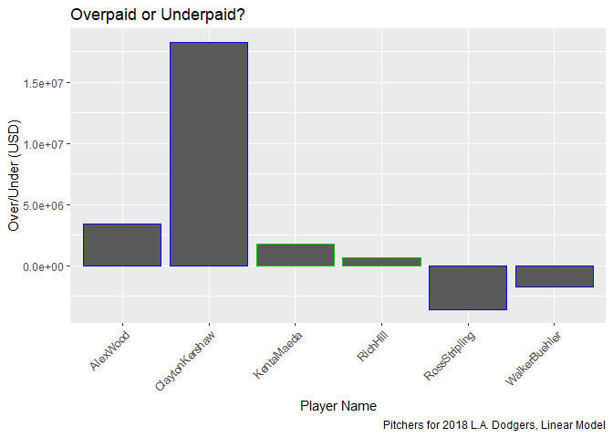
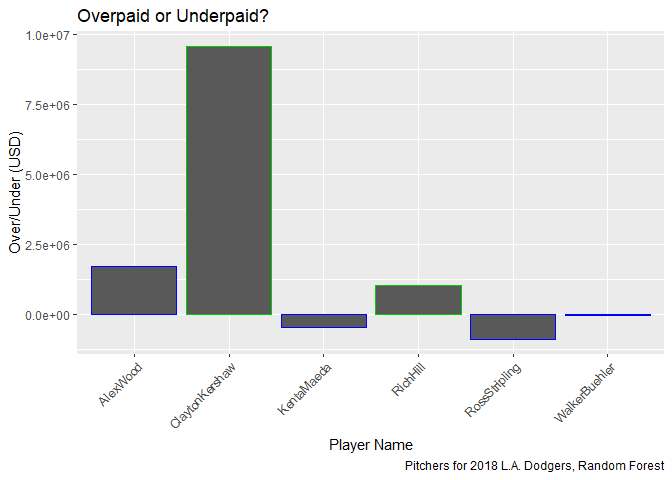
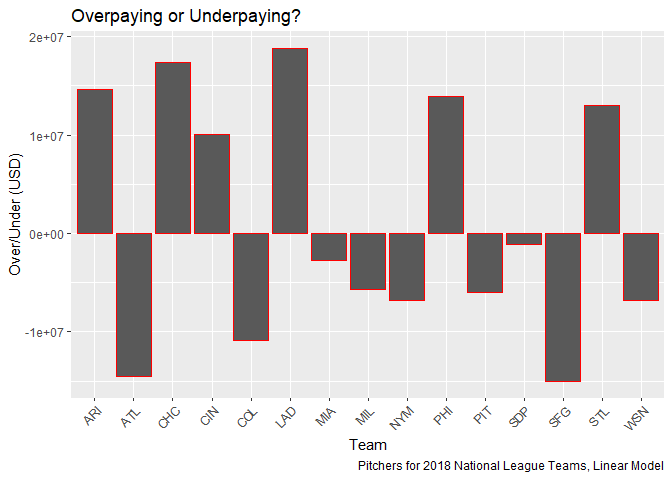
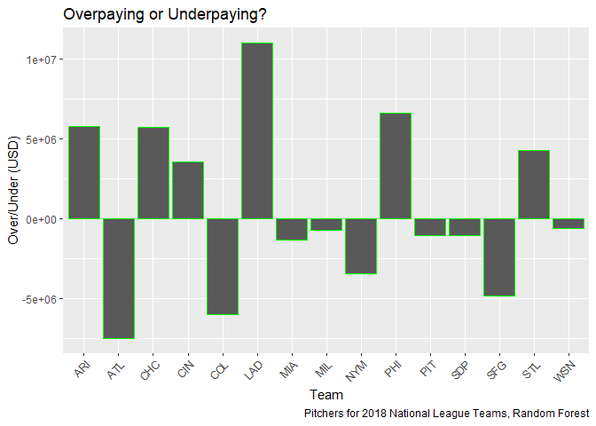

Final Project
================
Wyatt Allen, Elijah Evans, David Ford, Patrick Scovel --
16 May 2019

    ## randomForest 4.6-14

    ## Type rfNews() to see new features/changes/bug fixes.

    ## Registered S3 methods overwritten by 'ggplot2':
    ##   method         from 
    ##   [.quosures     rlang
    ##   c.quosures     rlang
    ##   print.quosures rlang

    ## 
    ## Attaching package: 'ggplot2'

    ## The following object is masked from 'package:randomForest':
    ## 
    ##     margin

    ## 
    ## Call:
    ## lm(formula = Salary ~ Age + AtBats + Runs + Hits + HomeRuns + 
    ##     StrikeOuts + Doubles + Triples + BattingAvg + StolenBases + 
    ##     BasesWalked, data = baseball)
    ## 
    ## Residuals:
    ##      Min       1Q   Median       3Q      Max 
    ## -9265753 -2591035  -599727  1569730 24617573 
    ## 
    ## Coefficients:
    ##              Estimate Std. Error t value Pr(>|t|)    
    ## (Intercept) -20533580    2771450  -7.409 2.12e-13 ***
    ## Age            634969      29466  21.550  < 2e-16 ***
    ## AtBats          10198       7351   1.387 0.165573    
    ## Runs             1036      16472   0.063 0.949873    
    ## Hits           -13832      27990  -0.494 0.621259    
    ## HomeRuns       106770      22611   4.722 2.56e-06 ***
    ## StrikeOuts     -19039       5642  -3.374 0.000759 ***
    ## Doubles         20878      23718   0.880 0.378850    
    ## Triples       -119399      57142  -2.089 0.036833 *  
    ## BattingAvg    9314434   10304796   0.904 0.366198    
    ## StolenBases     -6356      16721  -0.380 0.703922    
    ## BasesWalked     46334       8495   5.454 5.76e-08 ***
    ## ---
    ## Signif. codes:  0 '***' 0.001 '**' 0.01 '*' 0.05 '.' 0.1 ' ' 1
    ## 
    ## Residual standard error: 4239000 on 1488 degrees of freedom
    ## Multiple R-squared:  0.3887, Adjusted R-squared:  0.3842 
    ## F-statistic: 86.02 on 11 and 1488 DF,  p-value: < 2.2e-16

    ## Start:  AIC=45791.3
    ## Salary ~ Age + AtBats + Runs + Hits + HomeRuns + StrikeOuts + 
    ##     Doubles + Triples + BattingAvg + StolenBases + BasesWalked
    ## 
    ##                           Df  Sum of Sq        RSS   AIC
    ## + Age:HomeRuns             1 2.5307e+15 2.4204e+16 45644
    ## + Age:Doubles              1 1.8653e+15 2.4870e+16 45685
    ## + Age:AtBats               1 1.7883e+15 2.4947e+16 45689
    ## + Age:StrikeOuts           1 1.7842e+15 2.4951e+16 45690
    ## + Age:Runs                 1 1.7659e+15 2.4969e+16 45691
    ## + Age:Hits                 1 1.6721e+15 2.5063e+16 45696
    ## + Age:BasesWalked          1 1.5550e+15 2.5180e+16 45703
    ## + SacHit                   1 7.7576e+14 2.5959e+16 45749
    ## + Doubles:Triples          1 3.0531e+14 2.6430e+16 45776
    ## + IntBasesOnBalls          1 2.6171e+14 2.6473e+16 45779
    ## + HomeRuns:StrikeOuts      1 2.6090e+14 2.6474e+16 45779
    ## + Runs:StrikeOuts          1 2.3832e+14 2.6497e+16 45780
    ## + StrikeOuts:StolenBases   1 2.0586e+14 2.6529e+16 45782
    ## + Age:BattingAvg           1 1.9998e+14 2.6535e+16 45782
    ## + Runs:Triples             1 1.8522e+14 2.6550e+16 45783
    ## + Triples:BasesWalked      1 1.7700e+14 2.6558e+16 45783
    ## + AtBats:Triples           1 1.7228e+14 2.6563e+16 45784
    ## + Hits:Triples             1 1.7040e+14 2.6565e+16 45784
    ## + Runs:StolenBases         1 1.6462e+14 2.6570e+16 45784
    ## + StolenBases:BasesWalked  1 1.6303e+14 2.6572e+16 45784
    ## + AtBats:StolenBases       1 1.5305e+14 2.6582e+16 45785
    ## + HomeRuns:Triples         1 1.5190e+14 2.6583e+16 45785
    ## + HomeRuns:StolenBases     1 1.4713e+14 2.6588e+16 45785
    ## + StrikeOuts:Triples       1 1.3820e+14 2.6597e+16 45786
    ## + Hits:StolenBases         1 1.2894e+14 2.6606e+16 45786
    ## + Doubles:StolenBases      1 1.2597e+14 2.6609e+16 45786
    ## + GroundDouble             1 1.1208e+14 2.6623e+16 45787
    ## + StrikeOuts:Doubles       1 1.0596e+14 2.6629e+16 45787
    ## + Hits:StrikeOuts          1 9.1456e+13 2.6644e+16 45788
    ## + Doubles:BattingAvg       1 8.5538e+13 2.6649e+16 45788
    ## + Runs:Doubles             1 8.2523e+13 2.6652e+16 45789
    ## + StrikeOuts:BasesWalked   1 7.9526e+13 2.6655e+16 45789
    ## + StrikeOuts:BattingAvg    1 7.8211e+13 2.6657e+16 45789
    ## + Hits:BattingAvg          1 7.7274e+13 2.6658e+16 45789
    ## + AtBats:Runs              1 7.6092e+13 2.6659e+16 45789
    ## + Age:StolenBases          1 7.5439e+13 2.6660e+16 45789
    ## + Runs:Hits                1 7.1241e+13 2.6664e+16 45789
    ## - Runs                     1 7.1033e+10 2.6735e+16 45789
    ## - StolenBases              1 2.5959e+12 2.6738e+16 45789
    ## + Runs:HomeRuns            1 6.8520e+13 2.6666e+16 45789
    ## + HitByPitch               1 6.6981e+13 2.6668e+16 45790
    ## - Hits                     1 4.3876e+12 2.6739e+16 45790
    ## + OnBasePerc               1 6.6095e+13 2.6669e+16 45790
    ## + Caught                   1 6.2352e+13 2.6673e+16 45790
    ## - Doubles                  1 1.3923e+13 2.6749e+16 45790
    ## - BattingAvg               1 1.4680e+13 2.6750e+16 45790
    ## + BattingAvg:BasesWalked   1 5.5254e+13 2.6680e+16 45790
    ## + AtBats:StrikeOuts        1 4.9742e+13 2.6685e+16 45791
    ## + SluggPerc                1 4.4827e+13 2.6690e+16 45791
    ## - AtBats                   1 3.4577e+13 2.6770e+16 45791
    ## <none>                                  2.6735e+16 45791
    ## + HomeRuns:Doubles         1 3.5423e+13 2.6700e+16 45791
    ## + Triples:BattingAvg       1 2.7976e+13 2.6707e+16 45792
    ## + AtBats:Doubles           1 2.3345e+13 2.6712e+16 45792
    ## + Runs:BattingAvg          1 2.2758e+13 2.6712e+16 45792
    ## + AtBats:HomeRuns          1 2.1873e+13 2.6713e+16 45792
    ## + Age:Triples              1 1.9075e+13 2.6716e+16 45792
    ## + SacFlies                 1 1.7774e+13 2.6717e+16 45792
    ## + HomeRuns:BasesWalked     1 1.7451e+13 2.6718e+16 45792
    ## + OnBaseSluggPercNorm      1 1.5770e+13 2.6719e+16 45792
    ## + Hits:HomeRuns            1 1.3014e+13 2.6722e+16 45793
    ## + Hits:Doubles             1 1.0426e+13 2.6725e+16 45793
    ## + Doubles:BasesWalked      1 1.0203e+13 2.6725e+16 45793
    ## + HomeRuns:BattingAvg      1 1.0181e+13 2.6725e+16 45793
    ## + AtBats:Hits              1 9.4964e+12 2.6726e+16 45793
    ## + Runs:BasesWalked         1 6.5509e+12 2.6728e+16 45793
    ## + BattingAvg:StolenBases   1 3.0287e+12 2.6732e+16 45793
    ## + OnBaseSluggPerc          1 2.8045e+12 2.6732e+16 45793
    ## + AtBats:BattingAvg        1 2.3142e+12 2.6733e+16 45793
    ## + Hits:BasesWalked         1 1.6352e+12 2.6733e+16 45793
    ## + Triples:StolenBases      1 3.2764e+10 2.6735e+16 45793
    ## + AtBats:BasesWalked       1 1.2417e+10 2.6735e+16 45793
    ## - Triples                  1 7.8444e+13 2.6813e+16 45794
    ## - StrikeOuts               1 2.0460e+14 2.6940e+16 45801
    ## - HomeRuns                 1 4.0061e+14 2.7136e+16 45812
    ## - BasesWalked              1 5.3445e+14 2.7269e+16 45819
    ## - Age                      1 8.3436e+15 3.5079e+16 46197
    ## 
    ## Step:  AIC=45644.13
    ## Salary ~ Age + AtBats + Runs + Hits + HomeRuns + StrikeOuts + 
    ##     Doubles + Triples + BattingAvg + StolenBases + BasesWalked + 
    ##     Age:HomeRuns
    ## 
    ##                           Df  Sum of Sq        RSS   AIC
    ## + SacHit                   1 6.8246e+14 2.3522e+16 45603
    ## + IntBasesOnBalls          1 2.3752e+14 2.3967e+16 45631
    ## + Age:Doubles              1 2.2216e+14 2.3982e+16 45632
    ## + Age:AtBats               1 1.8674e+14 2.4018e+16 45635
    ## + Age:Hits                 1 1.6781e+14 2.4036e+16 45636
    ## + Doubles:Triples          1 1.5417e+14 2.4050e+16 45637
    ## + GroundDouble             1 1.1284e+14 2.4091e+16 45639
    ## + Age:BasesWalked          1 9.6814e+13 2.4107e+16 45640
    ## + StrikeOuts:StolenBases   1 8.8287e+13 2.4116e+16 45641
    ## + AtBats:StolenBases       1 8.5364e+13 2.4119e+16 45641
    ## + Triples:BasesWalked      1 8.2194e+13 2.4122e+16 45641
    ## + Runs:StolenBases         1 7.9586e+13 2.4125e+16 45641
    ## + StolenBases:BasesWalked  1 7.6916e+13 2.4127e+16 45641
    ## + Runs:StrikeOuts          1 7.0738e+13 2.4134e+16 45642
    ## + Runs:Triples             1 7.0502e+13 2.4134e+16 45642
    ## + Hits:StolenBases         1 7.0312e+13 2.4134e+16 45642
    ## + Hits:Triples             1 6.8515e+13 2.4136e+16 45642
    ## + HitByPitch               1 6.7473e+13 2.4137e+16 45642
    ## + AtBats:Triples           1 6.6089e+13 2.4138e+16 45642
    ## + Doubles:BattingAvg       1 6.4794e+13 2.4139e+16 45642
    ## - Hits                     1 3.0726e+11 2.4205e+16 45642
    ## - StolenBases              1 1.2293e+12 2.4206e+16 45642
    ## - Runs                     1 1.7363e+12 2.4206e+16 45642
    ## - Doubles                  1 3.6342e+12 2.4208e+16 45642
    ## - BattingAvg               1 5.5798e+12 2.4210e+16 45642
    ## - AtBats                   1 6.8161e+12 2.4211e+16 45643
    ## + OnBasePerc               1 5.7005e+13 2.4147e+16 45643
    ## + BattingAvg:BasesWalked   1 5.6712e+13 2.4148e+16 45643
    ## + Age:StrikeOuts           1 5.4023e+13 2.4150e+16 45643
    ## + Age:Runs                 1 5.2729e+13 2.4152e+16 45643
    ## + StrikeOuts:Triples       1 5.2283e+13 2.4152e+16 45643
    ## + Runs:Doubles             1 5.2073e+13 2.4152e+16 45643
    ## + Hits:BattingAvg          1 5.0900e+13 2.4153e+16 45643
    ## + Doubles:StolenBases      1 4.9855e+13 2.4154e+16 45643
    ## + HomeRuns:StrikeOuts      1 4.9496e+13 2.4155e+16 45643
    ## + AtBats:Runs              1 4.6521e+13 2.4158e+16 45643
    ## + Runs:BattingAvg          1 3.9111e+13 2.4165e+16 45644
    ## + Runs:Hits                1 3.8674e+13 2.4166e+16 45644
    ## + Age:StolenBases          1 3.6318e+13 2.4168e+16 45644
    ## <none>                                  2.4204e+16 45644
    ## + Caught                   1 3.1532e+13 2.4173e+16 45644
    ## + HomeRuns:BattingAvg      1 2.8752e+13 2.4176e+16 45644
    ## + StrikeOuts:Doubles       1 2.7138e+13 2.4177e+16 45644
    ## + HomeRuns:StolenBases     1 2.6138e+13 2.4178e+16 45645
    ## + StrikeOuts:BasesWalked   1 2.5975e+13 2.4178e+16 45645
    ## + SacFlies                 1 2.3101e+13 2.4181e+16 45645
    ## + StrikeOuts:BattingAvg    1 2.0635e+13 2.4184e+16 45645
    ## + Hits:StrikeOuts          1 2.0219e+13 2.4184e+16 45645
    ## + AtBats:Doubles           1 1.9099e+13 2.4185e+16 45645
    ## + HomeRuns:Triples         1 1.8154e+13 2.4186e+16 45645
    ## + Age:BattingAvg           1 1.2546e+13 2.4192e+16 45645
    ## + Triples:BattingAvg       1 1.2226e+13 2.4192e+16 45645
    ## + SluggPerc                1 9.7070e+12 2.4195e+16 45646
    ## + AtBats:StrikeOuts        1 9.5643e+12 2.4195e+16 45646
    ## + Runs:HomeRuns            1 9.2789e+12 2.4195e+16 45646
    ## + Hits:Doubles             1 8.6214e+12 2.4196e+16 45646
    ## + HomeRuns:Doubles         1 8.5873e+12 2.4196e+16 45646
    ## + OnBaseSluggPercNorm      1 7.6336e+12 2.4197e+16 45646
    ## + HomeRuns:BasesWalked     1 7.1714e+12 2.4197e+16 45646
    ## + AtBats:Hits              1 6.7349e+12 2.4198e+16 45646
    ## + Doubles:BasesWalked      1 6.4162e+12 2.4198e+16 45646
    ## + Runs:BasesWalked         1 6.1233e+12 2.4198e+16 45646
    ## + AtBats:HomeRuns          1 3.4625e+12 2.4201e+16 45646
    ## + AtBats:BattingAvg        1 1.5513e+12 2.4203e+16 45646
    ## + Hits:BasesWalked         1 1.2687e+12 2.4203e+16 45646
    ## + OnBaseSluggPerc          1 8.9490e+11 2.4203e+16 45646
    ## + BattingAvg:StolenBases   1 3.0665e+11 2.4204e+16 45646
    ## + AtBats:BasesWalked       1 1.7802e+11 2.4204e+16 45646
    ## + Hits:HomeRuns            1 1.4550e+11 2.4204e+16 45646
    ## + Triples:StolenBases      1 1.3475e+11 2.4204e+16 45646
    ## + Age:Triples              1 3.3575e+09 2.4204e+16 45646
    ## - Triples                  1 9.5555e+13 2.4300e+16 45648
    ## - StrikeOuts               1 1.4136e+14 2.4346e+16 45651
    ## - BasesWalked              1 5.2339e+14 2.4728e+16 45674
    ## - Age:HomeRuns             1 2.5307e+15 2.6735e+16 45791
    ## 
    ## Step:  AIC=45603.23
    ## Salary ~ Age + AtBats + Runs + Hits + HomeRuns + StrikeOuts + 
    ##     Doubles + Triples + BattingAvg + StolenBases + BasesWalked + 
    ##     SacHit + Age:HomeRuns
    ## 
    ##                           Df  Sum of Sq        RSS   AIC
    ## + IntBasesOnBalls          1 2.9562e+14 2.3226e+16 45586
    ## + Age:AtBats               1 1.9407e+14 2.3328e+16 45593
    ## + Age:Doubles              1 1.9091e+14 2.3331e+16 45593
    ## + Doubles:Triples          1 1.8913e+14 2.3333e+16 45593
    ## + Age:Hits                 1 1.7960e+14 2.3342e+16 45594
    ## + Runs:StolenBases         1 1.5458e+14 2.3367e+16 45595
    ## + Age:SacHit               1 1.4982e+14 2.3372e+16 45596
    ## + AtBats:StolenBases       1 1.4148e+14 2.3380e+16 45596
    ## + Doubles:SacHit           1 1.2828e+14 2.3394e+16 45597
    ## + Hits:StolenBases         1 1.2769e+14 2.3394e+16 45597
    ## + BasesWalked:SacHit       1 1.1554e+14 2.3406e+16 45598
    ## + Hits:Triples             1 1.1351e+14 2.3408e+16 45598
    ## + AtBats:Triples           1 1.0986e+14 2.3412e+16 45598
    ## + StrikeOuts:StolenBases   1 1.0967e+14 2.3412e+16 45598
    ## + Runs:Triples             1 1.0679e+14 2.3415e+16 45598
    ## + HomeRuns:SacHit          1 1.0173e+14 2.3420e+16 45599
    ## + StolenBases:BasesWalked  1 1.0151e+14 2.3420e+16 45599
    ## + Age:BasesWalked          1 1.0132e+14 2.3421e+16 45599
    ## + Hits:SacHit              1 9.2155e+13 2.3430e+16 45599
    ## + Triples:BasesWalked      1 8.9342e+13 2.3432e+16 45600
    ## + BattingAvg:BasesWalked   1 8.7608e+13 2.3434e+16 45600
    ## + Doubles:StolenBases      1 8.3238e+13 2.3439e+16 45600
    ## + Runs:SacHit              1 8.2202e+13 2.3440e+16 45600
    ## + AtBats:SacHit            1 7.9671e+13 2.3442e+16 45600
    ## + GroundDouble             1 7.8774e+13 2.3443e+16 45600
    ## + Doubles:BattingAvg       1 6.8595e+13 2.3453e+16 45601
    ## + OnBasePerc               1 6.8537e+13 2.3453e+16 45601
    ## + StrikeOuts:Triples       1 6.8492e+13 2.3453e+16 45601
    ## + AtBats:Runs              1 6.5929e+13 2.3456e+16 45601
    ## + Runs:StrikeOuts          1 6.1893e+13 2.3460e+16 45601
    ## - Hits                     1 1.5606e+12 2.3523e+16 45601
    ## - Doubles                  1 2.1160e+12 2.3524e+16 45601
    ## + Hits:BattingAvg          1 6.0127e+13 2.3462e+16 45601
    ## - StolenBases              1 2.6129e+12 2.3524e+16 45601
    ## + Age:Runs                 1 5.8551e+13 2.3463e+16 45601
    ## + HitByPitch               1 5.5645e+13 2.3466e+16 45602
    ## + Runs:Hits                1 5.2703e+13 2.3469e+16 45602
    ## + Runs:BattingAvg          1 5.1795e+13 2.3470e+16 45602
    ## + HomeRuns:StolenBases     1 5.1455e+13 2.3470e+16 45602
    ## - BattingAvg               1 1.1260e+13 2.3533e+16 45602
    ## + BattingAvg:SacHit        1 5.1258e+13 2.3471e+16 45602
    ## + Runs:Doubles             1 4.9307e+13 2.3473e+16 45602
    ## + HomeRuns:BattingAvg      1 4.6420e+13 2.3475e+16 45602
    ## + Age:StolenBases          1 4.5919e+13 2.3476e+16 45602
    ## - Runs                     1 1.6957e+13 2.3539e+16 45602
    ## + Age:StrikeOuts           1 4.5505e+13 2.3476e+16 45602
    ## + HomeRuns:Triples         1 4.1953e+13 2.3480e+16 45603
    ## - AtBats                   1 2.8725e+13 2.3551e+16 45603
    ## <none>                                  2.3522e+16 45603
    ## + Triples:SacHit           1 2.7861e+13 2.3494e+16 45603
    ## + AtBats:Doubles           1 2.7727e+13 2.3494e+16 45603
    ## + StrikeOuts:SacHit        1 2.5408e+13 2.3496e+16 45604
    ## + AtBats:Hits              1 2.3497e+13 2.3498e+16 45604
    ## + StrikeOuts:BattingAvg    1 2.3212e+13 2.3499e+16 45604
    ## + Triples:BattingAvg       1 2.1701e+13 2.3500e+16 45604
    ## + Hits:StrikeOuts          1 2.1200e+13 2.3501e+16 45604
    ## + StrikeOuts:BasesWalked   1 1.9782e+13 2.3502e+16 45604
    ## + StrikeOuts:Doubles       1 1.6499e+13 2.3505e+16 45604
    ## + Age:BattingAvg           1 1.5516e+13 2.3506e+16 45604
    ## + Hits:Doubles             1 1.4073e+13 2.3508e+16 45604
    ## + HomeRuns:StrikeOuts      1 1.1520e+13 2.3510e+16 45604
    ## + OnBaseSluggPerc          1 1.0818e+13 2.3511e+16 45605
    ## + Doubles:BasesWalked      1 1.0067e+13 2.3512e+16 45605
    ## + SacFlies                 1 9.9120e+12 2.3512e+16 45605
    ## + AtBats:StrikeOuts        1 8.9575e+12 2.3513e+16 45605
    ## + BattingAvg:StolenBases   1 6.2203e+12 2.3516e+16 45605
    ## + Caught                   1 5.8783e+12 2.3516e+16 45605
    ## + Triples:StolenBases      1 4.6468e+12 2.3517e+16 45605
    ## + Hits:HomeRuns            1 3.2194e+12 2.3519e+16 45605
    ## + Hits:BasesWalked         1 2.7020e+12 2.3519e+16 45605
    ## + StolenBases:SacHit       1 2.1053e+12 2.3520e+16 45605
    ## + Runs:BasesWalked         1 2.0755e+12 2.3520e+16 45605
    ## + SluggPerc                1 3.3417e+11 2.3521e+16 45605
    ## + AtBats:BasesWalked       1 3.1603e+11 2.3522e+16 45605
    ## + HomeRuns:Doubles         1 1.9149e+11 2.3522e+16 45605
    ## + HomeRuns:BasesWalked     1 8.0176e+10 2.3522e+16 45605
    ## + OnBaseSluggPercNorm      1 7.7141e+10 2.3522e+16 45605
    ## + AtBats:BattingAvg        1 5.7398e+10 2.3522e+16 45605
    ## + Runs:HomeRuns            1 3.8341e+10 2.3522e+16 45605
    ## + AtBats:HomeRuns          1 8.0656e+09 2.3522e+16 45605
    ## + Age:Triples              1 2.7666e+08 2.3522e+16 45605
    ## - Triples                  1 6.9338e+13 2.3591e+16 45606
    ## - StrikeOuts               1 1.9790e+14 2.3720e+16 45614
    ## - BasesWalked              1 4.8014e+14 2.4002e+16 45632
    ## - SacHit                   1 6.8246e+14 2.4204e+16 45644
    ## - Age:HomeRuns             1 2.4374e+15 2.5959e+16 45749
    ## 
    ## Step:  AIC=45586.26
    ## Salary ~ Age + AtBats + Runs + Hits + HomeRuns + StrikeOuts + 
    ##     Doubles + Triples + BattingAvg + StolenBases + BasesWalked + 
    ##     SacHit + IntBasesOnBalls + Age:HomeRuns
    ## 
    ##                               Df  Sum of Sq        RSS   AIC
    ## + Age:AtBats                   1 2.2512e+14 2.3001e+16 45574
    ## + Age:Doubles                  1 2.0494e+14 2.3021e+16 45575
    ## + Age:Hits                     1 2.0476e+14 2.3021e+16 45575
    ## + SacHit:IntBasesOnBalls       1 1.5841e+14 2.3068e+16 45578
    ## + Doubles:Triples              1 1.5392e+14 2.3072e+16 45578
    ## + Runs:StolenBases             1 1.5372e+14 2.3072e+16 45578
    ## + AtBats:StolenBases           1 1.2847e+14 2.3098e+16 45580
    ## + Age:SacHit                   1 1.2771e+14 2.3098e+16 45580
    ## + Hits:StolenBases             1 1.2164e+14 2.3105e+16 45580
    ## + Age:BasesWalked              1 1.1800e+14 2.3108e+16 45581
    ## + Doubles:SacHit               1 1.0529e+14 2.3121e+16 45581
    ## + StrikeOuts:StolenBases       1 1.0528e+14 2.3121e+16 45581
    ## + StolenBases:BasesWalked      1 1.0232e+14 2.3124e+16 45582
    ## + HomeRuns:SacHit              1 9.2851e+13 2.3133e+16 45582
    ## + Hits:Triples                 1 8.9504e+13 2.3137e+16 45582
    ## + AtBats:Triples               1 8.7322e+13 2.3139e+16 45583
    ## + Runs:Triples                 1 7.7759e+13 2.3148e+16 45583
    ## + Doubles:StolenBases          1 7.6085e+13 2.3150e+16 45583
    ## + BasesWalked:SacHit           1 7.5217e+13 2.3151e+16 45583
    ## + GroundDouble                 1 7.4809e+13 2.3151e+16 45583
    ## + Age:Runs                     1 7.0219e+13 2.3156e+16 45584
    ## + Hits:SacHit                  1 6.7686e+13 2.3159e+16 45584
    ## + AtBats:Runs                  1 6.7569e+13 2.3159e+16 45584
    ## + AtBats:SacHit                1 6.7395e+13 2.3159e+16 45584
    ## + Runs:Hits                    1 6.6487e+13 2.3160e+16 45584
    ## + Runs:Doubles                 1 6.4784e+13 2.3161e+16 45584
    ## + Runs:StrikeOuts              1 6.2123e+13 2.3164e+16 45584
    ## + HomeRuns:StolenBases         1 6.0912e+13 2.3165e+16 45584
    ## - StolenBases                  1 1.9802e+12 2.3228e+16 45584
    ## + StrikeOuts:Triples           1 5.9812e+13 2.3166e+16 45584
    ## + Doubles:IntBasesOnBalls      1 5.9018e+13 2.3167e+16 45584
    ## - Doubles                      1 3.4316e+12 2.3230e+16 45584
    ## + Runs:SacHit                  1 5.5519e+13 2.3171e+16 45585
    ## + Age:StrikeOuts               1 5.5383e+13 2.3171e+16 45585
    ## + Age:StolenBases              1 5.0682e+13 2.3176e+16 45585
    ## + HitByPitch                   1 4.9654e+13 2.3177e+16 45585
    ## + Triples:BasesWalked          1 4.6897e+13 2.3179e+16 45585
    ## + Hits:BattingAvg              1 4.6034e+13 2.3180e+16 45585
    ## - Hits                         1 1.7308e+13 2.3244e+16 45585
    ## + BattingAvg:IntBasesOnBalls   1 4.2329e+13 2.3184e+16 45586
    ## + Doubles:BattingAvg           1 4.2038e+13 2.3184e+16 45586
    ## + OnBasePerc                   1 3.8945e+13 2.3187e+16 45586
    ## + Triples:SacHit               1 3.7049e+13 2.3189e+16 45586
    ## - BattingAvg                   1 2.6832e+13 2.3253e+16 45586
    ## + StrikeOuts:SacHit            1 3.4781e+13 2.3191e+16 45586
    ## + BattingAvg:BasesWalked       1 3.4063e+13 2.3192e+16 45586
    ## <none>                                      2.3226e+16 45586
    ## + HomeRuns:Triples             1 2.9588e+13 2.3197e+16 45586
    ## + Age:IntBasesOnBalls          1 2.8896e+13 2.3197e+16 45586
    ## + BattingAvg:SacHit            1 2.6901e+13 2.3199e+16 45587
    ## + StrikeOuts:IntBasesOnBalls   1 2.6769e+13 2.3199e+16 45587
    ## + AtBats:Doubles               1 2.6648e+13 2.3200e+16 45587
    ## + StrikeOuts:BattingAvg        1 2.6244e+13 2.3200e+16 45587
    ## + HomeRuns:BasesWalked         1 2.4094e+13 2.3202e+16 45587
    ## + Hits:StrikeOuts              1 2.3016e+13 2.3203e+16 45587
    ## + StolenBases:IntBasesOnBalls  1 2.2543e+13 2.3204e+16 45587
    ## + StrikeOuts:BasesWalked       1 2.1480e+13 2.3205e+16 45587
    ## + Runs:BattingAvg              1 2.0608e+13 2.3206e+16 45587
    ## + AtBats:Hits                  1 2.0207e+13 2.3206e+16 45587
    ## + Runs:BasesWalked             1 1.8119e+13 2.3208e+16 45587
    ## + Hits:Doubles                 1 1.8016e+13 2.3208e+16 45587
    ## + Hits:IntBasesOnBalls         1 1.7237e+13 2.3209e+16 45587
    ## + Age:BattingAvg               1 1.7052e+13 2.3209e+16 45587
    ## + Runs:HomeRuns                1 1.6565e+13 2.3210e+16 45587
    ## + StrikeOuts:Doubles           1 1.5963e+13 2.3210e+16 45587
    ## + HomeRuns:StrikeOuts          1 1.5932e+13 2.3210e+16 45587
    ## + Triples:BattingAvg           1 1.5307e+13 2.3211e+16 45587
    ## + Triples:IntBasesOnBalls      1 1.3867e+13 2.3212e+16 45587
    ## + AtBats:IntBasesOnBalls       1 1.3378e+13 2.3213e+16 45587
    ## + AtBats:StrikeOuts            1 9.3249e+12 2.3217e+16 45588
    ## + HomeRuns:BattingAvg          1 9.2938e+12 2.3217e+16 45588
    ## + BattingAvg:StolenBases       1 8.7283e+12 2.3217e+16 45588
    ## + Runs:IntBasesOnBalls         1 8.5770e+12 2.3218e+16 45588
    ## + SluggPerc                    1 7.9777e+12 2.3218e+16 45588
    ## + HomeRuns:Doubles             1 7.2723e+12 2.3219e+16 45588
    ## + StolenBases:SacHit           1 5.1907e+12 2.3221e+16 45588
    ## + SacFlies                     1 4.9240e+12 2.3221e+16 45588
    ## + AtBats:HomeRuns              1 4.7931e+12 2.3221e+16 45588
    ## + AtBats:BasesWalked           1 4.6613e+12 2.3222e+16 45588
    ## - AtBats                       1 5.7361e+13 2.3284e+16 45588
    ## + Triples:StolenBases          1 4.3107e+12 2.3222e+16 45588
    ## + OnBaseSluggPercNorm          1 3.2096e+12 2.3223e+16 45588
    ## + Caught                       1 2.7704e+12 2.3223e+16 45588
    ## + Hits:HomeRuns                1 2.5439e+12 2.3224e+16 45588
    ## + Hits:BasesWalked             1 1.2272e+12 2.3225e+16 45588
    ## + AtBats:BattingAvg            1 7.7581e+11 2.3225e+16 45588
    ## + HomeRuns:IntBasesOnBalls     1 6.9455e+11 2.3226e+16 45588
    ## + Doubles:BasesWalked          1 4.8371e+11 2.3226e+16 45588
    ## + OnBaseSluggPerc              1 3.6947e+11 2.3226e+16 45588
    ## + Age:Triples                  1 1.4515e+11 2.3226e+16 45588
    ## + BasesWalked:IntBasesOnBalls  1 7.5037e+09 2.3226e+16 45588
    ## - Runs                         1 6.3604e+13 2.3290e+16 45588
    ## - Triples                      1 7.0373e+13 2.3297e+16 45589
    ## - BasesWalked                  1 1.2431e+14 2.3351e+16 45592
    ## - StrikeOuts                   1 1.3037e+14 2.3357e+16 45593
    ## - IntBasesOnBalls              1 2.9562e+14 2.3522e+16 45603
    ## - SacHit                       1 7.4056e+14 2.3967e+16 45631
    ## - Age:HomeRuns                 1 2.4069e+15 2.5633e+16 45732
    ## 
    ## Step:  AIC=45573.65
    ## Salary ~ Age + AtBats + Runs + Hits + HomeRuns + StrikeOuts + 
    ##     Doubles + Triples + BattingAvg + StolenBases + BasesWalked + 
    ##     SacHit + IntBasesOnBalls + Age:HomeRuns + Age:AtBats
    ## 
    ##                               Df  Sum of Sq        RSS   AIC
    ## + Age:SacHit                   1 2.6520e+14 2.2736e+16 45558
    ## + SacHit:IntBasesOnBalls       1 1.3904e+14 2.2862e+16 45567
    ## + Runs:StolenBases             1 1.2466e+14 2.2876e+16 45567
    ## + Doubles:Triples              1 1.1318e+14 2.2888e+16 45568
    ## + StolenBases:BasesWalked      1 9.4879e+13 2.2906e+16 45569
    ## + AtBats:StolenBases           1 8.4635e+13 2.2916e+16 45570
    ## + Doubles:SacHit               1 8.4211e+13 2.2917e+16 45570
    ## + Hits:StolenBases             1 8.2526e+13 2.2919e+16 45570
    ## + BasesWalked:SacHit           1 8.1508e+13 2.2920e+16 45570
    ## + StrikeOuts:StolenBases       1 7.6609e+13 2.2924e+16 45571
    ## + GroundDouble                 1 7.6153e+13 2.2925e+16 45571
    ## + HomeRuns:SacHit              1 7.3202e+13 2.2928e+16 45571
    ## + HomeRuns:StolenBases         1 6.4170e+13 2.2937e+16 45571
    ## - Doubles                      1 1.3650e+12 2.3002e+16 45572
    ## + Hits:SacHit                  1 5.7986e+13 2.2943e+16 45572
    ## + AtBats:SacHit                1 5.5691e+13 2.2945e+16 45572
    ## + Doubles:StolenBases          1 5.3292e+13 2.2948e+16 45572
    ## - StolenBases                  1 8.1524e+12 2.3009e+16 45572
    ## + Runs:Doubles                 1 5.3060e+13 2.2948e+16 45572
    ## + Runs:Triples                 1 5.0974e+13 2.2950e+16 45572
    ## + Runs:SacHit                  1 4.8775e+13 2.2952e+16 45572
    ## + HitByPitch                   1 4.7449e+13 2.2954e+16 45573
    ## + Age:Triples                  1 4.7063e+13 2.2954e+16 45573
    ## + Hits:Triples                 1 4.6864e+13 2.2954e+16 45573
    ## + Triples:SacHit               1 4.6410e+13 2.2955e+16 45573
    ## - Hits                         1 1.5295e+13 2.3016e+16 45573
    ## + AtBats:Runs                  1 4.5184e+13 2.2956e+16 45573
    ## + Runs:Hits                    1 4.3577e+13 2.2958e+16 45573
    ## + Hits:BattingAvg              1 4.2637e+13 2.2958e+16 45573
    ## + Runs:StrikeOuts              1 4.2576e+13 2.2959e+16 45573
    ## + Doubles:IntBasesOnBalls      1 4.1831e+13 2.2959e+16 45573
    ## + Doubles:BattingAvg           1 4.1040e+13 2.2960e+16 45573
    ## + AtBats:Triples               1 4.0126e+13 2.2961e+16 45573
    ## + Age:Runs                     1 3.9237e+13 2.2962e+16 45573
    ## + Triples:BasesWalked          1 3.9222e+13 2.2962e+16 45573
    ## - BattingAvg                   1 2.3789e+13 2.3025e+16 45573
    ## + BattingAvg:IntBasesOnBalls   1 3.6646e+13 2.2964e+16 45573
    ## + BattingAvg:BasesWalked       1 3.4632e+13 2.2966e+16 45573
    ## + StrikeOuts:Triples           1 3.2874e+13 2.2968e+16 45574
    ## <none>                                      2.3001e+16 45574
    ## + HomeRuns:Triples             1 3.0117e+13 2.2971e+16 45574
    ## + BattingAvg:SacHit            1 2.8518e+13 2.2973e+16 45574
    ## + Age:BasesWalked              1 2.8089e+13 2.2973e+16 45574
    ## + OnBasePerc                   1 2.6932e+13 2.2974e+16 45574
    ## + Runs:BattingAvg              1 2.6005e+13 2.2975e+16 45574
    ## + StolenBases:IntBasesOnBalls  1 2.5210e+13 2.2976e+16 45574
    ## + HomeRuns:StrikeOuts          1 2.4014e+13 2.2977e+16 45574
    ## + AtBats:Doubles               1 2.3979e+13 2.2977e+16 45574
    ## + Age:Doubles                  1 2.2907e+13 2.2978e+16 45574
    ## + HomeRuns:BasesWalked         1 2.2046e+13 2.2979e+16 45574
    ## + StrikeOuts:BattingAvg        1 1.9488e+13 2.2982e+16 45574
    ## + StrikeOuts:BasesWalked       1 1.9141e+13 2.2982e+16 45574
    ## + Age:IntBasesOnBalls          1 1.8493e+13 2.2983e+16 45574
    ## + StrikeOuts:SacHit            1 1.7445e+13 2.2984e+16 45575
    ## + Triples:IntBasesOnBalls      1 1.6569e+13 2.2985e+16 45575
    ## + Hits:Doubles                 1 1.6282e+13 2.2985e+16 45575
    ## + Runs:BasesWalked             1 1.5951e+13 2.2985e+16 45575
    ## + StrikeOuts:IntBasesOnBalls   1 1.5938e+13 2.2985e+16 45575
    ## + Runs:HomeRuns                1 1.5803e+13 2.2985e+16 45575
    ## + Triples:BattingAvg           1 1.3277e+13 2.2988e+16 45575
    ## + HomeRuns:BattingAvg          1 1.0329e+13 2.2991e+16 45575
    ## + Hits:IntBasesOnBalls         1 9.9302e+12 2.2991e+16 45575
    ## - Runs                         1 5.1589e+13 2.3053e+16 45575
    ## + AtBats:Hits                  1 9.7086e+12 2.2991e+16 45575
    ## + StrikeOuts:Doubles           1 8.4921e+12 2.2993e+16 45575
    ## + HomeRuns:Doubles             1 8.4464e+12 2.2993e+16 45575
    ## - Triples                      1 5.3057e+13 2.3054e+16 45575
    ## + Hits:StrikeOuts              1 8.2754e+12 2.2993e+16 45575
    ## + SluggPerc                    1 8.2079e+12 2.2993e+16 45575
    ## + StolenBases:SacHit           1 6.5195e+12 2.2995e+16 45575
    ## + AtBats:IntBasesOnBalls       1 6.3668e+12 2.2995e+16 45575
    ## + BattingAvg:StolenBases       1 6.3360e+12 2.2995e+16 45575
    ## + AtBats:BasesWalked           1 5.8302e+12 2.2995e+16 45575
    ## + Runs:IntBasesOnBalls         1 5.0360e+12 2.2996e+16 45575
    ## + OnBaseSluggPercNorm          1 4.2983e+12 2.2997e+16 45575
    ## + AtBats:HomeRuns              1 3.9744e+12 2.2997e+16 45575
    ## + SacFlies                     1 3.8373e+12 2.2997e+16 45575
    ## + Hits:HomeRuns                1 1.8001e+12 2.2999e+16 45576
    ## + Hits:BasesWalked             1 1.6246e+12 2.2999e+16 45576
    ## + AtBats:StrikeOuts            1 1.4183e+12 2.3000e+16 45576
    ## + Triples:StolenBases          1 9.9857e+11 2.3000e+16 45576
    ## + Age:StrikeOuts               1 9.7639e+11 2.3000e+16 45576
    ## + Age:StolenBases              1 6.7023e+11 2.3000e+16 45576
    ## + AtBats:BattingAvg            1 5.2341e+11 2.3001e+16 45576
    ## + Caught                       1 4.8463e+11 2.3001e+16 45576
    ## + Age:Hits                     1 2.6282e+11 2.3001e+16 45576
    ## + Doubles:BasesWalked          1 2.0627e+11 2.3001e+16 45576
    ## + BasesWalked:IntBasesOnBalls  1 1.1695e+11 2.3001e+16 45576
    ## + HomeRuns:IntBasesOnBalls     1 5.4284e+10 2.3001e+16 45576
    ## + OnBaseSluggPerc              1 1.0684e+10 2.3001e+16 45576
    ## + Age:BattingAvg               1 2.5431e+09 2.3001e+16 45576
    ## - StrikeOuts                   1 1.0491e+14 2.3106e+16 45578
    ## - BasesWalked                  1 1.0984e+14 2.3111e+16 45579
    ## - Age:AtBats                   1 2.2512e+14 2.3226e+16 45586
    ## - IntBasesOnBalls              1 3.2667e+14 2.3328e+16 45593
    ## - SacHit                       1 7.5205e+14 2.3753e+16 45620
    ## - Age:HomeRuns                 1 8.1858e+14 2.3820e+16 45624
    ## 
    ## Step:  AIC=45558.25
    ## Salary ~ Age + AtBats + Runs + Hits + HomeRuns + StrikeOuts + 
    ##     Doubles + Triples + BattingAvg + StolenBases + BasesWalked + 
    ##     SacHit + IntBasesOnBalls + Age:HomeRuns + Age:AtBats + Age:SacHit
    ## 
    ##                               Df  Sum of Sq        RSS   AIC
    ## + SacHit:IntBasesOnBalls       1 1.8891e+14 2.2547e+16 45548
    ## + HomeRuns:SacHit              1 1.4249e+14 2.2593e+16 45551
    ## + Doubles:SacHit               1 1.4212e+14 2.2594e+16 45551
    ## + Runs:StolenBases             1 1.1718e+14 2.2619e+16 45552
    ## + StrikeOuts:StolenBases       1 1.0720e+14 2.2629e+16 45553
    ## + Doubles:Triples              1 1.0098e+14 2.2635e+16 45554
    ## + StrikeOuts:SacHit            1 9.8992e+13 2.2637e+16 45554
    ## + StolenBases:BasesWalked      1 8.7441e+13 2.2648e+16 45554
    ## + AtBats:StolenBases           1 8.1028e+13 2.2655e+16 45555
    ## + Hits:StolenBases             1 7.0694e+13 2.2665e+16 45556
    ## + GroundDouble                 1 6.6892e+13 2.2669e+16 45556
    ## + BasesWalked:SacHit           1 6.5161e+13 2.2671e+16 45556
    ## + HomeRuns:StolenBases         1 6.4853e+13 2.2671e+16 45556
    ## + AtBats:SacHit                1 6.1268e+13 2.2675e+16 45556
    ## - Doubles                      1 5.1408e+12 2.2741e+16 45557
    ## - StolenBases                  1 5.8867e+12 2.2742e+16 45557
    ## + Runs:SacHit                  1 5.3602e+13 2.2682e+16 45557
    ## + Hits:SacHit                  1 5.1206e+13 2.2685e+16 45557
    ## + Doubles:StolenBases          1 5.0986e+13 2.2685e+16 45557
    ## - Hits                         1 1.2622e+13 2.2749e+16 45557
    ## + Hits:BattingAvg              1 4.7013e+13 2.2689e+16 45557
    ## + Doubles:IntBasesOnBalls      1 4.6422e+13 2.2689e+16 45557
    ## + Runs:Doubles                 1 4.4406e+13 2.2691e+16 45557
    ## + HitByPitch                   1 4.3859e+13 2.2692e+16 45557
    ## + Runs:Triples                 1 4.3762e+13 2.2692e+16 45557
    ## + Runs:StrikeOuts              1 4.2966e+13 2.2693e+16 45557
    ## + StrikeOuts:Triples           1 4.0128e+13 2.2696e+16 45558
    ## - BattingAvg                   1 2.1610e+13 2.2757e+16 45558
    ## + AtBats:Runs                  1 3.8500e+13 2.2697e+16 45558
    ## + BattingAvg:IntBasesOnBalls   1 3.6940e+13 2.2699e+16 45558
    ## + Triples:BasesWalked          1 3.6805e+13 2.2699e+16 45558
    ## + BattingAvg:BasesWalked       1 3.6257e+13 2.2700e+16 45558
    ## + Runs:Hits                    1 3.6101e+13 2.2700e+16 45558
    ## + Runs:BattingAvg              1 3.3857e+13 2.2702e+16 45558
    ## + Doubles:BattingAvg           1 3.3159e+13 2.2703e+16 45558
    ## + Hits:Triples                 1 3.2030e+13 2.2704e+16 45558
    ## + Age:BasesWalked              1 3.0651e+13 2.2705e+16 45558
    ## + AtBats:Triples               1 3.0327e+13 2.2706e+16 45558
    ## <none>                                      2.2736e+16 45558
    ## + OnBasePerc                   1 2.5676e+13 2.2710e+16 45559
    ## + HomeRuns:Triples             1 2.3512e+13 2.2712e+16 45559
    ## + StrikeOuts:BattingAvg        1 2.2916e+13 2.2713e+16 45559
    ## + StolenBases:IntBasesOnBalls  1 2.2860e+13 2.2713e+16 45559
    ## + Age:StolenBases              1 2.2834e+13 2.2713e+16 45559
    ## + HomeRuns:BasesWalked         1 2.1892e+13 2.2714e+16 45559
    ## + Age:Triples                  1 2.0602e+13 2.2715e+16 45559
    ## + Age:IntBasesOnBalls          1 2.0569e+13 2.2715e+16 45559
    ## + StrikeOuts:BasesWalked       1 1.9477e+13 2.2716e+16 45559
    ## + AtBats:Doubles               1 1.8430e+13 2.2717e+16 45559
    ## + HomeRuns:StrikeOuts          1 1.6910e+13 2.2719e+16 45559
    ## + StrikeOuts:IntBasesOnBalls   1 1.6637e+13 2.2719e+16 45559
    ## + Triples:SacHit               1 1.5916e+13 2.2720e+16 45559
    ## + Runs:HomeRuns                1 1.5690e+13 2.2720e+16 45559
    ## + Triples:IntBasesOnBalls      1 1.4814e+13 2.2721e+16 45559
    ## + Hits:Doubles                 1 1.3764e+13 2.2722e+16 45559
    ## + Runs:BasesWalked             1 1.2397e+13 2.2723e+16 45559
    ## + Hits:IntBasesOnBalls         1 1.1096e+13 2.2725e+16 45560
    ## + Age:Runs                     1 1.0683e+13 2.2725e+16 45560
    ## + BattingAvg:SacHit            1 9.9194e+12 2.2726e+16 45560
    ## - Runs                         1 5.2479e+13 2.2788e+16 45560
    ## + SluggPerc                    1 7.7512e+12 2.2728e+16 45560
    ## + AtBats:Hits                  1 7.6655e+12 2.2728e+16 45560
    ## + OnBaseSluggPercNorm          1 7.5392e+12 2.2728e+16 45560
    ## + HomeRuns:BattingAvg          1 7.4211e+12 2.2728e+16 45560
    ## + AtBats:IntBasesOnBalls       1 7.1385e+12 2.2729e+16 45560
    ## + Runs:IntBasesOnBalls         1 6.7791e+12 2.2729e+16 45560
    ## + Hits:StrikeOuts              1 6.3924e+12 2.2729e+16 45560
    ## + Triples:BattingAvg           1 4.3645e+12 2.2732e+16 45560
    ## + Age:Doubles                  1 4.0561e+12 2.2732e+16 45560
    ## + HomeRuns:Doubles             1 3.7559e+12 2.2732e+16 45560
    ## + StolenBases:SacHit           1 3.5831e+12 2.2732e+16 45560
    ## + AtBats:BasesWalked           1 3.3567e+12 2.2733e+16 45560
    ## + AtBats:HomeRuns              1 3.1240e+12 2.2733e+16 45560
    ## + Caught                       1 2.5312e+12 2.2733e+16 45560
    ## + SacFlies                     1 2.3198e+12 2.2734e+16 45560
    ## + StrikeOuts:Doubles           1 2.2441e+12 2.2734e+16 45560
    ## + Hits:HomeRuns                1 1.6718e+12 2.2734e+16 45560
    ## - Triples                      1 5.9235e+13 2.2795e+16 45560
    ## + Triples:StolenBases          1 9.6718e+11 2.2735e+16 45560
    ## + Doubles:BasesWalked          1 8.0323e+11 2.2735e+16 45560
    ## + AtBats:StrikeOuts            1 5.2675e+11 2.2735e+16 45560
    ## + BattingAvg:StolenBases       1 5.1878e+11 2.2735e+16 45560
    ## + Hits:BasesWalked             1 5.1706e+11 2.2735e+16 45560
    ## + HomeRuns:IntBasesOnBalls     1 2.4033e+11 2.2736e+16 45560
    ## + Age:StrikeOuts               1 1.6073e+11 2.2736e+16 45560
    ## + Age:Hits                     1 7.5110e+10 2.2736e+16 45560
    ## + OnBaseSluggPerc              1 1.7487e+10 2.2736e+16 45560
    ## + Age:BattingAvg               1 9.4122e+09 2.2736e+16 45560
    ## + AtBats:BattingAvg            1 7.4781e+09 2.2736e+16 45560
    ## + BasesWalked:IntBasesOnBalls  1 4.7756e+09 2.2736e+16 45560
    ## - StrikeOuts                   1 1.1627e+14 2.2852e+16 45564
    ## - BasesWalked                  1 1.2072e+14 2.2857e+16 45564
    ## - Age:SacHit                   1 2.6520e+14 2.3001e+16 45574
    ## - Age:HomeRuns                 1 2.9741e+14 2.3033e+16 45576
    ## - IntBasesOnBalls              1 3.0314e+14 2.3039e+16 45576
    ## - Age:AtBats                   1 3.6261e+14 2.3098e+16 45580
    ## 
    ## Step:  AIC=45547.74
    ## Salary ~ Age + AtBats + Runs + Hits + HomeRuns + StrikeOuts + 
    ##     Doubles + Triples + BattingAvg + StolenBases + BasesWalked + 
    ##     SacHit + IntBasesOnBalls + Age:HomeRuns + Age:AtBats + Age:SacHit + 
    ##     SacHit:IntBasesOnBalls
    ## 
    ##                               Df  Sum of Sq        RSS   AIC
    ## + StrikeOuts:StolenBases       1 1.0009e+14 2.2447e+16 45543
    ## + Runs:StolenBases             1 9.4452e+13 2.2453e+16 45543
    ## + Doubles:SacHit               1 8.6065e+13 2.2461e+16 45544
    ## + StolenBases:BasesWalked      1 7.8550e+13 2.2468e+16 45545
    ## + Doubles:Triples              1 7.1358e+13 2.2476e+16 45545
    ## + HomeRuns:BasesWalked         1 6.8930e+13 2.2478e+16 45545
    ## + GroundDouble                 1 6.3479e+13 2.2483e+16 45546
    ## + HomeRuns:SacHit              1 6.2591e+13 2.2484e+16 45546
    ## + AtBats:StolenBases           1 6.1572e+13 2.2485e+16 45546
    ## + Runs:Doubles                 1 5.9732e+13 2.2487e+16 45546
    ## - StolenBases                  1 1.4016e+12 2.2548e+16 45546
    ## - Doubles                      1 6.1956e+12 2.2553e+16 45546
    ## + HomeRuns:StolenBases         1 5.2164e+13 2.2495e+16 45546
    ## + Hits:StolenBases             1 5.1052e+13 2.2496e+16 45546
    ## + Runs:StrikeOuts              1 5.0061e+13 2.2497e+16 45546
    ## + StrikeOuts:SacHit            1 4.7818e+13 2.2499e+16 45547
    ## + Hits:BattingAvg              1 4.3922e+13 2.2503e+16 45547
    ## + AtBats:Runs                  1 4.2249e+13 2.2505e+16 45547
    ## - Hits                         1 1.9162e+13 2.2566e+16 45547
    ## + StrikeOuts:Triples           1 4.0786e+13 2.2506e+16 45547
    ## + Runs:Hits                    1 4.0242e+13 2.2507e+16 45547
    ## + HitByPitch                   1 3.8071e+13 2.2509e+16 45547
    ## + StrikeOuts:BasesWalked       1 3.7159e+13 2.2510e+16 45547
    ## - BattingAvg                   1 2.5630e+13 2.2573e+16 45547
    ## + Runs:BasesWalked             1 3.4001e+13 2.2513e+16 45547
    ## + Age:BasesWalked              1 3.2917e+13 2.2514e+16 45548
    ## + Runs:HomeRuns                1 3.1595e+13 2.2515e+16 45548
    ## + Runs:BattingAvg              1 3.1170e+13 2.2516e+16 45548
    ## + Doubles:StolenBases          1 3.0864e+13 2.2516e+16 45548
    ## <none>                                      2.2547e+16 45548
    ## + HomeRuns:IntBasesOnBalls     1 2.9792e+13 2.2517e+16 45548
    ## + Age:StolenBases              1 2.8243e+13 2.2519e+16 45548
    ## + Runs:Triples                 1 2.7511e+13 2.2519e+16 45548
    ## + StolenBases:IntBasesOnBalls  1 2.7268e+13 2.2520e+16 45548
    ## + Runs:SacHit                  1 2.6950e+13 2.2520e+16 45548
    ## + Doubles:BattingAvg           1 2.6579e+13 2.2520e+16 45548
    ## + Triples:BasesWalked          1 2.6195e+13 2.2521e+16 45548
    ## + AtBats:Doubles               1 2.6178e+13 2.2521e+16 45548
    ## + BasesWalked:IntBasesOnBalls  1 2.5359e+13 2.2522e+16 45548
    ## + HomeRuns:StrikeOuts          1 2.4484e+13 2.2522e+16 45548
    ## + AtBats:SacHit                1 2.3754e+13 2.2523e+16 45548
    ## + StrikeOuts:BattingAvg        1 2.3437e+13 2.2524e+16 45548
    ## + Hits:Doubles                 1 2.1615e+13 2.2525e+16 45548
    ## + Hits:SacHit                  1 2.1569e+13 2.2525e+16 45548
    ## + AtBats:Triples               1 1.8916e+13 2.2528e+16 45548
    ## + SluggPerc                    1 1.8824e+13 2.2528e+16 45548
    ## + BattingAvg:BasesWalked       1 1.8737e+13 2.2528e+16 45548
    ## + Hits:Triples                 1 1.7359e+13 2.2530e+16 45549
    ## + HomeRuns:Doubles             1 1.7050e+13 2.2530e+16 45549
    ## + Age:Triples                  1 1.5697e+13 2.2531e+16 45549
    ## + HomeRuns:Triples             1 1.4974e+13 2.2532e+16 45549
    ## + OnBaseSluggPercNorm          1 1.2834e+13 2.2534e+16 45549
    ## + AtBats:BasesWalked           1 1.2747e+13 2.2534e+16 45549
    ## + BasesWalked:SacHit           1 1.2638e+13 2.2534e+16 45549
    ## + BattingAvg:SacHit            1 1.0815e+13 2.2536e+16 45549
    ## + OnBasePerc                   1 1.0670e+13 2.2536e+16 45549
    ## + AtBats:HomeRuns              1 1.0603e+13 2.2536e+16 45549
    ## + Hits:StrikeOuts              1 9.9387e+12 2.2537e+16 45549
    ## + AtBats:Hits                  1 9.8709e+12 2.2537e+16 45549
    ## + Age:IntBasesOnBalls          1 9.0381e+12 2.2538e+16 45549
    ## + Hits:HomeRuns                1 8.7037e+12 2.2538e+16 45549
    ## - Runs                         1 5.1497e+13 2.2598e+16 45549
    ## + Age:Runs                     1 8.4129e+12 2.2539e+16 45549
    ## + Hits:BasesWalked             1 7.9569e+12 2.2539e+16 45549
    ## + Triples:SacHit               1 7.5208e+12 2.2539e+16 45549
    ## + StrikeOuts:Doubles           1 6.1410e+12 2.2541e+16 45549
    ## + BattingAvg:IntBasesOnBalls   1 5.3346e+12 2.2542e+16 45549
    ## + Runs:IntBasesOnBalls         1 5.2920e+12 2.2542e+16 45549
    ## + Triples:IntBasesOnBalls      1 5.2521e+12 2.2542e+16 45549
    ## + Caught                       1 5.0197e+12 2.2542e+16 45549
    ## - Triples                      1 5.5343e+13 2.2602e+16 45549
    ## + Doubles:IntBasesOnBalls      1 4.6004e+12 2.2542e+16 45549
    ## + StrikeOuts:IntBasesOnBalls   1 4.1443e+12 2.2543e+16 45549
    ## + OnBaseSluggPerc              1 3.6508e+12 2.2543e+16 45549
    ## + Doubles:BasesWalked          1 2.9316e+12 2.2544e+16 45550
    ## + HomeRuns:BattingAvg          1 2.9087e+12 2.2544e+16 45550
    ## + Age:Doubles                  1 2.8231e+12 2.2544e+16 45550
    ## + SacFlies                     1 2.5968e+12 2.2544e+16 45550
    ## + AtBats:StrikeOuts            1 1.9470e+12 2.2545e+16 45550
    ## + Hits:IntBasesOnBalls         1 4.6566e+11 2.2547e+16 45550
    ## + Triples:BattingAvg           1 4.3609e+11 2.2547e+16 45550
    ## + Triples:StolenBases          1 4.0088e+11 2.2547e+16 45550
    ## + AtBats:IntBasesOnBalls       1 3.3321e+11 2.2547e+16 45550
    ## + Age:StrikeOuts               1 2.9629e+11 2.2547e+16 45550
    ## + BattingAvg:StolenBases       1 7.1285e+10 2.2547e+16 45550
    ## + StolenBases:SacHit           1 2.1738e+10 2.2547e+16 45550
    ## + Age:BattingAvg               1 2.0533e+10 2.2547e+16 45550
    ## + Age:Hits                     1 1.2831e+10 2.2547e+16 45550
    ## + AtBats:BattingAvg            1 1.5154e+09 2.2547e+16 45550
    ## - BasesWalked                  1 9.5637e+13 2.2643e+16 45552
    ## - StrikeOuts                   1 1.0407e+14 2.2651e+16 45553
    ## - SacHit:IntBasesOnBalls       1 1.8891e+14 2.2736e+16 45558
    ## - Age:HomeRuns                 1 2.8952e+14 2.2836e+16 45565
    ## - Age:SacHit                   1 3.1507e+14 2.2862e+16 45567
    ## - Age:AtBats                   1 3.5248e+14 2.2899e+16 45569
    ## 
    ## Step:  AIC=45543.06
    ## Salary ~ Age + AtBats + Runs + Hits + HomeRuns + StrikeOuts + 
    ##     Doubles + Triples + BattingAvg + StolenBases + BasesWalked + 
    ##     SacHit + IntBasesOnBalls + Age:HomeRuns + Age:AtBats + Age:SacHit + 
    ##     SacHit:IntBasesOnBalls + StrikeOuts:StolenBases
    ## 
    ##                               Df  Sum of Sq        RSS   AIC
    ## + HomeRuns:BasesWalked         1 6.8918e+13 2.2378e+16 45540
    ## + GroundDouble                 1 6.6072e+13 2.2381e+16 45541
    ## + Doubles:SacHit               1 6.4810e+13 2.2382e+16 45541
    ## - Doubles                      1 4.1360e+12 2.2451e+16 45541
    ## + Doubles:Triples              1 5.4476e+13 2.2392e+16 45541
    ## - Hits                         1 1.3798e+13 2.2461e+16 45542
    ## + Runs:Doubles                 1 4.1391e+13 2.2405e+16 45542
    ## + HomeRuns:SacHit              1 4.0040e+13 2.2407e+16 45542
    ## - BattingAvg                   1 2.0177e+13 2.2467e+16 45542
    ## + HitByPitch                   1 3.6558e+13 2.2410e+16 45543
    ## + Hits:BattingAvg              1 3.6313e+13 2.2411e+16 45543
    ## + Runs:BattingAvg              1 3.3670e+13 2.2413e+16 45543
    ## + Doubles:BattingAvg           1 3.3118e+13 2.2414e+16 45543
    ## + HomeRuns:IntBasesOnBalls     1 3.1423e+13 2.2415e+16 45543
    ## <none>                                      2.2447e+16 45543
    ## + BattingAvg:BasesWalked       1 2.9908e+13 2.2417e+16 45543
    ## + Age:BasesWalked              1 2.9055e+13 2.2418e+16 45543
    ## + BasesWalked:IntBasesOnBalls  1 2.7638e+13 2.2419e+16 45543
    ## + Runs:StolenBases             1 2.5116e+13 2.2422e+16 45543
    ## + Age:Triples                  1 2.1876e+13 2.2425e+16 45544
    ## + HomeRuns:StrikeOuts          1 2.0979e+13 2.2426e+16 45544
    ## + StrikeOuts:BasesWalked       1 2.0905e+13 2.2426e+16 45544
    ## + Runs:SacHit                  1 2.0795e+13 2.2426e+16 45544
    ## + BattingAvg:SacHit            1 2.0439e+13 2.2426e+16 45544
    ## + Hits:SacHit                  1 1.9538e+13 2.2427e+16 45544
    ## + Runs:HomeRuns                1 1.7598e+13 2.2429e+16 45544
    ## + SluggPerc                    1 1.7424e+13 2.2429e+16 45544
    ## + AtBats:Doubles               1 1.6716e+13 2.2430e+16 45544
    ## + AtBats:SacHit                1 1.6470e+13 2.2430e+16 45544
    ## + StrikeOuts:SacHit            1 1.6200e+13 2.2431e+16 45544
    ## + Runs:BasesWalked             1 1.5812e+13 2.2431e+16 45544
    ## + Runs:Hits                    1 1.4931e+13 2.2432e+16 45544
    ## + AtBats:Runs                  1 1.4835e+13 2.2432e+16 45544
    ## + HomeRuns:Doubles             1 1.4666e+13 2.2432e+16 45544
    ## + OnBasePerc                   1 1.4173e+13 2.2433e+16 45544
    ## + StolenBases:BasesWalked      1 1.3160e+13 2.2434e+16 45544
    ## + Hits:Doubles                 1 1.2717e+13 2.2434e+16 45544
    ## + Runs:Triples                 1 1.2634e+13 2.2434e+16 45544
    ## - Runs                         1 4.7316e+13 2.2494e+16 45544
    ## + StolenBases:IntBasesOnBalls  1 1.2501e+13 2.2434e+16 45544
    ## + Age:Runs                     1 1.2428e+13 2.2434e+16 45544
    ## + HomeRuns:BattingAvg          1 1.2044e+13 2.2435e+16 45544
    ## + Age:StolenBases              1 1.1890e+13 2.2435e+16 45544
    ## + Hits:StolenBases             1 1.1401e+13 2.2435e+16 45544
    ## + Runs:StrikeOuts              1 1.0222e+13 2.2437e+16 45544
    ## + OnBaseSluggPercNorm          1 9.8891e+12 2.2437e+16 45544
    ## + Age:IntBasesOnBalls          1 9.7241e+12 2.2437e+16 45544
    ## + Triples:BasesWalked          1 9.7203e+12 2.2437e+16 45544
    ## + StrikeOuts:BattingAvg        1 9.7112e+12 2.2437e+16 45544
    ## + Hits:Triples                 1 9.0201e+12 2.2438e+16 45544
    ## + BattingAvg:IntBasesOnBalls   1 8.6377e+12 2.2438e+16 45544
    ## + AtBats:StolenBases           1 8.2586e+12 2.2439e+16 45545
    ## + HomeRuns:StolenBases         1 5.9612e+12 2.2441e+16 45545
    ## + AtBats:Triples               1 5.9530e+12 2.2441e+16 45545
    ## + Triples:IntBasesOnBalls      1 5.1255e+12 2.2442e+16 45545
    ## + SacFlies                     1 4.9341e+12 2.2442e+16 45545
    ## + AtBats:StrikeOuts            1 4.8008e+12 2.2442e+16 45545
    ## + Runs:IntBasesOnBalls         1 4.6468e+12 2.2442e+16 45545
    ## + AtBats:HomeRuns              1 4.4037e+12 2.2442e+16 45545
    ## + StrikeOuts:Triples           1 4.0285e+12 2.2443e+16 45545
    ## + Age:Doubles                  1 3.9379e+12 2.2443e+16 45545
    ## + BasesWalked:SacHit           1 3.8356e+12 2.2443e+16 45545
    ## + Doubles:IntBasesOnBalls      1 3.7385e+12 2.2443e+16 45545
    ## + HomeRuns:Triples             1 3.4867e+12 2.2443e+16 45545
    ## + Triples:SacHit               1 3.4297e+12 2.2443e+16 45545
    ## + Triples:BattingAvg           1 3.4168e+12 2.2443e+16 45545
    ## + Caught                       1 3.3436e+12 2.2444e+16 45545
    ## + AtBats:BasesWalked           1 2.7608e+12 2.2444e+16 45545
    ## + StrikeOuts:IntBasesOnBalls   1 2.6836e+12 2.2444e+16 45545
    ## + OnBaseSluggPerc              1 2.4345e+12 2.2444e+16 45545
    ## + Hits:HomeRuns                1 1.9416e+12 2.2445e+16 45545
    ## + Doubles:BasesWalked          1 1.4815e+12 2.2445e+16 45545
    ## + BattingAvg:StolenBases       1 1.2852e+12 2.2446e+16 45545
    ## + Doubles:StolenBases          1 1.2513e+12 2.2446e+16 45545
    ## + StrikeOuts:Doubles           1 1.2063e+12 2.2446e+16 45545
    ## + AtBats:Hits                  1 1.1389e+12 2.2446e+16 45545
    ## + Age:StrikeOuts               1 9.9889e+11 2.2446e+16 45545
    ## + StolenBases:SacHit           1 9.2217e+11 2.2446e+16 45545
    ## + Hits:BasesWalked             1 6.7318e+11 2.2446e+16 45545
    ## + Age:Hits                     1 5.6621e+11 2.2446e+16 45545
    ## + AtBats:IntBasesOnBalls       1 4.7599e+11 2.2446e+16 45545
    ## + Age:BattingAvg               1 2.9530e+11 2.2447e+16 45545
    ## + Hits:StrikeOuts              1 2.4975e+11 2.2447e+16 45545
    ## + Hits:IntBasesOnBalls         1 1.9501e+11 2.2447e+16 45545
    ## + Triples:StolenBases          1 9.6226e+10 2.2447e+16 45545
    ## + AtBats:BattingAvg            1 7.2363e+10 2.2447e+16 45545
    ## - Triples                      1 6.6958e+13 2.2514e+16 45546
    ## - StrikeOuts:StolenBases       1 1.0009e+14 2.2547e+16 45548
    ## - BasesWalked                  1 1.0140e+14 2.2548e+16 45548
    ## - SacHit:IntBasesOnBalls       1 1.8180e+14 2.2629e+16 45553
    ## - Age:HomeRuns                 1 2.6946e+14 2.2716e+16 45559
    ## - Age:AtBats                   1 3.2413e+14 2.2771e+16 45563
    ## - Age:SacHit                   1 3.4576e+14 2.2793e+16 45564
    ## 
    ## Step:  AIC=45540.45
    ## Salary ~ Age + AtBats + Runs + Hits + HomeRuns + StrikeOuts + 
    ##     Doubles + Triples + BattingAvg + StolenBases + BasesWalked + 
    ##     SacHit + IntBasesOnBalls + Age:HomeRuns + Age:AtBats + Age:SacHit + 
    ##     SacHit:IntBasesOnBalls + StrikeOuts:StolenBases + HomeRuns:BasesWalked
    ## 
    ##                               Df  Sum of Sq        RSS   AIC
    ## + Doubles:SacHit               1 7.8320e+13 2.2300e+16 45537
    ## + OnBasePerc                   1 6.9852e+13 2.2308e+16 45538
    ## + GroundDouble                 1 6.8195e+13 2.2310e+16 45538
    ## + Doubles:Triples              1 6.2978e+13 2.2315e+16 45538
    ## + HomeRuns:SacHit              1 5.6390e+13 2.2322e+16 45539
    ## + BattingAvg:BasesWalked       1 5.2540e+13 2.2325e+16 45539
    ## - Doubles                      1 7.5515e+12 2.2386e+16 45539
    ## - Hits                         1 9.6519e+12 2.2388e+16 45539
    ## + Runs:BattingAvg              1 4.6090e+13 2.2332e+16 45539
    ## - BattingAvg                   1 1.4955e+13 2.2393e+16 45539
    ## + Runs:SacHit                  1 4.3733e+13 2.2334e+16 45540
    ## + AtBats:StrikeOuts            1 3.8321e+13 2.2340e+16 45540
    ## + Hits:BattingAvg              1 3.5591e+13 2.2342e+16 45540
    ## + HitByPitch                   1 3.3888e+13 2.2344e+16 45540
    ## + Hits:SacHit                  1 3.1535e+13 2.2346e+16 45540
    ## <none>                                      2.2378e+16 45540
    ## + Doubles:BattingAvg           1 2.9339e+13 2.2349e+16 45540
    ## + StrikeOuts:SacHit            1 2.8234e+13 2.2350e+16 45541
    ## + AtBats:SacHit                1 2.7216e+13 2.2351e+16 45541
    ## + Hits:BasesWalked             1 2.7206e+13 2.2351e+16 45541
    ## + BattingAvg:SacHit            1 2.4924e+13 2.2353e+16 45541
    ## + BasesWalked:SacHit           1 2.4002e+13 2.2354e+16 45541
    ## + HomeRuns:BattingAvg          1 2.3824e+13 2.2354e+16 45541
    ## + Doubles:IntBasesOnBalls      1 2.2467e+13 2.2355e+16 45541
    ## + Age:BasesWalked              1 2.2108e+13 2.2356e+16 45541
    ## + Runs:StolenBases             1 2.2049e+13 2.2356e+16 45541
    ## + Age:Triples                  1 2.1264e+13 2.2357e+16 45541
    ## + StrikeOuts:IntBasesOnBalls   1 2.0912e+13 2.2357e+16 45541
    ## + AtBats:BasesWalked           1 1.9308e+13 2.2359e+16 45541
    ## + BattingAvg:IntBasesOnBalls   1 1.7413e+13 2.2361e+16 45541
    ## + Runs:Triples                 1 1.7345e+13 2.2361e+16 45541
    ## + Hits:StrikeOuts              1 1.7094e+13 2.2361e+16 45541
    ## + OnBaseSluggPerc              1 1.5939e+13 2.2362e+16 45541
    ## + Hits:HomeRuns                1 1.5604e+13 2.2362e+16 45541
    ## + Triples:BasesWalked          1 1.4860e+13 2.2363e+16 45541
    ## + Doubles:BasesWalked          1 1.4276e+13 2.2364e+16 45541
    ## + Runs:Doubles                 1 1.3455e+13 2.2365e+16 45542
    ## + Runs:BasesWalked             1 1.3092e+13 2.2365e+16 45542
    ## + Age:StolenBases              1 1.2299e+13 2.2366e+16 45542
    ## + Age:Runs                     1 1.1599e+13 2.2366e+16 45542
    ## + AtBats:HomeRuns              1 1.1393e+13 2.2367e+16 45542
    ## + Hits:Triples                 1 1.1232e+13 2.2367e+16 45542
    ## + StolenBases:BasesWalked      1 1.1171e+13 2.2367e+16 45542
    ## + StolenBases:IntBasesOnBalls  1 1.0665e+13 2.2367e+16 45542
    ## + Hits:StolenBases             1 9.0027e+12 2.2369e+16 45542
    ## + Hits:IntBasesOnBalls         1 7.7216e+12 2.2370e+16 45542
    ## + AtBats:Triples               1 7.6454e+12 2.2370e+16 45542
    ## + AtBats:IntBasesOnBalls       1 7.5874e+12 2.2370e+16 45542
    ## + Triples:IntBasesOnBalls      1 7.1511e+12 2.2371e+16 45542
    ## + StrikeOuts:Triples           1 6.5476e+12 2.2371e+16 45542
    ## + Age:IntBasesOnBalls          1 6.5145e+12 2.2371e+16 45542
    ## + StrikeOuts:BattingAvg        1 6.2704e+12 2.2372e+16 45542
    ## + AtBats:StolenBases           1 6.1808e+12 2.2372e+16 45542
    ## + Runs:HomeRuns                1 5.0536e+12 2.2373e+16 45542
    ## + AtBats:Doubles               1 4.9826e+12 2.2373e+16 45542
    ## + Runs:IntBasesOnBalls         1 4.5964e+12 2.2373e+16 45542
    ## + Triples:BattingAvg           1 4.1759e+12 2.2374e+16 45542
    ## + SacFlies                     1 4.0747e+12 2.2374e+16 45542
    ## + StolenBases:SacHit           1 3.8637e+12 2.2374e+16 45542
    ## - Runs                         1 5.5994e+13 2.2434e+16 45542
    ## + Age:Doubles                  1 3.5931e+12 2.2374e+16 45542
    ## + HomeRuns:Triples             1 3.5790e+12 2.2374e+16 45542
    ## + Hits:Doubles                 1 3.5629e+12 2.2374e+16 45542
    ## + StrikeOuts:Doubles           1 3.3732e+12 2.2375e+16 45542
    ## + Caught                       1 3.0592e+12 2.2375e+16 45542
    ## + HomeRuns:StolenBases         1 2.5591e+12 2.2375e+16 45542
    ## + Runs:StrikeOuts              1 1.9042e+12 2.2376e+16 45542
    ## + HomeRuns:IntBasesOnBalls     1 1.8707e+12 2.2376e+16 45542
    ## + AtBats:Hits                  1 1.7987e+12 2.2376e+16 45542
    ## + StrikeOuts:BasesWalked       1 9.7311e+11 2.2377e+16 45542
    ## + Triples:SacHit               1 9.0493e+11 2.2377e+16 45542
    ## + Doubles:StolenBases          1 8.4512e+11 2.2377e+16 45542
    ## + BattingAvg:StolenBases       1 8.0654e+11 2.2377e+16 45542
    ## + Age:StrikeOuts               1 5.8409e+11 2.2377e+16 45542
    ## + BasesWalked:IntBasesOnBalls  1 5.3246e+11 2.2377e+16 45542
    ## + Age:Hits                     1 2.8735e+11 2.2378e+16 45542
    ## + AtBats:BattingAvg            1 2.3916e+11 2.2378e+16 45542
    ## + Age:BattingAvg               1 1.3324e+11 2.2378e+16 45542
    ## + HomeRuns:Doubles             1 1.2333e+11 2.2378e+16 45542
    ## + OnBaseSluggPercNorm          1 1.1389e+11 2.2378e+16 45542
    ## + SluggPerc                    1 6.8163e+10 2.2378e+16 45542
    ## + Runs:Hits                    1 5.5320e+10 2.2378e+16 45542
    ## + AtBats:Runs                  1 4.5241e+10 2.2378e+16 45542
    ## + Triples:StolenBases          1 3.9195e+10 2.2378e+16 45542
    ## + HomeRuns:StrikeOuts          1 1.9433e+07 2.2378e+16 45542
    ## - HomeRuns:BasesWalked         1 6.8918e+13 2.2447e+16 45543
    ## - Triples                      1 7.5346e+13 2.2453e+16 45543
    ## - StrikeOuts:StolenBases       1 1.0008e+14 2.2478e+16 45545
    ## - SacHit:IntBasesOnBalls       1 2.2822e+14 2.2606e+16 45554
    ## - Age:HomeRuns                 1 2.6439e+14 2.2642e+16 45556
    ## - Age:AtBats                   1 3.1831e+14 2.2696e+16 45560
    ## - Age:SacHit                   1 3.5412e+14 2.2732e+16 45562
    ## 
    ## Step:  AIC=45537.19
    ## Salary ~ Age + AtBats + Runs + Hits + HomeRuns + StrikeOuts + 
    ##     Doubles + Triples + BattingAvg + StolenBases + BasesWalked + 
    ##     SacHit + IntBasesOnBalls + Age:HomeRuns + Age:AtBats + Age:SacHit + 
    ##     SacHit:IntBasesOnBalls + StrikeOuts:StolenBases + HomeRuns:BasesWalked + 
    ##     Doubles:SacHit
    ## 
    ##                               Df  Sum of Sq        RSS   AIC
    ## + GroundDouble                 1 6.7867e+13 2.2232e+16 45535
    ## + OnBasePerc                   1 6.5394e+13 2.2234e+16 45535
    ## + Runs:BattingAvg              1 4.9786e+13 2.2250e+16 45536
    ## + BattingAvg:BasesWalked       1 4.7652e+13 2.2252e+16 45536
    ## - Hits                         1 1.2529e+13 2.2312e+16 45536
    ## - BattingAvg                   1 1.6258e+13 2.2316e+16 45536
    ## + Doubles:Triples              1 3.7459e+13 2.2262e+16 45537
    ## + Hits:BattingAvg              1 3.7029e+13 2.2263e+16 45537
    ## + HitByPitch                   1 3.4776e+13 2.2265e+16 45537
    ## <none>                                      2.2300e+16 45537
    ## + AtBats:StrikeOuts            1 2.4692e+13 2.2275e+16 45538
    ## + Hits:BasesWalked             1 2.3616e+13 2.2276e+16 45538
    ## + StrikeOuts:IntBasesOnBalls   1 2.2994e+13 2.2277e+16 45538
    ## + Doubles:BattingAvg           1 2.2910e+13 2.2277e+16 45538
    ## + Age:BasesWalked              1 2.1547e+13 2.2278e+16 45538
    ## + Age:Triples                  1 1.8778e+13 2.2281e+16 45538
    ## + BattingAvg:IntBasesOnBalls   1 1.7613e+13 2.2282e+16 45538
    ## + Runs:Doubles                 1 1.7379e+13 2.2282e+16 45538
    ## + Doubles:IntBasesOnBalls      1 1.7244e+13 2.2282e+16 45538
    ## + AtBats:BasesWalked           1 1.6691e+13 2.2283e+16 45538
    ## + HomeRuns:SacHit              1 1.5149e+13 2.2284e+16 45538
    ## + Runs:BasesWalked             1 1.4958e+13 2.2285e+16 45538
    ## + HomeRuns:BattingAvg          1 1.4358e+13 2.2285e+16 45538
    ## + Runs:StolenBases             1 1.3239e+13 2.2286e+16 45538
    ## + Age:StolenBases              1 1.3197e+13 2.2286e+16 45538
    ## + StrikeOuts:BattingAvg        1 1.2206e+13 2.2287e+16 45538
    ## + Age:Runs                     1 1.1664e+13 2.2288e+16 45538
    ## + Triples:BasesWalked          1 9.0783e+12 2.2291e+16 45539
    ## + HomeRuns:Doubles             1 9.0391e+12 2.2291e+16 45539
    ## + Triples:SacHit               1 8.8991e+12 2.2291e+16 45539
    ## + StolenBases:IntBasesOnBalls  1 8.8754e+12 2.2291e+16 45539
    ## + Doubles:BasesWalked          1 8.7360e+12 2.2291e+16 45539
    ## + StolenBases:BasesWalked      1 8.5065e+12 2.2291e+16 45539
    ## + AtBats:Doubles               1 8.2173e+12 2.2291e+16 45539
    ## + Triples:IntBasesOnBalls      1 8.0836e+12 2.2292e+16 45539
    ## + Runs:Triples                 1 7.8560e+12 2.2292e+16 45539
    ## + Hits:IntBasesOnBalls         1 7.5734e+12 2.2292e+16 45539
    ## + Hits:StrikeOuts              1 7.4876e+12 2.2292e+16 45539
    ## + AtBats:IntBasesOnBalls       1 7.2987e+12 2.2292e+16 45539
    ## + Hits:Doubles                 1 7.0941e+12 2.2293e+16 45539
    ## + Runs:IntBasesOnBalls         1 6.8345e+12 2.2293e+16 45539
    ## + Age:IntBasesOnBalls          1 6.3878e+12 2.2293e+16 45539
    ## + StrikeOuts:Triples           1 6.3315e+12 2.2293e+16 45539
    ## + SluggPerc                    1 5.4273e+12 2.2294e+16 45539
    ## + HomeRuns:Triples             1 5.2625e+12 2.2294e+16 45539
    ## + OnBaseSluggPerc              1 4.6771e+12 2.2295e+16 45539
    ## + Hits:HomeRuns                1 4.0446e+12 2.2296e+16 45539
    ## + SacFlies                     1 3.9847e+12 2.2296e+16 45539
    ## + Hits:Triples                 1 3.6324e+12 2.2296e+16 45539
    ## + BasesWalked:SacHit           1 3.5222e+12 2.2296e+16 45539
    ## + BattingAvg:SacHit            1 3.3924e+12 2.2296e+16 45539
    ## + StrikeOuts:SacHit            1 3.1243e+12 2.2297e+16 45539
    ## + HomeRuns:StolenBases         1 3.0838e+12 2.2297e+16 45539
    ## + Hits:StolenBases             1 2.6881e+12 2.2297e+16 45539
    ## + AtBats:HomeRuns              1 2.2816e+12 2.2297e+16 45539
    ## + StolenBases:SacHit           1 2.1615e+12 2.2297e+16 45539
    ## + Age:Doubles                  1 2.1383e+12 2.2298e+16 45539
    ## + Caught                       1 2.0715e+12 2.2298e+16 45539
    ## + AtBats:Hits                  1 1.9933e+12 2.2298e+16 45539
    ## + AtBats:Triples               1 1.8990e+12 2.2298e+16 45539
    ## + AtBats:SacHit                1 1.6230e+12 2.2298e+16 45539
    ## + OnBaseSluggPercNorm          1 1.5176e+12 2.2298e+16 45539
    ## + HomeRuns:StrikeOuts          1 1.3259e+12 2.2298e+16 45539
    ## + Doubles:StolenBases          1 1.2615e+12 2.2298e+16 45539
    ## + Runs:SacHit                  1 1.1755e+12 2.2298e+16 45539
    ## + Triples:BattingAvg           1 1.1524e+12 2.2298e+16 45539
    ## + AtBats:StolenBases           1 1.1305e+12 2.2299e+16 45539
    ## + Hits:SacHit                  1 6.7798e+11 2.2299e+16 45539
    ## + Triples:StolenBases          1 5.6029e+11 2.2299e+16 45539
    ## + Runs:HomeRuns                1 4.5839e+11 2.2299e+16 45539
    ## + AtBats:BattingAvg            1 3.2122e+11 2.2299e+16 45539
    ## + StrikeOuts:BasesWalked       1 2.3430e+11 2.2299e+16 45539
    ## + Age:StrikeOuts               1 2.1753e+11 2.2299e+16 45539
    ## + HomeRuns:IntBasesOnBalls     1 1.3460e+11 2.2300e+16 45539
    ## + BasesWalked:IntBasesOnBalls  1 7.7997e+10 2.2300e+16 45539
    ## + BattingAvg:StolenBases       1 1.9538e+09 2.2300e+16 45539
    ## + Age:Hits                     1 1.6490e+09 2.2300e+16 45539
    ## + Runs:StrikeOuts              1 5.9127e+08 2.2300e+16 45539
    ## + AtBats:Runs                  1 3.9100e+08 2.2300e+16 45539
    ## + Runs:Hits                    1 3.6716e+08 2.2300e+16 45539
    ## + StrikeOuts:Doubles           1 1.6936e+08 2.2300e+16 45539
    ## + Age:BattingAvg               1 3.9659e+06 2.2300e+16 45539
    ## - Runs                         1 6.1638e+13 2.2361e+16 45539
    ## - Triples                      1 6.7382e+13 2.2367e+16 45540
    ## - StrikeOuts:StolenBases       1 7.6903e+13 2.2377e+16 45540
    ## - Doubles:SacHit               1 7.8320e+13 2.2378e+16 45540
    ## - HomeRuns:BasesWalked         1 8.2428e+13 2.2382e+16 45541
    ## - SacHit:IntBasesOnBalls       1 1.7635e+14 2.2476e+16 45547
    ## - Age:HomeRuns                 1 2.6204e+14 2.2562e+16 45553
    ## - Age:AtBats                   1 3.1359e+14 2.2613e+16 45556
    ## - Age:SacHit                   1 3.9241e+14 2.2692e+16 45561
    ## 
    ## Step:  AIC=45534.62
    ## Salary ~ Age + AtBats + Runs + Hits + HomeRuns + StrikeOuts + 
    ##     Doubles + Triples + BattingAvg + StolenBases + BasesWalked + 
    ##     SacHit + IntBasesOnBalls + GroundDouble + Age:HomeRuns + 
    ##     Age:AtBats + Age:SacHit + SacHit:IntBasesOnBalls + StrikeOuts:StolenBases + 
    ##     HomeRuns:BasesWalked + Doubles:SacHit
    ## 
    ##                                Df  Sum of Sq        RSS   AIC
    ## + OnBasePerc                    1 6.1534e+13 2.2170e+16 45532
    ## + Runs:BattingAvg               1 4.6057e+13 2.2186e+16 45534
    ## + BattingAvg:BasesWalked        1 4.2006e+13 2.2190e+16 45534
    ## - BattingAvg                    1 2.0240e+13 2.2252e+16 45534
    ## - Hits                          1 2.0339e+13 2.2252e+16 45534
    ## + Hits:BattingAvg               1 3.8149e+13 2.2194e+16 45534
    ## + AtBats:StrikeOuts             1 3.2213e+13 2.2200e+16 45534
    ## + Doubles:Triples               1 2.9965e+13 2.2202e+16 45535
    ## <none>                                       2.2232e+16 45535
    ## + HitByPitch                    1 2.7813e+13 2.2204e+16 45535
    ## + StrikeOuts:IntBasesOnBalls    1 2.6145e+13 2.2206e+16 45535
    ## + Doubles:BattingAvg            1 2.5794e+13 2.2206e+16 45535
    ## + Hits:BasesWalked              1 2.5675e+13 2.2206e+16 45535
    ## + Age:BasesWalked               1 2.2796e+13 2.2209e+16 45535
    ## + AtBats:BasesWalked            1 2.1514e+13 2.2210e+16 45535
    ## + Runs:BasesWalked              1 1.7239e+13 2.2215e+16 45535
    ## + Age:Triples                   1 1.6727e+13 2.2215e+16 45535
    ## + Age:GroundDouble              1 1.5029e+13 2.2217e+16 45536
    ## + Doubles:IntBasesOnBalls       1 1.4792e+13 2.2217e+16 45536
    ## + StrikeOuts:BattingAvg         1 1.4248e+13 2.2218e+16 45536
    ## + StolenBases:IntBasesOnBalls   1 1.3677e+13 2.2218e+16 45536
    ## + StrikeOuts:GroundDouble       1 1.3592e+13 2.2218e+16 45536
    ## + Age:Runs                      1 1.3590e+13 2.2218e+16 45536
    ## + BattingAvg:IntBasesOnBalls    1 1.3101e+13 2.2219e+16 45536
    ## + Age:StolenBases               1 1.3053e+13 2.2219e+16 45536
    ## - Triples                       1 4.6875e+13 2.2279e+16 45536
    ## + HomeRuns:SacHit               1 1.2388e+13 2.2219e+16 45536
    ## + Runs:Doubles                  1 1.2160e+13 2.2220e+16 45536
    ## + HomeRuns:BattingAvg           1 1.1250e+13 2.2221e+16 45536
    ## + Doubles:BasesWalked           1 1.1170e+13 2.2221e+16 45536
    ## + Hits:StrikeOuts               1 1.0667e+13 2.2221e+16 45536
    ## + Runs:StolenBases              1 1.0329e+13 2.2221e+16 45536
    ## + HomeRuns:Doubles              1 9.0285e+12 2.2223e+16 45536
    ## + StolenBases:BasesWalked       1 8.8513e+12 2.2223e+16 45536
    ## + Triples:SacHit                1 8.2828e+12 2.2223e+16 45536
    ## + Age:IntBasesOnBalls           1 7.8203e+12 2.2224e+16 45536
    ## + Triples:IntBasesOnBalls       1 7.6584e+12 2.2224e+16 45536
    ## + Triples:BasesWalked           1 6.9585e+12 2.2225e+16 45536
    ## + BattingAvg:GroundDouble       1 6.2200e+12 2.2226e+16 45536
    ## + AtBats:Doubles                1 5.9208e+12 2.2226e+16 45536
    ## + GroundDouble:IntBasesOnBalls  1 5.8568e+12 2.2226e+16 45536
    ## + AtBats:IntBasesOnBalls        1 5.7383e+12 2.2226e+16 45536
    ## + Runs:GroundDouble             1 5.1870e+12 2.2227e+16 45536
    ## + StrikeOuts:Triples            1 5.1796e+12 2.2227e+16 45536
    ## + Hits:IntBasesOnBalls          1 5.0157e+12 2.2227e+16 45536
    ## + HomeRuns:StolenBases          1 4.8681e+12 2.2227e+16 45536
    ## + Hits:Doubles                  1 4.7756e+12 2.2227e+16 45536
    ## + OnBaseSluggPerc               1 4.7269e+12 2.2227e+16 45536
    ## + SluggPerc                     1 4.6954e+12 2.2227e+16 45536
    ## + BattingAvg:SacHit             1 4.6830e+12 2.2227e+16 45536
    ## + Runs:Triples                  1 4.4538e+12 2.2227e+16 45536
    ## + HomeRuns:Triples              1 4.4385e+12 2.2227e+16 45536
    ## + Hits:HomeRuns                 1 4.1659e+12 2.2228e+16 45536
    ## + BasesWalked:SacHit            1 4.0980e+12 2.2228e+16 45536
    ## + AtBats:Hits                   1 3.4166e+12 2.2228e+16 45536
    ## + Runs:IntBasesOnBalls          1 3.2054e+12 2.2229e+16 45536
    ## + OnBaseSluggPercNorm           1 3.2027e+12 2.2229e+16 45536
    ## + SacFlies                      1 3.1113e+12 2.2229e+16 45536
    ## + AtBats:HomeRuns               1 2.9387e+12 2.2229e+16 45536
    ## + StolenBases:GroundDouble      1 2.5340e+12 2.2229e+16 45536
    ## + StrikeOuts:SacHit             1 2.3277e+12 2.2229e+16 45536
    ## + AtBats:SacHit                 1 2.2209e+12 2.2230e+16 45536
    ## + HomeRuns:GroundDouble         1 2.1641e+12 2.2230e+16 45536
    ## + Doubles:StolenBases           1 2.0013e+12 2.2230e+16 45536
    ## + Caught                        1 1.9170e+12 2.2230e+16 45536
    ## + Age:Doubles                   1 1.8711e+12 2.2230e+16 45536
    ## + Triples:StolenBases           1 1.4491e+12 2.2230e+16 45537
    ## + Hits:GroundDouble             1 1.3885e+12 2.2230e+16 45537
    ## + StrikeOuts:BasesWalked        1 1.3648e+12 2.2230e+16 45537
    ## + Hits:Triples                  1 1.3337e+12 2.2230e+16 45537
    ## + StolenBases:SacHit            1 1.3301e+12 2.2230e+16 45537
    ## + AtBats:GroundDouble           1 1.2861e+12 2.2230e+16 45537
    ## + Runs:SacHit                   1 1.2651e+12 2.2231e+16 45537
    ## + Hits:StolenBases              1 1.2295e+12 2.2231e+16 45537
    ## + HomeRuns:IntBasesOnBalls      1 1.1394e+12 2.2231e+16 45537
    ## + Doubles:GroundDouble          1 9.4359e+11 2.2231e+16 45537
    ## + Runs:StrikeOuts               1 8.3439e+11 2.2231e+16 45537
    ## + AtBats:Runs                   1 8.2766e+11 2.2231e+16 45537
    ## + Hits:SacHit                   1 7.7303e+11 2.2231e+16 45537
    ## + Runs:Hits                     1 6.4036e+11 2.2231e+16 45537
    ## + BasesWalked:GroundDouble      1 6.1860e+11 2.2231e+16 45537
    ## + Age:StrikeOuts                1 5.6625e+11 2.2231e+16 45537
    ## + Triples:BattingAvg            1 4.7579e+11 2.2231e+16 45537
    ## + HomeRuns:StrikeOuts           1 4.6767e+11 2.2231e+16 45537
    ## + AtBats:Triples                1 4.2861e+11 2.2231e+16 45537
    ## + Runs:HomeRuns                 1 4.0200e+11 2.2231e+16 45537
    ## + Triples:GroundDouble          1 3.2526e+11 2.2231e+16 45537
    ## + AtBats:BattingAvg             1 2.8882e+11 2.2231e+16 45537
    ## + BasesWalked:IntBasesOnBalls   1 1.6669e+11 2.2232e+16 45537
    ## + StrikeOuts:Doubles            1 1.3345e+11 2.2232e+16 45537
    ## + AtBats:StolenBases            1 1.0850e+11 2.2232e+16 45537
    ## + BattingAvg:StolenBases        1 1.6343e+10 2.2232e+16 45537
    ## + Age:BattingAvg                1 1.1596e+09 2.2232e+16 45537
    ## + GroundDouble:SacHit           1 6.6957e+07 2.2232e+16 45537
    ## + Age:Hits                      1 6.0543e+07 2.2232e+16 45537
    ## - GroundDouble                  1 6.7867e+13 2.2300e+16 45537
    ## - Doubles:SacHit                1 7.7993e+13 2.2310e+16 45538
    ## - StrikeOuts:StolenBases        1 7.9235e+13 2.2311e+16 45538
    ## - Runs                          1 8.3451e+13 2.2315e+16 45538
    ## - HomeRuns:BasesWalked          1 8.4700e+13 2.2316e+16 45538
    ## - SacHit:IntBasesOnBalls        1 1.7394e+14 2.2406e+16 45544
    ## - Age:HomeRuns                  1 2.6594e+14 2.2498e+16 45550
    ## - Age:AtBats                    1 3.1186e+14 2.2544e+16 45554
    ## - Age:SacHit                    1 3.8114e+14 2.2613e+16 45558
    ## 
    ## Step:  AIC=45532.46
    ## Salary ~ Age + AtBats + Runs + Hits + HomeRuns + StrikeOuts + 
    ##     Doubles + Triples + BattingAvg + StolenBases + BasesWalked + 
    ##     SacHit + IntBasesOnBalls + GroundDouble + OnBasePerc + Age:HomeRuns + 
    ##     Age:AtBats + Age:SacHit + SacHit:IntBasesOnBalls + StrikeOuts:StolenBases + 
    ##     HomeRuns:BasesWalked + Doubles:SacHit
    ## 
    ##                                Df  Sum of Sq        RSS   AIC
    ## + BattingAvg:OnBasePerc         1 1.5363e+14 2.2017e+16 45524
    ## + StrikeOuts:OnBasePerc         1 8.4286e+13 2.2086e+16 45529
    ## - Hits                          1 1.0922e+13 2.2181e+16 45531
    ## + AtBats:StrikeOuts             1 3.6029e+13 2.2134e+16 45532
    ## + Hits:BattingAvg               1 3.5936e+13 2.2134e+16 45532
    ## + Runs:BattingAvg               1 3.5673e+13 2.2135e+16 45532
    ## + Doubles:Triples               1 3.2021e+13 2.2138e+16 45532
    ## <none>                                       2.2170e+16 45532
    ## + BasesWalked:OnBasePerc        1 2.6936e+13 2.2143e+16 45533
    ## + Doubles:BattingAvg            1 2.5076e+13 2.2145e+16 45533
    ## + StolenBases:BasesWalked       1 2.4153e+13 2.2146e+16 45533
    ## + OnBaseSluggPercNorm           1 2.3441e+13 2.2147e+16 45533
    ## + StrikeOuts:IntBasesOnBalls    1 2.0763e+13 2.2149e+16 45533
    ## + Age:BasesWalked               1 1.9935e+13 2.2150e+16 45533
    ## + BattingAvg:BasesWalked        1 1.9518e+13 2.2151e+16 45533
    ## + Triples:BasesWalked           1 1.9180e+13 2.2151e+16 45533
    ## + StrikeOuts:BattingAvg         1 1.8434e+13 2.2152e+16 45533
    ## + Doubles:OnBasePerc            1 1.8276e+13 2.2152e+16 45533
    ## + StolenBases:IntBasesOnBalls   1 1.8214e+13 2.2152e+16 45533
    ## + Age:Triples                   1 1.8120e+13 2.2152e+16 45533
    ## + Age:GroundDouble              1 1.7703e+13 2.2153e+16 45533
    ## + Runs:OnBasePerc               1 1.6742e+13 2.2153e+16 45533
    ## + Age:Runs                      1 1.3938e+13 2.2156e+16 45534
    ## + StrikeOuts:GroundDouble       1 1.3722e+13 2.2157e+16 45534
    ## + Runs:Doubles                  1 1.2956e+13 2.2157e+16 45534
    ## + Age:OnBasePerc                1 1.2936e+13 2.2157e+16 45534
    ## + HomeRuns:SacHit               1 1.2919e+13 2.2157e+16 45534
    ## + Age:StolenBases               1 1.2406e+13 2.2158e+16 45534
    ## + Hits:OnBasePerc               1 1.2167e+13 2.2158e+16 45534
    ## + Hits:StrikeOuts               1 1.1059e+13 2.2159e+16 45534
    ## + Triples:IntBasesOnBalls       1 1.0670e+13 2.2160e+16 45534
    ## + Doubles:IntBasesOnBalls       1 1.0094e+13 2.2160e+16 45534
    ## + OnBasePerc:SacHit             1 9.5170e+12 2.2161e+16 45534
    ## + Runs:StolenBases              1 9.1959e+12 2.2161e+16 45534
    ## + HomeRuns:BattingAvg           1 9.1848e+12 2.2161e+16 45534
    ## + AtBats:OnBasePerc             1 8.4309e+12 2.2162e+16 45534
    ## + BattingAvg:IntBasesOnBalls    1 8.0442e+12 2.2162e+16 45534
    ## + Age:IntBasesOnBalls           1 7.8784e+12 2.2162e+16 45534
    ## + Triples:SacHit                1 7.8669e+12 2.2162e+16 45534
    ## + GroundDouble:IntBasesOnBalls  1 7.8365e+12 2.2162e+16 45534
    ## + AtBats:Hits                   1 7.4955e+12 2.2163e+16 45534
    ## + BasesWalked:SacHit            1 7.0723e+12 2.2163e+16 45534
    ## + Triples:OnBasePerc            1 7.0616e+12 2.2163e+16 45534
    ## + OnBasePerc:IntBasesOnBalls    1 6.9408e+12 2.2163e+16 45534
    ## + Hits:HomeRuns                 1 6.8959e+12 2.2163e+16 45534
    ## + AtBats:HomeRuns               1 6.5078e+12 2.2164e+16 45534
    ## + StrikeOuts:Triples            1 5.7806e+12 2.2164e+16 45534
    ## + Runs:Triples                  1 5.6073e+12 2.2165e+16 45534
    ## + StolenBases:OnBasePerc        1 5.3245e+12 2.2165e+16 45534
    ## + Runs:GroundDouble             1 4.9998e+12 2.2165e+16 45534
    ## + SluggPerc                     1 4.9014e+12 2.2165e+16 45534
    ## + HomeRuns:Triples              1 4.5959e+12 2.2166e+16 45534
    ## + BattingAvg:GroundDouble       1 4.5677e+12 2.2166e+16 45534
    ## + OnBaseSluggPerc               1 4.4771e+12 2.2166e+16 45534
    ## - Triples                       1 5.4753e+13 2.2225e+16 45534
    ## + HomeRuns:Doubles              1 4.4299e+12 2.2166e+16 45534
    ## + BasesWalked:GroundDouble      1 4.3687e+12 2.2166e+16 45534
    ## + HomeRuns:StolenBases          1 4.2092e+12 2.2166e+16 45534
    ## + BattingAvg:SacHit             1 4.2022e+12 2.2166e+16 45534
    ## + AtBats:SacHit                 1 3.8561e+12 2.2166e+16 45534
    ## + StolenBases:GroundDouble      1 3.7803e+12 2.2166e+16 45534
    ## + AtBats:GroundDouble           1 3.5309e+12 2.2167e+16 45534
    ## + AtBats:Doubles                1 3.4793e+12 2.2167e+16 45534
    ## + Hits:Doubles                  1 3.1194e+12 2.2167e+16 45534
    ## + Hits:GroundDouble             1 2.8259e+12 2.2167e+16 45534
    ## + Doubles:StolenBases           1 2.7351e+12 2.2168e+16 45534
    ## + Age:Doubles                   1 2.5137e+12 2.2168e+16 45534
    ## + HomeRuns:OnBasePerc           1 2.4185e+12 2.2168e+16 45534
    ## + StrikeOuts:SacHit             1 2.3732e+12 2.2168e+16 45534
    ## + Triples:StolenBases           1 2.3326e+12 2.2168e+16 45534
    ## + Runs:HomeRuns                 1 2.2324e+12 2.2168e+16 45534
    ## + HomeRuns:GroundDouble         1 2.0811e+12 2.2168e+16 45534
    ## + Doubles:GroundDouble          1 1.9935e+12 2.2168e+16 45534
    ## + BasesWalked:IntBasesOnBalls   1 1.7916e+12 2.2168e+16 45534
    ## + Hits:SacHit                   1 1.6938e+12 2.2169e+16 45534
    ## + AtBats:IntBasesOnBalls        1 1.6663e+12 2.2169e+16 45534
    ## + Hits:BasesWalked              1 1.4874e+12 2.2169e+16 45534
    ## + Runs:SacHit                   1 1.3815e+12 2.2169e+16 45534
    ## + Hits:IntBasesOnBalls          1 1.3028e+12 2.2169e+16 45534
    ## + Caught                        1 1.1693e+12 2.2169e+16 45534
    ## + Runs:IntBasesOnBalls          1 1.1227e+12 2.2169e+16 45534
    ## + Hits:Triples                  1 1.0301e+12 2.2169e+16 45534
    ## + AtBats:BasesWalked            1 1.0034e+12 2.2169e+16 45534
    ## + StolenBases:SacHit            1 9.6951e+11 2.2169e+16 45534
    ## + AtBats:Runs                   1 8.2934e+11 2.2169e+16 45534
    ## + Age:StrikeOuts                1 8.0436e+11 2.2169e+16 45534
    ## + HomeRuns:IntBasesOnBalls      1 7.0872e+11 2.2170e+16 45534
    ## + Triples:BattingAvg            1 6.7122e+11 2.2170e+16 45534
    ## + Runs:StrikeOuts               1 6.2570e+11 2.2170e+16 45534
    ## + AtBats:BattingAvg             1 6.1746e+11 2.2170e+16 45534
    ## + Doubles:BasesWalked           1 5.4502e+11 2.2170e+16 45534
    ## + HitByPitch                    1 4.7463e+11 2.2170e+16 45534
    ## + Runs:Hits                     1 3.3649e+11 2.2170e+16 45534
    ## + StrikeOuts:Doubles            1 2.7055e+11 2.2170e+16 45534
    ## + StrikeOuts:BasesWalked        1 2.6683e+11 2.2170e+16 45534
    ## + SacFlies                      1 2.4158e+11 2.2170e+16 45534
    ## + AtBats:Triples                1 1.9874e+11 2.2170e+16 45534
    ## + Hits:StolenBases              1 1.6313e+11 2.2170e+16 45534
    ## + AtBats:StolenBases            1 1.5774e+11 2.2170e+16 45534
    ## + Runs:BasesWalked              1 1.1059e+11 2.2170e+16 45534
    ## + Age:BattingAvg                1 7.4147e+10 2.2170e+16 45534
    ## + Triples:GroundDouble          1 6.6412e+10 2.2170e+16 45534
    ## + Age:Hits                      1 6.2452e+10 2.2170e+16 45534
    ## + BattingAvg:StolenBases        1 4.9017e+10 2.2170e+16 45534
    ## + GroundDouble:SacHit           1 4.7245e+10 2.2170e+16 45534
    ## + HomeRuns:StrikeOuts           1 1.1777e+10 2.2170e+16 45534
    ## + OnBasePerc:GroundDouble       1 1.5799e+09 2.2170e+16 45534
    ## - OnBasePerc                    1 6.1534e+13 2.2232e+16 45535
    ## - GroundDouble                  1 6.4007e+13 2.2234e+16 45535
    ## - Doubles:SacHit                1 7.3681e+13 2.2244e+16 45535
    ## - BattingAvg                    1 7.3756e+13 2.2244e+16 45535
    ## - StrikeOuts:StolenBases        1 8.7293e+13 2.2258e+16 45536
    ## - Runs                          1 9.6110e+13 2.2266e+16 45537
    ## - HomeRuns:BasesWalked          1 1.3753e+14 2.2308e+16 45540
    ## - SacHit:IntBasesOnBalls        1 1.7011e+14 2.2340e+16 45542
    ## - Age:HomeRuns                  1 2.7350e+14 2.2444e+16 45549
    ## - Age:AtBats                    1 2.8535e+14 2.2456e+16 45550
    ## - Age:SacHit                    1 3.7819e+14 2.2548e+16 45556
    ## 
    ## Step:  AIC=45524.03
    ## Salary ~ Age + AtBats + Runs + Hits + HomeRuns + StrikeOuts + 
    ##     Doubles + Triples + BattingAvg + StolenBases + BasesWalked + 
    ##     SacHit + IntBasesOnBalls + GroundDouble + OnBasePerc + Age:HomeRuns + 
    ##     Age:AtBats + Age:SacHit + SacHit:IntBasesOnBalls + StrikeOuts:StolenBases + 
    ##     HomeRuns:BasesWalked + Doubles:SacHit + BattingAvg:OnBasePerc
    ## 
    ##                                Df  Sum of Sq        RSS   AIC
    ## + AtBats:StrikeOuts             1 4.6866e+13 2.1970e+16 45523
    ## + Hits:OnBasePerc               1 4.1390e+13 2.1975e+16 45523
    ## + StrikeOuts:IntBasesOnBalls    1 3.5048e+13 2.1982e+16 45524
    ## + StrikeOuts:OnBasePerc         1 3.4461e+13 2.1982e+16 45524
    ## <none>                                       2.2017e+16 45524
    ## + StolenBases:BasesWalked       1 2.7478e+13 2.1989e+16 45524
    ## + Doubles:Triples               1 2.6405e+13 2.1990e+16 45524
    ## + Hits:StrikeOuts               1 2.4832e+13 2.1992e+16 45524
    ## + Hits:BattingAvg               1 2.3196e+13 2.1993e+16 45524
    ## + StolenBases:IntBasesOnBalls   1 2.2521e+13 2.1994e+16 45524
    ## + Age:BasesWalked               1 1.9548e+13 2.1997e+16 45525
    ## + Age:Runs                      1 1.8495e+13 2.1998e+16 45525
    ## + Age:GroundDouble              1 1.8072e+13 2.1999e+16 45525
    ## + OnBaseSluggPercNorm           1 1.7708e+13 2.1999e+16 45525
    ## + Age:Triples                   1 1.7642e+13 2.1999e+16 45525
    ## + Triples:BasesWalked           1 1.7197e+13 2.1999e+16 45525
    ## + HomeRuns:SacHit               1 1.6069e+13 2.2001e+16 45525
    ## + AtBats:Hits                   1 1.5159e+13 2.2001e+16 45525
    ## + Runs:Doubles                  1 1.5078e+13 2.2002e+16 45525
    ## + StrikeOuts:GroundDouble       1 1.4436e+13 2.2002e+16 45525
    ## + AtBats:HomeRuns               1 1.3245e+13 2.2003e+16 45525
    ## + AtBats:OnBasePerc             1 1.2137e+13 2.2004e+16 45525
    ## + Triples:OnBasePerc            1 1.1131e+13 2.2005e+16 45525
    ## + Age:StolenBases               1 1.0661e+13 2.2006e+16 45525
    ## + StolenBases:OnBasePerc        1 1.0535e+13 2.2006e+16 45525
    ## + Runs:StolenBases              1 8.9085e+12 2.2008e+16 45525
    ## - Triples                       1 5.0003e+13 2.2067e+16 45525
    ## + Triples:IntBasesOnBalls       1 8.7114e+12 2.2008e+16 45525
    ## + BasesWalked:GroundDouble      1 8.4435e+12 2.2008e+16 45525
    ## + GroundDouble:IntBasesOnBalls  1 8.2216e+12 2.2008e+16 45525
    ## + Runs:StrikeOuts               1 7.7873e+12 2.2009e+16 45525
    ## + StrikeOuts:SacHit             1 7.3569e+12 2.2009e+16 45526
    ## + HomeRuns:StolenBases          1 7.2480e+12 2.2009e+16 45526
    ## + Hits:HomeRuns                 1 6.8595e+12 2.2010e+16 45526
    ## + Age:IntBasesOnBalls           1 6.6129e+12 2.2010e+16 45526
    ## + Age:OnBasePerc                1 6.6098e+12 2.2010e+16 45526
    ## + Triples:SacHit                1 6.5377e+12 2.2010e+16 45526
    ## + HitByPitch                    1 6.4606e+12 2.2010e+16 45526
    ## + BasesWalked:SacHit            1 5.8367e+12 2.2011e+16 45526
    ## + Runs:OnBasePerc               1 5.4367e+12 2.2011e+16 45526
    ## + BasesWalked:IntBasesOnBalls   1 5.2491e+12 2.2011e+16 45526
    ## + Runs:Triples                  1 5.1089e+12 2.2012e+16 45526
    ## + Runs:GroundDouble             1 4.9744e+12 2.2012e+16 45526
    ## + Hits:Doubles                  1 4.6653e+12 2.2012e+16 45526
    ## + AtBats:Runs                   1 4.5964e+12 2.2012e+16 45526
    ## + StrikeOuts:Doubles            1 4.4579e+12 2.2012e+16 45526
    ## + HomeRuns:Triples              1 4.3012e+12 2.2012e+16 45526
    ## + HomeRuns:Doubles              1 4.0895e+12 2.2013e+16 45526
    ## + BattingAvg:GroundDouble       1 3.6458e+12 2.2013e+16 45526
    ## + AtBats:GroundDouble           1 3.5936e+12 2.2013e+16 45526
    ## + AtBats:IntBasesOnBalls        1 3.5891e+12 2.2013e+16 45526
    ## + Doubles:OnBasePerc            1 3.5164e+12 2.2013e+16 45526
    ## + Doubles:IntBasesOnBalls       1 3.3817e+12 2.2013e+16 45526
    ## + OnBasePerc:SacHit             1 3.3113e+12 2.2013e+16 45526
    ## + StolenBases:GroundDouble      1 3.2774e+12 2.2013e+16 45526
    ## + Triples:StolenBases           1 3.1304e+12 2.2013e+16 45526
    ## + StrikeOuts:Triples            1 3.1230e+12 2.2013e+16 45526
    ## + Hits:GroundDouble             1 3.0293e+12 2.2014e+16 45526
    ## + HomeRuns:GroundDouble         1 2.9140e+12 2.2014e+16 45526
    ## + Triples:BattingAvg            1 2.8104e+12 2.2014e+16 45526
    ## + SluggPerc                     1 2.7951e+12 2.2014e+16 45526
    ## + AtBats:BasesWalked            1 2.7619e+12 2.2014e+16 45526
    ## + Runs:HomeRuns                 1 2.5882e+12 2.2014e+16 45526
    ## + Doubles:StolenBases           1 2.5061e+12 2.2014e+16 45526
    ## + OnBaseSluggPerc               1 2.4585e+12 2.2014e+16 45526
    ## + HomeRuns:StrikeOuts           1 2.3320e+12 2.2014e+16 45526
    ## + Doubles:GroundDouble          1 2.2067e+12 2.2014e+16 45526
    ## + Runs:BattingAvg               1 2.1534e+12 2.2014e+16 45526
    ## + HomeRuns:OnBasePerc           1 2.0711e+12 2.2015e+16 45526
    ## + Runs:SacHit                   1 2.0437e+12 2.2015e+16 45526
    ## + StrikeOuts:BasesWalked        1 1.8814e+12 2.2015e+16 45526
    ## + StrikeOuts:BattingAvg         1 1.7990e+12 2.2015e+16 45526
    ## + Age:Doubles                   1 1.7801e+12 2.2015e+16 45526
    ## + BasesWalked:OnBasePerc        1 1.3353e+12 2.2015e+16 45526
    ## + Age:BattingAvg                1 1.2513e+12 2.2015e+16 45526
    ## + BattingAvg:BasesWalked        1 1.1793e+12 2.2015e+16 45526
    ## + BattingAvg:SacHit             1 1.1417e+12 2.2015e+16 45526
    ## + AtBats:SacHit                 1 9.8142e+11 2.2016e+16 45526
    ## + Hits:Triples                  1 9.4336e+11 2.2016e+16 45526
    ## + Hits:SacHit                   1 9.4308e+11 2.2016e+16 45526
    ## + SacFlies                      1 9.3428e+11 2.2016e+16 45526
    ## + OnBasePerc:GroundDouble       1 9.2845e+11 2.2016e+16 45526
    ## + AtBats:Doubles                1 9.0491e+11 2.2016e+16 45526
    ## + AtBats:BattingAvg             1 8.1117e+11 2.2016e+16 45526
    ## + Caught                        1 6.8499e+11 2.2016e+16 45526
    ## + AtBats:StolenBases            1 6.7351e+11 2.2016e+16 45526
    ## + StolenBases:SacHit            1 5.7765e+11 2.2016e+16 45526
    ## + Age:Hits                      1 5.6852e+11 2.2016e+16 45526
    ## + Doubles:BasesWalked           1 5.5824e+11 2.2016e+16 45526
    ## + Doubles:BattingAvg            1 5.3520e+11 2.2016e+16 45526
    ## + Runs:BasesWalked              1 4.4836e+11 2.2016e+16 45526
    ## + HomeRuns:IntBasesOnBalls      1 3.9815e+11 2.2016e+16 45526
    ## + Hits:BasesWalked              1 3.0166e+11 2.2016e+16 45526
    ## + Runs:IntBasesOnBalls          1 2.8755e+11 2.2016e+16 45526
    ## + GroundDouble:SacHit           1 2.6008e+11 2.2016e+16 45526
    ## + BattingAvg:IntBasesOnBalls    1 2.0752e+11 2.2016e+16 45526
    ## + OnBasePerc:IntBasesOnBalls    1 1.8279e+11 2.2016e+16 45526
    ## + BattingAvg:StolenBases        1 1.6083e+11 2.2016e+16 45526
    ## + HomeRuns:BattingAvg           1 1.5162e+11 2.2016e+16 45526
    ## + Age:StrikeOuts                1 1.5119e+11 2.2016e+16 45526
    ## + Hits:IntBasesOnBalls          1 1.1815e+11 2.2016e+16 45526
    ## + Runs:Hits                     1 4.3369e+10 2.2017e+16 45526
    ## + Hits:StolenBases              1 3.8294e+10 2.2017e+16 45526
    ## + Triples:GroundDouble          1 3.0694e+10 2.2017e+16 45526
    ## + AtBats:Triples                1 2.3416e+10 2.2017e+16 45526
    ## - GroundDouble                  1 6.6127e+13 2.2083e+16 45527
    ## - Hits                          1 7.0337e+13 2.2087e+16 45527
    ## - Doubles:SacHit                1 7.2404e+13 2.2089e+16 45527
    ## - Runs                          1 8.2982e+13 2.2100e+16 45528
    ## - StrikeOuts:StolenBases        1 9.1217e+13 2.2108e+16 45528
    ## - HomeRuns:BasesWalked          1 1.3469e+14 2.2151e+16 45531
    ## - BattingAvg:OnBasePerc         1 1.5363e+14 2.2170e+16 45532
    ## - SacHit:IntBasesOnBalls        1 1.5400e+14 2.2171e+16 45532
    ## - Age:HomeRuns                  1 2.5663e+14 2.2273e+16 45539
    ## - Age:AtBats                    1 2.9100e+14 2.2308e+16 45542
    ## - Age:SacHit                    1 3.9420e+14 2.2411e+16 45549
    ## 
    ## Step:  AIC=45522.83
    ## Salary ~ Age + AtBats + Runs + Hits + HomeRuns + StrikeOuts + 
    ##     Doubles + Triples + BattingAvg + StolenBases + BasesWalked + 
    ##     SacHit + IntBasesOnBalls + GroundDouble + OnBasePerc + Age:HomeRuns + 
    ##     Age:AtBats + Age:SacHit + SacHit:IntBasesOnBalls + StrikeOuts:StolenBases + 
    ##     HomeRuns:BasesWalked + Doubles:SacHit + BattingAvg:OnBasePerc + 
    ##     AtBats:StrikeOuts
    ## 
    ##                                Df  Sum of Sq        RSS   AIC
    ## + Runs:Doubles                  1 5.4910e+13 2.1915e+16 45521
    ## + Doubles:Triples               1 4.2236e+13 2.1928e+16 45522
    ## + StrikeOuts:OnBasePerc         1 4.0999e+13 2.1929e+16 45522
    ## + Hits:Doubles                  1 3.6339e+13 2.1933e+16 45522
    ## + Hits:OnBasePerc               1 3.5251e+13 2.1934e+16 45522
    ## + AtBats:Doubles                1 3.1440e+13 2.1938e+16 45523
    ## + Triples:BasesWalked           1 2.9283e+13 2.1940e+16 45523
    ## <none>                                       2.1970e+16 45523
    ## + StolenBases:BasesWalked       1 2.6990e+13 2.1943e+16 45523
    ## + Runs:StrikeOuts               1 2.6463e+13 2.1943e+16 45523
    ## + OnBaseSluggPercNorm           1 2.5143e+13 2.1945e+16 45523
    ## + HomeRuns:Doubles              1 2.4256e+13 2.1945e+16 45523
    ## + Age:GroundDouble              1 2.1262e+13 2.1948e+16 45523
    ## + StolenBases:IntBasesOnBalls   1 2.0397e+13 2.1949e+16 45523
    ## + StrikeOuts:Doubles            1 2.0181e+13 2.1950e+16 45523
    ## + StrikeOuts:IntBasesOnBalls    1 2.0169e+13 2.1950e+16 45523
    ## + Hits:BattingAvg               1 2.0112e+13 2.1950e+16 45523
    ## + Age:BasesWalked               1 1.7965e+13 2.1952e+16 45524
    ## + Age:Triples                   1 1.7688e+13 2.1952e+16 45524
    ## + Age:Runs                      1 1.6919e+13 2.1953e+16 45524
    ## + Triples:OnBasePerc            1 1.6761e+13 2.1953e+16 45524
    ## + Runs:Hits                     1 1.6375e+13 2.1953e+16 45524
    ## + HomeRuns:SacHit               1 1.6160e+13 2.1954e+16 45524
    ## + Hits:StrikeOuts               1 1.5440e+13 2.1954e+16 45524
    ## + Hits:BasesWalked              1 1.4580e+13 2.1955e+16 45524
    ## + BasesWalked:GroundDouble      1 1.3566e+13 2.1956e+16 45524
    ## + SluggPerc                     1 1.3078e+13 2.1957e+16 45524
    ## + Triples:IntBasesOnBalls       1 1.3058e+13 2.1957e+16 45524
    ## + Runs:Triples                  1 1.2374e+13 2.1957e+16 45524
    ## + OnBaseSluggPerc               1 1.2239e+13 2.1958e+16 45524
    ## - AtBats:StrikeOuts             1 4.6866e+13 2.2017e+16 45524
    ## + AtBats:OnBasePerc             1 1.1098e+13 2.1959e+16 45524
    ## + StolenBases:OnBasePerc        1 1.1055e+13 2.1959e+16 45524
    ## + HomeRuns:Triples              1 1.0547e+13 2.1959e+16 45524
    ## + HomeRuns:StrikeOuts           1 1.0265e+13 2.1959e+16 45524
    ## + StrikeOuts:Triples            1 9.7506e+12 2.1960e+16 45524
    ## + Runs:StolenBases              1 9.5056e+12 2.1960e+16 45524
    ## + Age:StolenBases               1 8.9395e+12 2.1961e+16 45524
    ## + Doubles:BasesWalked           1 8.5600e+12 2.1961e+16 45524
    ## + HomeRuns:StolenBases          1 7.9208e+12 2.1962e+16 45524
    ## + StrikeOuts:BasesWalked        1 7.5070e+12 2.1962e+16 45524
    ## + Triples:SacHit                1 7.2752e+12 2.1962e+16 45524
    ## - Triples                       1 5.1678e+13 2.2021e+16 45524
    ## + BattingAvg:GroundDouble       1 6.8365e+12 2.1963e+16 45524
    ## + AtBats:Runs                   1 6.3229e+12 2.1963e+16 45524
    ## + Age:OnBasePerc                1 6.1075e+12 2.1964e+16 45524
    ## + Runs:BasesWalked              1 6.0891e+12 2.1964e+16 45524
    ## + StrikeOuts:BattingAvg         1 6.0701e+12 2.1964e+16 45524
    ## + GroundDouble:IntBasesOnBalls  1 5.9693e+12 2.1964e+16 45524
    ## + BasesWalked:OnBasePerc        1 5.7511e+12 2.1964e+16 45524
    ## + BasesWalked:SacHit            1 5.6531e+12 2.1964e+16 45524
    ## + AtBats:BasesWalked            1 5.5736e+12 2.1964e+16 45524
    ## + Triples:BattingAvg            1 4.9438e+12 2.1965e+16 45524
    ## + Age:IntBasesOnBalls           1 4.9122e+12 2.1965e+16 45524
    ## + Hits:Triples                  1 4.7260e+12 2.1965e+16 45525
    ## + OnBasePerc:SacHit             1 4.4621e+12 2.1965e+16 45525
    ## + StrikeOuts:SacHit             1 4.1587e+12 2.1966e+16 45525
    ## + HitByPitch                    1 3.9857e+12 2.1966e+16 45525
    ## - Doubles:SacHit                1 5.4971e+13 2.2025e+16 45525
    ## + Triples:StolenBases           1 2.9638e+12 2.1967e+16 45525
    ## + Doubles:IntBasesOnBalls       1 2.8604e+12 2.1967e+16 45525
    ## + Age:Doubles                   1 2.6454e+12 2.1967e+16 45525
    ## + AtBats:SacHit                 1 2.4158e+12 2.1967e+16 45525
    ## + StolenBases:GroundDouble      1 2.3301e+12 2.1967e+16 45525
    ## + AtBats:Triples                1 1.8617e+12 2.1968e+16 45525
    ## + Hits:SacHit                   1 1.7505e+12 2.1968e+16 45525
    ## + Runs:OnBasePerc               1 1.6461e+12 2.1968e+16 45525
    ## + Runs:BattingAvg               1 1.6311e+12 2.1968e+16 45525
    ## + Runs:SacHit                   1 1.6235e+12 2.1968e+16 45525
    ## + BasesWalked:IntBasesOnBalls   1 1.6076e+12 2.1968e+16 45525
    ## + Doubles:OnBasePerc            1 1.5852e+12 2.1968e+16 45525
    ## + BattingAvg:SacHit             1 1.5721e+12 2.1968e+16 45525
    ## + Runs:GroundDouble             1 1.5137e+12 2.1968e+16 45525
    ## + Doubles:StolenBases           1 1.4866e+12 2.1968e+16 45525
    ## + AtBats:IntBasesOnBalls        1 1.3378e+12 2.1968e+16 45525
    ## + AtBats:BattingAvg             1 1.1162e+12 2.1969e+16 45525
    ## + Age:StrikeOuts                1 1.1057e+12 2.1969e+16 45525
    ## + Age:BattingAvg                1 1.1008e+12 2.1969e+16 45525
    ## + SacFlies                      1 1.0389e+12 2.1969e+16 45525
    ## + Runs:IntBasesOnBalls          1 9.8483e+11 2.1969e+16 45525
    ## + Caught                        1 9.5333e+11 2.1969e+16 45525
    ## + OnBasePerc:IntBasesOnBalls    1 7.9877e+11 2.1969e+16 45525
    ## + BattingAvg:StolenBases        1 6.4714e+11 2.1969e+16 45525
    ## + HomeRuns:GroundDouble         1 6.3934e+11 2.1969e+16 45525
    ## + StolenBases:SacHit            1 5.7805e+11 2.1969e+16 45525
    ## + BattingAvg:BasesWalked        1 5.4047e+11 2.1969e+16 45525
    ## + Runs:HomeRuns                 1 4.3335e+11 2.1969e+16 45525
    ## + AtBats:Hits                   1 4.3193e+11 2.1969e+16 45525
    ## + HomeRuns:BattingAvg           1 3.8669e+11 2.1969e+16 45525
    ## + Triples:GroundDouble          1 3.2707e+11 2.1969e+16 45525
    ## + Hits:StolenBases              1 3.0264e+11 2.1969e+16 45525
    ## + Hits:HomeRuns                 1 2.8833e+11 2.1969e+16 45525
    ## + StrikeOuts:GroundDouble       1 2.7411e+11 2.1969e+16 45525
    ## + Hits:GroundDouble             1 2.5276e+11 2.1969e+16 45525
    ## + HomeRuns:OnBasePerc           1 2.2425e+11 2.1970e+16 45525
    ## + AtBats:StolenBases            1 2.1229e+11 2.1970e+16 45525
    ## + Age:Hits                      1 2.1140e+11 2.1970e+16 45525
    ## + GroundDouble:SacHit           1 1.9509e+11 2.1970e+16 45525
    ## + AtBats:HomeRuns               1 1.6291e+11 2.1970e+16 45525
    ## + OnBasePerc:GroundDouble       1 1.2370e+11 2.1970e+16 45525
    ## + BattingAvg:IntBasesOnBalls    1 1.1998e+11 2.1970e+16 45525
    ## + Doubles:BattingAvg            1 9.6588e+10 2.1970e+16 45525
    ## + Doubles:GroundDouble          1 5.1760e+10 2.1970e+16 45525
    ## + Hits:IntBasesOnBalls          1 1.9998e+10 2.1970e+16 45525
    ## + HomeRuns:IntBasesOnBalls      1 1.9321e+10 2.1970e+16 45525
    ## + AtBats:GroundDouble           1 1.4527e+10 2.1970e+16 45525
    ## - Hits                          1 6.7776e+13 2.2038e+16 45525
    ## - GroundDouble                  1 7.5211e+13 2.2045e+16 45526
    ## - Runs                          1 7.9329e+13 2.2049e+16 45526
    ## - StrikeOuts:StolenBases        1 1.3177e+14 2.2102e+16 45530
    ## - BattingAvg:OnBasePerc         1 1.6446e+14 2.2134e+16 45532
    ## - SacHit:IntBasesOnBalls        1 1.6493e+14 2.2135e+16 45532
    ## - HomeRuns:BasesWalked          1 1.7826e+14 2.2148e+16 45533
    ## - Age:HomeRuns                  1 2.4164e+14 2.2211e+16 45537
    ## - Age:AtBats                    1 3.1416e+14 2.2284e+16 45542
    ## - Age:SacHit                    1 4.0853e+14 2.2378e+16 45548
    ## 
    ## Step:  AIC=45521.08
    ## Salary ~ Age + AtBats + Runs + Hits + HomeRuns + StrikeOuts + 
    ##     Doubles + Triples + BattingAvg + StolenBases + BasesWalked + 
    ##     SacHit + IntBasesOnBalls + GroundDouble + OnBasePerc + Age:HomeRuns + 
    ##     Age:AtBats + Age:SacHit + SacHit:IntBasesOnBalls + StrikeOuts:StolenBases + 
    ##     HomeRuns:BasesWalked + Doubles:SacHit + BattingAvg:OnBasePerc + 
    ##     AtBats:StrikeOuts + Runs:Doubles
    ## 
    ##                                Df  Sum of Sq        RSS   AIC
    ## + StrikeOuts:OnBasePerc         1 5.0684e+13 2.1864e+16 45520
    ## - Hits                          1 1.4450e+13 2.1929e+16 45520
    ## + Hits:OnBasePerc               1 3.0284e+13 2.1885e+16 45521
    ## <none>                                       2.1915e+16 45521
    ## + Age:GroundDouble              1 2.3739e+13 2.1891e+16 45521
    ## + Age:Triples                   1 1.9670e+13 2.1895e+16 45522
    ## + Triples:BasesWalked           1 1.9482e+13 2.1895e+16 45522
    ## + Age:BasesWalked               1 1.8740e+13 2.1896e+16 45522
    ## + Age:Runs                      1 1.8316e+13 2.1897e+16 45522
    ## + StolenBases:BasesWalked       1 1.7838e+13 2.1897e+16 45522
    ## + Doubles:Triples               1 1.7295e+13 2.1898e+16 45522
    ## + Hits:BattingAvg               1 1.7160e+13 2.1898e+16 45522
    ## + Runs:StrikeOuts               1 1.7086e+13 2.1898e+16 45522
    ## + OnBaseSluggPercNorm           1 1.6849e+13 2.1898e+16 45522
    ## + StrikeOuts:IntBasesOnBalls    1 1.5939e+13 2.1899e+16 45522
    ## + StolenBases:IntBasesOnBalls   1 1.5810e+13 2.1899e+16 45522
    ## + HomeRuns:StrikeOuts           1 1.5611e+13 2.1899e+16 45522
    ## + Hits:StrikeOuts               1 1.5403e+13 2.1899e+16 45522
    ## + Triples:OnBasePerc            1 1.4321e+13 2.1901e+16 45522
    ## + Doubles:StolenBases           1 1.4175e+13 2.1901e+16 45522
    ## + HomeRuns:SacHit               1 1.3057e+13 2.1902e+16 45522
    ## + BasesWalked:GroundDouble      1 1.1351e+13 2.1903e+16 45522
    ## + Triples:IntBasesOnBalls       1 1.1295e+13 2.1904e+16 45522
    ## + AtBats:OnBasePerc             1 1.0688e+13 2.1904e+16 45522
    ## + StrikeOuts:BasesWalked        1 1.0402e+13 2.1904e+16 45522
    ## - Triples                       1 4.8114e+13 2.1963e+16 45522
    ## + Doubles:IntBasesOnBalls       1 9.8730e+12 2.1905e+16 45522
    ## + StolenBases:OnBasePerc        1 9.4863e+12 2.1905e+16 45522
    ## + StrikeOuts:BattingAvg         1 9.3437e+12 2.1905e+16 45522
    ## + Age:StolenBases               1 8.6334e+12 2.1906e+16 45522
    ## + AtBats:Hits                   1 8.2762e+12 2.1907e+16 45523
    ## + AtBats:Runs                   1 8.0554e+12 2.1907e+16 45523
    ## + StrikeOuts:Triples            1 7.7734e+12 2.1907e+16 45523
    ## + Triples:SacHit                1 7.2954e+12 2.1908e+16 45523
    ## + Doubles:BattingAvg            1 7.0889e+12 2.1908e+16 45523
    ## + Age:IntBasesOnBalls           1 6.5911e+12 2.1908e+16 45523
    ## + HomeRuns:Triples              1 5.7662e+12 2.1909e+16 45523
    ## + Age:OnBasePerc                1 5.3599e+12 2.1909e+16 45523
    ## + Runs:StolenBases              1 5.2800e+12 2.1910e+16 45523
    ## + BasesWalked:OnBasePerc        1 5.1365e+12 2.1910e+16 45523
    ## + Runs:GroundDouble             1 5.1253e+12 2.1910e+16 45523
    ## + Runs:Triples                  1 4.9038e+12 2.1910e+16 45523
    ## + BattingAvg:GroundDouble       1 4.7195e+12 2.1910e+16 45523
    ## + OnBasePerc:SacHit             1 4.4329e+12 2.1910e+16 45523
    ## - Doubles:SacHit                1 5.4254e+13 2.1969e+16 45523
    ## + Runs:HomeRuns                 1 4.1341e+12 2.1911e+16 45523
    ## + Triples:BattingAvg            1 4.1307e+12 2.1911e+16 45523
    ## + StolenBases:GroundDouble      1 4.0322e+12 2.1911e+16 45523
    ## + Runs:IntBasesOnBalls          1 3.8348e+12 2.1911e+16 45523
    ## + BasesWalked:SacHit            1 3.7985e+12 2.1911e+16 45523
    ## - Runs:Doubles                  1 5.4910e+13 2.1970e+16 45523
    ## + HitByPitch                    1 3.5903e+12 2.1911e+16 45523
    ## + SluggPerc                     1 3.5834e+12 2.1911e+16 45523
    ## + StrikeOuts:Doubles            1 3.2978e+12 2.1912e+16 45523
    ## + GroundDouble:IntBasesOnBalls  1 3.2605e+12 2.1912e+16 45523
    ## + OnBaseSluggPerc               1 3.1242e+12 2.1912e+16 45523
    ## + AtBats:HomeRuns               1 2.9086e+12 2.1912e+16 45523
    ## + HomeRuns:StolenBases          1 2.8804e+12 2.1912e+16 45523
    ## + StrikeOuts:SacHit             1 2.7149e+12 2.1912e+16 45523
    ## + AtBats:IntBasesOnBalls        1 2.7090e+12 2.1912e+16 45523
    ## + Hits:BasesWalked              1 2.6293e+12 2.1912e+16 45523
    ## + Hits:HomeRuns                 1 2.6079e+12 2.1912e+16 45523
    ## + Doubles:BasesWalked           1 2.5543e+12 2.1912e+16 45523
    ## + AtBats:SacHit                 1 2.4519e+12 2.1912e+16 45523
    ## + Doubles:GroundDouble          1 2.4427e+12 2.1912e+16 45523
    ## + Age:Doubles                   1 2.3461e+12 2.1912e+16 45523
    ## + BattingAvg:SacHit             1 2.3037e+12 2.1913e+16 45523
    ## + Runs:SacHit                   1 2.2247e+12 2.1913e+16 45523
    ## + Doubles:OnBasePerc            1 2.1523e+12 2.1913e+16 45523
    ## + Triples:StolenBases           1 2.0996e+12 2.1913e+16 45523
    ## + Age:BattingAvg                1 1.9061e+12 2.1913e+16 45523
    ## + HomeRuns:GroundDouble         1 1.8307e+12 2.1913e+16 45523
    ## + HomeRuns:BattingAvg           1 1.7069e+12 2.1913e+16 45523
    ## + BasesWalked:IntBasesOnBalls   1 1.6047e+12 2.1913e+16 45523
    ## + SacFlies                      1 1.4475e+12 2.1913e+16 45523
    ## + StolenBases:SacHit            1 1.4126e+12 2.1913e+16 45523
    ## + AtBats:StolenBases            1 1.3275e+12 2.1914e+16 45523
    ## + Hits:SacHit                   1 1.3243e+12 2.1914e+16 45523
    ## + Runs:Hits                     1 1.2615e+12 2.1914e+16 45523
    ## + Hits:GroundDouble             1 1.2245e+12 2.1914e+16 45523
    ## + HomeRuns:Doubles              1 1.1961e+12 2.1914e+16 45523
    ## + Caught                        1 1.0248e+12 2.1914e+16 45523
    ## + Hits:Triples                  1 1.0232e+12 2.1914e+16 45523
    ## + Runs:BattingAvg               1 9.8924e+11 2.1914e+16 45523
    ## + Age:StrikeOuts                1 9.7852e+11 2.1914e+16 45523
    ## + AtBats:GroundDouble           1 8.2474e+11 2.1914e+16 45523
    ## + BattingAvg:StolenBases        1 7.8476e+11 2.1914e+16 45523
    ## + OnBasePerc:IntBasesOnBalls    1 6.9165e+11 2.1914e+16 45523
    ## + Runs:BasesWalked              1 4.9552e+11 2.1914e+16 45523
    ## + OnBasePerc:GroundDouble       1 4.7699e+11 2.1914e+16 45523
    ## + Hits:IntBasesOnBalls          1 4.7389e+11 2.1914e+16 45523
    ## + Age:Hits                      1 4.4405e+11 2.1914e+16 45523
    ## + HomeRuns:IntBasesOnBalls      1 4.1427e+11 2.1914e+16 45523
    ## + AtBats:BattingAvg             1 4.0695e+11 2.1914e+16 45523
    ## + GroundDouble:SacHit           1 2.4911e+11 2.1915e+16 45523
    ## + BattingAvg:IntBasesOnBalls    1 2.1570e+11 2.1915e+16 45523
    ## + BattingAvg:BasesWalked        1 1.8315e+11 2.1915e+16 45523
    ## + HomeRuns:OnBasePerc           1 1.7291e+11 2.1915e+16 45523
    ## + AtBats:Doubles                1 1.3836e+11 2.1915e+16 45523
    ## + Triples:GroundDouble          1 1.0987e+11 2.1915e+16 45523
    ## + Runs:OnBasePerc               1 4.2486e+10 2.1915e+16 45523
    ## + StrikeOuts:GroundDouble       1 3.5255e+10 2.1915e+16 45523
    ## + AtBats:Triples                1 7.2399e+09 2.1915e+16 45523
    ## + AtBats:BasesWalked            1 5.3820e+09 2.1915e+16 45523
    ## + Hits:StolenBases              1 3.5035e+09 2.1915e+16 45523
    ## + Hits:Doubles                  1 8.5786e+08 2.1915e+16 45523
    ## - GroundDouble                  1 6.8129e+13 2.1983e+16 45524
    ## - AtBats:StrikeOuts             1 8.6698e+13 2.2002e+16 45525
    ## - StrikeOuts:StolenBases        1 1.3620e+14 2.2051e+16 45528
    ## - HomeRuns:BasesWalked          1 1.4265e+14 2.2057e+16 45529
    ## - SacHit:IntBasesOnBalls        1 1.6613e+14 2.2081e+16 45530
    ## - BattingAvg:OnBasePerc         1 1.7467e+14 2.2090e+16 45531
    ## - Age:HomeRuns                  1 2.4368e+14 2.2159e+16 45536
    ## - Age:AtBats                    1 3.1331e+14 2.2228e+16 45540
    ## - Age:SacHit                    1 4.0128e+14 2.2316e+16 45546
    ## 
    ## Step:  AIC=45519.61
    ## Salary ~ Age + AtBats + Runs + Hits + HomeRuns + StrikeOuts + 
    ##     Doubles + Triples + BattingAvg + StolenBases + BasesWalked + 
    ##     SacHit + IntBasesOnBalls + GroundDouble + OnBasePerc + Age:HomeRuns + 
    ##     Age:AtBats + Age:SacHit + SacHit:IntBasesOnBalls + StrikeOuts:StolenBases + 
    ##     HomeRuns:BasesWalked + Doubles:SacHit + BattingAvg:OnBasePerc + 
    ##     AtBats:StrikeOuts + Runs:Doubles + StrikeOuts:OnBasePerc
    ## 
    ##                                Df  Sum of Sq        RSS   AIC
    ## - Hits                          1 3.0076e+11 2.1864e+16 45518
    ## + StrikeOuts:IntBasesOnBalls    1 4.1285e+13 2.1823e+16 45519
    ## + Hits:BattingAvg               1 3.4968e+13 2.1829e+16 45519
    ## <none>                                       2.1864e+16 45520
    ## + Age:Runs                      1 2.5171e+13 2.1839e+16 45520
    ## + BasesWalked:GroundDouble      1 2.2598e+13 2.1842e+16 45520
    ## + Age:Triples                   1 2.1407e+13 2.1843e+16 45520
    ## + Age:GroundDouble              1 2.1289e+13 2.1843e+16 45520
    ## + OnBaseSluggPercNorm           1 1.9348e+13 2.1845e+16 45520
    ## + BasesWalked:OnBasePerc        1 1.8761e+13 2.1845e+16 45520
    ## + Doubles:StolenBases           1 1.7652e+13 2.1846e+16 45520
    ## + Doubles:Triples               1 1.6370e+13 2.1848e+16 45520
    ## + HomeRuns:SacHit               1 1.4296e+13 2.1850e+16 45521
    ## + StolenBases:IntBasesOnBalls   1 1.3268e+13 2.1851e+16 45521
    ## + HomeRuns:OnBasePerc           1 1.2903e+13 2.1851e+16 45521
    ## + StolenBases:BasesWalked       1 1.2902e+13 2.1851e+16 45521
    ## + Triples:BasesWalked           1 1.2892e+13 2.1851e+16 45521
    ## - Triples                       1 4.5704e+13 2.1910e+16 45521
    ## + GroundDouble:IntBasesOnBalls  1 1.2341e+13 2.1852e+16 45521
    ## + Hits:OnBasePerc               1 1.1828e+13 2.1852e+16 45521
    ## + Doubles:OnBasePerc            1 1.1726e+13 2.1852e+16 45521
    ## + Runs:OnBasePerc               1 1.0736e+13 2.1853e+16 45521
    ## + Age:BasesWalked               1 1.0728e+13 2.1853e+16 45521
    ## + HomeRuns:BattingAvg           1 1.0632e+13 2.1854e+16 45521
    ## + HomeRuns:StrikeOuts           1 1.0421e+13 2.1854e+16 45521
    ## + OnBasePerc:SacHit             1 9.3771e+12 2.1855e+16 45521
    ## + Age:StolenBases               1 9.2992e+12 2.1855e+16 45521
    ## + Triples:OnBasePerc            1 9.1974e+12 2.1855e+16 45521
    ## + Triples:IntBasesOnBalls       1 8.3991e+12 2.1856e+16 45521
    ## - StrikeOuts:OnBasePerc         1 5.0684e+13 2.1915e+16 45521
    ## + Doubles:BasesWalked           1 7.5216e+12 2.1857e+16 45521
    ## + Triples:SacHit                1 7.3736e+12 2.1857e+16 45521
    ## + Age:BattingAvg                1 6.3292e+12 2.1858e+16 45521
    ## + BasesWalked:SacHit            1 5.8826e+12 2.1858e+16 45521
    ## + BattingAvg:SacHit             1 5.8388e+12 2.1858e+16 45521
    ## + StrikeOuts:SacHit             1 5.8029e+12 2.1858e+16 45521
    ## + Doubles:BattingAvg            1 5.6078e+12 2.1859e+16 45521
    ## + Doubles:IntBasesOnBalls       1 5.3863e+12 2.1859e+16 45521
    ## + Runs:StolenBases              1 5.1990e+12 2.1859e+16 45521
    ## + Triples:BattingAvg            1 5.0308e+12 2.1859e+16 45521
    ## + StrikeOuts:Triples            1 5.0219e+12 2.1859e+16 45521
    ## + Runs:Triples                  1 4.7980e+12 2.1859e+16 45521
    ## + StrikeOuts:BattingAvg         1 4.4822e+12 2.1860e+16 45521
    ## + BasesWalked:IntBasesOnBalls   1 4.3954e+12 2.1860e+16 45521
    ## + StolenBases:GroundDouble      1 4.2139e+12 2.1860e+16 45521
    ## + Runs:HomeRuns                 1 4.1312e+12 2.1860e+16 45521
    ## + HomeRuns:Triples              1 3.9830e+12 2.1860e+16 45521
    ## + SluggPerc                     1 3.8433e+12 2.1860e+16 45521
    ## + Runs:SacHit                   1 3.8066e+12 2.1860e+16 45521
    ## + Age:Hits                      1 3.6985e+12 2.1860e+16 45521
    ## + OnBasePerc:GroundDouble       1 3.6055e+12 2.1861e+16 45521
    ## + Runs:BattingAvg               1 3.5497e+12 2.1861e+16 45521
    ## + Runs:BasesWalked              1 3.4787e+12 2.1861e+16 45521
    ## + StolenBases:OnBasePerc        1 3.4477e+12 2.1861e+16 45521
    ## + OnBaseSluggPerc               1 3.3465e+12 2.1861e+16 45521
    ## + Age:IntBasesOnBalls           1 3.2623e+12 2.1861e+16 45521
    ## + AtBats:Runs                   1 3.0743e+12 2.1861e+16 45521
    ## + Hits:HomeRuns                 1 2.6620e+12 2.1861e+16 45521
    ## + StolenBases:SacHit            1 2.2713e+12 2.1862e+16 45521
    ## + Hits:Doubles                  1 2.2491e+12 2.1862e+16 45521
    ## + AtBats:SacHit                 1 2.0366e+12 2.1862e+16 45521
    ## + AtBats:Hits                   1 1.7581e+12 2.1862e+16 45521
    ## + Hits:Triples                  1 1.4776e+12 2.1863e+16 45522
    ## + HomeRuns:Doubles              1 1.4256e+12 2.1863e+16 45522
    ## + HomeRuns:StolenBases          1 1.3726e+12 2.1863e+16 45522
    ## + AtBats:IntBasesOnBalls        1 1.0332e+12 2.1863e+16 45522
    ## + Age:Doubles                   1 1.0206e+12 2.1863e+16 45522
    ## + Triples:StolenBases           1 1.0192e+12 2.1863e+16 45522
    ## + Hits:BasesWalked              1 9.8006e+11 2.1863e+16 45522
    ## + AtBats:Doubles                1 9.1095e+11 2.1863e+16 45522
    ## + Runs:IntBasesOnBalls          1 8.9526e+11 2.1863e+16 45522
    ## + Runs:GroundDouble             1 8.6267e+11 2.1863e+16 45522
    ## + Runs:StrikeOuts               1 8.0325e+11 2.1863e+16 45522
    ## + BattingAvg:GroundDouble       1 7.5116e+11 2.1863e+16 45522
    ## + HitByPitch                    1 6.9701e+11 2.1863e+16 45522
    ## + Age:OnBasePerc                1 6.8571e+11 2.1863e+16 45522
    ## + AtBats:HomeRuns               1 6.5756e+11 2.1863e+16 45522
    ## + AtBats:StolenBases            1 6.4027e+11 2.1864e+16 45522
    ## + StrikeOuts:BasesWalked        1 6.3229e+11 2.1864e+16 45522
    ## + Caught                        1 5.7031e+11 2.1864e+16 45522
    ## + StrikeOuts:Doubles            1 5.6795e+11 2.1864e+16 45522
    ## + AtBats:OnBasePerc             1 5.5448e+11 2.1864e+16 45522
    ## + Hits:StrikeOuts               1 4.8448e+11 2.1864e+16 45522
    ## + Hits:SacHit                   1 4.6961e+11 2.1864e+16 45522
    ## + HomeRuns:IntBasesOnBalls      1 4.3529e+11 2.1864e+16 45522
    ## + BattingAvg:BasesWalked        1 2.5744e+11 2.1864e+16 45522
    ## + GroundDouble:SacHit           1 2.4655e+11 2.1864e+16 45522
    ## + AtBats:BattingAvg             1 1.8496e+11 2.1864e+16 45522
    ## + Triples:GroundDouble          1 1.4369e+11 2.1864e+16 45522
    ## + Age:StrikeOuts                1 1.4327e+11 2.1864e+16 45522
    ## + Runs:Hits                     1 1.0427e+11 2.1864e+16 45522
    ## + AtBats:BasesWalked            1 1.0196e+11 2.1864e+16 45522
    ## + SacFlies                      1 1.0099e+11 2.1864e+16 45522
    ## + Hits:GroundDouble             1 1.0030e+11 2.1864e+16 45522
    ## + BattingAvg:IntBasesOnBalls    1 8.7177e+10 2.1864e+16 45522
    ## + BattingAvg:StolenBases        1 6.6070e+10 2.1864e+16 45522
    ## + AtBats:Triples                1 6.5834e+10 2.1864e+16 45522
    ## + StrikeOuts:GroundDouble       1 4.0409e+10 2.1864e+16 45522
    ## + AtBats:GroundDouble           1 3.9942e+10 2.1864e+16 45522
    ## + Doubles:GroundDouble          1 3.6535e+10 2.1864e+16 45522
    ## + Hits:IntBasesOnBalls          1 2.5708e+10 2.1864e+16 45522
    ## + OnBasePerc:IntBasesOnBalls    1 2.3906e+10 2.1864e+16 45522
    ## + Hits:StolenBases              1 1.2206e+10 2.1864e+16 45522
    ## + HomeRuns:GroundDouble         1 2.8718e+09 2.1864e+16 45522
    ## - Doubles:SacHit                1 6.0068e+13 2.1924e+16 45522
    ## - Runs:Doubles                  1 6.4595e+13 2.1929e+16 45522
    ## - GroundDouble                  1 6.5724e+13 2.1930e+16 45522
    ## - HomeRuns:BasesWalked          1 8.7212e+13 2.1951e+16 45524
    ## - AtBats:StrikeOuts             1 1.0038e+14 2.1965e+16 45524
    ## - BattingAvg:OnBasePerc         1 1.1463e+14 2.1979e+16 45525
    ## - StrikeOuts:StolenBases        1 1.2336e+14 2.1988e+16 45526
    ## - SacHit:IntBasesOnBalls        1 1.5873e+14 2.2023e+16 45528
    ## - Age:HomeRuns                  1 2.2642e+14 2.2091e+16 45533
    ## - Age:AtBats                    1 3.1948e+14 2.2184e+16 45539
    ## - Age:SacHit                    1 4.0776e+14 2.2272e+16 45545
    ## 
    ## Step:  AIC=45517.63
    ## Salary ~ Age + AtBats + Runs + HomeRuns + StrikeOuts + Doubles + 
    ##     Triples + BattingAvg + StolenBases + BasesWalked + SacHit + 
    ##     IntBasesOnBalls + GroundDouble + OnBasePerc + Age:HomeRuns + 
    ##     Age:AtBats + Age:SacHit + SacHit:IntBasesOnBalls + StrikeOuts:StolenBases + 
    ##     HomeRuns:BasesWalked + Doubles:SacHit + BattingAvg:OnBasePerc + 
    ##     AtBats:StrikeOuts + Runs:Doubles + StrikeOuts:OnBasePerc
    ## 
    ##                                Df  Sum of Sq        RSS   AIC
    ## + StrikeOuts:IntBasesOnBalls    1 4.0300e+13 2.1824e+16 45517
    ## <none>                                       2.1864e+16 45518
    ## + Age:Runs                      1 2.5153e+13 2.1839e+16 45518
    ## + Age:Triples                   1 2.1345e+13 2.1843e+16 45518
    ## + Age:GroundDouble              1 2.1333e+13 2.1843e+16 45518
    ## + BasesWalked:GroundDouble      1 2.1189e+13 2.1843e+16 45518
    ## + BasesWalked:OnBasePerc        1 1.9056e+13 2.1845e+16 45518
    ## + OnBaseSluggPercNorm           1 1.8942e+13 2.1846e+16 45518
    ## + Doubles:StolenBases           1 1.7554e+13 2.1847e+16 45518
    ## + Doubles:Triples               1 1.6073e+13 2.1848e+16 45519
    ## + HomeRuns:SacHit               1 1.4382e+13 2.1850e+16 45519
    ## + StolenBases:IntBasesOnBalls   1 1.3358e+13 2.1851e+16 45519
    ## + HomeRuns:OnBasePerc           1 1.3201e+13 2.1851e+16 45519
    ## + StolenBases:BasesWalked       1 1.3106e+13 2.1851e+16 45519
    ## + Triples:BasesWalked           1 1.2810e+13 2.1852e+16 45519
    ## - Triples                       1 4.5708e+13 2.1910e+16 45519
    ## + Doubles:OnBasePerc            1 1.1901e+13 2.1853e+16 45519
    ## + GroundDouble:IntBasesOnBalls  1 1.1860e+13 2.1853e+16 45519
    ## + Age:BasesWalked               1 1.0948e+13 2.1854e+16 45519
    ## + HomeRuns:BattingAvg           1 1.0792e+13 2.1854e+16 45519
    ## + HomeRuns:StrikeOuts           1 1.0446e+13 2.1854e+16 45519
    ## + Runs:OnBasePerc               1 1.0340e+13 2.1854e+16 45519
    ## + Age:StolenBases               1 9.0977e+12 2.1855e+16 45519
    ## + OnBasePerc:SacHit             1 8.6965e+12 2.1856e+16 45519
    ## + Triples:OnBasePerc            1 8.3326e+12 2.1856e+16 45519
    ## + Triples:IntBasesOnBalls       1 8.2404e+12 2.1856e+16 45519
    ## + Triples:SacHit                1 7.4092e+12 2.1857e+16 45519
    ## + Doubles:BasesWalked           1 6.8906e+12 2.1858e+16 45519
    ## + Age:BattingAvg                1 6.2144e+12 2.1858e+16 45519
    ## + StrikeOuts:SacHit             1 5.8334e+12 2.1859e+16 45519
    ## + BasesWalked:SacHit            1 5.7306e+12 2.1859e+16 45519
    ## + Doubles:IntBasesOnBalls       1 5.4591e+12 2.1859e+16 45519
    ## + BattingAvg:SacHit             1 5.3848e+12 2.1859e+16 45519
    ## + StrikeOuts:Triples            1 4.9384e+12 2.1860e+16 45519
    ## + Doubles:BattingAvg            1 4.7776e+12 2.1860e+16 45519
    ## + Runs:StolenBases              1 4.7621e+12 2.1860e+16 45519
    ## + StrikeOuts:BattingAvg         1 4.6894e+12 2.1860e+16 45519
    ## + Runs:Triples                  1 4.3429e+12 2.1860e+16 45519
    ## + BasesWalked:IntBasesOnBalls   1 4.2984e+12 2.1860e+16 45519
    ## + StolenBases:GroundDouble      1 4.2949e+12 2.1860e+16 45519
    ## + Runs:HomeRuns                 1 4.2255e+12 2.1860e+16 45519
    ## + Triples:BattingAvg            1 3.9835e+12 2.1860e+16 45519
    ## + HomeRuns:Triples              1 3.8900e+12 2.1861e+16 45519
    ## + SluggPerc                     1 3.7088e+12 2.1861e+16 45519
    ## + Runs:SacHit                   1 3.6322e+12 2.1861e+16 45519
    ## + Age:IntBasesOnBalls           1 3.3579e+12 2.1861e+16 45519
    ## + AtBats:Runs                   1 3.3542e+12 2.1861e+16 45519
    ## + Runs:BasesWalked              1 3.3383e+12 2.1861e+16 45519
    ## + OnBaseSluggPerc               1 3.2227e+12 2.1861e+16 45519
    ## + StolenBases:OnBasePerc        1 3.1846e+12 2.1861e+16 45519
    ## + Runs:BattingAvg               1 2.6284e+12 2.1862e+16 45519
    ## + OnBasePerc:GroundDouble       1 2.3333e+12 2.1862e+16 45519
    ## + StolenBases:SacHit            1 2.1510e+12 2.1862e+16 45519
    ## + AtBats:SacHit                 1 2.0229e+12 2.1862e+16 45519
    ## + HomeRuns:Doubles              1 1.4513e+12 2.1863e+16 45520
    ## + HomeRuns:StolenBases          1 1.4437e+12 2.1863e+16 45520
    ## + Triples:StolenBases           1 1.1655e+12 2.1863e+16 45520
    ## + AtBats:IntBasesOnBalls        1 1.1438e+12 2.1863e+16 45520
    ## + BattingAvg:GroundDouble       1 1.0500e+12 2.1863e+16 45520
    ## + Runs:GroundDouble             1 1.0440e+12 2.1863e+16 45520
    ## + Age:Doubles                   1 1.0420e+12 2.1863e+16 45520
    ## + Runs:IntBasesOnBalls          1 9.7070e+11 2.1863e+16 45520
    ## + Runs:StrikeOuts               1 9.3650e+11 2.1864e+16 45520
    ## + AtBats:HomeRuns               1 7.8556e+11 2.1864e+16 45520
    ## + AtBats:StolenBases            1 7.6674e+11 2.1864e+16 45520
    ## + Age:OnBasePerc                1 7.4891e+11 2.1864e+16 45520
    ## + AtBats:Doubles                1 6.3233e+11 2.1864e+16 45520
    ## + Caught                        1 5.8033e+11 2.1864e+16 45520
    ## + BattingAvg:BasesWalked        1 4.5064e+11 2.1864e+16 45520
    ## + StrikeOuts:Doubles            1 3.9954e+11 2.1864e+16 45520
    ## + HomeRuns:IntBasesOnBalls      1 3.7321e+11 2.1864e+16 45520
    ## + HitByPitch                    1 3.5814e+11 2.1864e+16 45520
    ## + StrikeOuts:BasesWalked        1 3.3963e+11 2.1864e+16 45520
    ## + TotalBases                    1 3.0076e+11 2.1864e+16 45520
    ## + Hits                          1 3.0076e+11 2.1864e+16 45520
    ## + AtBats:BattingAvg             1 2.7770e+11 2.1864e+16 45520
    ## + GroundDouble:SacHit           1 2.5312e+11 2.1864e+16 45520
    ## + Age:StrikeOuts                1 1.5125e+11 2.1864e+16 45520
    ## + SacFlies                      1 1.3008e+11 2.1864e+16 45520
    ## + Triples:GroundDouble          1 1.2404e+11 2.1864e+16 45520
    ## + AtBats:BasesWalked            1 1.2385e+11 2.1864e+16 45520
    ## + Doubles:GroundDouble          1 8.7442e+10 2.1864e+16 45520
    ## + StrikeOuts:GroundDouble       1 5.5309e+10 2.1864e+16 45520
    ## + OnBasePerc:IntBasesOnBalls    1 4.1150e+10 2.1864e+16 45520
    ## + BattingAvg:IntBasesOnBalls    1 3.7117e+10 2.1864e+16 45520
    ## + AtBats:Triples                1 3.0440e+10 2.1864e+16 45520
    ## + HomeRuns:GroundDouble         1 1.3824e+10 2.1864e+16 45520
    ## + BattingAvg:StolenBases        1 1.2544e+10 2.1864e+16 45520
    ## + AtBats:GroundDouble           1 1.0383e+10 2.1864e+16 45520
    ## + AtBats:OnBasePerc             1 9.0185e+09 2.1864e+16 45520
    ## - Doubles:SacHit                1 6.0146e+13 2.1925e+16 45520
    ## - StrikeOuts:OnBasePerc         1 6.4834e+13 2.1929e+16 45520
    ## - GroundDouble                  1 6.7713e+13 2.1932e+16 45520
    ## - Runs:Doubles                  1 7.5703e+13 2.1940e+16 45521
    ## - HomeRuns:BasesWalked          1 9.0316e+13 2.1955e+16 45522
    ## - AtBats:StrikeOuts             1 1.0359e+14 2.1968e+16 45523
    ## - StrikeOuts:StolenBases        1 1.2317e+14 2.1988e+16 45524
    ## - BattingAvg:OnBasePerc         1 1.4837e+14 2.2013e+16 45526
    ## - SacHit:IntBasesOnBalls        1 1.5914e+14 2.2024e+16 45527
    ## - Age:HomeRuns                  1 2.2664e+14 2.2091e+16 45531
    ## - Age:AtBats                    1 3.1928e+14 2.2184e+16 45537
    ## - Age:SacHit                    1 4.0765e+14 2.2272e+16 45543
    ## 
    ## Step:  AIC=45516.86
    ## Salary ~ Age + AtBats + Runs + HomeRuns + StrikeOuts + Doubles + 
    ##     Triples + BattingAvg + StolenBases + BasesWalked + SacHit + 
    ##     IntBasesOnBalls + GroundDouble + OnBasePerc + Age:HomeRuns + 
    ##     Age:AtBats + Age:SacHit + SacHit:IntBasesOnBalls + StrikeOuts:StolenBases + 
    ##     HomeRuns:BasesWalked + Doubles:SacHit + BattingAvg:OnBasePerc + 
    ##     AtBats:StrikeOuts + Runs:Doubles + StrikeOuts:OnBasePerc + 
    ##     StrikeOuts:IntBasesOnBalls
    ## 
    ##                                Df  Sum of Sq        RSS   AIC
    ## <none>                                       2.1824e+16 45517
    ## + Age:Runs                      1 2.5124e+13 2.1799e+16 45517
    ## + BasesWalked:OnBasePerc        1 2.4405e+13 2.1800e+16 45517
    ## + StolenBases:IntBasesOnBalls   1 2.4274e+13 2.1800e+16 45517
    ## + HomeRuns:OnBasePerc           1 2.4094e+13 2.1800e+16 45517
    ## + Age:GroundDouble              1 2.1773e+13 2.1802e+16 45517
    ## + Age:Triples                   1 2.1391e+13 2.1803e+16 45517
    ## + Runs:OnBasePerc               1 2.0316e+13 2.1804e+16 45517
    ## + HomeRuns:StrikeOuts           1 1.9952e+13 2.1804e+16 45517
    ## + HomeRuns:BattingAvg           1 1.9203e+13 2.1805e+16 45518
    ## + Doubles:OnBasePerc            1 1.8559e+13 2.1806e+16 45518
    ## + BasesWalked:GroundDouble      1 1.7982e+13 2.1806e+16 45518
    ## - StrikeOuts:IntBasesOnBalls    1 4.0300e+13 2.1864e+16 45518
    ## + HomeRuns:SacHit               1 1.7497e+13 2.1807e+16 45518
    ## + Doubles:Triples               1 1.6556e+13 2.1808e+16 45518
    ## + Doubles:StolenBases           1 1.6324e+13 2.1808e+16 45518
    ## + OnBaseSluggPercNorm           1 1.5636e+13 2.1809e+16 45518
    ## + Triples:IntBasesOnBalls       1 1.5484e+13 2.1809e+16 45518
    ## + Age:IntBasesOnBalls           1 1.4458e+13 2.1810e+16 45518
    ## - Triples                       1 4.4073e+13 2.1868e+16 45518
    ## + StolenBases:BasesWalked       1 1.4000e+13 2.1810e+16 45518
    ## + Age:BasesWalked               1 1.3247e+13 2.1811e+16 45518
    ## + BasesWalked:IntBasesOnBalls   1 1.2870e+13 2.1811e+16 45518
    ## + Age:StolenBases               1 1.1639e+13 2.1813e+16 45518
    ## + Triples:BasesWalked           1 1.1321e+13 2.1813e+16 45518
    ## + OnBasePerc:SacHit             1 1.0317e+13 2.1814e+16 45518
    ## + StrikeOuts:BattingAvg         1 9.3405e+12 2.1815e+16 45518
    ## + Triples:SacHit                1 8.4137e+12 2.1816e+16 45518
    ## + Runs:HomeRuns                 1 7.7990e+12 2.1816e+16 45518
    ## + Doubles:BasesWalked           1 7.7260e+12 2.1816e+16 45518
    ## + Age:BattingAvg                1 7.4353e+12 2.1817e+16 45518
    ## + Triples:OnBasePerc            1 7.2275e+12 2.1817e+16 45518
    ## + BattingAvg:SacHit             1 6.6764e+12 2.1817e+16 45518
    ## + Doubles:BattingAvg            1 6.6040e+12 2.1818e+16 45518
    ## + BasesWalked:SacHit            1 6.4607e+12 2.1818e+16 45518
    ## + GroundDouble:IntBasesOnBalls  1 6.3276e+12 2.1818e+16 45518
    ## + HomeRuns:IntBasesOnBalls      1 5.6649e+12 2.1818e+16 45518
    ## + Runs:BattingAvg               1 5.4545e+12 2.1819e+16 45518
    ## + StrikeOuts:SacHit             1 5.2614e+12 2.1819e+16 45518
    ## + Runs:BasesWalked              1 5.1708e+12 2.1819e+16 45519
    ## + Runs:SacHit                   1 5.0092e+12 2.1819e+16 45519
    ## + Runs:StolenBases              1 4.5607e+12 2.1820e+16 45519
    ## + AtBats:Runs                   1 4.1728e+12 2.1820e+16 45519
    ## + Triples:BattingAvg            1 4.1155e+12 2.1820e+16 45519
    ## + HomeRuns:Triples              1 4.0981e+12 2.1820e+16 45519
    ## + Runs:Triples                  1 3.7600e+12 2.1820e+16 45519
    ## + StolenBases:OnBasePerc        1 3.2079e+12 2.1821e+16 45519
    ## + AtBats:IntBasesOnBalls        1 3.1144e+12 2.1821e+16 45519
    ## + Doubles:IntBasesOnBalls       1 2.9142e+12 2.1821e+16 45519
    ## + StolenBases:GroundDouble      1 2.8645e+12 2.1821e+16 45519
    ## + StrikeOuts:Triples            1 2.5899e+12 2.1822e+16 45519
    ## + BattingAvg:BasesWalked        1 2.2550e+12 2.1822e+16 45519
    ## + SluggPerc                     1 2.2222e+12 2.1822e+16 45519
    ## + OnBaseSluggPerc               1 1.8596e+12 2.1822e+16 45519
    ## + AtBats:Doubles                1 1.7247e+12 2.1822e+16 45519
    ## + StolenBases:SacHit            1 1.6394e+12 2.1823e+16 45519
    ## + Triples:StolenBases           1 1.6380e+12 2.1823e+16 45519
    ## + HomeRuns:StolenBases          1 1.6375e+12 2.1823e+16 45519
    ## + Runs:GroundDouble             1 1.4326e+12 2.1823e+16 45519
    ## + StrikeOuts:BasesWalked        1 1.4162e+12 2.1823e+16 45519
    ## + Runs:StrikeOuts               1 1.3860e+12 2.1823e+16 45519
    ## + BattingAvg:GroundDouble       1 1.3856e+12 2.1823e+16 45519
    ## + HitByPitch                    1 1.2928e+12 2.1823e+16 45519
    ## + Hits                          1 1.2852e+12 2.1823e+16 45519
    ## + TotalBases                    1 1.2852e+12 2.1823e+16 45519
    ## + AtBats:SacHit                 1 1.2625e+12 2.1823e+16 45519
    ## + AtBats:BattingAvg             1 1.2524e+12 2.1823e+16 45519
    ## + AtBats:HomeRuns               1 1.1997e+12 2.1823e+16 45519
    ## + OnBasePerc:GroundDouble       1 1.1523e+12 2.1823e+16 45519
    ## + Triples:GroundDouble          1 7.8935e+11 2.1823e+16 45519
    ## + BattingAvg:IntBasesOnBalls    1 7.8027e+11 2.1823e+16 45519
    ## + AtBats:StolenBases            1 7.4876e+11 2.1823e+16 45519
    ## + Age:Doubles                   1 7.4765e+11 2.1823e+16 45519
    ## + HomeRuns:Doubles              1 7.3667e+11 2.1823e+16 45519
    ## + HomeRuns:GroundDouble         1 7.3420e+11 2.1823e+16 45519
    ## + AtBats:OnBasePerc             1 6.6885e+11 2.1823e+16 45519
    ## + GroundDouble:SacHit           1 6.4557e+11 2.1824e+16 45519
    ## + Age:OnBasePerc                1 6.1762e+11 2.1824e+16 45519
    ## + OnBasePerc:IntBasesOnBalls    1 5.6104e+11 2.1824e+16 45519
    ## + Caught                        1 5.5766e+11 2.1824e+16 45519
    ## + Runs:IntBasesOnBalls          1 4.3901e+11 2.1824e+16 45519
    ## + Age:StrikeOuts                1 1.6646e+11 2.1824e+16 45519
    ## + AtBats:GroundDouble           1 1.0912e+11 2.1824e+16 45519
    ## + StrikeOuts:Doubles            1 7.9135e+10 2.1824e+16 45519
    ## + Doubles:GroundDouble          1 6.5972e+10 2.1824e+16 45519
    ## + AtBats:BasesWalked            1 4.9705e+10 2.1824e+16 45519
    ## + SacFlies                      1 4.1856e+10 2.1824e+16 45519
    ## + BattingAvg:StolenBases        1 2.8347e+10 2.1824e+16 45519
    ## + AtBats:Triples                1 1.6883e+10 2.1824e+16 45519
    ## + StrikeOuts:GroundDouble       1 4.3757e+08 2.1824e+16 45519
    ## - Runs:Doubles                  1 6.5240e+13 2.1889e+16 45519
    ## - Doubles:SacHit                1 6.8079e+13 2.1892e+16 45520
    ## - AtBats:StrikeOuts             1 7.0294e+13 2.1894e+16 45520
    ## - GroundDouble                  1 7.1137e+13 2.1895e+16 45520
    ## - StrikeOuts:OnBasePerc         1 9.1744e+13 2.1916e+16 45521
    ## - StrikeOuts:StolenBases        1 9.7708e+13 2.1922e+16 45522
    ## - HomeRuns:BasesWalked          1 1.0217e+14 2.1926e+16 45522
    ## - SacHit:IntBasesOnBalls        1 1.3997e+14 2.1964e+16 45524
    ## - BattingAvg:OnBasePerc         1 1.5570e+14 2.1980e+16 45526
    ## - Age:HomeRuns                  1 2.4621e+14 2.2070e+16 45532
    ## - Age:AtBats                    1 2.9435e+14 2.2119e+16 45535
    ## - Age:SacHit                    1 4.0609e+14 2.2230e+16 45543

    ## 
    ## Call:
    ## lm(formula = Salary ~ Age + AtBats + Runs + HomeRuns + StrikeOuts + 
    ##     Doubles + Triples + BattingAvg + StolenBases + BasesWalked + 
    ##     SacHit + IntBasesOnBalls + GroundDouble + OnBasePerc + Age:HomeRuns + 
    ##     Age:AtBats + Age:SacHit + SacHit:IntBasesOnBalls + StrikeOuts:StolenBases + 
    ##     HomeRuns:BasesWalked + Doubles:SacHit + BattingAvg:OnBasePerc + 
    ##     AtBats:StrikeOuts + Runs:Doubles + StrikeOuts:OnBasePerc + 
    ##     StrikeOuts:IntBasesOnBalls, data = baseball)
    ## 
    ## Residuals:
    ##       Min        1Q    Median        3Q       Max 
    ## -12208649  -2080195   -413292   1119944  24749963 
    ## 
    ## Coefficients:
    ##                              Estimate Std. Error t value Pr(>|t|)    
    ## (Intercept)                 1.645e+07  7.740e+06   2.125 0.033728 *  
    ## Age                         7.533e+04  8.227e+04   0.916 0.360028    
    ## AtBats                     -4.003e+04  8.654e+03  -4.625 4.07e-06 ***
    ## Runs                        7.016e+04  2.241e+04   3.131 0.001776 ** 
    ## HomeRuns                   -3.911e+05  1.269e+05  -3.083 0.002086 ** 
    ## StrikeOuts                  4.466e+04  3.814e+04   1.171 0.241725    
    ## Doubles                     8.410e+04  4.555e+04   1.846 0.065078 .  
    ## Triples                    -9.196e+04  5.332e+04  -1.725 0.084786 .  
    ## BattingAvg                 -6.792e+07  3.030e+07  -2.242 0.025139 *  
    ## StolenBases                 9.749e+04  3.753e+04   2.598 0.009474 ** 
    ## BasesWalked                 9.008e+04  2.387e+04   3.774 0.000167 ***
    ## SacHit                      1.847e+06  3.892e+05   4.745 2.29e-06 ***
    ## IntBasesOnBalls             7.123e+04  9.068e+04   0.786 0.432280    
    ## GroundDouble                5.886e+04  2.686e+04   2.191 0.028594 *  
    ## OnBasePerc                 -7.249e+07  2.354e+07  -3.079 0.002112 ** 
    ## Age:HomeRuns                1.767e+04  4.333e+03   4.077 4.82e-05 ***
    ## Age:AtBats                  1.181e+03  2.649e+02   4.457 8.93e-06 ***
    ## Age:SacHit                 -6.575e+04  1.256e+04  -5.235 1.89e-07 ***
    ## SacHit:IntBasesOnBalls     -4.927e+04  1.603e+04  -3.074 0.002154 ** 
    ## StrikeOuts:StolenBases     -8.594e+02  3.347e+02  -2.568 0.010326 *  
    ## HomeRuns:BasesWalked       -1.708e+03  6.504e+02  -2.626 0.008730 ** 
    ## Doubles:SacHit             -1.143e+04  5.334e+03  -2.144 0.032231 *  
    ## BattingAvg:OnBasePerc       2.629e+08  8.111e+07   3.242 0.001215 ** 
    ## AtBats:StrikeOuts           7.030e+01  3.228e+01   2.178 0.029552 *  
    ## Runs:Doubles               -1.269e+03  6.049e+02  -2.098 0.036039 *  
    ## StrikeOuts:OnBasePerc      -2.665e+05  1.071e+05  -2.488 0.012941 *  
    ## StrikeOuts:IntBasesOnBalls  1.316e+03  7.981e+02   1.649 0.099310 .  
    ## ---
    ## Signif. codes:  0 '***' 0.001 '**' 0.01 '*' 0.05 '.' 0.1 ' ' 1
    ## 
    ## Residual standard error: 3849000 on 1473 degrees of freedom
    ## Multiple R-squared:  0.501,  Adjusted R-squared:  0.4922 
    ## F-statistic: 56.88 on 26 and 1473 DF,  p-value: < 2.2e-16

    ## [1] HarrisonBader
    ## 2584 Levels: AaronAltherr AaronBarrett AaronBlair ... ZoiloAlmonte

    ##                 Old           New       NewSamePos
    ## 1      AustinBarnes    JeffMcNeil    PedroSeverino
    ## 2       ChrisTaylor  BrandonNimmo      ChrisTaylor
    ## 3     CodyBellinger      MaxMuncy    CodyBellinger
    ## 4  EnriqueHernandez HarrisonBader EnriqueHernandez
    ## 5       JocPederson    ColinMoran      JocPederson
    ## 6      JustinTurner    KurtSuzuki      ToddFrazier
    ## 7      MannyMachado   AdamFrazier CharlieCulberson
    ## 8          MattKemp   ToddFrazier         MattKemp
    ## 9          MaxMuncy   RhysHoskins         MaxMuncy
    ## 10       YasielPuig    JosePirela       YasielPuig
    ## 11   YasmaniGrandal BrianAnderson       JTRealmuto

    ##      [,1]     [,2]              
    ## [1,] "Linear" "3449014.75270791"
    ## [2,] "Tree"   "1413267.27182457"

    ## Start:  AIC=19203.68
    ## Salary ~ Position + VetStatus + Win_Loss + ERA + InningsPitched + 
    ##     EarnedRuns_Allowed + BasesWalk + StrikeOuts + HitByPitch + 
    ##     Walks.HitsPerInn
    ## 
    ##                                       Df  Sum of Sq        RSS   AIC
    ## + VetStatus:StrikeOuts                 5 5.8019e+14 1.2534e+16 19185
    ## + Age                                  1 3.9723e+14 1.2716e+16 19187
    ## + VetStatus:Win_Loss                   5 5.2780e+14 1.2586e+16 19188
    ## + BasesWalk:Walks.HitsPerInn           1 3.6460e+14 1.2749e+16 19188
    ## + StrikeOuts:Walks.HitsPerInn          1 3.3511e+14 1.2779e+16 19190
    ## + ERA:BasesWalk                        1 3.2042e+14 1.2793e+16 19190
    ## + VetStatus:Walks.HitsPerInn           5 4.5707e+14 1.2657e+16 19192
    ## + Win_Loss:Walks.HitsPerInn            1 2.8845e+14 1.2825e+16 19192
    ## + Win_Loss:BasesWalk                   1 2.8257e+14 1.2831e+16 19192
    ## + ERA:Walks.HitsPerInn                 1 2.4951e+14 1.2864e+16 19194
    ## + Position:VetStatus                   4 3.6260e+14 1.2751e+16 19194
    ## + BasesWalk:StrikeOuts                 1 2.1897e+14 1.2895e+16 19195
    ## + ERA:StrikeOuts                       1 1.6249e+14 1.2951e+16 19198
    ## + EarnedRuns_Allowed:Walks.HitsPerInn  1 1.5278e+14 1.2961e+16 19198
    ## + EarnedRuns_Allowed:BasesWalk         1 1.3172e+14 1.2982e+16 19199
    ## + Win_Loss:ERA                         1 1.1742e+14 1.2996e+16 19200
    ## + VetStatus:BasesWalk                  5 2.8105e+14 1.2833e+16 19200
    ## + Position:BasesWalk                   1 1.1019e+14 1.3004e+16 19200
    ## + ERA:EarnedRuns_Allowed               1 1.0639e+14 1.3007e+16 19201
    ## + ERA:InningsPitched                   1 9.7504e+13 1.3016e+16 19201
    ## + VetStatus:EarnedRuns_Allowed         5 2.6279e+14 1.2851e+16 19201
    ## + VetStatus:ERA                        5 2.5428e+14 1.2859e+16 19201
    ## + Position:Walks.HitsPerInn            1 8.7787e+13 1.3026e+16 19202
    ## + Position:EarnedRuns_Allowed          1 8.2090e+13 1.3032e+16 19202
    ## - InningsPitched                       1 2.3610e+12 1.3116e+16 19202
    ## + Position:Win_Loss                    1 8.1003e+13 1.3033e+16 19202
    ## - Walks.HitsPerInn                     1 2.8354e+12 1.3117e+16 19202
    ## + Win_Loss:EarnedRuns_Allowed          1 7.4538e+13 1.3039e+16 19202
    ## + SO9                                  1 7.4415e+13 1.3039e+16 19202
    ## + HitByPitch:Walks.HitsPerInn          1 6.9431e+13 1.3044e+16 19202
    ## - EarnedRuns_Allowed                   1 1.7807e+13 1.3132e+16 19203
    ## - ERA                                  1 2.2515e+13 1.3136e+16 19203
    ## + Win_Loss:StrikeOuts                  1 5.6884e+13 1.3057e+16 19203
    ## + InningsPitched:Walks.HitsPerInn      1 5.5011e+13 1.3059e+16 19203
    ## + Position:ERA                         1 5.4123e+13 1.3060e+16 19203
    ## + Position:HitByPitch                  1 5.3704e+13 1.3060e+16 19203
    ## + VetStatus:HitByPitch                 5 2.1751e+14 1.2896e+16 19203
    ## + EarnedRuns_Allowed:StrikeOuts        1 4.9738e+13 1.3064e+16 19203
    ## + InningsPitched:BasesWalk             1 4.2220e+13 1.3071e+16 19204
    ## + FieldIndPitch                        1 4.2146e+13 1.3072e+16 19204
    ## <none>                                              1.3114e+16 19204
    ## + Win_Loss:HitByPitch                  1 3.8372e+13 1.3075e+16 19204
    ## + StrikeOuts:HitByPitch                1 3.7030e+13 1.3077e+16 19204
    ## - Win_Loss                             1 5.0465e+13 1.3164e+16 19204
    ## + InningsPitched:HitByPitch            1 2.7499e+13 1.3086e+16 19204
    ## + InningsPitched:EarnedRuns_Allowed    1 2.5062e+13 1.3089e+16 19205
    ## + BasesWalk:HitByPitch                 1 2.2315e+13 1.3091e+16 19205
    ## + Balks                                1 2.1968e+13 1.3092e+16 19205
    ## - HitByPitch                           1 7.0218e+13 1.3184e+16 19205
    ## + ERA:HitByPitch                       1 1.3147e+13 1.3101e+16 19205
    ## + WildPitches                          1 1.1852e+13 1.3102e+16 19205
    ## + H9                                   1 1.1565e+13 1.3102e+16 19205
    ## + InningsPitched:StrikeOuts            1 1.0467e+13 1.3103e+16 19205
    ## - Position                             1 7.4298e+13 1.3188e+16 19205
    ## + BB9                                  1 9.1801e+12 1.3105e+16 19205
    ## + Position:InningsPitched              1 6.5657e+12 1.3107e+16 19205
    ## + HR9                                  1 6.4907e+12 1.3107e+16 19205
    ## + Win_Loss:InningsPitched              1 4.1223e+12 1.3110e+16 19206
    ## + IntentWalk                           1 4.0867e+12 1.3110e+16 19206
    ## + Position:StrikeOuts                  1 2.4782e+12 1.3111e+16 19206
    ## + BattersFaced                         1 1.2572e+12 1.3112e+16 19206
    ## + EarnedRuns_Allowed:HitByPitch        1 4.3098e+10 1.3114e+16 19206
    ## - BasesWalk                            1 1.4592e+14 1.3260e+16 19209
    ## + VetStatus:InningsPitched             5 2.0899e+13 1.3093e+16 19213
    ## - StrikeOuts                           1 5.7953e+14 1.3693e+16 19229
    ## - VetStatus                            6 1.2176e+16 2.5290e+16 19602
    ## 
    ## Step:  AIC=19185.39
    ## Salary ~ Position + VetStatus + Win_Loss + ERA + InningsPitched + 
    ##     EarnedRuns_Allowed + BasesWalk + StrikeOuts + HitByPitch + 
    ##     Walks.HitsPerInn + VetStatus:StrikeOuts
    ## 
    ##                                       Df  Sum of Sq        RSS   AIC
    ## + VetStatus:InningsPitched             4 5.7409e+14 1.1959e+16 19164
    ## + VetStatus:BasesWalk                  4 5.5361e+14 1.1980e+16 19165
    ## + Age                                  1 3.7981e+14 1.2154e+16 19168
    ## + BasesWalk:Walks.HitsPerInn           1 3.1068e+14 1.2223e+16 19172
    ## + VetStatus:HitByPitch                 4 4.1450e+14 1.2119e+16 19172
    ## + Win_Loss:Walks.HitsPerInn            1 2.6226e+14 1.2271e+16 19174
    ## + ERA:Walks.HitsPerInn                 1 2.5380e+14 1.2280e+16 19175
    ## + VetStatus:EarnedRuns_Allowed         4 3.6672e+14 1.2167e+16 19175
    ## + ERA:BasesWalk                        1 2.4800e+14 1.2286e+16 19175
    ## + Win_Loss:BasesWalk                   1 2.1885e+14 1.2315e+16 19176
    ## + StrikeOuts:Walks.HitsPerInn          1 1.9420e+14 1.2339e+16 19178
    ## + BasesWalk:StrikeOuts                 1 1.8436e+14 1.2349e+16 19178
    ## + EarnedRuns_Allowed:Walks.HitsPerInn  1 1.7282e+14 1.2361e+16 19179
    ## + Position:VetStatus                   4 2.7622e+14 1.2257e+16 19180
    ## + VetStatus:Win_Loss                   4 2.4423e+14 1.2289e+16 19181
    ## + Win_Loss:ERA                         1 1.2398e+14 1.2410e+16 19181
    ## + Position:BasesWalk                   1 1.2288e+14 1.2411e+16 19181
    ## + ERA:StrikeOuts                       1 1.1493e+14 1.2419e+16 19182
    ## + ERA:EarnedRuns_Allowed               1 1.1265e+14 1.2421e+16 19182
    ## + EarnedRuns_Allowed:StrikeOuts        1 1.0775e+14 1.2426e+16 19182
    ## + HitByPitch:Walks.HitsPerInn          1 1.0734e+14 1.2426e+16 19182
    ## + Position:EarnedRuns_Allowed          1 1.0608e+14 1.2427e+16 19182
    ## + InningsPitched:EarnedRuns_Allowed    1 9.9199e+13 1.2434e+16 19182
    ## + ERA:InningsPitched                   1 9.5141e+13 1.2438e+16 19183
    ## + StrikeOuts:HitByPitch                1 9.4771e+13 1.2439e+16 19183
    ## - InningsPitched                       1 4.8271e+10 1.2534e+16 19183
    ## - Walks.HitsPerInn                     1 3.2271e+12 1.2537e+16 19184
    ## - EarnedRuns_Allowed                   1 7.6756e+12 1.2541e+16 19184
    ## + Win_Loss:EarnedRuns_Allowed          1 7.0975e+13 1.2463e+16 19184
    ## + EarnedRuns_Allowed:BasesWalk         1 7.0897e+13 1.2463e+16 19184
    ## + Position:HitByPitch                  1 6.8598e+13 1.2465e+16 19184
    ## - ERA                                  1 1.2057e+13 1.2546e+16 19184
    ## + Position:Walks.HitsPerInn            1 6.2618e+13 1.2471e+16 19184
    ## + Position:Win_Loss                    1 6.0155e+13 1.2473e+16 19184
    ## + InningsPitched:BasesWalk             1 5.6976e+13 1.2477e+16 19185
    ## + InningsPitched:HitByPitch            1 5.2302e+13 1.2481e+16 19185
    ## + Position:ERA                         1 4.4589e+13 1.2489e+16 19185
    ## - Win_Loss                             1 3.8146e+13 1.2572e+16 19185
    ## + Win_Loss:HitByPitch                  1 4.0887e+13 1.2493e+16 19185
    ## <none>                                              1.2534e+16 19185
    ## + Win_Loss:StrikeOuts                  1 2.9451e+13 1.2504e+16 19186
    ## + SO9                                  1 2.8154e+13 1.2505e+16 19186
    ## + Position:InningsPitched              1 2.2965e+13 1.2511e+16 19186
    ## + FieldIndPitch                        1 2.1150e+13 1.2512e+16 19186
    ## + ERA:HitByPitch                       1 1.9718e+13 1.2514e+16 19186
    ## + InningsPitched:Walks.HitsPerInn      1 1.7479e+13 1.2516e+16 19187
    ## + InningsPitched:StrikeOuts            1 1.5183e+13 1.2518e+16 19187
    ## + Balks                                1 1.3198e+13 1.2520e+16 19187
    ## + WildPitches                          1 1.1879e+13 1.2522e+16 19187
    ## + BasesWalk:HitByPitch                 1 9.7899e+12 1.2524e+16 19187
    ## + IntentWalk                           1 3.2803e+12 1.2530e+16 19187
    ## + HR9                                  1 3.2731e+12 1.2530e+16 19187
    ## + Win_Loss:InningsPitched              1 3.1531e+12 1.2530e+16 19187
    ## + H9                                   1 3.1000e+12 1.2530e+16 19187
    ## + Position:StrikeOuts                  1 3.0999e+12 1.2530e+16 19187
    ## + BattersFaced                         1 2.8666e+12 1.2531e+16 19187
    ## + BB9                                  1 1.8738e+12 1.2532e+16 19187
    ## + EarnedRuns_Allowed:HitByPitch        1 6.1465e+11 1.2533e+16 19187
    ## + VetStatus:Walks.HitsPerInn           4 1.2002e+14 1.2413e+16 19187
    ## - HitByPitch                           1 9.3895e+13 1.2627e+16 19188
    ## - BasesWalk                            1 1.0166e+14 1.2635e+16 19188
    ## - Position                             1 1.1705e+14 1.2651e+16 19189
    ## + VetStatus:ERA                        4 2.2591e+13 1.2511e+16 19192
    ## - VetStatus:StrikeOuts                 5 5.8019e+14 1.3114e+16 19204
    ## 
    ## Step:  AIC=19164.09
    ## Salary ~ Position + VetStatus + Win_Loss + ERA + InningsPitched + 
    ##     EarnedRuns_Allowed + BasesWalk + StrikeOuts + HitByPitch + 
    ##     Walks.HitsPerInn + VetStatus:StrikeOuts + VetStatus:InningsPitched
    ## 
    ##                                       Df  Sum of Sq        RSS   AIC
    ## + Age                                  1 3.6893e+14 1.1590e+16 19147
    ## + BasesWalk:Walks.HitsPerInn           1 2.8507e+14 1.1674e+16 19151
    ## + ERA:BasesWalk                        1 2.5354e+14 1.1706e+16 19153
    ## + Win_Loss:Walks.HitsPerInn            1 2.4042e+14 1.1719e+16 19153
    ## + VetStatus:BasesWalk                  4 3.4435e+14 1.1615e+16 19154
    ## + ERA:Walks.HitsPerInn                 1 2.1905e+14 1.1740e+16 19155
    ## + Win_Loss:BasesWalk                   1 2.1540e+14 1.1744e+16 19155
    ## + Position:VetStatus                   4 3.0660e+14 1.1653e+16 19156
    ## + VetStatus:Win_Loss                   4 2.8886e+14 1.1671e+16 19157
    ## + EarnedRuns_Allowed:Walks.HitsPerInn  1 1.4360e+14 1.1816e+16 19159
    ## + BasesWalk:StrikeOuts                 1 1.3490e+14 1.1825e+16 19159
    ## + VetStatus:HitByPitch                 4 2.3759e+14 1.1722e+16 19160
    ## + StrikeOuts:HitByPitch                1 1.1581e+14 1.1844e+16 19160
    ## + Win_Loss:ERA                         1 1.1358e+14 1.1846e+16 19160
    ## + HitByPitch:Walks.HitsPerInn          1 1.0298e+14 1.1856e+16 19161
    ## + EarnedRuns_Allowed:BasesWalk         1 9.9651e+13 1.1860e+16 19161
    ## + ERA:EarnedRuns_Allowed               1 9.9476e+13 1.1860e+16 19161
    ## + StrikeOuts:Walks.HitsPerInn          1 9.6867e+13 1.1863e+16 19161
    ## + Position:BasesWalk                   1 8.5920e+13 1.1873e+16 19162
    ## + Position:Win_Loss                    1 7.7169e+13 1.1882e+16 19162
    ## - Walks.HitsPerInn                     1 2.6106e+12 1.1962e+16 19162
    ## - EarnedRuns_Allowed                   1 4.4564e+12 1.1964e+16 19162
    ## - ERA                                  1 7.2232e+12 1.1967e+16 19163
    ## + EarnedRuns_Allowed:StrikeOuts        1 6.3811e+13 1.1896e+16 19163
    ## + ERA:InningsPitched                   1 6.1328e+13 1.1898e+16 19163
    ## + Position:Walks.HitsPerInn            1 5.9331e+13 1.1900e+16 19163
    ## + Win_Loss:HitByPitch                  1 5.7170e+13 1.1902e+16 19163
    ## + Position:EarnedRuns_Allowed          1 5.4718e+13 1.1905e+16 19163
    ## + Win_Loss:EarnedRuns_Allowed          1 5.3993e+13 1.1905e+16 19163
    ## + Position:HitByPitch                  1 5.1639e+13 1.1908e+16 19163
    ## + ERA:StrikeOuts                       1 4.8839e+13 1.1911e+16 19164
    ## + Position:ERA                         1 4.2562e+13 1.1917e+16 19164
    ## <none>                                              1.1959e+16 19164
    ## - Win_Loss                             1 3.8459e+13 1.1998e+16 19164
    ## + InningsPitched:BasesWalk             1 3.5794e+13 1.1924e+16 19164
    ## + InningsPitched:HitByPitch            1 2.8821e+13 1.1931e+16 19165
    ## + ERA:HitByPitch                       1 2.3591e+13 1.1936e+16 19165
    ## + InningsPitched:EarnedRuns_Allowed    1 2.3440e+13 1.1936e+16 19165
    ## + VetStatus:Walks.HitsPerInn           4 1.3566e+14 1.1824e+16 19165
    ## + InningsPitched:StrikeOuts            1 2.1015e+13 1.1938e+16 19165
    ## + InningsPitched:Walks.HitsPerInn      1 1.9342e+13 1.1940e+16 19165
    ## + WildPitches                          1 1.4692e+13 1.1945e+16 19165
    ## + IntentWalk                           1 1.3291e+13 1.1946e+16 19165
    ## + H9                                   1 1.1865e+13 1.1948e+16 19166
    ## + FieldIndPitch                        1 1.0857e+13 1.1949e+16 19166
    ## + BasesWalk:HitByPitch                 1 1.0359e+13 1.1949e+16 19166
    ## + BB9                                  1 8.6115e+12 1.1951e+16 19166
    ## + Win_Loss:InningsPitched              1 7.2807e+12 1.1952e+16 19166
    ## + Win_Loss:StrikeOuts                  1 6.4331e+12 1.1953e+16 19166
    ## + Position:InningsPitched              1 4.5244e+12 1.1955e+16 19166
    ## + Position:StrikeOuts                  1 3.8362e+12 1.1956e+16 19166
    ## + Balks                                1 2.1164e+12 1.1957e+16 19166
    ## + HR9                                  1 1.8586e+12 1.1958e+16 19166
    ## + EarnedRuns_Allowed:HitByPitch        1 1.3433e+12 1.1958e+16 19166
    ## + BattersFaced                         1 3.9021e+10 1.1959e+16 19166
    ## + SO9                                  1 9.4182e+08 1.1959e+16 19166
    ## - BasesWalk                            1 9.6620e+13 1.2056e+16 19167
    ## - HitByPitch                           1 1.0108e+14 1.2060e+16 19167
    ## + VetStatus:EarnedRuns_Allowed         4 6.5955e+13 1.1893e+16 19169
    ## + VetStatus:ERA                        4 5.2154e+13 1.1907e+16 19169
    ## - Position                             1 1.4921e+14 1.2109e+16 19170
    ## - VetStatus:InningsPitched             4 5.7409e+14 1.2534e+16 19185
    ## - VetStatus:StrikeOuts                 4 1.1334e+15 1.3093e+16 19213
    ## 
    ## Step:  AIC=19146.51
    ## Salary ~ Position + VetStatus + Win_Loss + ERA + InningsPitched + 
    ##     EarnedRuns_Allowed + BasesWalk + StrikeOuts + HitByPitch + 
    ##     Walks.HitsPerInn + Age + VetStatus:StrikeOuts + VetStatus:InningsPitched
    ## 
    ##                                       Df  Sum of Sq        RSS   AIC
    ## + ERA:BasesWalk                        1 2.5176e+14 1.1339e+16 19135
    ## + BasesWalk:Walks.HitsPerInn           1 2.4672e+14 1.1344e+16 19135
    ## + ERA:Walks.HitsPerInn                 1 2.3880e+14 1.1352e+16 19136
    ## + Win_Loss:Walks.HitsPerInn            1 2.3425e+14 1.1356e+16 19136
    ## + VetStatus:BasesWalk                  4 3.1588e+14 1.1275e+16 19137
    ## + Win_Loss:BasesWalk                   1 1.9091e+14 1.1400e+16 19138
    ## + VetStatus:HitByPitch                 4 2.7664e+14 1.1314e+16 19139
    ## + BasesWalk:StrikeOuts                 1 1.4801e+14 1.1442e+16 19141
    ## + VetStatus:Win_Loss                   4 2.5549e+14 1.1335e+16 19141
    ## + Position:VetStatus                   4 2.5120e+14 1.1339e+16 19141
    ## + EarnedRuns_Allowed:Walks.HitsPerInn  1 1.2810e+14 1.1462e+16 19142
    ## + Win_Loss:ERA                         1 1.2211e+14 1.1468e+16 19142
    ## + StrikeOuts:Walks.HitsPerInn          1 1.1565e+14 1.1475e+16 19142
    ## + Position:Age                         1 1.1146e+14 1.1479e+16 19143
    ## + StrikeOuts:HitByPitch                1 1.1139e+14 1.1479e+16 19143
    ## + ERA:EarnedRuns_Allowed               1 1.0300e+14 1.1487e+16 19143
    ## + EarnedRuns_Allowed:BasesWalk         1 9.8449e+13 1.1492e+16 19143
    ## + HitByPitch:Walks.HitsPerInn          1 9.7684e+13 1.1493e+16 19143
    ## + Position:BasesWalk                   1 8.4037e+13 1.1506e+16 19144
    ## + Position:Win_Loss                    1 8.0219e+13 1.1510e+16 19144
    ## + Position:EarnedRuns_Allowed          1 7.4316e+13 1.1516e+16 19145
    ## + Win_Loss:Age                         1 7.1015e+13 1.1519e+16 19145
    ## + Position:HitByPitch                  1 7.1015e+13 1.1519e+16 19145
    ## + ERA:InningsPitched                   1 7.0037e+13 1.1520e+16 19145
    ## - Walks.HitsPerInn                     1 5.5247e+12 1.1596e+16 19145
    ## - ERA                                  1 6.5739e+12 1.1597e+16 19145
    ## - EarnedRuns_Allowed                   1 7.8776e+12 1.1598e+16 19145
    ## + Win_Loss:HitByPitch                  1 5.5562e+13 1.1535e+16 19146
    ## + EarnedRuns_Allowed:StrikeOuts        1 5.4130e+13 1.1536e+16 19146
    ## + Position:Walks.HitsPerInn            1 5.4102e+13 1.1536e+16 19146
    ## + Win_Loss:EarnedRuns_Allowed          1 5.3607e+13 1.1537e+16 19146
    ## + VetStatus:Age                        4 1.5684e+14 1.1434e+16 19146
    ## + InningsPitched:Walks.HitsPerInn      1 4.6392e+13 1.1544e+16 19146
    ## + Position:ERA                         1 4.3994e+13 1.1546e+16 19146
    ## + ERA:StrikeOuts                       1 4.2019e+13 1.1548e+16 19146
    ## + VetStatus:Walks.HitsPerInn           4 1.5144e+14 1.1439e+16 19146
    ## <none>                                              1.1590e+16 19147
    ## - Win_Loss                             1 4.1478e+13 1.1632e+16 19147
    ## + HitByPitch:Age                       1 3.2551e+13 1.1558e+16 19147
    ## + InningsPitched:BasesWalk             1 3.2489e+13 1.1558e+16 19147
    ## + InningsPitched:HitByPitch            1 2.6446e+13 1.1564e+16 19147
    ## + WildPitches                          1 2.2012e+13 1.1568e+16 19147
    ## + InningsPitched:EarnedRuns_Allowed    1 1.8695e+13 1.1572e+16 19148
    ## + InningsPitched:StrikeOuts            1 1.8075e+13 1.1572e+16 19148
    ## + ERA:HitByPitch                       1 1.7332e+13 1.1573e+16 19148
    ## + H9                                   1 1.2207e+13 1.1578e+16 19148
    ## + Position:InningsPitched              1 1.2198e+13 1.1578e+16 19148
    ## + ERA:Age                              1 1.1748e+13 1.1579e+16 19148
    ## + EarnedRuns_Allowed:Age               1 1.0231e+13 1.1580e+16 19148
    ## + IntentWalk                           1 9.8479e+12 1.1581e+16 19148
    ## + BB9                                  1 9.7302e+12 1.1581e+16 19148
    ## + BasesWalk:Age                        1 9.1900e+12 1.1581e+16 19148
    ## + Win_Loss:InningsPitched              1 9.1874e+12 1.1581e+16 19148
    ## + BasesWalk:HitByPitch                 1 9.0734e+12 1.1581e+16 19148
    ## + Win_Loss:StrikeOuts                  1 8.0913e+12 1.1582e+16 19148
    ## + Balks                                1 5.2888e+12 1.1585e+16 19148
    ## + Walks.HitsPerInn:Age                 1 3.5078e+12 1.1587e+16 19148
    ## + Position:StrikeOuts                  1 1.8006e+12 1.1589e+16 19148
    ## + FieldIndPitch                        1 1.7211e+12 1.1589e+16 19148
    ## + BattersFaced                         1 1.1854e+12 1.1589e+16 19148
    ## + InningsPitched:Age                   1 7.7204e+11 1.1590e+16 19149
    ## + EarnedRuns_Allowed:HitByPitch        1 6.7132e+11 1.1590e+16 19149
    ## + HR9                                  1 3.7081e+11 1.1590e+16 19149
    ## + StrikeOuts:Age                       1 1.3528e+10 1.1590e+16 19149
    ## + SO9                                  1 7.2313e+09 1.1590e+16 19149
    ## - BasesWalk                            1 7.8191e+13 1.1669e+16 19149
    ## - Position                             1 9.7024e+13 1.1688e+16 19150
    ## - HitByPitch                           1 1.0569e+14 1.1696e+16 19150
    ## + VetStatus:EarnedRuns_Allowed         4 7.0758e+13 1.1520e+16 19151
    ## + VetStatus:ERA                        4 5.4738e+13 1.1536e+16 19152
    ## - Age                                  1 3.6893e+14 1.1959e+16 19164
    ## - VetStatus:InningsPitched             4 5.6321e+14 1.2154e+16 19168
    ## - VetStatus:StrikeOuts                 4 1.1018e+15 1.2692e+16 19195
    ## 
    ## Step:  AIC=19134.78
    ## Salary ~ Position + VetStatus + Win_Loss + ERA + InningsPitched + 
    ##     EarnedRuns_Allowed + BasesWalk + StrikeOuts + HitByPitch + 
    ##     Walks.HitsPerInn + Age + VetStatus:StrikeOuts + VetStatus:InningsPitched + 
    ##     ERA:BasesWalk
    ## 
    ##                                       Df  Sum of Sq        RSS   AIC
    ## + VetStatus:BasesWalk                  4 3.3043e+14 1.1008e+16 19124
    ## + VetStatus:HitByPitch                 4 2.5862e+14 1.1080e+16 19128
    ## + Position:VetStatus                   4 2.3269e+14 1.1106e+16 19130
    ## + VetStatus:Win_Loss                   4 2.2233e+14 1.1116e+16 19130
    ## + Position:Age                         1 1.0750e+14 1.1231e+16 19131
    ## + Win_Loss:Walks.HitsPerInn            1 8.8177e+13 1.1251e+16 19132
    ## + StrikeOuts:HitByPitch                1 8.0755e+13 1.1258e+16 19132
    ## - Walks.HitsPerInn                     1 7.5902e+09 1.1339e+16 19133
    ## + Position:Win_Loss                    1 6.8880e+13 1.1270e+16 19133
    ## + Position:BasesWalk                   1 6.1473e+13 1.1277e+16 19133
    ## + Win_Loss:Age                         1 6.0869e+13 1.1278e+16 19133
    ## + StrikeOuts:Walks.HitsPerInn          1 5.9972e+13 1.1279e+16 19134
    ## + ERA:InningsPitched                   1 5.6854e+13 1.1282e+16 19134
    ## + Position:HitByPitch                  1 5.5744e+13 1.1283e+16 19134
    ## + HitByPitch:Walks.HitsPerInn          1 5.1309e+13 1.1287e+16 19134
    ## + Position:EarnedRuns_Allowed          1 4.6863e+13 1.1292e+16 19134
    ## + ERA:Walks.HitsPerInn                 1 4.6744e+13 1.1292e+16 19134
    ## - Win_Loss                             1 2.7843e+13 1.1367e+16 19134
    ## + Win_Loss:ERA                         1 4.2507e+13 1.1296e+16 19134
    ## + ERA:StrikeOuts                       1 4.1049e+13 1.1298e+16 19135
    ## + VetStatus:Age                        4 1.4446e+14 1.1194e+16 19135
    ## <none>                                              1.1339e+16 19135
    ## + EarnedRuns_Allowed:StrikeOuts        1 3.6071e+13 1.1303e+16 19135
    ## + BasesWalk:StrikeOuts                 1 3.2039e+13 1.1307e+16 19135
    ## + HitByPitch:Age                       1 3.1110e+13 1.1308e+16 19135
    ## + Win_Loss:HitByPitch                  1 2.9607e+13 1.1309e+16 19135
    ## + BasesWalk:Age                        1 2.8329e+13 1.1310e+16 19135
    ## + Win_Loss:BasesWalk                   1 2.8281e+13 1.1310e+16 19135
    ## + BasesWalk:Walks.HitsPerInn           1 2.7072e+13 1.1312e+16 19135
    ## + ERA:Age                              1 2.6606e+13 1.1312e+16 19135
    ## + IntentWalk                           1 2.3810e+13 1.1315e+16 19136
    ## + VetStatus:Walks.HitsPerInn           4 1.3164e+14 1.1207e+16 19136
    ## + InningsPitched:HitByPitch            1 2.2305e+13 1.1316e+16 19136
    ## + Position:Walks.HitsPerInn            1 2.2162e+13 1.1317e+16 19136
    ## + WildPitches                          1 2.1556e+13 1.1317e+16 19136
    ## + Position:InningsPitched              1 1.8851e+13 1.1320e+16 19136
    ## + Position:ERA                         1 1.6916e+13 1.1322e+16 19136
    ## + EarnedRuns_Allowed:Age               1 1.4010e+13 1.1325e+16 19136
    ## + InningsPitched:StrikeOuts            1 1.3751e+13 1.1325e+16 19136
    ## + EarnedRuns_Allowed:Walks.HitsPerInn  1 1.3648e+13 1.1325e+16 19136
    ## + ERA:EarnedRuns_Allowed               1 1.2131e+13 1.1327e+16 19136
    ## + BB9                                  1 1.0650e+13 1.1328e+16 19136
    ## + InningsPitched:EarnedRuns_Allowed    1 1.0503e+13 1.1328e+16 19136
    ## + H9                                   1 8.7264e+12 1.1330e+16 19136
    ## + Win_Loss:EarnedRuns_Allowed          1 7.7033e+12 1.1331e+16 19136
    ## + InningsPitched:Walks.HitsPerInn      1 7.4911e+12 1.1331e+16 19136
    ## + Win_Loss:StrikeOuts                  1 5.9005e+12 1.1333e+16 19137
    ## + Position:StrikeOuts                  1 5.3132e+12 1.1333e+16 19137
    ## + Win_Loss:InningsPitched              1 4.6111e+12 1.1334e+16 19137
    ## + EarnedRuns_Allowed:BasesWalk         1 3.8277e+12 1.1335e+16 19137
    ## + ERA:HitByPitch                       1 3.4227e+12 1.1335e+16 19137
    ## + Walks.HitsPerInn:Age                 1 3.3571e+12 1.1335e+16 19137
    ## + FieldIndPitch                        1 3.2134e+12 1.1336e+16 19137
    ## + BasesWalk:HitByPitch                 1 3.0075e+12 1.1336e+16 19137
    ## + BattersFaced                         1 1.5926e+12 1.1337e+16 19137
    ## - EarnedRuns_Allowed                   1 7.1357e+13 1.1410e+16 19137
    ## + EarnedRuns_Allowed:HitByPitch        1 1.4096e+12 1.1337e+16 19137
    ## + SO9                                  1 1.3147e+12 1.1337e+16 19137
    ## + StrikeOuts:Age                       1 1.2872e+12 1.1337e+16 19137
    ## + HR9                                  1 6.1252e+11 1.1338e+16 19137
    ## + InningsPitched:Age                   1 3.3124e+11 1.1338e+16 19137
    ## + Balks                                1 2.7361e+11 1.1338e+16 19137
    ## + InningsPitched:BasesWalk             1 1.6785e+11 1.1339e+16 19137
    ## - HitByPitch                           1 8.5262e+13 1.1424e+16 19138
    ## - Position                             1 8.7798e+13 1.1427e+16 19138
    ## + VetStatus:EarnedRuns_Allowed         4 5.0212e+13 1.1289e+16 19140
    ## + VetStatus:ERA                        4 3.5833e+13 1.1303e+16 19141
    ## - ERA:BasesWalk                        1 2.5176e+14 1.1590e+16 19147
    ## - Age                                  1 3.6714e+14 1.1706e+16 19153
    ## - VetStatus:InningsPitched             4 5.6694e+14 1.1906e+16 19157
    ## - VetStatus:StrikeOuts                 4 1.0250e+15 1.2364e+16 19181
    ## 
    ## Step:  AIC=19124.3
    ## Salary ~ Position + VetStatus + Win_Loss + ERA + InningsPitched + 
    ##     EarnedRuns_Allowed + BasesWalk + StrikeOuts + HitByPitch + 
    ##     Walks.HitsPerInn + Age + VetStatus:StrikeOuts + VetStatus:InningsPitched + 
    ##     ERA:BasesWalk + VetStatus:BasesWalk
    ## 
    ##                                       Df  Sum of Sq        RSS   AIC
    ## + Position:Age                         1 8.4444e+13 1.0924e+16 19122
    ## + Win_Loss:Walks.HitsPerInn            1 7.6099e+13 1.0932e+16 19122
    ## + ERA:Age                              1 7.0416e+13 1.0938e+16 19122
    ## - Walks.HitsPerInn                     1 2.9510e+11 1.1009e+16 19122
    ## + VetStatus:Age                        4 1.6961e+14 1.0839e+16 19123
    ## + Position:VetStatus                   4 1.6886e+14 1.0839e+16 19123
    ## + Position:Win_Loss                    1 6.3788e+13 1.0945e+16 19123
    ## + StrikeOuts:Walks.HitsPerInn          1 6.3336e+13 1.0945e+16 19123
    ## + StrikeOuts:HitByPitch                1 5.6424e+13 1.0952e+16 19123
    ## + ERA:InningsPitched                   1 5.5700e+13 1.0953e+16 19123
    ## + ERA:StrikeOuts                       1 4.5537e+13 1.0963e+16 19124
    ## + VetStatus:HitByPitch                 4 1.4956e+14 1.0859e+16 19124
    ## + HitByPitch:Walks.HitsPerInn          1 4.2179e+13 1.0966e+16 19124
    ## + ERA:Walks.HitsPerInn                 1 4.0384e+13 1.0968e+16 19124
    ## + Win_Loss:ERA                         1 3.9625e+13 1.0969e+16 19124
    ## <none>                                              1.1008e+16 19124
    ## + Position:HitByPitch                  1 3.4979e+13 1.0973e+16 19124
    ## + EarnedRuns_Allowed:Age               1 3.4555e+13 1.0974e+16 19124
    ## - Win_Loss                             1 3.8975e+13 1.1047e+16 19125
    ## + VetStatus:Win_Loss                   4 1.3387e+14 1.0874e+16 19125
    ## + IntentWalk                           1 2.8112e+13 1.0980e+16 19125
    ## + Position:EarnedRuns_Allowed          1 2.7926e+13 1.0980e+16 19125
    ## + Win_Loss:Age                         1 2.7834e+13 1.0980e+16 19125
    ## + BasesWalk:StrikeOuts                 1 2.6290e+13 1.0982e+16 19125
    ## + EarnedRuns_Allowed:StrikeOuts        1 2.5354e+13 1.0983e+16 19125
    ## + BB9                                  1 2.4933e+13 1.0983e+16 19125
    ## + EarnedRuns_Allowed:BasesWalk         1 2.4046e+13 1.0984e+16 19125
    ## + Position:BasesWalk                   1 2.2089e+13 1.0986e+16 19125
    ## + H9                                   1 2.0814e+13 1.0987e+16 19125
    ## + Win_Loss:BasesWalk                   1 1.8429e+13 1.0990e+16 19125
    ## + Walks.HitsPerInn:Age                 1 1.8390e+13 1.0990e+16 19125
    ## + BasesWalk:Walks.HitsPerInn           1 1.7936e+13 1.0990e+16 19125
    ## + Win_Loss:HitByPitch                  1 1.7804e+13 1.0990e+16 19125
    ## + BasesWalk:Age                        1 1.5866e+13 1.0992e+16 19125
    ## + EarnedRuns_Allowed:Walks.HitsPerInn  1 1.5202e+13 1.0993e+16 19125
    ## + HitByPitch:Age                       1 1.3649e+13 1.0995e+16 19126
    ## + WildPitches                          1 1.3497e+13 1.0995e+16 19126
    ## + InningsPitched:BasesWalk             1 1.3112e+13 1.0995e+16 19126
    ## + Position:ERA                         1 1.2500e+13 1.0996e+16 19126
    ## + Position:InningsPitched              1 1.0948e+13 1.0997e+16 19126
    ## + ERA:EarnedRuns_Allowed               1 9.5357e+12 1.0999e+16 19126
    ## + InningsPitched:HitByPitch            1 9.0213e+12 1.0999e+16 19126
    ## + Win_Loss:StrikeOuts                  1 8.5357e+12 1.1000e+16 19126
    ## + Position:Walks.HitsPerInn            1 7.0148e+12 1.1001e+16 19126
    ## + BasesWalk:HitByPitch                 1 6.9445e+12 1.1001e+16 19126
    ## + Win_Loss:InningsPitched              1 6.7329e+12 1.1002e+16 19126
    ## + InningsPitched:Age                   1 5.2877e+12 1.1003e+16 19126
    ## + InningsPitched:StrikeOuts            1 4.9159e+12 1.1003e+16 19126
    ## + StrikeOuts:Age                       1 4.8260e+12 1.1003e+16 19126
    ## + Win_Loss:EarnedRuns_Allowed          1 4.8083e+12 1.1003e+16 19126
    ## + Position:StrikeOuts                  1 4.1432e+12 1.1004e+16 19126
    ## - EarnedRuns_Allowed                   1 6.7481e+13 1.1076e+16 19126
    ## + SO9                                  1 3.1213e+12 1.1005e+16 19126
    ## + InningsPitched:Walks.HitsPerInn      1 3.0919e+12 1.1005e+16 19126
    ## + ERA:HitByPitch                       1 2.1477e+12 1.1006e+16 19126
    ## + InningsPitched:EarnedRuns_Allowed    1 2.0692e+12 1.1006e+16 19126
    ## + FieldIndPitch                        1 1.7512e+12 1.1007e+16 19126
    ## + BattersFaced                         1 4.6506e+11 1.1008e+16 19126
    ## + HR9                                  1 4.4402e+10 1.1008e+16 19126
    ## + Balks                                1 1.5402e+10 1.1008e+16 19126
    ## + EarnedRuns_Allowed:HitByPitch        1 1.2387e+08 1.1008e+16 19126
    ## - HitByPitch                           1 7.1214e+13 1.1080e+16 19126
    ## - Position                             1 9.8734e+13 1.1107e+16 19128
    ## + VetStatus:EarnedRuns_Allowed         4 1.8377e+13 1.0990e+16 19131
    ## + VetStatus:ERA                        4 9.3768e+12 1.0999e+16 19132
    ## + VetStatus:Walks.HitsPerInn           4 2.2183e+12 1.1006e+16 19132
    ## - VetStatus:BasesWalk                  4 3.3043e+14 1.1339e+16 19135
    ## - VetStatus:InningsPitched             4 3.6389e+14 1.1372e+16 19137
    ## - ERA:BasesWalk                        1 2.6631e+14 1.1275e+16 19137
    ## - Age                                  1 3.3792e+14 1.1346e+16 19141
    ## - VetStatus:StrikeOuts                 4 1.0538e+15 1.2062e+16 19173
    ## 
    ## Step:  AIC=19121.48
    ## Salary ~ Position + VetStatus + Win_Loss + ERA + InningsPitched + 
    ##     EarnedRuns_Allowed + BasesWalk + StrikeOuts + HitByPitch + 
    ##     Walks.HitsPerInn + Age + VetStatus:StrikeOuts + VetStatus:InningsPitched + 
    ##     ERA:BasesWalk + VetStatus:BasesWalk + Position:Age
    ## 
    ##                                       Df  Sum of Sq        RSS   AIC
    ## + VetStatus:Age                        4 1.7975e+14 1.0744e+16 19119
    ## + ERA:Age                              1 7.3133e+13 1.0851e+16 19119
    ## + Position:Win_Loss                    1 7.0351e+13 1.0854e+16 19119
    ## + Win_Loss:Walks.HitsPerInn            1 7.0287e+13 1.0854e+16 19119
    ## - Walks.HitsPerInn                     1 1.5907e+11 1.0924e+16 19120
    ## + VetStatus:HitByPitch                 4 1.6291e+14 1.0761e+16 19120
    ## + StrikeOuts:Walks.HitsPerInn          1 5.4762e+13 1.0869e+16 19120
    ## + StrikeOuts:HitByPitch                1 5.3591e+13 1.0870e+16 19120
    ## + ERA:InningsPitched                   1 4.7870e+13 1.0876e+16 19121
    ## + HitByPitch:Walks.HitsPerInn          1 4.1983e+13 1.0882e+16 19121
    ## + Position:EarnedRuns_Allowed          1 4.1261e+13 1.0883e+16 19121
    ## + ERA:StrikeOuts                       1 3.9072e+13 1.0885e+16 19121
    ## + ERA:Walks.HitsPerInn                 1 3.7131e+13 1.0887e+16 19121
    ## + Win_Loss:ERA                         1 3.6535e+13 1.0887e+16 19121
    ## <none>                                              1.0924e+16 19122
    ## + IntentWalk                           1 3.3200e+13 1.0891e+16 19122
    ## + BB9                                  1 3.1684e+13 1.0892e+16 19122
    ## + Position:HitByPitch                  1 3.0846e+13 1.0893e+16 19122
    ## + HitByPitch:Age                       1 2.8010e+13 1.0896e+16 19122
    ## + EarnedRuns_Allowed:Age               1 2.7957e+13 1.0896e+16 19122
    ## - Win_Loss                             1 4.2248e+13 1.0966e+16 19122
    ## + H9                                   1 2.6778e+13 1.0897e+16 19122
    ## + EarnedRuns_Allowed:StrikeOuts        1 2.5759e+13 1.0898e+16 19122
    ## + EarnedRuns_Allowed:BasesWalk         1 2.5439e+13 1.0898e+16 19122
    ## + BasesWalk:StrikeOuts                 1 2.5325e+13 1.0899e+16 19122
    ## + Walks.HitsPerInn:Age                 1 2.4698e+13 1.0899e+16 19122
    ## + Position:ERA                         1 2.3738e+13 1.0900e+16 19122
    ## + Win_Loss:Age                         1 2.3089e+13 1.0901e+16 19122
    ## + VetStatus:Win_Loss                   4 1.2675e+14 1.0797e+16 19122
    ## + BasesWalk:Age                        1 2.1463e+13 1.0902e+16 19122
    ## + Win_Loss:HitByPitch                  1 1.9367e+13 1.0904e+16 19122
    ## + Win_Loss:BasesWalk                   1 1.9247e+13 1.0905e+16 19122
    ## + Position:BasesWalk                   1 1.8451e+13 1.0905e+16 19122
    ## + EarnedRuns_Allowed:Walks.HitsPerInn  1 1.5525e+13 1.0908e+16 19123
    ## + BasesWalk:Walks.HitsPerInn           1 1.5060e+13 1.0909e+16 19123
    ## + WildPitches                          1 1.4666e+13 1.0909e+16 19123
    ## + InningsPitched:BasesWalk             1 1.4110e+13 1.0910e+16 19123
    ## + Position:Walks.HitsPerInn            1 1.0200e+13 1.0914e+16 19123
    ## + Position:InningsPitched              1 1.0153e+13 1.0914e+16 19123
    ## + InningsPitched:Age                   1 9.8414e+12 1.0914e+16 19123
    ## + ERA:EarnedRuns_Allowed               1 9.3161e+12 1.0915e+16 19123
    ## + BasesWalk:HitByPitch                 1 8.2627e+12 1.0916e+16 19123
    ## + InningsPitched:HitByPitch            1 7.3972e+12 1.0916e+16 19123
    ## - EarnedRuns_Allowed                   1 6.2786e+13 1.0987e+16 19123
    ## + InningsPitched:StrikeOuts            1 6.7959e+12 1.0917e+16 19123
    ## + StrikeOuts:Age                       1 6.3254e+12 1.0918e+16 19123
    ## + Win_Loss:InningsPitched              1 5.7248e+12 1.0918e+16 19123
    ## + Win_Loss:StrikeOuts                  1 5.3108e+12 1.0919e+16 19123
    ## + Win_Loss:EarnedRuns_Allowed          1 4.7740e+12 1.0919e+16 19123
    ## + Position:StrikeOuts                  1 4.1396e+12 1.0920e+16 19123
    ## + InningsPitched:EarnedRuns_Allowed    1 3.6037e+12 1.0920e+16 19123
    ## + SO9                                  1 2.2786e+12 1.0922e+16 19123
    ## + ERA:HitByPitch                       1 2.0510e+12 1.0922e+16 19123
    ## + InningsPitched:Walks.HitsPerInn      1 2.0443e+12 1.0922e+16 19123
    ## + FieldIndPitch                        1 1.3122e+12 1.0923e+16 19123
    ## + BattersFaced                         1 1.3821e+11 1.0924e+16 19124
    ## + EarnedRuns_Allowed:HitByPitch        1 3.9247e+10 1.0924e+16 19124
    ## + HR9                                  1 3.1119e+10 1.0924e+16 19124
    ## + Balks                                1 3.0956e+10 1.0924e+16 19124
    ## - HitByPitch                           1 7.2763e+13 1.0997e+16 19124
    ## + Position:VetStatus                   4 9.8922e+13 1.0825e+16 19124
    ## - Position:Age                         1 8.4444e+13 1.1008e+16 19124
    ## + VetStatus:EarnedRuns_Allowed         4 2.0312e+13 1.0904e+16 19128
    ## + VetStatus:ERA                        4 1.1846e+13 1.0912e+16 19129
    ## + VetStatus:Walks.HitsPerInn           4 2.4605e+12 1.0921e+16 19129
    ## - VetStatus:BasesWalk                  4 3.0737e+14 1.1231e+16 19131
    ## - ERA:BasesWalk                        1 2.6186e+14 1.1186e+16 19134
    ## - VetStatus:InningsPitched             4 4.0314e+14 1.1327e+16 19136
    ## - VetStatus:StrikeOuts                 4 1.0405e+15 1.1964e+16 19170
    ## 
    ## Step:  AIC=19119.11
    ## Salary ~ Position + VetStatus + Win_Loss + ERA + InningsPitched + 
    ##     EarnedRuns_Allowed + BasesWalk + StrikeOuts + HitByPitch + 
    ##     Walks.HitsPerInn + Age + VetStatus:StrikeOuts + VetStatus:InningsPitched + 
    ##     ERA:BasesWalk + VetStatus:BasesWalk + Position:Age + VetStatus:Age
    ## 
    ##                                       Df  Sum of Sq        RSS   AIC
    ## + Position:Win_Loss                    1 8.1053e+13 1.0663e+16 19116
    ## - Walks.HitsPerInn                     1 2.3466e+11 1.0744e+16 19117
    ## + Win_Loss:Walks.HitsPerInn            1 6.7601e+13 1.0677e+16 19117
    ## + BasesWalk:Age                        1 6.1417e+13 1.0683e+16 19118
    ## + StrikeOuts:Walks.HitsPerInn          1 5.8221e+13 1.0686e+16 19118
    ## + EarnedRuns_Allowed:Age               1 5.3135e+13 1.0691e+16 19118
    ## + ERA:InningsPitched                   1 4.7893e+13 1.0696e+16 19118
    ## + StrikeOuts:HitByPitch                1 4.7338e+13 1.0697e+16 19118
    ## + VetStatus:HitByPitch                 4 1.4903e+14 1.0595e+16 19118
    ## + ERA:Age                              1 4.5872e+13 1.0698e+16 19118
    ## + Position:EarnedRuns_Allowed          1 3.5678e+13 1.0708e+16 19119
    ## + ERA:Walks.HitsPerInn                 1 3.5499e+13 1.0709e+16 19119
    ## + ERA:StrikeOuts                       1 3.5447e+13 1.0709e+16 19119
    ## + HitByPitch:Walks.HitsPerInn          1 3.5120e+13 1.0709e+16 19119
    ## + Win_Loss:ERA                         1 3.5105e+13 1.0709e+16 19119
    ## <none>                                              1.0744e+16 19119
    ## + Win_Loss:Age                         1 3.2988e+13 1.0711e+16 19119
    ## + IntentWalk                           1 3.2512e+13 1.0712e+16 19119
    ## + Position:HitByPitch                  1 3.1371e+13 1.0713e+16 19119
    ## + Position:ERA                         1 3.0671e+13 1.0713e+16 19119
    ## + BB9                                  1 2.7220e+13 1.0717e+16 19120
    ## + BasesWalk:StrikeOuts                 1 2.6417e+13 1.0718e+16 19120
    ## + EarnedRuns_Allowed:StrikeOuts        1 2.5456e+13 1.0719e+16 19120
    ## + EarnedRuns_Allowed:BasesWalk         1 2.1929e+13 1.0722e+16 19120
    ## + Win_Loss:BasesWalk                   1 2.1844e+13 1.0722e+16 19120
    ## + H9                                   1 2.1831e+13 1.0722e+16 19120
    ## - Win_Loss                             1 4.7572e+13 1.0792e+16 19120
    ## + Walks.HitsPerInn:Age                 1 2.0983e+13 1.0723e+16 19120
    ## + Position:VetStatus                   4 1.2295e+14 1.0621e+16 19120
    ## + VetStatus:Win_Loss                   4 1.2256e+14 1.0622e+16 19120
    ## + Win_Loss:HitByPitch                  1 1.6726e+13 1.0727e+16 19120
    ## + HitByPitch:Age                       1 1.6340e+13 1.0728e+16 19120
    ## - EarnedRuns_Allowed                   1 5.6066e+13 1.0800e+16 19120
    ## + Position:BasesWalk                   1 1.2610e+13 1.0731e+16 19120
    ## + EarnedRuns_Allowed:Walks.HitsPerInn  1 1.2518e+13 1.0732e+16 19120
    ## + Position:Walks.HitsPerInn            1 1.1519e+13 1.0733e+16 19120
    ## + InningsPitched:BasesWalk             1 1.1204e+13 1.0733e+16 19121
    ## + ERA:EarnedRuns_Allowed               1 9.5732e+12 1.0735e+16 19121
    ## + InningsPitched:StrikeOuts            1 8.0721e+12 1.0736e+16 19121
    ## + InningsPitched:HitByPitch            1 7.3461e+12 1.0737e+16 19121
    ## + BasesWalk:Walks.HitsPerInn           1 7.3193e+12 1.0737e+16 19121
    ## + BasesWalk:HitByPitch                 1 6.2232e+12 1.0738e+16 19121
    ## + Win_Loss:InningsPitched              1 5.4945e+12 1.0739e+16 19121
    ## + StrikeOuts:Age                       1 5.3329e+12 1.0739e+16 19121
    ## + WildPitches                          1 4.8238e+12 1.0739e+16 19121
    ## + Position:InningsPitched              1 4.7128e+12 1.0739e+16 19121
    ## + Win_Loss:EarnedRuns_Allowed          1 4.5542e+12 1.0740e+16 19121
    ## + InningsPitched:EarnedRuns_Allowed    1 4.1566e+12 1.0740e+16 19121
    ## + FieldIndPitch                        1 4.0950e+12 1.0740e+16 19121
    ## - HitByPitch                           1 6.5069e+13 1.0809e+16 19121
    ## + Win_Loss:StrikeOuts                  1 3.5489e+12 1.0741e+16 19121
    ## + InningsPitched:Walks.HitsPerInn      1 3.3784e+12 1.0741e+16 19121
    ## + SO9                                  1 2.3985e+12 1.0742e+16 19121
    ## + InningsPitched:Age                   1 2.2494e+12 1.0742e+16 19121
    ## + Position:StrikeOuts                  1 1.7152e+12 1.0742e+16 19121
    ## + ERA:HitByPitch                       1 9.0835e+11 1.0743e+16 19121
    ## + HR9                                  1 6.1578e+11 1.0743e+16 19121
    ## + BattersFaced                         1 1.8857e+11 1.0744e+16 19121
    ## + Balks                                1 3.7029e+10 1.0744e+16 19121
    ## + EarnedRuns_Allowed:HitByPitch        1 3.8317e+09 1.0744e+16 19121
    ## - VetStatus:Age                        4 1.7975e+14 1.0924e+16 19122
    ## - Position:Age                         1 9.4580e+13 1.0839e+16 19123
    ## + VetStatus:EarnedRuns_Allowed         4 2.3193e+13 1.0721e+16 19126
    ## + VetStatus:ERA                        4 1.1531e+13 1.0733e+16 19126
    ## + VetStatus:Walks.HitsPerInn           4 6.6189e+12 1.0737e+16 19127
    ## - VetStatus:InningsPitched             4 3.1481e+14 1.1059e+16 19129
    ## - VetStatus:BasesWalk                  4 3.3316e+14 1.1077e+16 19130
    ## - ERA:BasesWalk                        1 2.4783e+14 1.0992e+16 19131
    ## - VetStatus:StrikeOuts                 4 8.5140e+14 1.1596e+16 19159
    ## 
    ## Step:  AIC=19116.38
    ## Salary ~ Position + VetStatus + Win_Loss + ERA + InningsPitched + 
    ##     EarnedRuns_Allowed + BasesWalk + StrikeOuts + HitByPitch + 
    ##     Walks.HitsPerInn + Age + VetStatus:StrikeOuts + VetStatus:InningsPitched + 
    ##     ERA:BasesWalk + VetStatus:BasesWalk + Position:Age + VetStatus:Age + 
    ##     Position:Win_Loss
    ## 
    ##                                       Df  Sum of Sq        RSS   AIC
    ## - Walks.HitsPerInn                     1 2.1854e+10 1.0663e+16 19114
    ## + BasesWalk:Age                        1 5.9125e+13 1.0604e+16 19115
    ## + EarnedRuns_Allowed:Age               1 5.8129e+13 1.0605e+16 19115
    ## + ERA:Age                              1 5.7628e+13 1.0605e+16 19115
    ## + StrikeOuts:HitByPitch                1 5.5717e+13 1.0607e+16 19115
    ## + StrikeOuts:Walks.HitsPerInn          1 5.3055e+13 1.0610e+16 19115
    ## + ERA:InningsPitched                   1 5.2930e+13 1.0610e+16 19115
    ## + VetStatus:HitByPitch                 4 1.5375e+14 1.0509e+16 19115
    ## + Position:HitByPitch                  1 4.1379e+13 1.0622e+16 19116
    ## + Win_Loss:Walks.HitsPerInn            1 3.9474e+13 1.0624e+16 19116
    ## - EarnedRuns_Allowed                   1 3.0968e+13 1.0694e+16 19116
    ## + HitByPitch:Walks.HitsPerInn          1 3.7195e+13 1.0626e+16 19116
    ## <none>                                              1.0663e+16 19116
    ## + ERA:StrikeOuts                       1 3.3746e+13 1.0629e+16 19116
    ## + Walks.HitsPerInn:Age                 1 2.9481e+13 1.0634e+16 19117
    ## + IntentWalk                           1 2.8897e+13 1.0634e+16 19117
    ## + Position:InningsPitched              1 2.8833e+13 1.0634e+16 19117
    ## + ERA:Walks.HitsPerInn                 1 2.6916e+13 1.0636e+16 19117
    ## + Position:StrikeOuts                  1 2.6629e+13 1.0636e+16 19117
    ## + Position:EarnedRuns_Allowed          1 2.5412e+13 1.0638e+16 19117
    ## + Win_Loss:HitByPitch                  1 2.4598e+13 1.0638e+16 19117
    ## + BB9                                  1 2.4491e+13 1.0639e+16 19117
    ## + BasesWalk:StrikeOuts                 1 2.4140e+13 1.0639e+16 19117
    ## + Win_Loss:ERA                         1 2.3273e+13 1.0640e+16 19117
    ## + Position:BasesWalk                   1 2.2958e+13 1.0640e+16 19117
    ## + EarnedRuns_Allowed:StrikeOuts        1 2.0453e+13 1.0643e+16 19117
    ## + H9                                   1 1.9734e+13 1.0643e+16 19117
    ## + EarnedRuns_Allowed:BasesWalk         1 1.9656e+13 1.0643e+16 19117
    ## + HitByPitch:Age                       1 1.8780e+13 1.0644e+16 19117
    ## + Win_Loss:BasesWalk                   1 1.7721e+13 1.0645e+16 19117
    ## + Win_Loss:Age                         1 1.7404e+13 1.0646e+16 19117
    ## + InningsPitched:HitByPitch            1 1.0859e+13 1.0652e+16 19118
    ## + InningsPitched:BasesWalk             1 1.0412e+13 1.0653e+16 19118
    ## + EarnedRuns_Allowed:Walks.HitsPerInn  1 8.9998e+12 1.0654e+16 19118
    ## + ERA:EarnedRuns_Allowed               1 8.6544e+12 1.0654e+16 19118
    ## + Position:VetStatus                   4 1.0823e+14 1.0555e+16 19118
    ## + Win_Loss:EarnedRuns_Allowed          1 5.7517e+12 1.0657e+16 19118
    ## + BasesWalk:Walks.HitsPerInn           1 5.4575e+12 1.0658e+16 19118
    ## + WildPitches                          1 5.0134e+12 1.0658e+16 19118
    ## + InningsPitched:StrikeOuts            1 4.6164e+12 1.0658e+16 19118
    ## + FieldIndPitch                        1 4.3257e+12 1.0659e+16 19118
    ## + VetStatus:Win_Loss                   4 1.0571e+14 1.0557e+16 19118
    ## + SO9                                  1 3.7531e+12 1.0659e+16 19118
    ## + BasesWalk:HitByPitch                 1 3.6729e+12 1.0659e+16 19118
    ## + InningsPitched:EarnedRuns_Allowed    1 3.6155e+12 1.0659e+16 19118
    ## + InningsPitched:Walks.HitsPerInn      1 3.2076e+12 1.0660e+16 19118
    ## + StrikeOuts:Age                       1 2.8063e+12 1.0660e+16 19118
    ## - HitByPitch                           1 6.6032e+13 1.0729e+16 19118
    ## + ERA:HitByPitch                       1 2.2571e+12 1.0661e+16 19118
    ## + InningsPitched:Age                   1 1.1168e+12 1.0662e+16 19118
    ## + Position:ERA                         1 9.7208e+11 1.0662e+16 19118
    ## + HR9                                  1 7.3108e+11 1.0662e+16 19118
    ## + Position:Walks.HitsPerInn            1 5.9852e+11 1.0662e+16 19118
    ## + Win_Loss:InningsPitched              1 5.7937e+11 1.0662e+16 19118
    ## + BattersFaced                         1 6.6629e+10 1.0663e+16 19118
    ## + EarnedRuns_Allowed:HitByPitch        1 4.4766e+10 1.0663e+16 19118
    ## + Win_Loss:StrikeOuts                  1 2.4582e+10 1.0663e+16 19118
    ## + Balks                                1 5.1254e+09 1.0663e+16 19118
    ## - Position:Win_Loss                    1 8.1053e+13 1.0744e+16 19119
    ## - VetStatus:Age                        4 1.9045e+14 1.0854e+16 19119
    ## - Position:Age                         1 1.0389e+14 1.0767e+16 19120
    ## + VetStatus:EarnedRuns_Allowed         4 2.5130e+13 1.0638e+16 19123
    ## + VetStatus:ERA                        4 1.4586e+13 1.0648e+16 19124
    ## + VetStatus:Walks.HitsPerInn           4 8.3856e+12 1.0655e+16 19124
    ## - VetStatus:InningsPitched             4 3.2562e+14 1.0989e+16 19127
    ## - VetStatus:BasesWalk                  4 3.2801e+14 1.0991e+16 19127
    ## - ERA:BasesWalk                        1 2.3704e+14 1.0900e+16 19128
    ## - VetStatus:StrikeOuts                 4 8.3735e+14 1.1500e+16 19156
    ## 
    ## Step:  AIC=19114.38
    ## Salary ~ Position + VetStatus + Win_Loss + ERA + InningsPitched + 
    ##     EarnedRuns_Allowed + BasesWalk + StrikeOuts + HitByPitch + 
    ##     Age + VetStatus:StrikeOuts + VetStatus:InningsPitched + ERA:BasesWalk + 
    ##     VetStatus:BasesWalk + Position:Age + VetStatus:Age + Position:Win_Loss
    ## 
    ##                                     Df  Sum of Sq        RSS   AIC
    ## + BasesWalk:Age                      1 5.8767e+13 1.0604e+16 19113
    ## + EarnedRuns_Allowed:Age             1 5.7967e+13 1.0605e+16 19113
    ## + ERA:Age                            1 5.7568e+13 1.0606e+16 19113
    ## + StrikeOuts:HitByPitch              1 5.5645e+13 1.0607e+16 19113
    ## + ERA:InningsPitched                 1 5.2809e+13 1.0610e+16 19113
    ## + VetStatus:HitByPitch               4 1.5371e+14 1.0509e+16 19113
    ## + Position:HitByPitch                1 4.1400e+13 1.0622e+16 19114
    ## - EarnedRuns_Allowed                 1 3.1724e+13 1.0695e+16 19114
    ## <none>                                            1.0663e+16 19114
    ## + ERA:StrikeOuts                     1 3.3703e+13 1.0629e+16 19114
    ## + Position:InningsPitched            1 2.8822e+13 1.0634e+16 19115
    ## + IntentWalk                         1 2.8666e+13 1.0634e+16 19115
    ## + Position:StrikeOuts                1 2.6623e+13 1.0636e+16 19115
    ## + Position:EarnedRuns_Allowed        1 2.5425e+13 1.0638e+16 19115
    ## + Win_Loss:HitByPitch                1 2.4592e+13 1.0638e+16 19115
    ## + BasesWalk:StrikeOuts               1 2.4036e+13 1.0639e+16 19115
    ## + Win_Loss:ERA                       1 2.3282e+13 1.0640e+16 19115
    ## + BB9                                1 2.3252e+13 1.0640e+16 19115
    ## + Position:BasesWalk                 1 2.2913e+13 1.0640e+16 19115
    ## + EarnedRuns_Allowed:StrikeOuts      1 2.0159e+13 1.0643e+16 19115
    ## + EarnedRuns_Allowed:BasesWalk       1 1.8949e+13 1.0644e+16 19115
    ## + HitByPitch:Age                     1 1.8801e+13 1.0644e+16 19115
    ## + Win_Loss:BasesWalk                 1 1.7704e+13 1.0645e+16 19115
    ## + Win_Loss:Age                       1 1.7270e+13 1.0646e+16 19115
    ## + InningsPitched:HitByPitch          1 1.0879e+13 1.0652e+16 19116
    ## + InningsPitched:BasesWalk           1 1.0001e+13 1.0653e+16 19116
    ## + ERA:EarnedRuns_Allowed             1 8.6009e+12 1.0654e+16 19116
    ## + Position:VetStatus                 4 1.0818e+14 1.0555e+16 19116
    ## + Win_Loss:EarnedRuns_Allowed        1 5.7470e+12 1.0657e+16 19116
    ## + WildPitches                        1 5.0341e+12 1.0658e+16 19116
    ## + InningsPitched:StrikeOuts          1 4.4954e+12 1.0659e+16 19116
    ## + FieldIndPitch                      1 3.9666e+12 1.0659e+16 19116
    ## + SO9                                1 3.7741e+12 1.0659e+16 19116
    ## + VetStatus:Win_Loss                 4 1.0560e+14 1.0557e+16 19116
    ## + BasesWalk:HitByPitch               1 3.5969e+12 1.0659e+16 19116
    ## + InningsPitched:EarnedRuns_Allowed  1 3.5826e+12 1.0659e+16 19116
    ## + StrikeOuts:Age                     1 2.8279e+12 1.0660e+16 19116
    ## + ERA:HitByPitch                     1 2.2457e+12 1.0661e+16 19116
    ## + H9                                 1 2.1552e+12 1.0661e+16 19116
    ## - HitByPitch                         1 6.7121e+13 1.0730e+16 19116
    ## + InningsPitched:Age                 1 1.1387e+12 1.0662e+16 19116
    ## + Position:ERA                       1 9.9117e+11 1.0662e+16 19116
    ## + HR9                                1 6.0390e+11 1.0662e+16 19116
    ## + Win_Loss:InningsPitched            1 5.7892e+11 1.0662e+16 19116
    ## + EarnedRuns_Allowed:HitByPitch      1 4.8562e+10 1.0663e+16 19116
    ## + Win_Loss:StrikeOuts                1 2.4341e+10 1.0663e+16 19116
    ## + Walks.HitsPerInn                   1 2.1854e+10 1.0663e+16 19116
    ## + Balks                              1 6.8234e+09 1.0663e+16 19116
    ## + BattersFaced                       1 6.4635e+08 1.0663e+16 19116
    ## - Position:Win_Loss                  1 8.1266e+13 1.0744e+16 19117
    ## - VetStatus:Age                      4 1.9108e+14 1.0854e+16 19118
    ## - Position:Age                       1 1.0389e+14 1.0767e+16 19118
    ## + VetStatus:EarnedRuns_Allowed       4 2.5142e+13 1.0638e+16 19121
    ## + VetStatus:ERA                      4 1.4599e+13 1.0648e+16 19122
    ## - VetStatus:InningsPitched           4 3.2593e+14 1.0989e+16 19125
    ## - VetStatus:BasesWalk                4 3.2833e+14 1.0991e+16 19125
    ## - ERA:BasesWalk                      1 2.4290e+14 1.0906e+16 19127
    ## - VetStatus:StrikeOuts               4 8.3777e+14 1.1501e+16 19154
    ## 
    ## Step:  AIC=19112.93
    ## Salary ~ Position + VetStatus + Win_Loss + ERA + InningsPitched + 
    ##     EarnedRuns_Allowed + BasesWalk + StrikeOuts + HitByPitch + 
    ##     Age + VetStatus:StrikeOuts + VetStatus:InningsPitched + ERA:BasesWalk + 
    ##     VetStatus:BasesWalk + Position:Age + VetStatus:Age + Position:Win_Loss + 
    ##     BasesWalk:Age
    ## 
    ##                                     Df  Sum of Sq        RSS   AIC
    ## + ERA:Age                            1 6.4821e+13 1.0539e+16 19111
    ## + StrikeOuts:HitByPitch              1 6.1788e+13 1.0543e+16 19111
    ## + ERA:InningsPitched                 1 6.0788e+13 1.0544e+16 19111
    ## + VetStatus:HitByPitch               4 1.5626e+14 1.0448e+16 19112
    ## + Position:HitByPitch                1 4.2691e+13 1.0562e+16 19112
    ## + HitByPitch:Age                     1 3.7129e+13 1.0567e+16 19113
    ## <none>                                            1.0604e+16 19113
    ## - EarnedRuns_Allowed                 1 3.5119e+13 1.0639e+16 19113
    ## + Position:InningsPitched            1 3.2672e+13 1.0572e+16 19113
    ## + EarnedRuns_Allowed:Age             1 3.0514e+13 1.0574e+16 19113
    ## + Position:StrikeOuts                1 2.9179e+13 1.0575e+16 19113
    ## + Position:EarnedRuns_Allowed        1 2.9149e+13 1.0575e+16 19113
    ## + Position:BasesWalk                 1 2.8791e+13 1.0576e+16 19113
    ## + ERA:StrikeOuts                     1 2.8376e+13 1.0576e+16 19113
    ## + IntentWalk                         1 2.6614e+13 1.0578e+16 19113
    ## + Win_Loss:Age                       1 2.2985e+13 1.0581e+16 19114
    ## + Win_Loss:HitByPitch                1 2.1772e+13 1.0583e+16 19114
    ## + Win_Loss:ERA                       1 1.9210e+13 1.0585e+16 19114
    ## + BasesWalk:StrikeOuts               1 1.8982e+13 1.0585e+16 19114
    ## + Win_Loss:BasesWalk                 1 1.8579e+13 1.0586e+16 19114
    ## + EarnedRuns_Allowed:StrikeOuts      1 1.7692e+13 1.0587e+16 19114
    ## + InningsPitched:HitByPitch          1 1.6880e+13 1.0587e+16 19114
    ## + BB9                                1 1.6000e+13 1.0588e+16 19114
    ## + EarnedRuns_Allowed:BasesWalk       1 9.8729e+12 1.0594e+16 19114
    ## - BasesWalk:Age                      1 5.8767e+13 1.0663e+16 19114
    ## + VetStatus:Win_Loss                 4 1.1008e+14 1.0494e+16 19114
    ## + InningsPitched:Age                 1 7.4699e+12 1.0597e+16 19115
    ## + ERA:EarnedRuns_Allowed             1 7.1546e+12 1.0597e+16 19115
    ## + FieldIndPitch                      1 5.5430e+12 1.0599e+16 19115
    ## + InningsPitched:EarnedRuns_Allowed  1 5.4654e+12 1.0599e+16 19115
    ## + InningsPitched:StrikeOuts          1 4.9998e+12 1.0599e+16 19115
    ## + SO9                                1 4.8796e+12 1.0599e+16 19115
    ## + InningsPitched:BasesWalk           1 4.2693e+12 1.0600e+16 19115
    ## + Win_Loss:EarnedRuns_Allowed        1 3.8264e+12 1.0600e+16 19115
    ## + WildPitches                        1 3.1584e+12 1.0601e+16 19115
    ## + ERA:HitByPitch                     1 2.9128e+12 1.0601e+16 19115
    ## + StrikeOuts:Age                     1 2.4155e+12 1.0602e+16 19115
    ## + BasesWalk:HitByPitch               1 1.7429e+12 1.0603e+16 19115
    ## + Position:ERA                       1 8.5125e+11 1.0603e+16 19115
    ## + HR9                                1 7.3880e+11 1.0604e+16 19115
    ## + EarnedRuns_Allowed:HitByPitch      1 6.9658e+11 1.0604e+16 19115
    ## + Win_Loss:InningsPitched            1 5.9519e+11 1.0604e+16 19115
    ## + Walks.HitsPerInn                   1 3.7974e+11 1.0604e+16 19115
    ## + BattersFaced                       1 3.3025e+11 1.0604e+16 19115
    ## + H9                                 1 2.0710e+11 1.0604e+16 19115
    ## + Win_Loss:StrikeOuts                1 9.3907e+10 1.0604e+16 19115
    ## + Balks                              1 1.9405e+10 1.0604e+16 19115
    ## - HitByPitch                         1 7.0578e+13 1.0675e+16 19115
    ## + Position:VetStatus                 4 9.5967e+13 1.0508e+16 19115
    ## - Position:Win_Loss                  1 7.8472e+13 1.0683e+16 19116
    ## - Position:Age                       1 1.1691e+14 1.0721e+16 19118
    ## - VetStatus:Age                      4 2.3144e+14 1.0836e+16 19118
    ## + VetStatus:EarnedRuns_Allowed       4 2.6938e+13 1.0577e+16 19119
    ## + VetStatus:ERA                      4 1.5587e+13 1.0589e+16 19120
    ## - ERA:BasesWalk                      1 1.8882e+14 1.0793e+16 19122
    ## - VetStatus:InningsPitched           4 3.0574e+14 1.0910e+16 19123
    ## - VetStatus:BasesWalk                4 3.7999e+14 1.0984e+16 19127
    ## - VetStatus:StrikeOuts               4 7.9396e+14 1.1398e+16 19150
    ## 
    ## Step:  AIC=19111.1
    ## Salary ~ Position + VetStatus + Win_Loss + ERA + InningsPitched + 
    ##     EarnedRuns_Allowed + BasesWalk + StrikeOuts + HitByPitch + 
    ##     Age + VetStatus:StrikeOuts + VetStatus:InningsPitched + ERA:BasesWalk + 
    ##     VetStatus:BasesWalk + Position:Age + VetStatus:Age + Position:Win_Loss + 
    ##     BasesWalk:Age + ERA:Age
    ## 
    ##                                     Df  Sum of Sq        RSS   AIC
    ## + Win_Loss:Age                       1 1.0940e+14 1.0430e+16 19107
    ## + VetStatus:Win_Loss                 4 1.7951e+14 1.0360e+16 19108
    ## + ERA:InningsPitched                 1 6.8573e+13 1.0471e+16 19109
    ## + StrikeOuts:HitByPitch              1 5.6015e+13 1.0483e+16 19110
    ## + VetStatus:HitByPitch               4 1.4969e+14 1.0390e+16 19110
    ## + HitByPitch:Age                     1 4.4802e+13 1.0495e+16 19110
    ## + Position:HitByPitch                1 4.0287e+13 1.0499e+16 19111
    ## <none>                                            1.0539e+16 19111
    ## + Position:EarnedRuns_Allowed        1 3.3044e+13 1.0506e+16 19111
    ## + Position:InningsPitched            1 3.0917e+13 1.0509e+16 19111
    ## + IntentWalk                         1 2.9780e+13 1.0510e+16 19111
    ## + Position:BasesWalk                 1 2.7804e+13 1.0512e+16 19111
    ## + Position:StrikeOuts                1 2.6983e+13 1.0513e+16 19112
    ## - EarnedRuns_Allowed                 1 4.3568e+13 1.0583e+16 19112
    ## + BasesWalk:StrikeOuts               1 2.0664e+13 1.0519e+16 19112
    ## + Win_Loss:HitByPitch                1 1.6639e+13 1.0523e+16 19112
    ## + InningsPitched:HitByPitch          1 1.5442e+13 1.0524e+16 19112
    ## + Win_Loss:BasesWalk                 1 1.4060e+13 1.0525e+16 19112
    ## + InningsPitched:StrikeOuts          1 1.2271e+13 1.0527e+16 19112
    ## + EarnedRuns_Allowed:StrikeOuts      1 1.2175e+13 1.0527e+16 19112
    ## + BB9                                1 1.2121e+13 1.0527e+16 19112
    ## + ERA:StrikeOuts                     1 1.0916e+13 1.0529e+16 19112
    ## + StrikeOuts:Age                     1 9.6792e+12 1.0530e+16 19113
    ## + Win_Loss:ERA                       1 9.2157e+12 1.0530e+16 19113
    ## + InningsPitched:EarnedRuns_Allowed  1 7.8032e+12 1.0532e+16 19113
    ## + EarnedRuns_Allowed:BasesWalk       1 6.0568e+12 1.0533e+16 19113
    ## + FieldIndPitch                      1 5.9299e+12 1.0534e+16 19113
    ## + WildPitches                        1 4.6847e+12 1.0535e+16 19113
    ## - ERA:Age                            1 6.4821e+13 1.0604e+16 19113
    ## + Position:VetStatus                 4 1.0339e+14 1.0436e+16 19113
    ## + Position:ERA                       1 2.5296e+12 1.0537e+16 19113
    ## + BasesWalk:HitByPitch               1 2.0355e+12 1.0537e+16 19113
    ## + InningsPitched:BasesWalk           1 1.8879e+12 1.0538e+16 19113
    ## - BasesWalk:Age                      1 6.6020e+13 1.0606e+16 19113
    ## + EarnedRuns_Allowed:HitByPitch      1 1.6015e+12 1.0538e+16 19113
    ## + Win_Loss:StrikeOuts                1 1.5535e+12 1.0538e+16 19113
    ## + SO9                                1 1.4499e+12 1.0538e+16 19113
    ## + ERA:HitByPitch                     1 1.1700e+12 1.0538e+16 19113
    ## + HR9                                1 9.8227e+11 1.0539e+16 19113
    ## + Win_Loss:InningsPitched            1 8.4806e+11 1.0539e+16 19113
    ## + EarnedRuns_Allowed:Age             1 3.4310e+11 1.0539e+16 19113
    ## + ERA:EarnedRuns_Allowed             1 3.2184e+11 1.0539e+16 19113
    ## + Walks.HitsPerInn                   1 2.6478e+11 1.0539e+16 19113
    ## + Win_Loss:EarnedRuns_Allowed        1 2.3437e+11 1.0539e+16 19113
    ## + H9                                 1 2.0024e+11 1.0539e+16 19113
    ## + Balks                              1 7.1641e+10 1.0539e+16 19113
    ## + BattersFaced                       1 4.8918e+10 1.0539e+16 19113
    ## + InningsPitched:Age                 1 1.0803e+06 1.0539e+16 19113
    ## - HitByPitch                         1 6.9390e+13 1.0609e+16 19113
    ## - Position:Win_Loss                  1 9.0779e+13 1.0630e+16 19115
    ## - VetStatus:Age                      4 2.0087e+14 1.0740e+16 19115
    ## - Position:Age                       1 1.2150e+14 1.0661e+16 19116
    ## + VetStatus:EarnedRuns_Allowed       4 1.6734e+13 1.0523e+16 19118
    ## - VetStatus:InningsPitched           4 2.5709e+14 1.0797e+16 19118
    ## + VetStatus:ERA                      4 9.5382e+12 1.0530e+16 19119
    ## - ERA:BasesWalk                      1 2.1108e+14 1.0751e+16 19122
    ## - VetStatus:BasesWalk                4 4.2318e+14 1.0963e+16 19128
    ## - VetStatus:StrikeOuts               4 8.4586e+14 1.1385e+16 19151
    ## 
    ## Step:  AIC=19106.58
    ## Salary ~ Position + VetStatus + Win_Loss + ERA + InningsPitched + 
    ##     EarnedRuns_Allowed + BasesWalk + StrikeOuts + HitByPitch + 
    ##     Age + VetStatus:StrikeOuts + VetStatus:InningsPitched + ERA:BasesWalk + 
    ##     VetStatus:BasesWalk + Position:Age + VetStatus:Age + Position:Win_Loss + 
    ##     BasesWalk:Age + ERA:Age + Win_Loss:Age
    ## 
    ##                                     Df  Sum of Sq        RSS   AIC
    ## + ERA:InningsPitched                 1 5.9471e+13 1.0371e+16 19105
    ## + HitByPitch:Age                     1 5.4184e+13 1.0376e+16 19105
    ## + StrikeOuts:HitByPitch              1 5.3477e+13 1.0377e+16 19105
    ## + VetStatus:HitByPitch               4 1.5060e+14 1.0279e+16 19106
    ## + Position:HitByPitch                1 4.1349e+13 1.0389e+16 19106
    ## + Position:EarnedRuns_Allowed        1 3.5830e+13 1.0394e+16 19106
    ## + IntentWalk                         1 3.4214e+13 1.0396e+16 19107
    ## <none>                                            1.0430e+16 19107
    ## + Position:BasesWalk                 1 2.8527e+13 1.0402e+16 19107
    ## + Position:InningsPitched            1 2.8436e+13 1.0402e+16 19107
    ## + Position:StrikeOuts                1 2.5982e+13 1.0404e+16 19107
    ## - EarnedRuns_Allowed                 1 4.3888e+13 1.0474e+16 19107
    ## + Win_Loss:ERA                       1 1.8503e+13 1.0412e+16 19108
    ## + BasesWalk:StrikeOuts               1 1.7480e+13 1.0413e+16 19108
    ## + BB9                                1 1.6092e+13 1.0414e+16 19108
    ## + Win_Loss:HitByPitch                1 1.5359e+13 1.0415e+16 19108
    ## + ERA:StrikeOuts                     1 1.3341e+13 1.0417e+16 19108
    ## + EarnedRuns_Allowed:StrikeOuts      1 1.3052e+13 1.0417e+16 19108
    ## + InningsPitched:HitByPitch          1 1.1644e+13 1.0418e+16 19108
    ## + InningsPitched:StrikeOuts          1 1.1480e+13 1.0419e+16 19108
    ## + Win_Loss:BasesWalk                 1 1.0844e+13 1.0419e+16 19108
    ## + StrikeOuts:Age                     1 8.9857e+12 1.0421e+16 19108
    ## + WildPitches                        1 8.6648e+12 1.0421e+16 19108
    ## + EarnedRuns_Allowed:BasesWalk       1 8.2860e+12 1.0422e+16 19108
    ## - Position:Win_Loss                  1 5.9643e+13 1.0490e+16 19108
    ## + InningsPitched:EarnedRuns_Allowed  1 7.1820e+12 1.0423e+16 19108
    ## + FieldIndPitch                      1 6.6493e+12 1.0423e+16 19108
    ## + Win_Loss:EarnedRuns_Allowed        1 6.3711e+12 1.0424e+16 19108
    ## + BasesWalk:HitByPitch               1 5.8231e+12 1.0424e+16 19108
    ## + Position:ERA                       1 4.9322e+12 1.0425e+16 19108
    ## + InningsPitched:BasesWalk           1 3.2131e+12 1.0427e+16 19108
    ## + SO9                                1 1.7659e+12 1.0428e+16 19109
    ## + H9                                 1 1.7293e+12 1.0428e+16 19109
    ## + HR9                                1 1.6855e+12 1.0428e+16 19109
    ## + ERA:HitByPitch                     1 1.1482e+12 1.0429e+16 19109
    ## + ERA:EarnedRuns_Allowed             1 9.4742e+11 1.0429e+16 19109
    ## + BattersFaced                       1 5.0202e+11 1.0430e+16 19109
    ## + EarnedRuns_Allowed:HitByPitch      1 4.5520e+11 1.0430e+16 19109
    ## + Win_Loss:StrikeOuts                1 3.2421e+11 1.0430e+16 19109
    ## + Position:VetStatus                 4 9.9933e+13 1.0330e+16 19109
    ## + Win_Loss:InningsPitched            1 1.7878e+11 1.0430e+16 19109
    ## + Balks                              1 1.2321e+11 1.0430e+16 19109
    ## + InningsPitched:Age                 1 5.6348e+10 1.0430e+16 19109
    ## + Walks.HitsPerInn                   1 3.7983e+10 1.0430e+16 19109
    ## + EarnedRuns_Allowed:Age             1 4.2657e+09 1.0430e+16 19109
    ## - HitByPitch                         1 7.5639e+13 1.0506e+16 19109
    ## + VetStatus:Win_Loss                 4 8.5175e+13 1.0345e+16 19110
    ## - BasesWalk:Age                      1 8.8548e+13 1.0519e+16 19110
    ## - VetStatus:Age                      4 2.0628e+14 1.0636e+16 19111
    ## - Win_Loss:Age                       1 1.0940e+14 1.0539e+16 19111
    ## - Position:Age                       1 1.1119e+14 1.0541e+16 19111
    ## - ERA:Age                            1 1.5123e+14 1.0581e+16 19114
    ## + VetStatus:EarnedRuns_Allowed       4 1.5468e+13 1.0415e+16 19114
    ## + VetStatus:ERA                      4 9.1232e+12 1.0421e+16 19114
    ## - VetStatus:InningsPitched           4 2.7108e+14 1.0701e+16 19115
    ## - ERA:BasesWalk                      1 2.1528e+14 1.0645e+16 19117
    ## - VetStatus:BasesWalk                4 4.3091e+14 1.0861e+16 19124
    ## - VetStatus:StrikeOuts               4 8.1962e+14 1.1250e+16 19146
    ## 
    ## Step:  AIC=19105
    ## Salary ~ Position + VetStatus + Win_Loss + ERA + InningsPitched + 
    ##     EarnedRuns_Allowed + BasesWalk + StrikeOuts + HitByPitch + 
    ##     Age + VetStatus:StrikeOuts + VetStatus:InningsPitched + ERA:BasesWalk + 
    ##     VetStatus:BasesWalk + Position:Age + VetStatus:Age + Position:Win_Loss + 
    ##     BasesWalk:Age + ERA:Age + Win_Loss:Age + ERA:InningsPitched
    ## 
    ##                                     Df  Sum of Sq        RSS   AIC
    ## + HitByPitch:Age                     1 5.4018e+13 1.0317e+16 19104
    ## + StrikeOuts:HitByPitch              1 5.1721e+13 1.0319e+16 19104
    ## + VetStatus:HitByPitch               4 1.4890e+14 1.0222e+16 19104
    ## + Position:HitByPitch                1 4.2757e+13 1.0328e+16 19104
    ## + Position:EarnedRuns_Allowed        1 3.8095e+13 1.0333e+16 19105
    ## <none>                                            1.0371e+16 19105
    ## + IntentWalk                         1 3.1437e+13 1.0339e+16 19105
    ## + Position:BasesWalk                 1 3.0150e+13 1.0340e+16 19105
    ## + Position:InningsPitched            1 2.7656e+13 1.0343e+16 19105
    ## + Position:StrikeOuts                1 2.6457e+13 1.0344e+16 19105
    ## + Win_Loss:ERA                       1 1.7486e+13 1.0353e+16 19106
    ## + BB9                                1 1.7032e+13 1.0354e+16 19106
    ## + BasesWalk:StrikeOuts               1 1.6090e+13 1.0355e+16 19106
    ## + Win_Loss:HitByPitch                1 1.5543e+13 1.0355e+16 19106
    ## + InningsPitched:StrikeOuts          1 1.5265e+13 1.0355e+16 19106
    ## + EarnedRuns_Allowed:StrikeOuts      1 1.2836e+13 1.0358e+16 19106
    ## + Win_Loss:BasesWalk                 1 1.1875e+13 1.0359e+16 19106
    ## + InningsPitched:HitByPitch          1 1.1771e+13 1.0359e+16 19106
    ## - EarnedRuns_Allowed                 1 5.6070e+13 1.0427e+16 19106
    ## + ERA:StrikeOuts                     1 9.2338e+12 1.0361e+16 19106
    ## + StrikeOuts:Age                     1 8.4676e+12 1.0362e+16 19107
    ## + EarnedRuns_Allowed:BasesWalk       1 8.3951e+12 1.0362e+16 19107
    ## + WildPitches                        1 7.9388e+12 1.0363e+16 19107
    ## + FieldIndPitch                      1 7.4127e+12 1.0363e+16 19107
    ## + Win_Loss:EarnedRuns_Allowed        1 7.1994e+12 1.0363e+16 19107
    ## - ERA:InningsPitched                 1 5.9471e+13 1.0430e+16 19107
    ## + Position:ERA                       1 6.9871e+12 1.0364e+16 19107
    ## + InningsPitched:EarnedRuns_Allowed  1 5.9675e+12 1.0365e+16 19107
    ## + BasesWalk:HitByPitch               1 4.4378e+12 1.0366e+16 19107
    ## + InningsPitched:BasesWalk           1 3.6082e+12 1.0367e+16 19107
    ## + HR9                                1 2.6972e+12 1.0368e+16 19107
    ## + H9                                 1 2.3198e+12 1.0368e+16 19107
    ## + Position:VetStatus                 4 1.0136e+14 1.0269e+16 19107
    ## + ERA:EarnedRuns_Allowed             1 1.0765e+12 1.0370e+16 19107
    ## + ERA:HitByPitch                     1 7.3574e+11 1.0370e+16 19107
    ## - Position:Win_Loss                  1 6.5846e+13 1.0436e+16 19107
    ## + EarnedRuns_Allowed:HitByPitch      1 6.8251e+11 1.0370e+16 19107
    ## + Win_Loss:StrikeOuts                1 6.0179e+11 1.0370e+16 19107
    ## + Win_Loss:InningsPitched            1 5.9928e+11 1.0370e+16 19107
    ## + SO9                                1 4.4177e+11 1.0370e+16 19107
    ## + BattersFaced                       1 3.6769e+11 1.0370e+16 19107
    ## + Balks                              1 2.7126e+11 1.0370e+16 19107
    ## + InningsPitched:Age                 1 1.9328e+11 1.0370e+16 19107
    ## + Walks.HitsPerInn                   1 1.3444e+11 1.0370e+16 19107
    ## + EarnedRuns_Allowed:Age             1 7.4839e+10 1.0371e+16 19107
    ## - HitByPitch                         1 7.6417e+13 1.0447e+16 19108
    ## + VetStatus:Win_Loss                 4 8.7541e+13 1.0283e+16 19108
    ## - BasesWalk:Age                      1 9.7501e+13 1.0468e+16 19109
    ## - Win_Loss:Age                       1 1.0029e+14 1.0471e+16 19109
    ## - Position:Age                       1 1.0368e+14 1.0474e+16 19109
    ## - VetStatus:Age                      4 2.0921e+14 1.0580e+16 19110
    ## - VetStatus:InningsPitched           4 2.4536e+14 1.0616e+16 19112
    ## + VetStatus:EarnedRuns_Allowed       4 1.7617e+13 1.0353e+16 19112
    ## - ERA:Age                            1 1.5525e+14 1.0526e+16 19112
    ## + VetStatus:ERA                      4 9.2224e+12 1.0361e+16 19112
    ## - ERA:BasesWalk                      1 2.0398e+14 1.0575e+16 19115
    ## - VetStatus:BasesWalk                4 4.4429e+14 1.0815e+16 19123
    ## - VetStatus:StrikeOuts               4 7.9248e+14 1.1163e+16 19143
    ## 
    ## Step:  AIC=19103.74
    ## Salary ~ Position + VetStatus + Win_Loss + ERA + InningsPitched + 
    ##     EarnedRuns_Allowed + BasesWalk + StrikeOuts + HitByPitch + 
    ##     Age + VetStatus:StrikeOuts + VetStatus:InningsPitched + ERA:BasesWalk + 
    ##     VetStatus:BasesWalk + Position:Age + VetStatus:Age + Position:Win_Loss + 
    ##     BasesWalk:Age + ERA:Age + Win_Loss:Age + ERA:InningsPitched + 
    ##     HitByPitch:Age
    ## 
    ##                                     Df  Sum of Sq        RSS   AIC
    ## + StrikeOuts:HitByPitch              1 5.8541e+13 1.0258e+16 19102
    ## + Position:EarnedRuns_Allowed        1 4.3261e+13 1.0273e+16 19103
    ## + Position:HitByPitch                1 3.3306e+13 1.0283e+16 19104
    ## <none>                                            1.0317e+16 19104
    ## + Position:BasesWalk                 1 3.2323e+13 1.0284e+16 19104
    ## + Position:InningsPitched            1 3.0674e+13 1.0286e+16 19104
    ## + Position:StrikeOuts                1 2.8395e+13 1.0288e+16 19104
    ## + IntentWalk                         1 2.7179e+13 1.0289e+16 19104
    ## + Win_Loss:HitByPitch                1 2.2128e+13 1.0294e+16 19104
    ## + BB9                                1 2.0141e+13 1.0296e+16 19105
    ## + Win_Loss:ERA                       1 1.9395e+13 1.0297e+16 19105
    ## + Win_Loss:BasesWalk                 1 1.4968e+13 1.0302e+16 19105
    ## + InningsPitched:StrikeOuts          1 1.4579e+13 1.0302e+16 19105
    ## + EarnedRuns_Allowed:StrikeOuts      1 1.2838e+13 1.0304e+16 19105
    ## - HitByPitch:Age                     1 5.4018e+13 1.0371e+16 19105
    ## + WildPitches                        1 1.2088e+13 1.0305e+16 19105
    ## + EarnedRuns_Allowed:BasesWalk       1 1.1056e+13 1.0306e+16 19105
    ## + BasesWalk:StrikeOuts               1 1.0925e+13 1.0306e+16 19105
    ## + Win_Loss:EarnedRuns_Allowed        1 1.0336e+13 1.0306e+16 19105
    ## - EarnedRuns_Allowed                 1 5.5844e+13 1.0372e+16 19105
    ## + ERA:StrikeOuts                     1 1.0244e+13 1.0306e+16 19105
    ## + StrikeOuts:Age                     1 9.8517e+12 1.0307e+16 19105
    ## + Position:ERA                       1 8.0288e+12 1.0309e+16 19105
    ## + InningsPitched:HitByPitch          1 7.7411e+12 1.0309e+16 19105
    ## + FieldIndPitch                      1 7.2218e+12 1.0309e+16 19105
    ## - ERA:InningsPitched                 1 5.9305e+13 1.0376e+16 19105
    ## + InningsPitched:BasesWalk           1 5.8752e+12 1.0311e+16 19105
    ## + InningsPitched:EarnedRuns_Allowed  1 5.1757e+12 1.0311e+16 19105
    ## + BasesWalk:HitByPitch               1 4.4728e+12 1.0312e+16 19106
    ## + ERA:HitByPitch                     1 3.4548e+12 1.0313e+16 19106
    ## + HR9                                1 2.6153e+12 1.0314e+16 19106
    ## + ERA:EarnedRuns_Allowed             1 2.1435e+12 1.0314e+16 19106
    ## + H9                                 1 1.4210e+12 1.0315e+16 19106
    ## + Win_Loss:InningsPitched            1 1.2726e+12 1.0315e+16 19106
    ## + InningsPitched:Age                 1 8.9424e+11 1.0316e+16 19106
    ## + EarnedRuns_Allowed:Age             1 7.8462e+11 1.0316e+16 19106
    ## + EarnedRuns_Allowed:HitByPitch      1 6.0148e+11 1.0316e+16 19106
    ## + Win_Loss:StrikeOuts                1 5.9254e+11 1.0316e+16 19106
    ## + Position:VetStatus                 4 9.9061e+13 1.0218e+16 19106
    ## + SO9                                1 4.8370e+11 1.0316e+16 19106
    ## + Balks                              1 4.2189e+11 1.0316e+16 19106
    ## + Walks.HitsPerInn                   1 3.0428e+09 1.0317e+16 19106
    ## + BattersFaced                       1 1.1299e+09 1.0317e+16 19106
    ## - Position:Win_Loss                  1 6.8553e+13 1.0385e+16 19106
    ## + VetStatus:HitByPitch               4 9.4909e+13 1.0222e+16 19106
    ## + VetStatus:Win_Loss                 4 8.7324e+13 1.0229e+16 19106
    ## - VetStatus:Age                      4 1.9721e+14 1.0514e+16 19108
    ## - Win_Loss:Age                       1 1.0929e+14 1.0426e+16 19108
    ## - BasesWalk:Age                      1 1.2668e+14 1.0443e+16 19109
    ## - VetStatus:InningsPitched           4 2.2856e+14 1.0545e+16 19109
    ## - Position:Age                       1 1.2847e+14 1.0445e+16 19110
    ## + VetStatus:EarnedRuns_Allowed       4 1.6564e+13 1.0300e+16 19111
    ## + VetStatus:ERA                      4 9.5015e+12 1.0307e+16 19111
    ## - ERA:Age                            1 1.7151e+14 1.0488e+16 19112
    ## - ERA:BasesWalk                      1 1.9324e+14 1.0510e+16 19113
    ## - VetStatus:BasesWalk                4 4.4848e+14 1.0765e+16 19122
    ## - VetStatus:StrikeOuts               4 8.0273e+14 1.1119e+16 19143
    ## 
    ## Step:  AIC=19102.18
    ## Salary ~ Position + VetStatus + Win_Loss + ERA + InningsPitched + 
    ##     EarnedRuns_Allowed + BasesWalk + StrikeOuts + HitByPitch + 
    ##     Age + VetStatus:StrikeOuts + VetStatus:InningsPitched + ERA:BasesWalk + 
    ##     VetStatus:BasesWalk + Position:Age + VetStatus:Age + Position:Win_Loss + 
    ##     BasesWalk:Age + ERA:Age + Win_Loss:Age + ERA:InningsPitched + 
    ##     HitByPitch:Age + StrikeOuts:HitByPitch
    ## 
    ##                                     Df  Sum of Sq        RSS   AIC
    ## + Position:EarnedRuns_Allowed        1 3.4985e+13 1.0223e+16 19102
    ## <none>                                            1.0258e+16 19102
    ## + BB9                                1 2.8721e+13 1.0229e+16 19102
    ## + BasesWalk:HitByPitch               1 2.7103e+13 1.0231e+16 19103
    ## + IntentWalk                         1 2.6775e+13 1.0231e+16 19103
    ## + InningsPitched:HitByPitch          1 2.6469e+13 1.0232e+16 19103
    ## + EarnedRuns_Allowed:BasesWalk       1 2.4312e+13 1.0234e+16 19103
    ## + Position:HitByPitch                1 2.2116e+13 1.0236e+16 19103
    ## + Position:InningsPitched            1 2.2087e+13 1.0236e+16 19103
    ## + Position:BasesWalk                 1 2.2006e+13 1.0236e+16 19103
    ## + Win_Loss:ERA                       1 2.1184e+13 1.0237e+16 19103
    ## + Position:StrikeOuts                1 1.9673e+13 1.0238e+16 19103
    ## + InningsPitched:BasesWalk           1 1.8815e+13 1.0239e+16 19103
    ## + StrikeOuts:Age                     1 1.2415e+13 1.0246e+16 19103
    ## - EarnedRuns_Allowed                 1 5.4003e+13 1.0312e+16 19104
    ## + ERA:StrikeOuts                     1 1.0912e+13 1.0247e+16 19104
    ## + Win_Loss:BasesWalk                 1 1.0614e+13 1.0247e+16 19104
    ## + Position:ERA                       1 8.7882e+12 1.0249e+16 19104
    ## + Win_Loss:EarnedRuns_Allowed        1 8.6790e+12 1.0249e+16 19104
    ## - ERA:InningsPitched                 1 5.7427e+13 1.0315e+16 19104
    ## + WildPitches                        1 8.2497e+12 1.0250e+16 19104
    ## + Position:VetStatus                 4 1.0614e+14 1.0152e+16 19104
    ## - StrikeOuts:HitByPitch              1 5.8541e+13 1.0317e+16 19104
    ## + EarnedRuns_Allowed:HitByPitch      1 7.0395e+12 1.0251e+16 19104
    ## + EarnedRuns_Allowed:StrikeOuts      1 6.0817e+12 1.0252e+16 19104
    ## + FieldIndPitch                      1 6.0233e+12 1.0252e+16 19104
    ## + Win_Loss:HitByPitch                1 5.2166e+12 1.0253e+16 19104
    ## - HitByPitch:Age                     1 6.0838e+13 1.0319e+16 19104
    ## + ERA:HitByPitch                     1 4.9727e+12 1.0253e+16 19104
    ## + InningsPitched:StrikeOuts          1 4.7834e+12 1.0253e+16 19104
    ## + SO9                                1 2.4021e+12 1.0256e+16 19104
    ## + HR9                                1 2.3728e+12 1.0256e+16 19104
    ## + ERA:EarnedRuns_Allowed             1 2.1068e+12 1.0256e+16 19104
    ## + InningsPitched:EarnedRuns_Allowed  1 8.7551e+11 1.0257e+16 19104
    ## + BasesWalk:StrikeOuts               1 8.2214e+11 1.0257e+16 19104
    ## + Balks                              1 7.5729e+11 1.0257e+16 19104
    ## + InningsPitched:Age                 1 7.5028e+11 1.0257e+16 19104
    ## + H9                                 1 7.4209e+11 1.0257e+16 19104
    ## + EarnedRuns_Allowed:Age             1 5.0195e+11 1.0258e+16 19104
    ## + Walks.HitsPerInn                   1 3.7250e+11 1.0258e+16 19104
    ## + BattersFaced                       1 3.0498e+11 1.0258e+16 19104
    ## + Win_Loss:InningsPitched            1 1.7182e+11 1.0258e+16 19104
    ## + Win_Loss:StrikeOuts                1 4.5331e+10 1.0258e+16 19104
    ## + VetStatus:Win_Loss                 4 9.6510e+13 1.0162e+16 19104
    ## - Position:Win_Loss                  1 7.5869e+13 1.0334e+16 19105
    ## - VetStatus:Age                      4 1.9318e+14 1.0451e+16 19106
    ## + VetStatus:HitByPitch               4 6.2759e+13 1.0195e+16 19106
    ## - Win_Loss:Age                       1 1.0739e+14 1.0365e+16 19107
    ## - Position:Age                       1 1.2710e+14 1.0385e+16 19108
    ## - BasesWalk:Age                      1 1.3624e+14 1.0394e+16 19108
    ## - VetStatus:InningsPitched           4 2.4308e+14 1.0501e+16 19109
    ## + VetStatus:EarnedRuns_Allowed       4 2.0856e+13 1.0237e+16 19109
    ## + VetStatus:ERA                      4 1.0122e+13 1.0248e+16 19110
    ## - ERA:Age                            1 1.6249e+14 1.0421e+16 19110
    ## - ERA:BasesWalk                      1 1.6364e+14 1.0422e+16 19110
    ## - VetStatus:BasesWalk                4 4.2787e+14 1.0686e+16 19120
    ## - VetStatus:StrikeOuts               4 8.4997e+14 1.1108e+16 19144
    ## 
    ## Step:  AIC=19102.05
    ## Salary ~ Position + VetStatus + Win_Loss + ERA + InningsPitched + 
    ##     EarnedRuns_Allowed + BasesWalk + StrikeOuts + HitByPitch + 
    ##     Age + VetStatus:StrikeOuts + VetStatus:InningsPitched + ERA:BasesWalk + 
    ##     VetStatus:BasesWalk + Position:Age + VetStatus:Age + Position:Win_Loss + 
    ##     BasesWalk:Age + ERA:Age + Win_Loss:Age + ERA:InningsPitched + 
    ##     HitByPitch:Age + StrikeOuts:HitByPitch + Position:EarnedRuns_Allowed
    ## 
    ##                                     Df  Sum of Sq        RSS   AIC
    ## <none>                                            1.0223e+16 19102
    ## - Position:EarnedRuns_Allowed        1 3.4985e+13 1.0258e+16 19102
    ## + BasesWalk:HitByPitch               1 2.9307e+13 1.0194e+16 19102
    ## + InningsPitched:HitByPitch          1 2.9032e+13 1.0194e+16 19102
    ## + IntentWalk                         1 2.5853e+13 1.0197e+16 19103
    ## + BB9                                1 2.3524e+13 1.0200e+16 19103
    ## + Win_Loss:ERA                       1 2.1881e+13 1.0201e+16 19103
    ## + EarnedRuns_Allowed:BasesWalk       1 2.1042e+13 1.0202e+16 19103
    ## + InningsPitched:BasesWalk           1 1.6085e+13 1.0207e+16 19103
    ## - StrikeOuts:HitByPitch              1 5.0264e+13 1.0273e+16 19103
    ## + StrikeOuts:Age                     1 1.2597e+13 1.0210e+16 19103
    ## + Win_Loss:BasesWalk                 1 1.1204e+13 1.0212e+16 19103
    ## + EarnedRuns_Allowed:HitByPitch      1 1.0997e+13 1.0212e+16 19103
    ## + Position:HitByPitch                1 1.0682e+13 1.0212e+16 19103
    ## + WildPitches                        1 9.0272e+12 1.0214e+16 19104
    ## + ERA:StrikeOuts                     1 8.1646e+12 1.0215e+16 19104
    ## + FieldIndPitch                      1 7.8129e+12 1.0215e+16 19104
    ## + Win_Loss:EarnedRuns_Allowed        1 6.8111e+12 1.0216e+16 19104
    ## - ERA:InningsPitched                 1 5.9689e+13 1.0283e+16 19104
    ## + Position:StrikeOuts                1 5.4301e+12 1.0218e+16 19104
    ## + Win_Loss:HitByPitch                1 5.1255e+12 1.0218e+16 19104
    ## + Position:VetStatus                 4 1.0178e+14 1.0121e+16 19104
    ## + EarnedRuns_Allowed:StrikeOuts      1 3.1315e+12 1.0220e+16 19104
    ## + SO9                                1 3.1244e+12 1.0220e+16 19104
    ## + HR9                                1 2.9796e+12 1.0220e+16 19104
    ## + Position:BasesWalk                 1 2.9560e+12 1.0220e+16 19104
    ## + InningsPitched:StrikeOuts          1 2.9216e+12 1.0220e+16 19104
    ## + VetStatus:Win_Loss                 4 1.0037e+14 1.0123e+16 19104
    ## + ERA:HitByPitch                     1 2.6584e+12 1.0220e+16 19104
    ## - Position:Win_Loss                  1 6.4037e+13 1.0287e+16 19104
    ## + InningsPitched:Age                 1 1.4077e+12 1.0222e+16 19104
    ## + EarnedRuns_Allowed:Age             1 1.2626e+12 1.0222e+16 19104
    ## + BasesWalk:StrikeOuts               1 1.1170e+12 1.0222e+16 19104
    ## + BattersFaced                       1 1.0437e+12 1.0222e+16 19104
    ## + ERA:EarnedRuns_Allowed             1 9.2813e+11 1.0222e+16 19104
    ## + Walks.HitsPerInn                   1 7.9126e+11 1.0222e+16 19104
    ## + Position:InningsPitched            1 5.8182e+11 1.0222e+16 19104
    ## - HitByPitch:Age                     1 6.5249e+13 1.0288e+16 19104
    ## + InningsPitched:EarnedRuns_Allowed  1 2.6260e+11 1.0223e+16 19104
    ## + Balks                              1 1.4153e+11 1.0223e+16 19104
    ## + H9                                 1 1.3724e+11 1.0223e+16 19104
    ## + Win_Loss:InningsPitched            1 2.0628e+10 1.0223e+16 19104
    ## + Win_Loss:StrikeOuts                1 1.2922e+10 1.0223e+16 19104
    ## + Position:ERA                       1 7.6440e+08 1.0223e+16 19104
    ## - VetStatus:Age                      4 1.8788e+14 1.0411e+16 19105
    ## + VetStatus:HitByPitch               4 6.6611e+13 1.0156e+16 19106
    ## - Win_Loss:Age                       1 1.1050e+14 1.0334e+16 19107
    ## - VetStatus:InningsPitched           4 2.1870e+14 1.0442e+16 19107
    ## - Position:Age                       1 1.4206e+14 1.0365e+16 19109
    ## - ERA:BasesWalk                      1 1.4374e+14 1.0367e+16 19109
    ## - BasesWalk:Age                      1 1.4388e+14 1.0367e+16 19109
    ## + VetStatus:EarnedRuns_Allowed       4 1.6132e+13 1.0207e+16 19109
    ## + VetStatus:ERA                      4 6.6180e+12 1.0216e+16 19110
    ## - ERA:Age                            1 1.7076e+14 1.0394e+16 19110
    ## - VetStatus:BasesWalk                4 4.1703e+14 1.0640e+16 19119
    ## - VetStatus:StrikeOuts               4 8.2158e+14 1.1045e+16 19142

    ## 
    ## Call:
    ## lm(formula = Salary ~ VetInd + Win_Loss + ERA + InningsPitched + 
    ##     EarnedRuns_Allowed + BasesWalk + StrikeOuts + HitByPitch + 
    ##     Age + VetSO + VetWalk + VetInnP + EraWalk + VetWalk + VetAge + 
    ##     WalkAge + EraAge, data = pitchers)
    ## 
    ## Residuals:
    ##       Min        1Q    Median        3Q       Max 
    ## -12608125  -2156127   -448256   1703451  20527113 
    ## 
    ## Coefficients:
    ##                    Estimate Std. Error t value Pr(>|t|)    
    ## (Intercept)         2731296    5060114   0.540 0.589553    
    ## VetInd             18634191    2740423   6.800 2.51e-11 ***
    ## Win_Loss            3340516    1767800   1.890 0.059281 .  
    ## ERA                -1299239    1188979  -1.093 0.274943    
    ## InningsPitched        50230      26023   1.930 0.054045 .  
    ## EarnedRuns_Allowed  -124640      56617  -2.201 0.028078 *  
    ## BasesWalk           -294364      62087  -4.741 2.65e-06 ***
    ## StrikeOuts            18817       8270   2.275 0.023234 *  
    ## HitByPitch           -78880      61268  -1.287 0.198425    
    ## Age                 -188120     303920  -0.619 0.536163    
    ## VetSO                 73600      13022   5.652 2.44e-08 ***
    ## VetWalk             -144180      31050  -4.644 4.20e-06 ***
    ## VetInnP              -53008      17083  -3.103 0.002005 ** 
    ## EraWalk               55312      14733   3.754 0.000191 ***
    ## VetAge              -437506     121260  -3.608 0.000334 ***
    ## WalkAge                8799       3410   2.580 0.010111 *  
    ## EraAge                81002      58485   1.385 0.166554    
    ## ---
    ## Signif. codes:  0 '***' 0.001 '**' 0.01 '*' 0.05 '.' 0.1 ' ' 1
    ## 
    ## Residual standard error: 4462000 on 608 degrees of freedom
    ## Multiple R-squared:  0.5796, Adjusted R-squared:  0.5685 
    ## F-statistic: 52.39 on 16 and 608 DF,  p-value: < 2.2e-16

    ## [1] JackFlaherty
    ## 1597 Levels: AaronBarrett AaronBlair AaronBrooks AaronBummer ... ZekeSpruill

    ##              Old             New
    ## 1  WalkerBuehler DereckRodriguez
    ## 2  RossStripling        JohnGant
    ## 3       AlexWood       ZachEflin
    ## 4     KentaMaeda       EricLauer
    ## 5       RichHill   AnibalSanchez
    ## 6 ClaytonKershaw        IvanNova

    ## [1] 1655558

    ##      [,1]     [,2]              
    ## [1,] "Linear" "3929403.19348649"
    ## [2,] "Tree"   "1655557.52064222"

