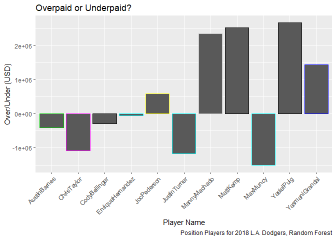
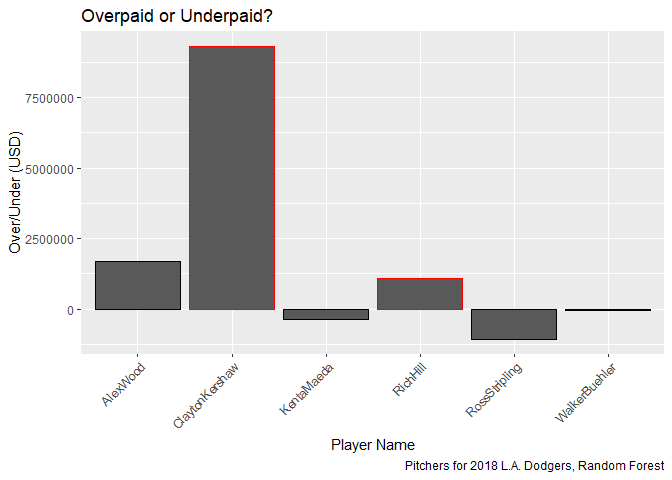
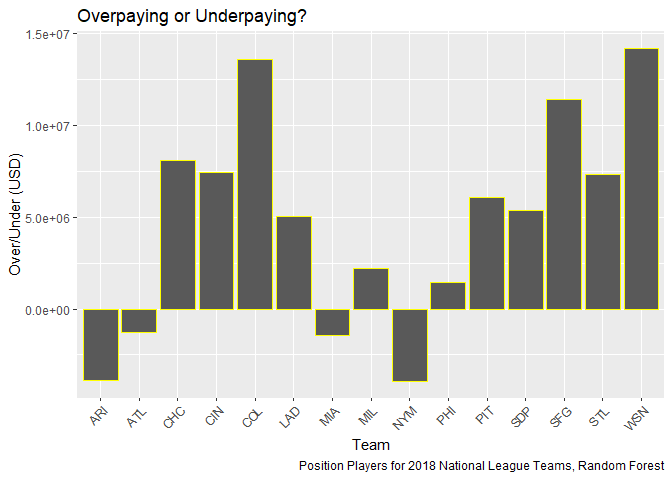
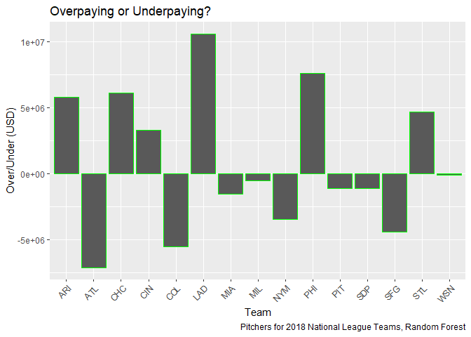
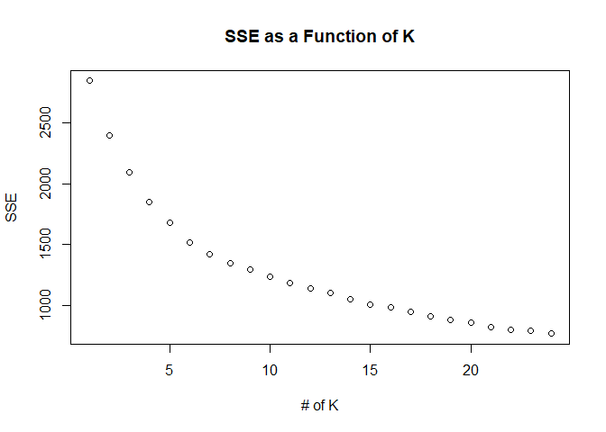
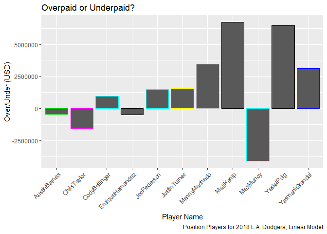
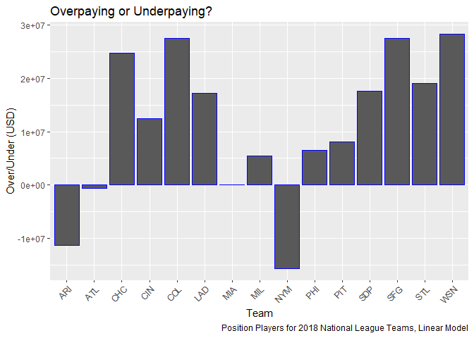
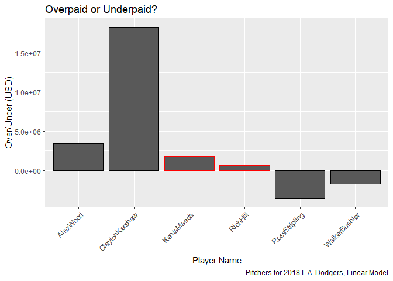
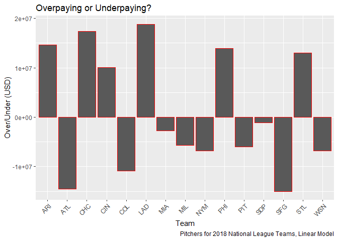

Final Project
================
Wyatt Allen, Elijah Evans, David Ford, P. Allen Scovel --
16 May 2019

### I. Abstract

This paper explores the abundance of baseball statistics in order to create a method to cultivate strong teams on a budget. Salary data as well as veteran status are first scraped during pre-processing in order to provide a more complete picture of what goes into baseball salaries. Next, the data are explored via linear modelling in order to identify the most critical statistics for predicting salaries. These statistics are then used in concert with clustering methods in order to find which players are most able to replace each other based upon the results that they produce on the field. Based upon these clusters, suggested roster replacements are then generated for a given team, The L.A. Dodgers, with considerable potential for savings.

### II. Introduction

Over the last few decades, Major League Baseball (MLB) has seen a paradigm shift in terms of player evaluation. No longer were teams looking at basic statistics and using outdated and non-sensical beliefs about player's personal lives to project their success at the highest levels, but instead, team General Managers were taking a quantitative approach to determine which players are most likely to impact games in a meaningful and positive way for their teams. This shift in evaluation has coincided with dwindling interest nationwide in the sport, with more competition to pay extraordinary amounts to top-tier players within the league, as well as with luxury taxes on team payrolls that exceed a certain threshold, it is more important than ever to be pragmatic when estimating a player's value to the team.

With this in mind, we decided to try our hand at building a team which we believe would be a viable playoff contender, and to do so for less money. To do this, we developed a system which, along with a few defensible assumptions, will lead to a team which should perform comparably to many of the top teams from the 2018 season, and will cost less than the teams they are replacing. First, we wanted to identify which statistics seem to have the biggest impact on salaries in the league. We wanted to use a linear model to find the most significant coefficients, which we would then use to cluster players around their most similar potential replacement. This relies on the assumptions that teams are generally proficient at valuing a player, and that salaries are derived from the same performance metrics which impact wins. Once we identified the statistics which matter the most, we used them to find the most similar players to each other. Once we had these clusters, we identified the lowest paid player in each cluster. Using the lowest paid player in each cluster, we were able to build a team which is statistically very similar to any given team in the league and which costs no more than the original team.

### III. Methods

The first step was to gather and pre-process the data. We gathered our data from:

-   www.Baseball-Reference.com to gather performance metrics for the entire league.

-   www.spotrac.com to gather salary information as well as information on whether the player is on their rookie contract, currently renegotiating their contract, or a veteran (second or later contract) via a web scraper

Once we had the data, we needed to organize it in a manner which would allow us to glean meaningful insights. The first thing we wanted to do was to work exclusively with the National League (NL). We chose the NL because the existence of designated hitters in the American League fundamentally changes the game, and we want to treat it differently because of this impact. Next, we wanted to discard players who are not seeing much playing time in the league. This is a very common technique when analyzing baseball data, as it is very easy to see skewed results from players without much activity in the league. To that end, we decided to drop all position players (i.e. not pitchers) from the data set who had fewer than 200 plate appearances. We also dropped all pitchers with fewer than 100 innings pitched, for the same reason. To make up for the lost observations, we went back a full decade to gather more data. This gave us a data set which is both large enough to draw solid conclusions, and in which all the observations are individually large enough to be meaningful.

After this, we redefined the columns of our dataset to improve interpretability for anyone that is less-than-familiar with baseball statistics and terminology. The following link should be a good reference: <https://www.baseball-reference.com/bullpen/Baseball_statistics>

Now that the data has been pre-processed, we need to determine which statistics have a statistically significant relationship with salary. We feel that at this stage, it is sensible to start with linear modelling in order to maintain ease of interpretation at first while identifying critical variables, and later we will use random forests in order to more strongly predict out-of-sample salaries.

We designated a baseline linear model with salary as a function of position, age, plate appearances (PA), caught stealing (CS), grounding into double play (GIDP), runs, hits, strikeouts, doubles, triples, homeruns, stolen bases (SB), and walks. Once we identified the baseline, we used a step function to identify some of the more important interaction terms. In the end we identified several interactions which had major impacts on salary. Unfortunately, one of the independent variables which was most common was "age". On first look, it seems that age might be relevant, as younger players haven't had a chance to hone their skills or to prove themselves worthy of higher pay. On further inspection, however, we realize that age is largely just capturing the effect of being on a rookie contract. To overcome this apparent omitted variable and get better results, we setup and ran a web scraper to track down information on contract status, which indicates if someone is on their rookie contract, in arbitration, or a veteran (negotiated a contract at least once). We decided to leave age in as a control variable as well, because it should still be capturing the effect of a player being on the back end of his career. Once we had this data coupled to the appropriate players, we ran the same models, this time using VetStatus in addition to age. This gave us better results, and we feel that it is a more accurate representation of the real world.

    ## 
    ## Call:
    ## lm(formula = Salary ~ Age + AtBats + Runs + HomeRuns + StrikeOuts + 
    ##     Doubles + Triples + BattingAvg + StolenBases + BasesWalked + 
    ##     SacHit + IntBasesOnBalls + GroundDouble + OnBasePerc + Age:HomeRuns + 
    ##     Age:AtBats + Age:SacHit + SacHit:IntBasesOnBalls + StrikeOuts:StolenBases + 
    ##     HomeRuns:BasesWalked + Doubles:SacHit + BattingAvg:OnBasePerc + 
    ##     AtBats:StrikeOuts + Runs:Doubles + StrikeOuts:OnBasePerc + 
    ##     StrikeOuts:IntBasesOnBalls, data = baseball)
    ## 
    ## Residuals:
    ##       Min        1Q    Median        3Q       Max 
    ## -12208649  -2080195   -413292   1119944  24749963 
    ## 
    ## Coefficients:
    ##                              Estimate Std. Error t value Pr(>|t|)    
    ## (Intercept)                 1.645e+07  7.740e+06   2.125 0.033728 *  
    ## Age                         7.533e+04  8.227e+04   0.916 0.360028    
    ## AtBats                     -4.003e+04  8.654e+03  -4.625 4.07e-06 ***
    ## Runs                        7.016e+04  2.241e+04   3.131 0.001776 ** 
    ## HomeRuns                   -3.911e+05  1.269e+05  -3.083 0.002086 ** 
    ## StrikeOuts                  4.466e+04  3.814e+04   1.171 0.241725    
    ## Doubles                     8.410e+04  4.555e+04   1.846 0.065078 .  
    ## Triples                    -9.196e+04  5.332e+04  -1.725 0.084786 .  
    ## BattingAvg                 -6.792e+07  3.030e+07  -2.242 0.025139 *  
    ## StolenBases                 9.749e+04  3.753e+04   2.598 0.009474 ** 
    ## BasesWalked                 9.008e+04  2.387e+04   3.774 0.000167 ***
    ## SacHit                      1.847e+06  3.892e+05   4.745 2.29e-06 ***
    ## IntBasesOnBalls             7.123e+04  9.068e+04   0.786 0.432280    
    ## GroundDouble                5.886e+04  2.686e+04   2.191 0.028594 *  
    ## OnBasePerc                 -7.249e+07  2.354e+07  -3.079 0.002112 ** 
    ## Age:HomeRuns                1.767e+04  4.333e+03   4.077 4.82e-05 ***
    ## Age:AtBats                  1.181e+03  2.649e+02   4.457 8.93e-06 ***
    ## Age:SacHit                 -6.575e+04  1.256e+04  -5.235 1.89e-07 ***
    ## SacHit:IntBasesOnBalls     -4.927e+04  1.603e+04  -3.074 0.002154 ** 
    ## StrikeOuts:StolenBases     -8.594e+02  3.347e+02  -2.568 0.010326 *  
    ## HomeRuns:BasesWalked       -1.708e+03  6.504e+02  -2.626 0.008730 ** 
    ## Doubles:SacHit             -1.143e+04  5.334e+03  -2.144 0.032231 *  
    ## BattingAvg:OnBasePerc       2.629e+08  8.111e+07   3.242 0.001215 ** 
    ## AtBats:StrikeOuts           7.030e+01  3.228e+01   2.178 0.029552 *  
    ## Runs:Doubles               -1.269e+03  6.049e+02  -2.098 0.036039 *  
    ## StrikeOuts:OnBasePerc      -2.665e+05  1.071e+05  -2.488 0.012941 *  
    ## StrikeOuts:IntBasesOnBalls  1.316e+03  7.981e+02   1.649 0.099310 .  
    ## ---
    ## Signif. codes:  0 '***' 0.001 '**' 0.01 '*' 0.05 '.' 0.1 ' ' 1
    ## 
    ## Residual standard error: 3849000 on 1473 degrees of freedom
    ## Multiple R-squared:  0.501,  Adjusted R-squared:  0.4922 
    ## F-statistic: 56.88 on 26 and 1473 DF,  p-value: < 2.2e-16

After identifying the statistics which have the largest impact on salary, we use the assumption that teams are generally good at paying players what they are worth, to say that the same statistics can identify which players would likely produce similar on-field results. We use K-means to identify the clusters of similar players, but first need to identify how many clusters to use. For this we set

> k E {1, 2, ., 25}

and found the SSE for each value of k, then plotted SSE as a function of k (appendix 1) hoping to find an elbow. Unfortunately, we were not able to identify a clear elbow, so we used our best intuition to select k=25 in order to move forward. With a k higher than 25, we started running into singleton predictions which seemed problematic. After setting k=25, we found the players in each cluster and proceeded in trying to build a better team. We started with looking at a single individual, A.J. Pollack, and found the cheapest replacement for him. After doing this, we then automated a process so that we could do the same thing for an entire team at once. In this case, we started with the 2018 NL Champion LA Dodgers who were selected because our goal was to build a team which would compete for a post-season appearance. We believe that by starting with the best team in the league, we will be able to identify a solid team, even after allowing for some drop-off of on-field performance. It is worth noting that because we are specifically selecting the lowest paid person from each cluster, we would, by design, have a team which is no more highly paid than the team we started with. Additionally, we built two separate rosters for the Dodgers: one which will replace each player without respect to position, and a second, which requires that each replacement player be of the same position as the player they replaced.

After we built a position players roster using linear models, we wanted to see if we could do a better job of predicting a player's salary, and if we can build a better predictive model, use that model to field another replacement team for the Dodgers. We decided to do this using a random forest approach and followed essentially the same process as we did for linear models. Finally, we wanted to compare the two models, so we looked at the RMSE for both the linear model and the forest model and found that the RMSE for the forest model was roughly one-third the RMSE for the linear model, meaning that it seems to be doing a considerably better job.

While designing and conducting this analysis, we had two more specific interesting relationships to look into which we explored next. First, we wanted to see which Dodgers players were what we will call overpaid, meaning their actual salary is higher than our best prediction for their salary. Secondly, we wanted to see which teams in the NL overpay their players more overall. To answer these questions, we again used our linear model and our forest model to determine the prediction errors for each qualified position player on each team, and then found the sum of these errors across each team.

After having done this for position players, we perform roughly the same process to identify the most crucial statistics on the pitchers in our data set. For this linear model, we use an entirely new set of variables specific to pitchers such as veteran status, win/loss ratio, earned run average (ERA), innings pitched, earned runs allowed, bases walked, strike outs, hits by pitch, and walks & hits per inning. We determine that this would be a strong baseline model, and then we pass this through a step function in R along with some other possibly-useful statistics to once again identify which sorts of interactions will be the most useful in our model.

### IV. Results

We found that it is very possible to build high-performing teams with a much lower salary than many of the top teams. Using the random forest, we found the following: For position players:

| Old               | New            | NewSamePos        |
|-------------------|----------------|-------------------|
| Austin Barnes     | Jeff McNeil    | Pedro Severino    |
| Chris Taylor      | Brandon Nimmo  | Chris Taylor      |
| Cody Bellinger    | Max Muncy      | Cody Bellinger    |
| Enrique Hernandez | Colin Moran    | Enrique Hernandez |
| Joc Pederson      | Nick Williams  | Joc Pederson      |
| Justin Turner     | Kurt Suzuki    | Todd Frazier      |
| Manny Machado     | Franmil Reyes  | Manny Machado     |
| Matt Kemp         | Todd Frazier   | Matt Kemp         |
| Max Muncy         | Rhys Hoskins   | Max Muncy         |
| Yaisel Puig       | Jose Pirela    | Yaisel Puig       |
| Yasmani Grandal   | Brian Anderson | Wilson Contrers   |

For pitchers:

| Old             | New             |
|-----------------|-----------------|
| Alex Wood       | Zack Eflin      |
| Clayton Kershaw | Ivan Nova       |
| Kenta Maede     | Eric Lauer      |
| Rich Hill       | Anibal Sanchez  |
| Ross Stripling  | John Grant      |
| Walker Buehler  | Derek Rodriguez |

Additionally, we found that the Dodgers are overpaying their position players in net but actually have more players underpaid than overpaid. The Dodgers are very close to our expectations in terms of pitcher salaries. The only exception here is Clayton Kershaw who is, according to our models, way overpaid. (Charts for linear model are in appendix 2)

Finally, we see that when we use random forest, many teams overpay position players, however, for pitchers, there is a much more even distribution of payments. (Charts for linear model are in app 2)

### V. Conclusion

We decided to use the random forest model for both position players and pitchers, because their respective RMSE's were roughly one-third for each. For position players, the L.A. Dodgers started with a 2018 salary of $59,884,186. Through our model, they could have reduced their salary to $48,408,726, a savings of more than 11 million dollars, using the random forest model. For the pitchers, the Dodgers started with a 2018 Salary of $65,430,844. Our model suggests they could have reduced their salary to $12,051,606, a savings of more than 53 million dollars.

Because of the design of our model, we feel as though this would be a strong team for playoff contention. The clustering method that we used was designed to identify players who produce results most similar to those of a given team, in terms of which statistics we determined to be the most predictive for salary based on our linear modelling.

Additionally, we determined that many baseball teams tend to overpay for position players, and except for the very top pitchers, teams tended to pay salaries closer to what our model predicts. That is, we are much better at predicting the salaries of pitchers than we are at predicting position player salaries. This is likely a result of our concentration on offensive statistics when predicting salaries for position players. Another possibility for this finding is that there are simply more pitchers on each team, and in the league overall, so the MLB is also more proficient at establishing pitcher salaries than they are position players.

We feel that a very natural extension to this question would deal with the money-making potential of each player. Clearly, baseball teams are not only built to compete for post-season play but are also designed to return some sort of profit to owners, and unfortunately, those profits are not perfectly tied to on-field performance. If we had access to data concerning jersey sales, ticket and concession revenues, and media deals, we could, through various statistical and econometric methods, try to identify individual effects on team revenue.

### VI Appendices

**Appendix 1.** 

**Appendix 2.** 
